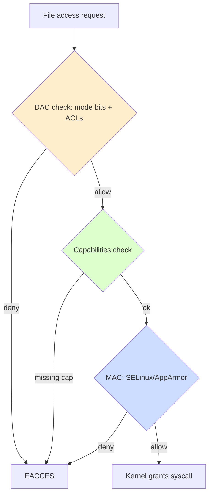
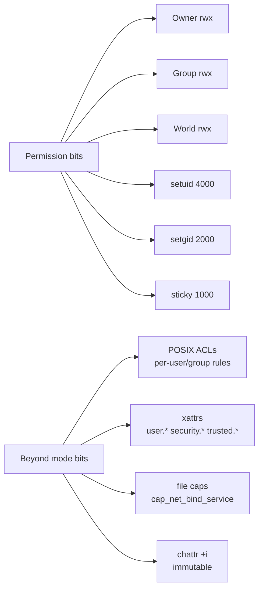

# File Permissions — Deep Dive

## Why this matters

The Unix permission model is 50 years old, and yet a misplaced bit in `chmod` is still the #1 root cause of "we got pwned." `0644` versus `0640` versus `0664` is not a typo — it's the difference between a secret staying secret and ending up on Pastebin.

Most engineers know `chmod 755 file`. Few know the difference between **setuid** and **setgid** on directories, when a **sticky bit** still matters in 2026, that **POSIX ACLs** exist for cases where mode bits cannot express your intent, that **extended attributes** carry SELinux labels and file capabilities, that `getcap` can replace nearly every setuid binary, and that `chattr +i` makes a file immutable even to root until cleared.

This file makes you fluent in all of it.

---

## Mental model

<!-- mermaid:rendered -->
<p align="center"></p>

<details><summary>Mermaid source</summary>



</details>

<!-- mermaid:rendered -->
<p align="center"></p>

<details><summary>Mermaid source</summary>



</details>

---

## Mode bits — the basics, properly

Every file has a 16-bit mode. The lower 12 bits matter for permissions:

```
 type    suid sgid sticky    user        group       other
 ----    ---- ---- ------    ---         ---         ---
 - d l   4000 2000 1000      rwx 400-100 rwx 040-010 rwx 004-001
```

Octal:
- 4 = read, 2 = write, 1 = execute
- `0755` = rwxr-xr-x, `0644` = rw-r--r--, `0640` = rw-r-----

```bash
ls -l /etc/passwd
# -rw-r--r-- 1 root root 2841 Apr 26 09:14 /etc/passwd
#  ↑ ↑    ↑    ↑    ↑
#  | rwx  rwx  rwx  owner / group
#  type
```

### What each bit means on **files** vs **directories**

| Bit | On file | On directory |
|-----|---------|--------------|
| `r` | read content | list entries (`ls`) |
| `w` | modify content | create/delete/rename entries |
| `x` | execute | traverse / `cd` into |
| `s` (suid) | run as file's owner | (no effect on most kernels) |
| `s` (sgid) | run as file's group | new files inherit dir's group |
| `t` (sticky) | (legacy: keep in swap) | only owner can delete their own files |

### Common gotchas

- `w` on a directory means you can **delete files you don't own** (unless sticky bit). That's why `/tmp` is `1777`.
- `r` on a file but not `x` on its parent directory = you can't open it, period.
- Removing `x` from a script removes the ability to run it directly, but `bash script.sh` still works (bash reads it).
- `chmod -R` on a tree without `X` (capital) makes every regular file executable too — almost always a mistake. Use `chmod -R u+rwX,go+rX dir/`.

---

## setuid, setgid, sticky — the special bits

### setuid (4000)

When set on an executable, the process runs with the **EUID** of the file's owner, not the caller. Classic example: `/usr/bin/passwd` is setuid root because it must edit `/etc/shadow`.

```bash
ls -l /usr/bin/passwd
# -rwsr-xr-x 1 root root 68208 ...
#    ↑ s in user-x slot = setuid
```

Setuid is the historical privilege escalation primitive — and a constant attack target. Modern Linux replaces most setuid binaries with **file capabilities** (see below).

```bash
# Find every setuid binary on the system (audit at install + monthly)
sudo find / -xdev -perm -4000 -type f 2>/dev/null

# Remove setuid (defang)
sudo chmod u-s /usr/bin/somebinary
```

### setgid (2000)

On executables: same as setuid but for group. On **directories**: any file/subdir created inherits the directory's group, *not* the creator's primary group. This is how shared workspaces work.

```bash
sudo mkdir /srv/teamshare
sudo chgrp engineering /srv/teamshare
sudo chmod 2775 /srv/teamshare        # 2 = setgid on dir
# Now any file alice creates here is group=engineering, not alice's primary group
```

### sticky bit (1000)

On directories: only the file's owner (or root) can delete or rename files in it, even if other users have `w` on the directory. `/tmp` and `/var/tmp` always.

```bash
ls -ld /tmp
# drwxrwxrwt 24 root root  ...
#         ↑ t = sticky
```

---

## Special-bit traps

```bash
# Find world-writable files (almost always wrong outside /tmp)
sudo find / -xdev -type f -perm -0002 ! -path "/proc/*" 2>/dev/null

# Find world-writable dirs without sticky bit (deletion attack vector)
sudo find / -xdev -type d -perm -0002 ! -perm -1000 2>/dev/null

# Find files with no owner (deleted user) -- often left behind after userdel
sudo find / -xdev \( -nouser -o -nogroup \) 2>/dev/null
```

---

## umask — the subtraction mask

`umask` is the bits **removed** from default permissions on file creation.

- Default file create perms: 0666
- Default dir create perms:  0777
- Common umask: `0022` → files 0644, dirs 0755
- Stricter: `0077` → files 0600, dirs 0700 (good for personal accounts handling secrets)
- Server default in `/etc/login.defs`: `UMASK 022`; for service accounts you may want `077`.

```bash
umask                    # current
umask 0027               # files 0640, dirs 0750 -- "no other"
```

Set per-user in `~/.bashrc` or per-system in `/etc/login.defs` and `/etc/profile`.

---

## POSIX ACLs — when mode bits aren't enough

Mode bits give one user, one group, everyone else. ACLs let you grant rights to **multiple specific users or groups** on the same file.

Requires the filesystem to be mounted with `acl` (default on ext4, xfs, btrfs).

```bash
# View ACL
getfacl /var/log/audit
# # file: var/log/audit
# # owner: root
# # group: root
# user::rwx
# group::r-x
# other::---

# Grant alice read to a file even though she's not in the group
sudo setfacl -m u:alice:r /etc/special.conf

# Grant a group write
sudo setfacl -m g:devops:rw /etc/myapp/config.yaml

# Default ACL on a directory (children inherit)
sudo setfacl -d -m g:devops:rwX /srv/shared

# Remove a specific ACL entry
sudo setfacl -x u:alice /etc/special.conf

# Remove ALL extended ACLs
sudo setfacl -b /etc/special.conf

# Recursive
sudo setfacl -R -m g:devops:rwX /srv/shared
```

`ls -l` shows a `+` after the mode when ACLs are present:

```
-rw-r--r--+ 1 root root 1024 Apr 26 file
         ↑
```

> **20-year tip**: ACLs are a "you'll know when you need them" feature. 95% of the time, mode bits + group membership is cleaner. Use ACLs when you have *legitimate* multi-team access requirements that can't be expressed by adding a group, e.g., a log directory that audit and dev teams both need to read but only audit can write.

---

## Extended attributes (xattrs)

Arbitrary key/value metadata stored alongside a file. Four namespaces:

- `user.*` — anyone with write can set
- `trusted.*` — root only
- `security.*` — used by SELinux (`security.selinux`), capabilities (`security.capability`)
- `system.*` — used by ACLs (`system.posix_acl_access`)

```bash
# Set a user xattr
setfattr -n user.checksum -v "sha256:abc..." /tmp/file
getfattr -d /tmp/file               # dump all user.* xattrs
getfattr -n security.selinux /etc/passwd

# See SELinux context (which is just an xattr)
ls -Z /etc/passwd
# system_u:object_r:passwd_file_t:s0  /etc/passwd

# Remove
setfattr -x user.checksum /tmp/file
```

xattrs survive `cp` only with `cp -a` or `cp --preserve=xattr`. `rsync` needs `-X`. **Forgetting this is how SELinux contexts get lost during backups and migrations.**

---

## File capabilities — the modern alternative to setuid

Capabilities split root's omnipotence into ~40 independent privileges. Instead of giving a binary full root via setuid, grant it only what it needs.

| Capability | What it grants |
|------------|----------------|
| `CAP_NET_BIND_SERVICE` | bind to ports < 1024 |
| `CAP_NET_RAW` | raw sockets (ping, tcpdump) |
| `CAP_NET_ADMIN` | network configuration |
| `CAP_SYS_ADMIN` | the "almost root" cap (mounts, namespaces) — avoid |
| `CAP_DAC_OVERRIDE` | bypass file permission checks |
| `CAP_DAC_READ_SEARCH` | bypass read perms only |
| `CAP_KILL` | send signals to any process |
| `CAP_SETUID` / `CAP_SETGID` | change UID/GID |
| `CAP_CHOWN` | change file owner |
| `CAP_FOWNER` | bypass file owner check on chmod/chown |
| `CAP_SYS_PTRACE` | ptrace any process |
| `CAP_SYS_TIME` | set system clock |

```bash
# Install
sudo apt install libcap2-bin              # Debian
sudo dnf install libcap                   # RHEL

# View
getcap /usr/bin/ping
# /usr/bin/ping cap_net_raw=ep

# Set (e.g., let nginx bind to 80 without setuid)
sudo setcap 'cap_net_bind_service=+ep' /usr/sbin/nginx

# Audit: every file with capabilities
sudo getcap -r / 2>/dev/null

# Remove
sudo setcap -r /path/to/binary
```

The flags after `=`: `e`=effective, `p`=permitted, `i`=inheritable. Almost always `+ep`.

> **Modern pattern**: instead of `chmod u+s /usr/local/bin/myapp`, do `setcap 'cap_net_bind_service=+ep' /usr/local/bin/myapp`. Much narrower blast radius.

---

## chattr — immutable and append-only

`chattr` sets ext-family / xfs filesystem flags that even root cannot bypass without first removing the flag.

```bash
sudo chattr +i /etc/resolv.conf      # immutable: no edit, no delete, no rename
sudo lsattr /etc/resolv.conf
# ----i--------------- /etc/resolv.conf

sudo chattr -i /etc/resolv.conf      # remove immutability

sudo chattr +a /var/log/important.log    # append-only (logs)
```

Common flags:

| Flag | Effect |
|------|--------|
| `i` | immutable (no modify/rename/delete) |
| `a` | append-only |
| `A` | no atime update |
| `d` | not backed up by dump |
| `s` | secure deletion (zero blocks) |
| `u` | undeletable (data preserved on delete) |

> **Anti-tamper pattern**: critical files like `/etc/passwd`, `/etc/shadow`, `/etc/sudoers`, `/etc/resolv.conf` get `+i` *after* you've configured them. Attackers who get root will be confused for a few minutes; that's enough time for your auditd alert to fire.
>
> Caveat: it breaks any tool that legitimately edits these files (passwd, sudoers updates). Have a documented unlock-edit-relock procedure.

---

## Lab — multi-team shared workspace with ACLs and setgid

Goal: `/srv/project-x` where:

- members of `proj-x-dev` can read/write everything
- members of `proj-x-qa` can read everything, write to `qa/` only
- members of `auditors` can read everything, period
- new files inherit group `proj-x-dev`
- nobody else sees a thing

```bash
# 1. Create groups + members
sudo groupadd proj-x-dev proj-x-qa auditors
sudo usermod -aG proj-x-dev alice
sudo usermod -aG proj-x-qa  bob
sudo usermod -aG auditors   carol

# 2. Create dirs
sudo mkdir -p /srv/project-x/{src,qa}

# 3. Base perms with setgid
sudo chgrp -R proj-x-dev /srv/project-x
sudo chmod -R 2770 /srv/project-x         # setgid + group rwx, no other

# 4. ACLs for QA and Auditors
sudo setfacl -R -m g:proj-x-qa:rX /srv/project-x
sudo setfacl -R -m g:auditors:rX  /srv/project-x

# QA can write inside qa/
sudo setfacl -R -m g:proj-x-qa:rwX /srv/project-x/qa

# 5. Default ACLs so new files inherit
sudo setfacl -d -m g:proj-x-dev:rwX /srv/project-x
sudo setfacl -d -m g:proj-x-qa:rX   /srv/project-x
sudo setfacl -d -m g:auditors:rX    /srv/project-x
sudo setfacl -d -m g:proj-x-qa:rwX  /srv/project-x/qa

# 6. Verify
getfacl /srv/project-x
sudo -u alice touch /srv/project-x/src/newfile
ls -la /srv/project-x/src/newfile           # group should be proj-x-dev
sudo -u bob   touch /srv/project-x/src/nope 2>&1   # should fail
sudo -u bob   touch /srv/project-x/qa/report       # should succeed
sudo -u carol cat   /srv/project-x/src/newfile     # should succeed (read)
sudo -u carol touch /srv/project-x/audit_attempt 2>&1  # should fail
```

---

## Lab — replace setuid with capabilities

```bash
# Bad: traditional setuid for a custom port-binder
sudo chmod u+s /usr/local/bin/myhttpd

# Good: grant only the capability needed
sudo chmod u-s /usr/local/bin/myhttpd
sudo setcap 'cap_net_bind_service=+ep' /usr/local/bin/myhttpd
getcap /usr/local/bin/myhttpd
# /usr/local/bin/myhttpd cap_net_bind_service=ep

# Now an attacker who exploits a buffer overflow gets only the right
# to bind low ports, not full root.
```

---

## Common attack patterns

| Attack | How | What stops it |
|--------|-----|---------------|
| **Path collision via world-writable dir** | Attacker creates `/tmp/.X11-unix/X0` race, hijacks display | Sticky bit + per-user tmpdirs |
| **Setuid binary GTFOBins escape** | `find / -name x -exec /bin/sh \;` from setuid find | Audit setuid; replace with capabilities; mount /tmp noexec,nosuid |
| **Backup loses SELinux contexts** | `cp` without `--preserve=xattr` strips `security.selinux`; on restore, daemon can't read | Use `cp -a`, `rsync -X`, restorecon after restore |
| **chattr +i on /etc/passwd to lock attacker's backdoor in place** | Attacker adds backdoor account then immutables the file so admin can't fix | Monitor lsattr; auditd watch on chattr syscall |
| **World-writable cron dir** | Attacker drops a job in `/etc/cron.d/` | Verify mode 0755 root:root + AIDE baseline |
| **Group=docker == group=root** | docker socket lets you mount / | Treat docker membership as root; use rootless docker |
| **Hardlink TOCTOU** | Hardlink victim's file to attacker's path, exploit setuid program | Set `fs.protected_hardlinks=1` (default modern) |
| **Capability `CAP_SYS_ADMIN`** | Granting it = nearly root | Audit getcap output; alert on appearance |

---

> **20-year tip — war story**
>
> A regulated financial customer ran a fully patched RHEL fleet with SELinux enforcing. Audit found that one application directory was world-writable. The dev team's response: "we set 777 because the app was crashing." Investigation: the app was running as `appuser`, the directory was owned by `root:root`, and instead of `chown -R appuser:appuser /opt/app/data`, someone slammed `chmod -R 777`. Six months later, every container that mounted that path inherited the loose perms. A single curl-able endpoint dropped a webshell into that writable path.
>
> **Lesson**: when an app "needs more permission," the answer is **almost always** ownership, not mode. `chmod 777` is the duct tape of the security world. If you find it in code review, push back.

---

> **Common interview questions**
>
> 1. **Q: Walk me through what `0755` and `2770` mean.**
>    A: 0755 = rwxr-xr-x: owner full, group/world read+execute. 2770 = setgid + rwxrwx---: setgid on dir means new entries inherit the directory's group; owner+group full, world none. The `2` is the high bit (setgid).
>
> 2. **Q: Why is `chmod -R 777` dangerous, and what should you use instead?**
>    A: It makes every file world-writable, including binaries (which become trivially backdoorable) and config files. It also gives execute on data files that shouldn't be executable. Correct fix: `chown -R correctuser:correctgroup` and then narrow mode with capital `X` (`chmod -R u=rwX,go=rX`) so execute is only set where it was already set.
>
> 3. **Q: What's the difference between setuid and file capabilities?**
>    A: setuid grants the binary the file owner's full identity (often root). Capabilities split root into ~40 fine-grained privileges; you grant only the one needed. Capabilities have smaller blast radius and survive most exploit primitives better. Modern Linux distributions use capabilities for ping, tcpdump, etc.
>
> 4. **Q: How do POSIX ACLs interact with mode bits?**
>    A: The mode `group` field becomes the ACL **mask** when ACLs are present — it's the maximum allowed for any named user/group entry. So if you `setfacl -m u:alice:rwx` but the mask is `r--`, alice still only gets read. Always check `getfacl` for the mask line.
>
> 5. **Q: What does `chattr +i` do and what can break?**
>    A: Sets the immutable filesystem flag; the file cannot be modified, renamed, deleted, or have new hardlinks created — even by root — until cleared with `chattr -i`. Breaks any auto-update tools (DNS resolver writes to /etc/resolv.conf, package managers updating /etc/passwd via useradd, etc.). Document and automate the unlock-modify-relock cycle.
>
> 6. **Q: An `ls -l` shows `-rw-r--r--+`. What does the plus sign mean?**
>    A: The file has POSIX ACL entries beyond the standard mode bits. Run `getfacl <file>` to see them. Mode bits alone don't tell the full story.
>
> 7. **Q: How do extended attributes relate to SELinux?**
>    A: SELinux contexts are stored in the `security.selinux` xattr. Tools like `cp`, `tar`, `rsync` need explicit flags to preserve them, otherwise restored files lose their context and `restorecon` is needed to relabel from policy.

---

## Sources

- `man 1 chmod`, `man 1 chown`, `man 2 stat`, `man 5 acl`
- `man 1 getfacl`, `man 1 setfacl`, `man 1 getfattr`, `man 1 setfattr`
- `man 7 capabilities`, `man 8 setcap`, `man 8 getcap`
- `man 1 chattr`, `man 1 lsattr`, `man 1 umask`
- Andrew G. Morgan, *POSIX Capabilities & Files* — kernel.org docs
- GTFOBins — https://gtfobins.github.io/ (catalog of setuid escape vectors)
- CIS Benchmarks §6 — File Permissions
