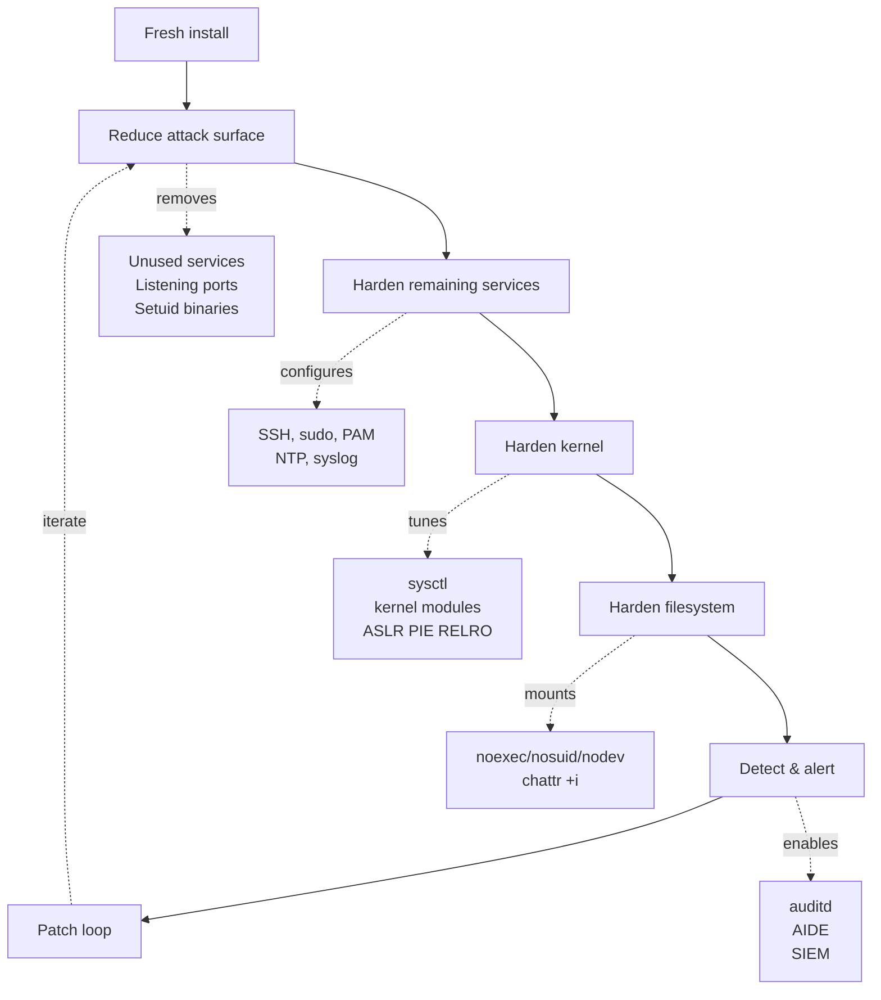
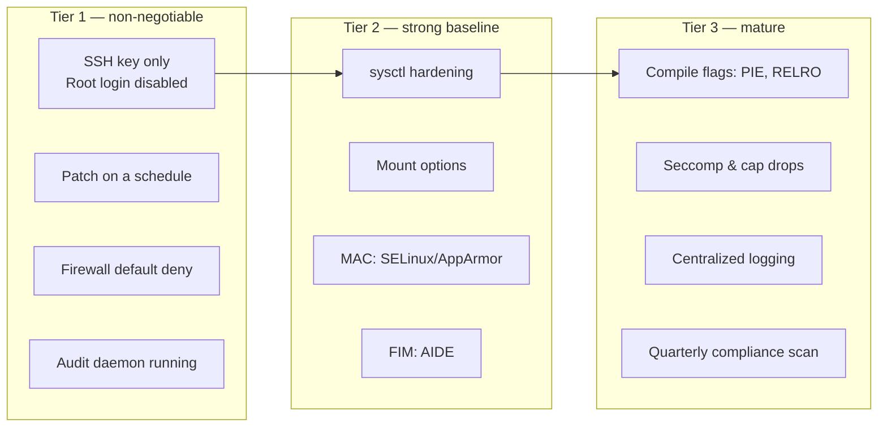

# Linux Hardening Checklist — CIS Distilled

## Why this matters

Most Linux servers ship "open and friendly" — root SSH login enabled, password auth on, every service in the world listening, kernel network parameters set for a 1990s LAN, `/tmp` executable, world-writable directories. Defaults are designed to *work everywhere*, not to be *secure anywhere*.

The CIS Benchmarks distill 20+ years of operational hardening into 200-300 specific controls per OS. This file pulls the highest-impact subset — the things that, applied to a fresh server, take it from "trivially compromised in a Shodan scan" to "actually defensible." Memorize these. Apply them via configuration management. Audit them quarterly.

---

## Mental model

<!-- mermaid:rendered -->
<p align="center"></p>

<details><summary>Mermaid source</summary>



</details>

<!-- mermaid:rendered -->
<p align="center"></p>

<details><summary>Mermaid source</summary>



</details>

---

## Tier 1 — Non-negotiable

### 1. SSH hardening — `/etc/ssh/sshd_config`

```ini
# Identity & auth
Port 22                                # change only if you have a real reason
Protocol 2
PermitRootLogin no
PasswordAuthentication no
PubkeyAuthentication yes
PermitEmptyPasswords no
ChallengeResponseAuthentication no
KbdInteractiveAuthentication no
UsePAM yes

# Limit who
AllowGroups ssh-users
DenyUsers root
LoginGraceTime 30
MaxAuthTries 3
MaxSessions 4
MaxStartups 10:30:60

# Lockdown
X11Forwarding no
AllowTcpForwarding no                  # set 'local' if you legitimately tunnel
AllowAgentForwarding no
PermitTunnel no
GatewayPorts no
PermitUserEnvironment no
ClientAliveInterval 300
ClientAliveCountMax 2
TCPKeepAlive no                        # the alive interval handles it
Compression no                         # CRIME-style attacks academic but pointless

# Crypto (modern, RFC-current)
KexAlgorithms curve25519-sha256@libssh.org,curve25519-sha256,diffie-hellman-group16-sha512,diffie-hellman-group18-sha512
Ciphers chacha20-poly1305@openssh.com,aes256-gcm@openssh.com,aes128-gcm@openssh.com,aes256-ctr,aes192-ctr,aes128-ctr
MACs hmac-sha2-512-etm@openssh.com,hmac-sha2-256-etm@openssh.com,umac-128-etm@openssh.com
HostKeyAlgorithms ssh-ed25519,rsa-sha2-512,rsa-sha2-256

# Banner (legal protection)
Banner /etc/issue.net

# Logging
LogLevel VERBOSE                       # records key fingerprint used
SyslogFacility AUTH

# Subsystem
Subsystem sftp /usr/lib/openssh/sftp-server -f LOCAL6 -l INFO
```

```bash
sudo sshd -t                            # syntax check (always run this)
sudo systemctl restart sshd
ssh -Q kex; ssh -Q cipher; ssh -Q mac   # what the client supports
```

> **Always** keep an active session open during sshd reconfiguration. Revert via that session if needed.

### 2. Patch on a schedule

```bash
# Debian/Ubuntu: unattended security upgrades
sudo apt install unattended-upgrades apt-listchanges
sudo dpkg-reconfigure -plow unattended-upgrades
# Edit /etc/apt/apt.conf.d/50unattended-upgrades to whitelist security suites
# and enable automatic reboots in maintenance window if appropriate.

# RHEL: dnf-automatic
sudo dnf install dnf-automatic
sudo systemctl enable --now dnf-automatic.timer
# Edit /etc/dnf/automatic.conf:
#   apply_updates = yes
#   upgrade_type = security
```

Track CVEs that match installed packages. Subscribe to distro security advisories.

### 3. Firewall default deny

`nftables` (modern) or `iptables` (legacy). UFW (Ubuntu) and firewalld (RHEL) wrap them.

```bash
# UFW
sudo ufw default deny incoming
sudo ufw default allow outgoing
sudo ufw allow from 10.0.0.0/8 to any port 22 proto tcp
sudo ufw allow 443/tcp
sudo ufw enable
sudo ufw status verbose

# firewalld
sudo firewall-cmd --set-default-zone=drop
sudo firewall-cmd --permanent --add-service=https
sudo firewall-cmd --permanent --add-rich-rule='rule family=ipv4 source address=10.0.0.0/8 service name=ssh accept'
sudo firewall-cmd --reload
sudo firewall-cmd --list-all
```

### 4. auditd running with rules loaded

See `audit-and-fim.md`. Verify:
```bash
sudo systemctl is-active auditd
sudo auditctl -l | wc -l        # > 0
```

---

## Tier 2 — Strong baseline

### 5. Kernel sysctl hardening

`/etc/sysctl.d/99-hardening.conf`:

```ini
## --- Network: spoofing & filtering ---
# Reverse-path filter — drop packets where the source can't be reached via the same iface.
net.ipv4.conf.all.rp_filter = 1
net.ipv4.conf.default.rp_filter = 1

# Disable acceptance of source-routed packets (spoofing classic).
net.ipv4.conf.all.accept_source_route = 0
net.ipv4.conf.default.accept_source_route = 0
net.ipv6.conf.all.accept_source_route = 0
net.ipv6.conf.default.accept_source_route = 0

# Don't accept ICMP redirects (man-in-the-middle prevention).
net.ipv4.conf.all.accept_redirects = 0
net.ipv4.conf.default.accept_redirects = 0
net.ipv4.conf.all.secure_redirects = 0
net.ipv4.conf.default.secure_redirects = 0
net.ipv6.conf.all.accept_redirects = 0
net.ipv6.conf.default.accept_redirects = 0

# Don't send ICMP redirects (we're not a router unless you intend to be).
net.ipv4.conf.all.send_redirects = 0
net.ipv4.conf.default.send_redirects = 0

# Log spoofed/source-routed/martian packets (loud audit signal).
net.ipv4.conf.all.log_martians = 1
net.ipv4.conf.default.log_martians = 1

# Ignore ICMP echo broadcasts (smurf attack mitigation).
net.ipv4.icmp_echo_ignore_broadcasts = 1

# Ignore bogus ICMP responses.
net.ipv4.icmp_ignore_bogus_error_responses = 1

# TCP SYN cookies — survive SYN-flood DoS.
net.ipv4.tcp_syncookies = 1
net.ipv4.tcp_max_syn_backlog = 4096

## --- IP forwarding (only enable if router) ---
net.ipv4.ip_forward = 0
net.ipv6.conf.all.forwarding = 0

## --- IPv6 hygiene ---
net.ipv6.conf.all.accept_ra = 0
net.ipv6.conf.default.accept_ra = 0

## --- Process hardening ---
# ASLR for the kernel and userspace.
kernel.randomize_va_space = 2

# Restrict ptrace to direct parent (defang RCE -> credential dump pivots).
kernel.yama.ptrace_scope = 1

# Restrict access to kernel pointers (info-leak mitigation).
kernel.kptr_restrict = 2

# Don't expose dmesg to non-root.
kernel.dmesg_restrict = 1

# Restrict performance events to root.
kernel.perf_event_paranoid = 3

# Disable kexec (prevent in-place kernel replacement).
kernel.kexec_load_disabled = 1

# Disable sysrq magic key (or restrict).
kernel.sysrq = 0

# Hardlink/symlink protections (TOCTOU race mitigation).
fs.protected_hardlinks = 1
fs.protected_symlinks = 1
fs.protected_fifos = 2
fs.protected_regular = 2

# Restrict core dumps from setuid binaries (no info leak).
fs.suid_dumpable = 0

# Increase max file descriptors (operational, not security).
fs.file-max = 2097152
```

Apply:
```bash
sudo sysctl --system
sudo sysctl -a | grep -E 'rp_filter|tcp_syncookies|ptrace_scope|randomize_va_space|kptr_restrict'
```

### 6. Mount options for sensitive partitions

`/etc/fstab` lines (or LVM/cloud-init equivalents):

```fstab
# /tmp on tmpfs (RAM, wiped each boot, can't keep persistent payloads)
tmpfs   /tmp        tmpfs   defaults,nodev,nosuid,noexec,size=2G,mode=1777   0  0

# /var/tmp typically bind-mounted to /tmp or its own with same flags
tmpfs   /var/tmp    tmpfs   defaults,nodev,nosuid,noexec,size=512M,mode=1777 0  0

# /home -- users shouldn't be running setuid binaries from their home
UUID=xxx /home      ext4    defaults,nodev,nosuid                            0  2

# /dev/shm -- often forgotten
tmpfs   /dev/shm    tmpfs   defaults,nodev,nosuid,noexec                     0  0

# /boot -- read-only when not patching
UUID=xxx /boot      ext4    defaults,nodev,nosuid,noexec,ro                  0  2
```

Mount option meanings:
- `nodev` — block device files in this fs are not honored. Stops `mknod /tmp/badroot c 1 1` style tricks.
- `nosuid` — setuid bits ignored. Even a planted setuid binary is harmless.
- `noexec` — files cannot be `execve`'d. Doesn't stop `bash /tmp/script.sh` (bash reads the file) but blocks compiled exploits and ELF droppers.

```bash
sudo mount -o remount /tmp /var/tmp /home /dev/shm
mount | grep -E 'tmp|home'         # verify
```

> **Caveat**: some package managers and yum/dnf use `/var/tmp` for staging, and some snap/flatpak runtimes need exec on `/home/<user>/snap`. Test your workload before applying noexec everywhere in production. CIS lets you justify exceptions; don't blindly apply.

### 7. Disable unnecessary services

```bash
# Inventory
sudo systemctl list-unit-files --state=enabled
sudo ss -tlnp                       # what's listening
sudo ss -tulnp

# Common defaulters to disable (only if not needed):
sudo systemctl disable --now avahi-daemon cups bluetooth ModemManager rpcbind nfs-server
```

Audit listening ports against an allowlist. Anything unexpected → investigate.

### 8. MAC enforcing

See `selinux-vs-apparmor.md`. RHEL: `sestatus` should report `enforcing`. Ubuntu: `aa-status` should report all profiles in `enforce`.

### 9. FIM baseline

See `audit-and-fim.md`. AIDE init done after hardening, scheduled `--check`.

---

## Tier 3 — Mature

### 10. Compile-time / linker hardening

For binaries you build:

| Flag | Effect |
|------|--------|
| `-fstack-protector-strong` | stack canary — detect smashing |
| `-D_FORTIFY_SOURCE=2 -O2` | runtime bounds checks for libc string ops |
| `-fPIE -pie` | PIE (Position Independent Executable) → ASLR for the executable itself |
| `-Wl,-z,relro -Wl,-z,now` | Full RELRO — GOT remapped read-only after relocations |
| `-Wl,-z,noexecstack` | non-executable stack |

Inspect a binary:

```bash
checksec --file=/usr/sbin/sshd
# RELRO        STACK CANARY  NX     PIE     RPATH   RUNPATH    Symbols    FORTIFY  Fortified  Fortifiable
# Full RELRO   Canary found  NX en  PIE en  No RPATH No RUNPATH No Symbols Yes      4          11
```

`checksec` (from the `paxutils` / `checksec.sh` package) gives you all these in one shot.

### 11. Drop capabilities & use seccomp

For systemd services, harden the unit:

```ini
[Service]
NoNewPrivileges=yes
ProtectSystem=strict
ProtectHome=yes
PrivateTmp=yes
PrivateDevices=yes
ProtectKernelTunables=yes
ProtectKernelModules=yes
ProtectKernelLogs=yes
ProtectControlGroups=yes
ProtectClock=yes
ProtectHostname=yes
RestrictRealtime=yes
RestrictSUIDSGID=yes
RestrictNamespaces=yes
RestrictAddressFamilies=AF_INET AF_INET6
LockPersonality=yes
MemoryDenyWriteExecute=yes
SystemCallArchitectures=native
SystemCallFilter=@system-service
CapabilityBoundingSet=CAP_NET_BIND_SERVICE
AmbientCapabilities=CAP_NET_BIND_SERVICE
```

Audit a unit's hardening score:
```bash
systemd-analyze security nginx.service
```

### 12. Centralized, tamper-resistant logging

See `audit-and-fim.md`. rsyslog or syslog-ng over TLS to an external collector. Never trust local logs alone.

### 13. Quarterly compliance scan

```bash
# OpenSCAP / scap-security-guide
sudo dnf install scap-security-guide openscap-scanner
sudo oscap xccdf eval \
  --profile xccdf_org.ssgproject.content_profile_cis \
  --results /tmp/scan-results.xml \
  --report  /tmp/scan-report.html \
  /usr/share/xml/scap/ssg/content/ssg-rhel9-ds.xml
firefox /tmp/scan-report.html
```

Lynis is an excellent open-source alternative:
```bash
sudo apt install lynis
sudo lynis audit system
```

---

## Lab — Harden a fresh Ubuntu 24.04 VM

```bash
# 1. Update + auto-security patches
sudo apt update && sudo apt -y upgrade
sudo apt -y install unattended-upgrades auditd aide ufw fail2ban
sudo dpkg-reconfigure -plow unattended-upgrades

# 2. Firewall
sudo ufw default deny incoming
sudo ufw default allow outgoing
sudo ufw allow from 10.0.0.0/8 to any port 22 proto tcp
sudo ufw --force enable

# 3. SSH hardening
sudo cp /etc/ssh/sshd_config /etc/ssh/sshd_config.bak
sudo tee /etc/ssh/sshd_config.d/99-hardening.conf >/dev/null <<'EOF'
PermitRootLogin no
PasswordAuthentication no
PubkeyAuthentication yes
PermitEmptyPasswords no
X11Forwarding no
AllowTcpForwarding no
AllowAgentForwarding no
ClientAliveInterval 300
ClientAliveCountMax 2
MaxAuthTries 3
LoginGraceTime 30
LogLevel VERBOSE
AllowGroups ssh-users
EOF
sudo groupadd -f ssh-users
sudo usermod -aG ssh-users $USER
sudo sshd -t && sudo systemctl restart sshd

# 4. sysctl
sudo tee /etc/sysctl.d/99-hardening.conf >/dev/null <<'EOF'
net.ipv4.conf.all.rp_filter=1
net.ipv4.conf.all.accept_source_route=0
net.ipv4.conf.all.accept_redirects=0
net.ipv4.conf.all.send_redirects=0
net.ipv4.conf.all.log_martians=1
net.ipv4.icmp_echo_ignore_broadcasts=1
net.ipv4.tcp_syncookies=1
net.ipv4.ip_forward=0
kernel.randomize_va_space=2
kernel.yama.ptrace_scope=1
kernel.kptr_restrict=2
kernel.dmesg_restrict=1
fs.protected_hardlinks=1
fs.protected_symlinks=1
fs.suid_dumpable=0
EOF
sudo sysctl --system

# 5. Mount /tmp on tmpfs
sudo systemctl unmask tmp.mount
sudo systemctl enable --now tmp.mount
mount | grep '/tmp '

# 6. AppArmor (Ubuntu default)
sudo aa-status

# 7. Audit rules (start small)
sudo tee /etc/audit/rules.d/50-baseline.rules >/dev/null <<'EOF'
-w /etc/passwd     -p wa -k identity
-w /etc/shadow     -p wa -k identity
-w /etc/sudoers    -p wa -k privilege
-w /etc/sudoers.d/ -p wa -k privilege
-w /etc/ssh/sshd_config -p wa -k sshd
-a always,exit -F arch=b64 -S execve -F euid=0 -F auid>=1000 -F auid!=4294967295 -k root_exec
EOF
sudo augenrules --load
sudo auditctl -l

# 8. AIDE baseline (after all the above)
sudo aideinit
sudo mv /var/lib/aide/aide.db.new /var/lib/aide/aide.db
( sudo crontab -l 2>/dev/null; echo "0 3 * * * /usr/bin/aide --check | mail -s 'AIDE report' security@example.com" ) | sudo crontab -

# 9. fail2ban
sudo systemctl enable --now fail2ban
sudo fail2ban-client status sshd

# 10. Final scan
sudo lynis audit system | tail -50
```

---

## Common attack patterns

| Attack | Hardening that stops it |
|--------|-------------------------|
| **SSH brute force** | key-only + AllowGroups + fail2ban + MFA |
| **Kernel exploit dropper in /tmp** | /tmp tmpfs + nodev/nosuid/noexec |
| **Setuid binary planted in /home** | /home with nodev,nosuid |
| **SYN flood** | tcp_syncookies + tcp_max_syn_backlog |
| **ICMP redirect MITM** | accept_redirects=0 |
| **Source-routed spoof** | accept_source_route=0, rp_filter=1 |
| **dmesg info leak (kernel addresses)** | kernel.dmesg_restrict=1, kptr_restrict=2 |
| **ptrace credential dump** | yama.ptrace_scope=1 |
| **kexec live kernel swap** | kernel.kexec_load_disabled=1 |
| **Symlink/hardlink TOCTOU** | fs.protected_symlinks/hardlinks=1 |
| **Outdated openssh CVE** | unattended-upgrades + monitoring |
| **Unused service exposes RCE (cups, avahi)** | disable + firewall default deny |

---

> **20-year tip — war story**
>
> A fintech client passed a SOC-2 audit with flying colors. Six weeks later, ransomware spread across 800 hosts in 40 minutes via SMB. The post-mortem found that the auditor's sample had inspected 15 hosts; the other 785 had been spun up via an outdated Packer image that pre-dated the hardening baseline. Image drift, not control weakness, killed them.
>
> **Lesson 1**: Hardening is a property of the *image build pipeline*, not of individual hosts. Bake it into the AMI/qcow2/snapshot. Re-bake monthly minimum.
> **Lesson 2**: Continuously scan the fleet, not just at audit time. Wazuh, openSCAP, Lynis, all run on schedule.
> **Lesson 3**: Disable lateral protocols you don't use. SMB on a Linux fleet? `systemctl disable --now smbd nmbd` everywhere it isn't load-bearing.
>
> Bonus: mount option `noexec` on `/tmp` saved a different client from a 0-day Apache RCE. The exploit dropped a precompiled ELF, tried to run it, hit ENOEXEC, fell back to a shell-script payload that the IDS caught. Tiny config, massive blast-radius reduction.

---

> **Common interview questions**
>
> 1. **Q: Why disable `PermitRootLogin` over SSH?**
>    A: Root is the universal target — every brute-force script tries it first. Forcing login as a regular user then `sudo` (a) requires knowing two credentials (user + sudo password or two factor), (b) provides accountability via auditd's `auid`, (c) lets you disable the user without touching root. Even with key-only auth, leaving root SSH on widens the attack surface for stolen keys.
>
> 2. **Q: What does `tcp_syncookies` do?**
>    A: When the SYN backlog fills (under SYN-flood DoS), the kernel encodes connection info in the SYN-ACK sequence number instead of allocating state. Legitimate clients ACK back with that sequence and the kernel reconstructs the connection. Defends against TCP SYN-flood without losing legitimate connections.
>
> 3. **Q: Mount option `noexec` on /tmp — does it stop all attacks?**
>    A: No. It blocks `execve` of files there (compiled exploits, ELF droppers). It does **not** block `bash /tmp/script.sh` — bash reads and interprets the file itself. Combine with seccomp/MAC policies that restrict shell exec from web daemons.
>
> 4. **Q: What's the difference between Partial RELRO and Full RELRO?**
>    A: Partial RELRO marks the GOT/PLT read-only after relocations *except* the lazy-binding entries — those remain writable, exploitable via GOT overwrite. Full RELRO (`-Wl,-z,relro -Wl,-z,now`) resolves all symbols at load time, then marks the entire GOT read-only. Trade-off: slightly slower start, much harder GOT overwrite.
>
> 5. **Q: Why `kernel.yama.ptrace_scope = 1`?**
>    A: The default permits any process owned by the same UID to ptrace any other (used to debug). Attackers exploit this: pop a shell as `apache`, ptrace another `apache` process holding session secrets, exfiltrate. Setting `ptrace_scope=1` restricts ptrace to direct parent → child, breaking the pivot.
>
> 6. **Q: What does `unattended-upgrades` cover, and what does it miss?**
>    A: Applies security suite updates automatically. Misses: kernel reboots (unless `Unattended-Upgrade::Automatic-Reboot true`), application-managed dependencies (npm, pip, gems, Go modules vendored), and out-of-tree drivers. Always pair with monitoring and a regular reboot window.
>
> 7. **Q: A pen-tester says they got root via a misconfigured `/etc/cron.d/` entry world-writable. Which controls would have prevented this?**
>    A: (a) AIDE baseline catches the new file. (b) auditd `-w /etc/cron.d/ -p wa` alerts in real time. (c) Default `umask 022` and config management enforce `/etc/cron.d/` mode 755 root:root. (d) MAC policy (SELinux `cron_spool_t`) refuses to load files with the wrong label. Defense in depth — rely on more than one.

---

## The condensed daily checklist

```bash
# Quick health check — run on any production box
sudo sshd -T | grep -iE 'permitroot|passwordauth|allowgroups|maxauth'
sudo systemctl is-active auditd && sudo auditctl -l | wc -l
sudo aa-status 2>/dev/null || sudo sestatus
sudo find / -xdev -perm -4000 2>/dev/null | wc -l
sudo find / -xdev -type d -perm -0002 ! -perm -1000 2>/dev/null
mount | grep -E '/tmp|/home|/dev/shm'
sudo sysctl net.ipv4.tcp_syncookies kernel.randomize_va_space kernel.kptr_restrict
sudo ss -tlnp
sudo last -n 5; sudo lastb -n 5
sudo aide --check 2>&1 | head -20
```

---

## Sources

- CIS Benchmarks (Ubuntu 22/24, RHEL 8/9, Debian 12) — https://www.cisecurity.org/cis-benchmarks
- NSA Cybersecurity *Hardening Tips* — https://www.nsa.gov/cybersecurity/
- DISA STIG for RHEL — https://public.cyber.mil/stigs/
- OpenSCAP / SCAP Security Guide — https://www.open-scap.org/
- Lynis — https://cisofy.com/lynis/
- kernel.org *Documentation/admin-guide/sysctl/* — https://www.kernel.org/doc/html/latest/admin-guide/sysctl/
- OpenSSH manpages — `man sshd_config`, `man ssh_config`
- systemd-analyze security — `man systemd.exec`
- Mozilla SSH Guidelines — https://infosec.mozilla.org/guidelines/openssh
