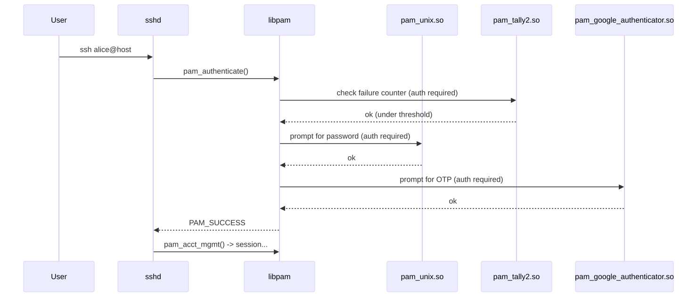
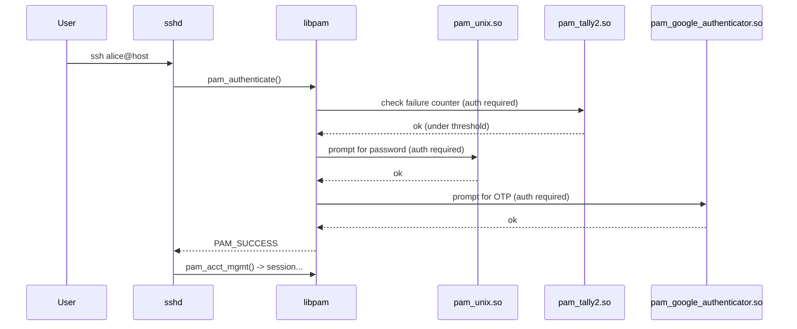

# PAM — Pluggable Authentication Modules — Deep Dive

## Why this matters

PAM is the answer to a question every Linux engineer eventually asks: *"how does `sshd` decide whether my password is right?"* The answer is not "it reads `/etc/shadow`." It is: **PAM**. SSH, login, su, sudo, gdm, cron, vsftpd — they all delegate the decision *yes-or-no, can this user do this thing* to the PAM stack. Change one file in `/etc/pam.d/` and you can require MFA, lock accounts after N failures, enforce password complexity, restrict logins by time of day, all without touching a single application.

It is also the place where one wrong line silently turns "must have password" into "anyone walks in." PAM's failure mode is permissive — that's why understanding it cold is non-negotiable for anyone touching production Linux.

---

## Mental model

```mermaid
flowchart TB
    APP[sshd / login / su / sudo / cron] -->|libpam| STACK
    subgraph STACK [/etc/pam.d/sshd stack]
        A[auth: who are you?] --> ACC[account: are you allowed in?]
        ACC --> PASS[password: change credentials]
        PASS --> SESS[session: setup/teardown env]
    end
    STACK --> RESULT{aggregate result}
    RESULT -->|all required pass| OK[grant]
    RESULT -->|any required fail| DENY[deny]
```

<!-- mermaid:rendered -->
<p align="center"></p>

<details><summary>Mermaid source</summary>



</details>

---

## The four PAM phases

| Phase | Purpose |
|-------|---------|
| `auth` | Verify identity. Passwords, OTP, biometrics, kerberos tickets. |
| `account` | Authorization checks unrelated to credentials: account expired? time-of-day allowed? quota exceeded? |
| `password` | Used when *changing* credentials (passwd, chsh). Complexity policy lives here. |
| `session` | Run setup/teardown when access granted: open keychain, mount homedir, write utmp, MOTD, cgroup limits. |

Each phase has its own stack of modules. Order matters.

---

## A line in `/etc/pam.d/<service>` decoded

```
auth    required       pam_unix.so      try_first_pass nullok
^       ^              ^                ^
|       |              |                module-specific args
|       |              module .so
|       control: required / requisite / sufficient / optional / [list]
phase
```

### Control values

| Control | What it means on success | On failure |
|---------|---------------------------|------------|
| `required`   | continue stack | continue stack, but final = fail |
| `requisite`  | continue stack | **abort immediately** (deny, no further prompts) |
| `sufficient` | **abort immediately** (allow, skip rest) — *unless* a prior `required` failed | continue stack |
| `optional`   | continue, ignored | continue, ignored (unless it's the only one) |
| `include`    | include another file's stack | — |
| `substack`   | like include but local control of jumps | — |
| `[key=val ...]` | fine-grained: success=ok, default=die, etc. | per spec |

The cardinal rule: **`requisite` is "fail-fast deny," `sufficient` is "succeed-fast allow."**

---

## Common modules — what they do

### Authentication & accounts
- **`pam_unix.so`** — checks /etc/shadow.
- **`pam_pwquality.so`** (or older `pam_cracklib.so`) — password complexity (length, classes, dictionary).
- **`pam_tally2.so` / `pam_faillock.so`** — count failed logins, lock account after N. `faillock` is the modern one on RHEL 8+.
- **`pam_listfile.so`** — allow/deny based on a flat file (e.g., usernames).
- **`pam_access.so`** — `/etc/security/access.conf` rules: who/where/when.
- **`pam_time.so`** — `/etc/security/time.conf` time-of-day restrictions.
- **`pam_succeed_if.so`** — conditional: "succeed if uid >= 1000," etc.
- **`pam_nologin.so`** — denies non-root login if `/etc/nologin` exists. Used during shutdown.
- **`pam_securetty.so`** — root login restricted to TTYs in `/etc/securetty`.

### Sessions & limits
- **`pam_limits.so`** — applies `/etc/security/limits.conf` (ulimits: nofile, nproc, memlock, etc.).
- **`pam_loginuid.so`** — sets the audit "loginuid" so auditd can track who originally logged in across su/sudo.
- **`pam_systemd.so`** — registers session with systemd-logind, sets up `XDG_RUNTIME_DIR`.
- **`pam_motd.so`** — prints message of the day.
- **`pam_lastlog.so`** — writes lastlog and shows "last login" message.
- **`pam_mkhomedir.so`** — creates home directory on first login (LDAP / SSO setups).
- **`pam_env.so`** — sets env vars from `/etc/environment` and `/etc/security/pam_env.conf`.

### MFA
- **`pam_google_authenticator.so`** — TOTP (RFC 6238). Works with Google Authenticator, Authy, FreeOTP, 1Password, etc.
- **`pam_yubico.so`** — YubiKey.
- **`pam_u2f.so`** — FIDO2 / WebAuthn hardware tokens.

---

## A real `/etc/pam.d/sshd` (Ubuntu 24.04, annotated)

```
# Account lockout: 5 fails -> 15min lock. Must be FIRST in auth stack.
auth     required   pam_faillock.so   preauth silent deny=5 unlock_time=900

# OTP (TOTP) -- FIRST factor before password gives better UX
auth     required   pam_google_authenticator.so   nullok

# Common Unix password (delegates to /etc/pam.d/common-auth)
@include common-auth

# Tail of faillock to record failure
auth     [default=die] pam_faillock.so authfail deny=5 unlock_time=900
auth     sufficient pam_faillock.so authsucc

@include common-account

# Resets PAM environment, sets locale
session  required   pam_loginuid.so
session  optional   pam_keyinit.so   force revoke
@include common-session
session  optional   pam_motd.so      motd=/run/motd.dynamic
session  optional   pam_motd.so      noupdate
session  optional   pam_mail.so      standard noenv
session  required   pam_limits.so
session  required   pam_env.so       readenv=1
session  required   pam_env.so       readenv=1 envfile=/etc/default/locale
session  optional   pam_systemd.so

@include common-password
```

`nullok` on `pam_google_authenticator` means: if the user hasn't set up TOTP yet, allow login without it. Drop `nullok` once everyone is enrolled.

---

## Common configs

### Lock account after N failed SSH logins (RHEL 8+ / Ubuntu 22.04+)

```
# /etc/pam.d/sshd  (use faillock, not pam_tally2 -- deprecated)
auth        required      pam_faillock.so preauth silent deny=5 unlock_time=900 even_deny_root
auth        sufficient    pam_unix.so try_first_pass
auth        [default=die] pam_faillock.so authfail deny=5 unlock_time=900 even_deny_root
account     required      pam_faillock.so
```

```bash
# Inspect / clear
sudo faillock --user alice
sudo faillock --user alice --reset
```

### Password complexity

`/etc/security/pwquality.conf`:
```
minlen = 14
minclass = 3        # need 3 of: upper, lower, digit, special
maxrepeat = 3
maxclassrepeat = 4
dcredit = -1        # require at least 1 digit
ucredit = -1
ocredit = -1
lcredit = -1
dictcheck = 1
enforce_for_root
remember = 5        # combined with pam_unix remember=N
```

Hooked in `/etc/pam.d/common-password`:
```
password requisite pam_pwquality.so retry=3
password required  pam_unix.so      use_authtok sha512 shadow remember=5 rounds=656000
```

### Limit who can SSH in

`/etc/security/access.conf`:
```
+ : root : 192.168.10.0/24
+ : (admins) : ALL
- : ALL : ALL
```

In `/etc/pam.d/sshd`:
```
account required pam_access.so
```

### Prevent service accounts from interactive login

```
# /etc/pam.d/login
auth required pam_succeed_if.so uid >= 1000 quiet_success
```

Or set their shell to `/sbin/nologin` (cleaner).

---

## MFA via pam_google_authenticator

```bash
# Install
sudo apt install libpam-google-authenticator   # Debian
sudo dnf install google-authenticator           # RHEL EPEL

# As the user (alice)
google-authenticator
# Walks through:
#  - time-based? yes
#  - update ~/.google_authenticator? yes
#  - disallow multiple uses? yes
#  - increase window for clock skew? no
#  - rate-limit: 3 attempts every 30s? yes
# Prints QR code -> scan into Authy/1Password/etc.
# Saves secret + 5 emergency scratch codes to ~/.google_authenticator (mode 0400)

# Hook into PAM (ssh)
sudo vi /etc/pam.d/sshd
# Add at the TOP of auth stack:
#   auth required pam_google_authenticator.so nullok

# Tell sshd to use PAM challenge-response
sudo vi /etc/ssh/sshd_config
#   ChallengeResponseAuthentication yes
#   UsePAM yes
#   AuthenticationMethods publickey,keyboard-interactive   # key + OTP
sudo systemctl restart sshd

# Test from another terminal first -- DO NOT close your existing session.
```

> Always keep an active SSH session open while testing PAM/sshd changes. One typo and you are locked out — guaranteed.

---

## Lab — Hardened SSH login: key + TOTP + faillock + access.conf

Goal: only members of `ssh-users` group can SSH from the corporate subnet, must use SSH key + TOTP, locked for 15 minutes after 5 fails.

```bash
# 1. Group + members
sudo groupadd ssh-users
sudo usermod -aG ssh-users alice

# 2. Enroll TOTP for alice
sudo -iu alice google-authenticator -t -d -f -r 3 -R 30 -W

# 3. /etc/pam.d/sshd
sudo tee /etc/pam.d/sshd >/dev/null <<'EOF'
auth     required   pam_faillock.so preauth silent deny=5 unlock_time=900
auth     required   pam_google_authenticator.so
@include common-auth
auth     [default=die] pam_faillock.so authfail deny=5 unlock_time=900
auth     sufficient pam_faillock.so authsucc

account  required   pam_access.so
account  required   pam_nologin.so
@include common-account

session  required   pam_loginuid.so
session  required   pam_limits.so
@include common-session

@include common-password
EOF

# 4. /etc/security/access.conf
sudo tee -a /etc/security/access.conf >/dev/null <<'EOF'
+ : (ssh-users) : 10.0.0.0/8
- : ALL : ALL
EOF

# 5. /etc/ssh/sshd_config
sudo sed -i \
  -e 's/^#\?PasswordAuthentication.*/PasswordAuthentication no/' \
  -e 's/^#\?ChallengeResponseAuthentication.*/ChallengeResponseAuthentication yes/' \
  -e 's/^#\?UsePAM.*/UsePAM yes/' \
  -e 's/^#\?PermitRootLogin.*/PermitRootLogin no/' \
  /etc/ssh/sshd_config

echo "AuthenticationMethods publickey,keyboard-interactive" | sudo tee -a /etc/ssh/sshd_config
echo "AllowGroups ssh-users" | sudo tee -a /etc/ssh/sshd_config

# 6. Restart -- but keep your current session open!
sudo sshd -t            # syntax check
sudo systemctl restart sshd

# 7. Test from another terminal
ssh alice@host
# Should: present key, then prompt for OTP. Bob (not in ssh-users) gets denied.
```

Verification:
```bash
sudo faillock --user alice          # show fail counter
sudo lastb -n 20                    # recent failed logins
sudo journalctl -u sshd -n 100
```

---

## Common attack patterns

| Attack | Description | How PAM stops it |
|--------|-------------|------------------|
| **Brute-force SSH** | Bot tries 1000s of passwords | `pam_faillock` locks account, plus SSH key-only |
| **Credential stuffing with leaked passwords** | Reused passwords from data breaches | `pam_pwquality` with dictionary check; require MFA |
| **Service-account interactive login** | Attacker `su`s to `nginx` user | `pam_succeed_if uid >= 1000` blocks system accounts |
| **Password change to weak password** | Insider sets pw to `Summer2025!` | `pam_pwquality minlen=14 minclass=3 dictcheck=1` |
| **Off-hours admin login** | Compromised laptop logs in at 3am | `pam_time.conf` restricts admin group to business hours |
| **Bypass via console/TTY** | Physical attacker at TTY | `pam_securetty.so` denies root on non-listed TTYs |
| **Session escape via unset loginuid** | Privilege escalation hides original user in audit | `pam_loginuid.so required` records original loginuid |

---

> **20-year tip — war story**
>
> Customer ran a "secure" environment with elaborate sudoers rules. Audit found that during a maintenance window an engineer had added a single line to `/etc/pam.d/sshd`:
>
> ```
> auth sufficient pam_succeed_if.so user = root
> ```
>
> Because **`sufficient`** stops the stack on success, this meant that any incoming SSH connection claiming to be `root` was authenticated **without ever checking the password or key**. It had been that way for 11 months. The line was added "to debug a key issue."
>
> **Lesson 1**: never add `sufficient` to a PAM auth stack without understanding the stack-stop semantics.
> **Lesson 2**: PAM files belong in source control with diff review like any other production config.
> **Lesson 3**: test what you intend to deny by *trying to do it* — the engineer never tested with a wrong password.
>
> Bonus: if you must edit `/etc/pam.d/*` live, keep a root shell open in another terminal. PAM mistakes lock everyone out, including you, *immediately* — there is no "save and revert" window.

---

> **Common interview questions**
>
> 1. **Q: What's the difference between `required`, `requisite`, and `sufficient`?**
>    A: `required` — must succeed for stack to succeed, but failure does not abort; later modules still get called (so an attacker can't infer which module failed). `requisite` — must succeed; failure aborts immediately (used when later prompts must not happen). `sufficient` — success aborts the rest of the stack and grants access *unless* a prior `required` failed.
>
> 2. **Q: A user can `ssh` in even though their password is wrong. Where do you look?**
>    A: `/etc/pam.d/sshd` and any `@include` files (typically `common-auth`). Look for `sufficient` modules early in the stack (especially `pam_succeed_if`, `pam_unix nullok`). Check `/etc/ssh/sshd_config` for `UsePAM yes` and `PasswordAuthentication`. Also inspect `pam_listfile` rules and `pam_access.conf`.
>
> 3. **Q: Why use `pam_loginuid`?**
>    A: It records the original UID at login time into the kernel's audit subsystem. As the user `su`s or `sudo`s, the loginuid persists, so auditd can attribute root actions back to the original human. Without it, the audit trail loses the human identity at the first privilege change.
>
> 4. **Q: What's `pam_faillock` and how does it differ from `pam_tally2`?**
>    A: Both count failed authentications. `pam_tally2` is deprecated (not present in RHEL 8+). `pam_faillock` is the supported replacement; supports per-user state files in `/var/run/faillock/`, configurable deny count, unlock_time, even_deny_root.
>
> 5. **Q: Where is password complexity enforced?**
>    A: In the `password` phase, typically by `pam_pwquality.so` (the modern replacement for `pam_cracklib`). Configured via `/etc/security/pwquality.conf`. The `pam_unix` `remember=N` option (with shadow files) prevents reuse of the last N passwords.
>
> 6. **Q: How would you add MFA to SSH without breaking emergency access?**
>    A: Use `pam_google_authenticator nullok` so users without enrolled tokens can still log in (gradually enroll users). Pair with `AuthenticationMethods publickey,keyboard-interactive` in sshd_config so SSH key is also required. Always keep a console/IPMI/serial path that bypasses MFA for break-glass. Document and rotate.
>
> 7. **Q: A change to `/etc/pam.d/common-auth` locks everyone out. How do you recover?**
>    A: Boot to single-user / rescue mode, mount root rw, restore from backup or git history, reboot. Or boot from rescue media and chroot. Lesson: always test in a parallel session and back up the file before editing.

---

## Sources

- `man 8 pam`, `man 5 pam.conf`, `man 5 pam.d`
- `man 8 pam_unix`, `man 8 pam_faillock`, `man 8 pam_pwquality`, `man 8 pam_access`, `man 8 pam_limits`, `man 8 pam_loginuid`, `man 8 pam_succeed_if`
- Linux-PAM documentation — http://www.linux-pam.org/
- Google Authenticator PAM — https://github.com/google/google-authenticator-libpam
- Red Hat: *Configuring Authentication and Authorization in RHEL*
- CIS Benchmarks §5.4 (PAM configuration)
