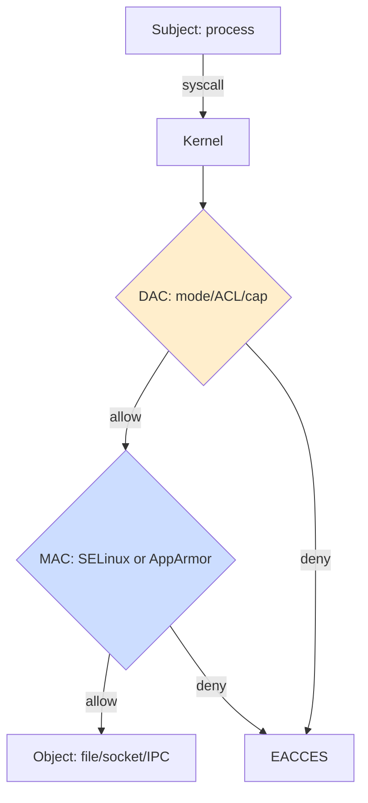
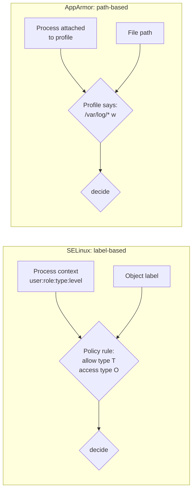

# SELinux vs AppArmor — Mandatory Access Control

## Why this matters

DAC (Discretionary Access Control — the rwx mode bits, ACLs, file capabilities) has one fatal property: **the owner of an object can grant access to anyone**. If your web server runs as `apache` and `apache` owns the data dir, a remote code execution gives the attacker the same rights as `apache` — including reading every file `apache` owns.

MAC (Mandatory Access Control) layers a *system-wide policy* over DAC. Even if `apache` "owns" the file, the kernel will refuse access if the **policy** doesn't permit a process labeled `httpd_t` to read a file labeled `etc_t`. The owner can't waive this. Only the security administrator can change policy.

Two main implementations on Linux: **SELinux** (NSA, type-enforcement based, label-driven, used in RHEL/Fedora/CentOS/Android) and **AppArmor** (Canonical, path-based profiles, used in Ubuntu/SUSE). Both are LSMs (Linux Security Modules). They solve the same problem with very different ergonomics.

---

## Mental model

<!-- mermaid:rendered -->
<p align="center"></p>

<details><summary>Mermaid source</summary>



</details>

<!-- mermaid:rendered -->
<p align="center"></p>

<details><summary>Mermaid source</summary>



</details>

---

## DAC vs MAC — the one-paragraph contrast

DAC: *"Can the subject's UID/GID do this operation on this object's mode/ACL?"* Owner-controlled.

MAC: *"Does the system-wide policy allow a subject of class X to perform operation Y on an object of class Z?"* Policy-controlled. Even root cannot bypass without first changing the policy.

Both run. The kernel checks DAC first; if DAC denies, the request fails. If DAC allows, MAC then evaluates. *Both* must pass. MAC cannot grant access that DAC denies.

---

## SELinux

### Concepts

Every process and object gets a **security context** of the form:

```
user:role:type:sensitivity[:category]
example: system_u:system_r:httpd_t:s0
```

- **user** — SELinux user (not Linux user). `system_u`, `unconfined_u`, `staff_u`.
- **role** — abstraction for RBAC. `system_r` for daemons, `unconfined_r` for unconfined sessions.
- **type** — the workhorse. **Type enforcement** is what does the actual deciding.
- **sensitivity / categories** — MLS (multi-level security), used in MCS for container/multi-tenant separation.

Policy says things like:
```
allow httpd_t httpd_sys_content_t : file { read getattr open };
```

Translation: a process whose type is `httpd_t` may `read`, `getattr`, `open` a file whose type is `httpd_sys_content_t`. Anything not explicitly allowed is denied.

### Three modes

| Mode | What it does |
|------|--------------|
| `enforcing` | Policy is enforced. Denials block. Production. |
| `permissive` | Policy is evaluated and denials *logged*, but not blocked. Diagnostic. |
| `disabled` | LSM hook not active. Avoid in production. Re-enabling requires relabel. |

```bash
sestatus                # full status
getenforce              # one word
setenforce 0            # enforcing -> permissive (runtime, NOT persistent for disabled)
setenforce 1            # back to enforcing

# Persistent: edit /etc/selinux/config
#   SELINUX=enforcing   (or permissive / disabled)
#   SELINUXTYPE=targeted
```

> **Never** set `SELINUX=disabled` to "fix" an issue. Use `permissive`, capture the AVC denials, fix the policy.

### Inspecting contexts

```bash
ls -Z /etc/passwd
# system_u:object_r:passwd_file_t:s0  /etc/passwd

ps -eZ | grep httpd
# system_u:system_r:httpd_t:s0    1234 ?    00:00:01 httpd

id -Z                            # your own context
matchpathcon /var/www/html/index.html   # what context SHOULD this path have

# Change context (manual, often wrong; prefer policy)
chcon -t httpd_sys_content_t /var/www/html/myfile

# Reset to policy-defined context
restorecon -Rv /var/www/html

# Define a permanent context rule (semanage)
sudo semanage fcontext -a -t httpd_sys_content_t '/srv/web(/.*)?'
sudo restorecon -Rv /srv/web
```

### Booleans — runtime policy switches

Many common decisions are toggleable booleans, no policy compile needed.

```bash
getsebool -a | grep httpd
sudo setsebool -P httpd_can_network_connect on   # -P = persistent
sudo setsebool -P httpd_enable_homedirs off
```

### Ports

SELinux labels TCP/UDP ports too. To let httpd listen on 8080:

```bash
sudo semanage port -a -t http_port_t -p tcp 8080
sudo semanage port -l | grep http
```

### Audit & audit2allow workflow

When SELinux denies something, it logs an `AVC` (Access Vector Cache) message to the audit log. `audit2allow` turns those into a policy module.

```bash
# Watch denials in real time
sudo ausearch -m AVC -ts recent
sudo tail -f /var/log/audit/audit.log | grep AVC

# Turn the last denials into a candidate module (READ before installing!)
sudo ausearch -m AVC -ts today | audit2allow -m mywebapp

# Generate, compile, install
sudo ausearch -m AVC -ts today | audit2allow -M mywebapp
sudo semodule -i mywebapp.pp

# List installed modules
sudo semodule -l | head

# Disable a module
sudo semodule -d mywebapp
```

> **Critical caveat**: `audit2allow` blindly converts every denial to an `allow`. If the denial was an actual attack, you've just permitted it forever. **Always read the generated `.te` file**. If you see denials for `shell_exec_t` or `unconfined_t` from a daemon, that's not a misconfig — that's an exploit signature.

### Useful commands

```bash
sealert -l <UUID>                # human-readable explanation (setroubleshoot)
sealert -a /var/log/audit/audit.log
semanage fcontext -l             # all file context rules
semanage user -l                 # SELinux user mappings
semanage login -l                # Linux user -> SELinux user
chcat -l                         # MCS categories
fixfiles relabel                 # full filesystem relabel (next boot)
touch /.autorelabel && reboot    # trigger full relabel
```

### Common file-context types

| Type | Used for |
|------|----------|
| `httpd_sys_content_t` | files Apache/nginx serves (read) |
| `httpd_sys_rw_content_t` | files httpd may write (uploads) |
| `httpd_log_t` | httpd log files |
| `var_log_t` | generic log files |
| `etc_t` | generic /etc config |
| `bin_t` | system binaries |
| `tmp_t` | /tmp content |
| `user_home_t` | user home content |
| `unconfined_t` | unconfined process (often what you DON'T want for a daemon) |

---

## AppArmor

Path-based, profile-per-binary. A *profile* is a file in `/etc/apparmor.d/` named after the binary's path with slashes replaced by dots, e.g., `/etc/apparmor.d/usr.sbin.nginx`.

### Modes (per profile)

| Mode | Behavior |
|------|----------|
| `enforce` | Deny anything outside the profile. |
| `complain` | Allow but log violations. Used for development. |
| `disabled` | Profile not loaded. |
| `audit` | Log even allowed accesses (verbose). |

```bash
sudo aa-status                  # which profiles loaded, which mode
sudo aa-enforce /etc/apparmor.d/usr.sbin.nginx
sudo aa-complain /etc/apparmor.d/usr.sbin.nginx
sudo aa-disable /etc/apparmor.d/usr.sbin.nginx
sudo apparmor_parser -r /etc/apparmor.d/usr.sbin.nginx   # reload
```

### Profile syntax (read like a firewall rule)

```
#include <tunables/global>

/usr/sbin/nginx {
  #include <abstractions/base>
  #include <abstractions/nameservice>

  capability net_bind_service,
  capability setuid,
  capability setgid,

  network inet stream,
  network inet6 stream,

  /etc/nginx/** r,
  /etc/ssl/certs/** r,
  /etc/ssl/private/** r,

  /var/log/nginx/*.log w,
  /run/nginx.pid w,

  /var/www/** r,
  /srv/web/** r,
  /srv/uploads/** rw,

  /usr/sbin/nginx mr,
  /usr/lib/nginx/modules/*.so mr,

  # Deny anything else implicitly.
  deny /etc/shadow r,
  deny /home/** rw,
}
```

File access modes: `r` read, `w` write, `a` append, `m` memory map executable, `k` lock, `l` link, `x` execute (with discrete subtypes: `ix` inherit profile, `Px` switch profile, `ux` unconfined — dangerous).

### Profile authoring helpers

```bash
sudo aa-genprof /usr/local/bin/myapp     # interactive: run app, learn accesses
sudo aa-logprof                          # parse audit log, suggest profile updates
sudo aa-complain /usr/local/bin/myapp    # let it run, then iterate
sudo aa-enforce  /usr/local/bin/myapp
```

---

## Side-by-side comparison

| Feature | SELinux | AppArmor |
|---------|---------|----------|
| **Policy model** | Type enforcement (labels) | Path-based (filenames/globs) |
| **Default distros** | RHEL/Fedora/CentOS/Rocky/Android | Ubuntu/Debian/SUSE |
| **Granularity** | Very high (every object class, every operation) | Coarser (mostly file path + caps + net) |
| **Learning curve** | Steep | Gentler |
| **Policy units** | `.te` source → `.pp` modules | One profile file per binary |
| **Tooling** | semanage, semodule, audit2allow, sealert | aa-genprof, aa-logprof, aa-status |
| **What if file is moved?** | Label travels (xattr) | Profile no longer applies (path changed) |
| **Coexists with the other?** | LSM stacking limited; usually one or the other | same |
| **Container ecosystem** | Strong (OpenShift, Podman, Kubernetes SCC) | Strong (Snap, Docker default) |
| **MLS / MCS support** | Yes, full | No |
| **Strength** | Most expressive MAC system on Linux | Easiest to write/maintain |
| **Weakness** | Label drift, restorecon nightmares, opacity | Path-based is bypassable via hardlinks/bind mounts |

The cliché is true: **SELinux is harder but stronger**, **AppArmor is friendlier but coarser**. Pick the one that matches your distro; running both well requires expertise most teams don't have.

---

## Lab — SELinux: confine a custom web app

```bash
# 1. Install + ensure enforcing
sudo dnf install -y policycoreutils-python-utils setroubleshoot-server
sudo setenforce 1
getenforce

# 2. Place app
sudo mkdir -p /opt/myapp
echo '<?php phpinfo(); ?>' | sudo tee /opt/myapp/index.php

# 3. Try to serve from /opt/myapp via httpd -- will FAIL
sudo sed -i 's|DocumentRoot "/var/www/html"|DocumentRoot "/opt/myapp"|' /etc/httpd/conf/httpd.conf
sudo systemctl restart httpd
curl -I http://localhost/        # 403
sudo ausearch -m AVC -ts recent  # see denial

# 4. Fix: declare the right context for /opt/myapp
sudo semanage fcontext -a -t httpd_sys_content_t '/opt/myapp(/.*)?'
sudo restorecon -Rv /opt/myapp
ls -Z /opt/myapp

# 5. Verify
curl -I http://localhost/        # 200

# 6. Demonstrate boolean
sudo setsebool -P httpd_can_network_connect on   # if app calls outward APIs
```

## Lab — AppArmor: lock down a script

```bash
# 1. Place script
sudo tee /usr/local/bin/log-trimmer.sh >/dev/null <<'EOF'
#!/bin/bash
find /var/log -name "*.log" -size +100M -exec truncate -s 0 {} \;
EOF
sudo chmod +x /usr/local/bin/log-trimmer.sh

# 2. Generate a profile in complain mode
sudo aa-genprof /usr/local/bin/log-trimmer.sh
# In another terminal, run the script. Answer aa-genprof prompts as you go.

# 3. Switch to enforce
sudo aa-enforce /usr/local/bin/log-trimmer.sh

# 4. Verify -- if the script tries to write outside /var/log it will be blocked
sudo aa-status | grep log-trimmer
```

---

## Common attack patterns

| Attack | DAC alone? | MAC stops it? |
|--------|-----------|---------------|
| **Webshell drops `/var/www/uploads/x.php`, then reads `/etc/shadow`** | yes if file is mode 0644 (it isn't, but...) | SELinux: `httpd_t` cannot read `shadow_t`. Denied. |
| **httpd RCE writes to `/var/www/html`** | possible (if httpd owns it) | SELinux: `httpd_sys_content_t` is read-only for `httpd_t`; need explicit `httpd_sys_rw_content_t`. |
| **Container breaks out, tries to mount /proc** | docker drops caps but not enough | SELinux/AppArmor confines container to its label/profile. |
| **PHP `system("/bin/bash")`** | succeeds if perms allow | SELinux: `httpd_t` cannot transition to `shell_exec_t`/`bin_t` for arbitrary exec. |
| **DAC widening: `chmod 777 /etc/cron.d/`** | huge problem | MAC still requires `cron_spool_t`; webshell can write but cron won't load it without correct label. |
| **Symlink TOCTOU into /etc/passwd** | yes potentially | SELinux refuses cross-domain access; AppArmor can be bypassed via path tricks if profile uses globs poorly. |

---

> **20-year tip — war story**
>
> A retail customer ran SELinux in `permissive` mode "until we figure out the rules." For three years. During an incident, an Apache RCE wrote a backdoor into `/var/www/html/upload.php`. SELinux **logged 4,000 AVC denials** for that web shell trying to read `/etc/shadow`, dial outbound, exec `/bin/sh`, etc. Every. Single. Denial. Was. Logged. And. Allowed.
>
> If they had run `enforcing`, the breach would have stopped at "webshell uploaded; cannot do anything with it." Instead it ran for 11 days.
>
> **Lesson**: `permissive` is for *learning*, not *running*. Set a hard deadline (30/60/90 days), iterate the policy with `audit2allow`, then flip to enforcing. The same applies to AppArmor `complain` mode.
>
> Second lesson: when an SRE says "I disabled SELinux because the app wouldn't start," that is a **security incident**, not a fix. Investigate the *real* denial, write the policy delta, re-enable enforcing.

---

> **Common interview questions**
>
> 1. **Q: What's the difference between DAC and MAC?**
>    A: DAC = Discretionary Access Control: object owner controls who can access (Unix mode bits). MAC = Mandatory Access Control: a system-wide policy controls access; owners cannot grant beyond what policy allows. SELinux/AppArmor implement MAC.
>
> 2. **Q: Walk me through what happens when an SELinux-enforcing system denies a syscall.**
>    A: Kernel evaluates DAC first; if it allows, the LSM hook fires. SELinux checks the subject's context (e.g., `httpd_t`) against the object's context (e.g., `shadow_t`) for the requested operation. If no `allow` rule matches, the kernel returns EACCES (or similar) and writes an AVC message to the audit subsystem. `setroubleshoot` may translate that into a human-friendly suggestion.
>
> 3. **Q: When would you choose AppArmor over SELinux?**
>    A: When the team is small, the distro is Ubuntu/Debian/SUSE, and you need fast wins for a few critical binaries. AppArmor profiles are easier to write and audit. Choose SELinux when running RHEL/Fedora, when you need MLS/MCS (multi-tenant containers, regulated workloads), or when your security team already operates SELinux.
>
> 4. **Q: What does `restorecon` do, and when do you need it?**
>    A: It resets a file's SELinux context to the default defined by `semanage fcontext` rules. Needed after copying files (most copy tools strip xattrs), after restoring backups, or after running `chcon` (which is non-persistent and can be undone by relabel).
>
> 5. **Q: Why is `audit2allow` dangerous?**
>    A: It transforms every observed denial into an allow, including denials caused by attacks. The recommended workflow is: run in permissive temporarily, capture denials, manually review and only allow legitimate ones. Never pipe `audit2allow -M` blindly into `semodule -i` on a production box.
>
> 6. **Q: How do you make `httpd` listen on port 8080 with SELinux enforcing?**
>    A: `sudo semanage port -a -t http_port_t -p tcp 8080`. Then restart httpd. The port label is independent of the file labels.
>
> 7. **Q: What's a security context made of, and where is it stored?**
>    A: `user:role:type:sensitivity[:categories]`. For files it lives in the `security.selinux` extended attribute. For processes it's an in-kernel attribute exposed via `/proc/<pid>/attr/current`. The type is the field that nearly every type-enforcement rule operates on.

---

## Sources

- `man 8 selinux`, `man 5 selinux_config`, `man 8 semanage`, `man 8 semodule`, `man 8 chcon`, `man 8 restorecon`, `man 8 audit2allow`, `man 8 sealert`
- `man 7 apparmor`, `man 8 aa-status`, `man 8 aa-genprof`, `man 8 aa-logprof`, `man 5 apparmor.d`
- Red Hat *SELinux User's and Administrator's Guide*
- Dan Walsh's blog (SELinux maintainer) — https://danwalsh.livejournal.com/
- Ubuntu AppArmor wiki — https://wiki.ubuntu.com/AppArmor
- NSA *Security-Enhanced Linux* — https://www.nsa.gov/research/selinux/
- LSM in kernel.org — https://www.kernel.org/doc/html/latest/admin-guide/LSM/
- CIS Benchmarks §1.6 (Mandatory Access Control)
