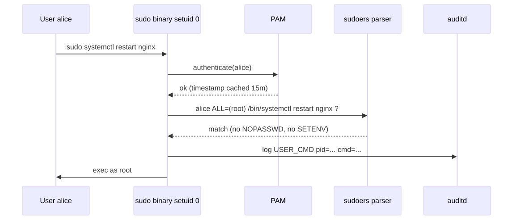
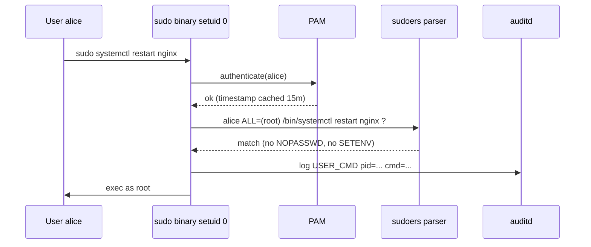

# Users, Groups, and sudo — Deep Dive

## Why this matters

Identity is the foundation of every other security control on Linux. If you can't trust *who* a process is running as, no permission, capability, MAC label, or audit log means anything. Yet 90% of Linux admins know `useradd` and `sudo` and stop there — they don't know that `/etc/shadow` is a different file for a reason, that `sudoers` is a *grammar*, not a flag list, that `NOPASSWD` is the single most dangerous keyword in DevOps, and that `sudo -i` versus `sudo bash` versus `sudo su -` produce three different audit trails.

This file makes you the person on the team who knows.

---

## Mental model

```mermaid
flowchart LR
    A[Login attempt] --> B{NSS lookup}
    B -->|/etc/passwd| C[UID/GID/shell/home]
    B -->|/etc/shadow| D[Password hash + aging]
    B -->|/etc/group| E[Group memberships]
    C --> F[PAM stack decides]
    D --> F
    E --> F
    F -->|success| G[Shell session as UID]
    G --> H{sudo invoked?}
    H -->|yes| I[Parse /etc/sudoers + sudoers.d/]
    I --> J[Match user@host = (runas) cmd]
    J -->|allowed| K[exec as target UID, log to audit]
    J -->|denied| L[deny + log + email mailto]
```

<!-- mermaid:rendered -->
<p align="center"></p>

<details><summary>Mermaid source</summary>



</details>
---

## /etc/passwd — the public ledger

```text
alice:x:1001:1001:Alice Kim,,,:/home/alice:/bin/bash
```

Seven colon-separated fields:

1. **username** — login name
2. **password placeholder** — historically the hash; now `x` means "look in shadow", `*` or `!` means locked, empty means no password (terrifying)
3. **UID** — numeric user ID. UID 0 = root. UID < 1000 typically system accounts.
4. **GID** — primary group
5. **GECOS** — comment field, comma-separated subfields (full name, room, phone, other)
6. **home directory**
7. **login shell** — `/sbin/nologin` or `/bin/false` to disable interactive login

World-readable (mode 0644). That's intentional: every program that needs to map UID→name reads it.

```bash
ls -l /etc/passwd
# -rw-r--r-- 1 root root 2841 Apr 26 09:14 /etc/passwd
```

## /etc/shadow — the secret ledger

```text
alice:$6$rounds=656000$saltsalt$hashhashhash...:19838:0:99999:7:::
```

Nine fields:

1. **username**
2. **password hash** — `$id$salt$hash`. `$1$`=MD5, `$2a$`=Blowfish, `$5$`=SHA-256, `$6$`=SHA-512, `$y$`=yescrypt. Leading `!` or `*` = locked. Empty = no password.
3. **last password change** (days since 1970-01-01)
4. **min days between changes** (0 = anytime)
5. **max days password valid** (99999 = never expire)
6. **warning days** before expiry
7. **inactivity days** after expiry before account locked
8. **account expiration** (days since epoch)
9. **reserved**

Mode 0640 root:shadow. **Never** make it world-readable. If it leaks, every password is offline-crackable.

```bash
ls -l /etc/shadow
# -rw-r----- 1 root shadow 1543 Apr 26 09:14 /etc/shadow

sudo chage -l alice          # view aging
sudo chage -M 90 -W 14 alice # max 90d, warn 14d
sudo passwd -l alice         # lock (prepends ! to hash)
sudo passwd -u alice         # unlock
```

## /etc/group

```bash
wheel:x:10:alice,bob
docker:x:999:alice
```

Four fields: **groupname:password:GID:member-list**. The password field is almost always `x` (use gshadow) or empty. Adding a user to `docker` or `wheel` is effectively root — treat group membership as privilege escalation.

```bash
groups alice                 # all groups alice belongs to
id alice
getent group docker
gpasswd -a alice docker      # add to group
gpasswd -d alice docker      # remove
```

## /etc/sudoers — the grammar

The single most powerful and dangerous config file on a Linux box. **Always edit with `visudo`** (or `visudo -f /etc/sudoers.d/myfile`). Syntax errors lock you out.

### Structure

```bash
# Defaults
Defaults    env_reset
Defaults    mail_badpass
Defaults    secure_path="/usr/local/sbin:/usr/local/bin:/usr/sbin:/usr/bin:/sbin:/bin"
Defaults    logfile="/var/log/sudo.log"
Defaults    timestamp_timeout=15
Defaults    passwd_tries=3
Defaults    use_pty
Defaults    log_input,log_output

# Aliases
User_Alias  ADMINS = alice, bob
Runas_Alias OPS = root, postgres
Host_Alias  WEBSERVERS = web01, web02, web03
Cmnd_Alias  SVC_RESTART = /bin/systemctl restart nginx, /bin/systemctl reload nginx
Cmnd_Alias  DANGEROUS = /usr/bin/su, /usr/bin/visudo, /bin/bash, /bin/sh

# User specifications
root            ALL=(ALL:ALL) ALL
%sudo           ALL=(ALL:ALL) ALL
%wheel          ALL=(ALL) ALL
ADMINS          WEBSERVERS=(OPS) SVC_RESTART
deploy          ALL=(www-data) NOPASSWD: /usr/bin/git pull
%developers     ALL=(ALL) !DANGEROUS
```

### The user spec line, decoded

```text
who      where = (run-as)        [tag1: tag2:] command
ADMINS   WEBSERVERS=(OPS)        NOPASSWD:    SVC_RESTART
```

- **who** — user, %group, +netgroup, User_Alias
- **where** — host pattern (limits scope when sudoers shared via NIS/LDAP)
- **(run-as)** — `(user:group)`. Default `(root)`.
- **tags** — `NOPASSWD:`, `PASSWD:`, `SETENV:`, `NOSETENV:`, `LOG_INPUT:`, `NOEXEC:`
- **command** — full path or Cmnd_Alias. **Never** allow a wildcard like `/bin/*`.

### NOPASSWD — read this twice

```bash
deploy ALL=(root) NOPASSWD: /bin/systemctl restart myapp
```

This means anyone who can become `deploy` (compromised CI runner, stolen SSH key, escaped container) becomes root with no further check. Use it only when:

- the command is *fully specified* with arguments,
- the binary cannot be tricked into spawning a shell (vim, less, find, awk, perl can all `:!sh`),
- the use case is genuine automation (cron, systemd unit, CI deploy).

For interactive humans, **never** NOPASSWD.

### sudoers.d/

`/etc/sudoers` ends with `#includedir /etc/sudoers.d`. Drop-in files are easier to manage with config management. Files **must not** contain `.` or `~` and **must** be mode 0440.

```bash
sudo visudo -f /etc/sudoers.d/10-deploy
# Inside:
deploy ALL=(www-data) NOPASSWD: /usr/bin/rsync --delete /opt/release/ /var/www/
```

### Defaults to always set

```bash
Defaults env_reset                    # wipe env, only keep whitelist
Defaults secure_path="/sbin:/bin:..." # ignore caller's PATH
Defaults use_pty                      # forces pty -> sudoreplay works
Defaults log_input,log_output         # full session capture
Defaults logfile=/var/log/sudo.log
Defaults timestamp_timeout=5          # shorter cache window
Defaults passwd_tries=3
Defaults requiretty                   # no sudo from cron unless explicit
Defaults !visiblepw                   # never echo password
Defaults mail_badpass                 # alert on failed sudo
Defaults mailto="security@example.com"
```

### Command aliases — least privilege

The right pattern: small, named bundles of fully-specified commands.

```bash
Cmnd_Alias NGINX_OPS = \
    /bin/systemctl reload nginx, \
    /bin/systemctl restart nginx, \
    /bin/systemctl status nginx, \
    /usr/sbin/nginx -t

%webops ALL=(root) NOPASSWD: NGINX_OPS
```

Webops can do exactly four things, no more.

---

## Commands annotated

```bash
# Identity
id                              # uid=1001(alice) gid=1001(alice) groups=...
whoami                          # effective username
who                             # who is logged in (utmp)
last                            # login history (wtmp)
lastlog                         # last login per user
faillog                         # failed login counters

# User/group management
useradd -m -s /bin/bash -G sudo alice   # create + home + add to sudo
usermod -aG docker alice                # APPEND to docker group (forgetting -a wipes others!)
userdel -r alice                        # remove with home dir
groupadd ops
groupmod -n newname oldname

# Password / aging
passwd alice                    # set password
chage -l alice                  # show aging
chage -E 2026-12-31 alice       # account expires
chage -d 0 alice                # force pw change on next login

# sudo
sudo -l                         # list what *I* can run
sudo -l -U bob                  # list what bob can run (root only)
sudo -k                         # invalidate timestamp cache
sudo -v                         # extend timestamp without running cmd
sudo -i                         # login shell as root (loads root's env)
sudo -s                         # non-login shell as root
sudo -u www-data -i             # become www-data
sudoreplay <session-id>         # replay logged session
visudo -c                       # syntax check
visudo -cf /etc/sudoers.d/foo

# Audit trail
journalctl _COMM=sudo
tail -f /var/log/auth.log       # Debian
tail -f /var/log/secure         # RHEL
ausearch -m USER_CMD -ts today
```

---

## Lab — least-privilege deploy user

Goal: a `deploy` user that can restart nginx and rsync to /var/www, **nothing else**, without a password (for CI), with full audit.

```bash
# 1. Create system-style account, no shell login from password
sudo useradd -m -s /bin/bash -c "CI deploy" deploy
sudo passwd -l deploy                       # disable password auth

# 2. Add SSH key for CI
sudo -u deploy mkdir -p /home/deploy/.ssh
sudo -u deploy chmod 700 /home/deploy/.ssh
echo "ssh-ed25519 AAAA... ci@buildbox" | sudo -u deploy tee /home/deploy/.ssh/authorized_keys
sudo -u deploy chmod 600 /home/deploy/.ssh/authorized_keys

# 3. Define exact commands
sudo visudo -f /etc/sudoers.d/10-deploy
```

Contents:
```bash
Cmnd_Alias DEPLOY_OPS = \
    /bin/systemctl reload nginx, \
    /bin/systemctl restart nginx, \
    /usr/bin/rsync --delete /opt/release/ /var/www/html/

Defaults:deploy !requiretty, log_input, log_output

deploy ALL=(root) NOPASSWD: DEPLOY_OPS
```

```bash
# 4. Verify
sudo -l -U deploy
# Should list exactly the three commands

# 5. Watch the audit
sudo tail -f /var/log/sudo.log /var/log/auth.log
# Now from CI: ssh deploy@host 'sudo systemctl reload nginx'
```

Try to escape:
```bash
ssh deploy@host 'sudo bash'        # denied
ssh deploy@host 'sudo systemctl reload nginx; sudo bash'  # second denied
ssh deploy@host 'sudo rsync --rsync-path="bash -c id" /tmp/ /tmp/'  # rsync's --rsync-path is dangerous; lock down args!
```

> **Hardening note**: `--rsync-path` is a known sudo-bypass vector. If you must allow rsync, use a wrapper script, not the binary directly.

---

## Common attack patterns

| Attack | How it works | How this layer stops it |
|--------|--------------|-------------------------|
| **Stolen SSH key for sudo user** | Attacker keys in as alice, runs `sudo -s` | `Defaults timestamp_timeout=0` forces password each time; require MFA via PAM |
| **NOPASSWD on a shell-spawning binary** | `sudo vim` then `:!bash` | Audit setuid + only allow non-shell binaries; use `NOEXEC:` tag |
| **Wildcards in Cmnd** | `/bin/systemctl *` lets attacker `systemctl edit user.service --full` and inject ExecStart=/bin/bash | Never use wildcards; enumerate full commands |
| **Adding user to docker group** | `docker run -v /:/host -it alpine chroot /host` = instant root | Treat docker group as root; use rootless docker or sudo+audit |
| **passwd field empty** | Anyone can `su - alice` with no password | Audit `awk -F: '$2==""' /etc/shadow` |
| **GECOS injection** | Some MTAs interpret commas | Validate GECOS field on user create |
| **Sudo timestamp tty hijack (CVE-2017-1000367)** | Old bug, now patched, but illustrative | Keep sudo current; use `Defaults use_pty` |
| **Baron Samedit (CVE-2021-3156)** | sudo heap overflow regardless of sudoers | Patch promptly; sudo >= 1.9.5p2 |

---

> **20-year tip — war story**
>
> A client called at 3am: "the audit team found root logins from a service account, but nobody owns it." Traced it to a `sudoers.d` file dropped by a Puppet module five years earlier with `svc_legacy ALL=(ALL) NOPASSWD: ALL`. The original developer had left the company. The service account's SSH key was on six developer laptops. Two of those laptops were sold on eBay.
>
> **Lesson**: every NOPASSWD entry needs an owner, an expiry date in a comment, and a quarterly review. If you can't justify why a line exists, delete it. The blast radius of one bad sudoers line is the entire fleet.
>
> Also: never grant `(ALL) ALL`. Always specify the runas user. `(ALL)` means the attacker can become `root` *or* `postgres` *or* `mysql` and pivot through the data layer.

---

> **Common interview questions**
>
> 1. **Q: Why does `/etc/passwd` have an `x` in the password field?**
>    A: Historical password hashes lived there but the file is world-readable. The hash moved to `/etc/shadow` (mode 0640, root:shadow) so unprivileged processes can still resolve UID→name without seeing hashes. The `x` is a sentinel telling the auth library to consult shadow.
>
> 2. **Q: What's the difference between `sudo su -`, `sudo -i`, and `sudo bash`?**
>    A: `sudo -i` runs root's login shell with root's environment (clean). `sudo su -` execs su as root which then runs root's login shell — two processes, two audit entries, slightly different env handling. `sudo bash` runs bash as root **with the caller's environment** (unless `env_reset` strips it), which is dangerous because PATH, LD_PRELOAD, etc. carry over. Prefer `sudo -i`.
>
> 3. **Q: A user reports they can run `sudo cat /etc/shadow` but not `sudo less /etc/shadow`. Why?**
>    A: The sudoers rule almost certainly named `/bin/cat` explicitly but not `less`. Also, `less` would be dangerous because `!sh` from inside less spawns a root shell. This is why `sudo -l` matters: list exactly what's permitted.
>
> 4. **Q: What does `Defaults env_reset` do, and why is it on by default?**
>    A: It clears the calling user's environment before executing the command, keeping only a whitelist (TERM, PATH from secure_path, LANG, etc.). Without it, an attacker could set `LD_PRELOAD=/tmp/evil.so` or `PYTHONPATH=...` and have root execute their code. Always keep env_reset on.
>
> 5. **Q: How would you allow a CI user to deploy without a password but minimize blast radius?**
>    A: SSH key (not password), system account with locked password, `NOPASSWD` only on a fully-specified Cmnd_Alias (no wildcards), wrap any flexible commands (rsync, find) in a shell script you own and audit, enable `log_input,log_output`, ship sudo logs to SIEM, and rotate the SSH key.
>
> 6. **Q: Why is adding a user to the `docker` group equivalent to giving them root?**
>    A: Docker daemon runs as root and the docker socket has no per-command ACL. `docker run -v /:/host --privileged alpine chroot /host` mounts the host filesystem and chroots — instant root. Solutions: rootless Docker, or require `sudo docker` with auditing.
>
> 7. **Q: How do you detect a backdoor account in `/etc/passwd`?**
>    A: Baseline with AIDE or compare against config-managed source of truth. Programmatically: `awk -F: '$3==0 && $1!="root"' /etc/passwd` finds non-root UID-0 accounts. Also check for empty password fields: `awk -F: '$2==""' /etc/shadow`. Cron + alerting + auditd `-w /etc/passwd -p wa -k passwd_changes`.

---

## Sources

- `man 5 passwd`, `man 5 shadow`, `man 5 group`, `man 5 sudoers`, `man 8 sudo`, `man 8 visudo`
- `man 1 chage`, `man 1 passwd`, `man 8 useradd`
- Sudo project — https://www.sudo.ws/docs/
- CIS RHEL 9 Benchmark §5 (Access, Authentication, Authorization)
- NSA *Security Configuration Guide* — `sudo` hardening section
- CVE-2021-3156 (Baron Samedit) write-up — Qualys Security Advisory
