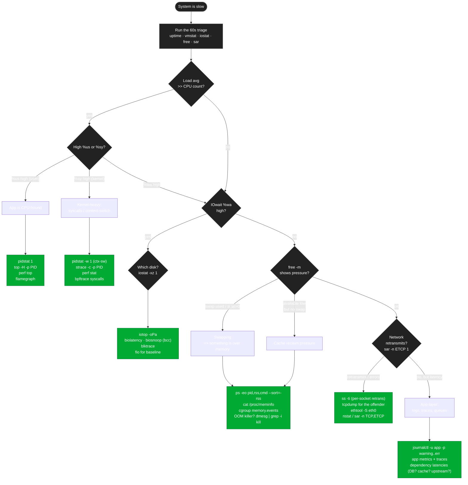

# Troubleshooting Flowchart — "System is slow"

> When the pager goes off, don't randomly grep. Walk the tree.

```
   ┌──────────────────────────────────────────────────────────────┐
   │  THE 60-SECOND TRIAGE (Brendan Gregg's USE checklist)        │
   │                                                              │
   │   uptime          → load avg trend                           │
   │   dmesg | tail    → kernel said anything? (OOM, disk fail)   │
   │   vmstat 1 5      → CPU, memory, swap, IO at a glance        │
   │   mpstat -P ALL 1 → per-CPU breakdown                        │
   │   pidstat 1       → top processes by CPU                     │
   │   iostat -xz 1    → per-disk IO                              │
   │   free -m         → memory + swap                            │
   │   sar -n DEV 1    → network IO per interface                 │
   │   sar -n TCP,ETCP 1 → TCP retransmits, errors                │
   │   top / htop      → live process view                        │
   └──────────────────────────────────────────────────────────────┘
```

---

## The flowchart

<!-- mermaid:rendered -->
<p align="center"></p>

<details><summary>Mermaid source</summary>



</details>
---

## Subsystem → tool quick map

| Symptom | First tool | Second tool | Deep tool |
|---------|------------|-------------|-----------|
| High %us | `pidstat 1` | `top -H -p PID` | `perf top -p PID`, flamegraph |
| High %sy | `pidstat -w 1` | `strace -c -p PID` | `perf stat`, `bpftrace` |
| High %wa | `iostat -xz 1` | `iotop -oPa` | `biolatency`, `biosnoop` |
| High %si / %hi | `mpstat -P ALL 1` | `cat /proc/interrupts` | irq affinity tuning |
| Memory low | `free -m` + `vmstat 1` | `ps --sort=-rss \| head` | `/proc/meminfo`, slabtop |
| Swap thrashing | `vmstat 1` (si/so) | `cat /proc/swaps` | turn off swap, fix the leak |
| Retransmits | `ss -ti` | `nstat -a \| grep -i retr` | `tcpdump` flow capture |
| DNS slow | `dig +trace example.com` | `getent hosts example.com` | resolver logs / `tcpdump port 53` |
| Disk full | `df -h` | `du -xh /var \| sort -h \| tail` | `find / -size +1G -xdev` |
| Inodes full | `df -i` | `find /path -xdev -printf '%h\n' \| sort \| uniq -c \| sort -rn \| head` | check quotas |

---

## CPU triage details

```bash
# How many CPUs do I have?
nproc                                # logical
lscpu                                # cores / sockets / NUMA

# Load avg vs CPUs (rule of thumb: load > 2x CPU count = saturation)
uptime                               # 1m / 5m / 15m

# Per-CPU breakdown — find imbalance
mpstat -P ALL 1 5

# Per-process top CPU consumers (also shows per-thread with -t)
pidstat 1
pidstat -t -p $PID 1

# What syscalls is it stuck in?
strace -c -p $PID                    # summary after Ctrl-C
strace -f -e trace=network -p $PID

# CPU profile (sample call stacks 99 Hz for 30s)
perf record -F 99 -p $PID -g -- sleep 30
perf report
# Or flamegraph: perf script | stackcollapse-perf.pl | flamegraph.pl > fg.svg
```

## Memory triage details

```bash
free -m
cat /proc/meminfo | grep -E '^(Mem|Swap|Cached|Buffers|Dirty|Writeback|Slab|Available)'
ps -eo pid,user,rss,vsz,comm --sort=-rss | head -10
slabtop                              # kernel slab caches
smem -tk -P python                   # PSS-based, more honest than RSS

# Was anything killed?
dmesg | grep -i 'killed process'
journalctl -k | grep -i oom

# Cgroup memory pressure (k8s-relevant)
cat /sys/fs/cgroup/memory.events
cat /sys/fs/cgroup/memory.pressure   # PSI
```

## Disk triage details

```bash
iostat -xz 1                         # %util, await, r/s w/s, rkB/s wkB/s
iotop -oPa                           # per-process IO (root needed)

# Per-mount fill + inodes
df -hT
df -i

# What's eating the disk under /var?
du -xh --max-depth=1 /var | sort -h | tail
ncdu /var                            # interactive — best tool

# Open files (might be deleted but still consuming space)
lsof +L1                             # files unlinked but still open
```

## Network triage details

```bash
ip -s link show eth0                 # rx/tx errors, drops
ethtool -S eth0 | grep -E 'err|drop|crc'
ss -s                                # socket totals
ss -ti                               # per-socket TCP info: rtt, retrans, lost
nstat -a | grep -iE 'retr|drop|fail|error'
sar -n DEV 1 5                       # per-interface bandwidth
sar -n TCP,ETCP 1 5                  # tcp & error counters
```

## Application layer

When subsystems all look healthy, the bug is in your code or a dependency:

```bash
journalctl -u myapp -p warning..err --since '15 min ago'
# look at app metrics: latency p99, queue depth, error rate
# check dependencies: DB connection pool exhausted? cache hit rate? upstream API?
```

---

## ★ If you remember nothing else ★

```
1.  ALWAYS run the 60-second triage first. It tells you the WHICH subsystem.
2.  CPU: %us/%sy/%wa from vmstat tells you CPU-bound vs kernel vs IO.
3.  Memory: si/so > 0 = swapping = something is too big. Find it with rss sort.
4.  Disk full > inode full > slow disk. Check df -h, df -i, then iostat -xz.
5.  Network: retransmits in `ss -ti` / `nstat` are the smoking gun.
```
