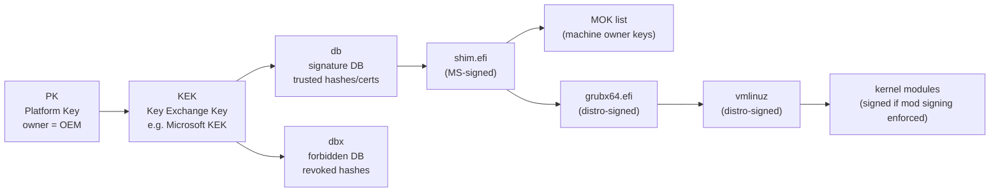

# 01 — Power-on to Bootloader: Firmware, UEFI vs BIOS, Secure Boot

> **Why this matters:** if a server won't even reach the GRUB menu, the problem is below the OS. You're dealing with firmware, NVRAM boot variables, the ESP partition or MBR, secure-boot key chains, or hardware. None of your Linux skills apply until you understand this layer. This file is the map.

---

## Concepts

### What happens at power-on

1. CPU comes out of reset, jumps to a hard-wired address (the **reset vector**, `0xFFFFFFF0` on x86).
2. **Firmware** (UEFI or legacy BIOS) executes from flash ROM (SPI flash on the motherboard).
3. Firmware runs **POST** (Power-On Self Test): RAM check, CPU init, PCI enumeration, fan/temp/voltage sanity.
4. Firmware reads its own NVRAM to find the **boot order** (which device, which loader).
5. Firmware loads the first-stage bootloader from the chosen boot device.
6. Control transfers to the bootloader. Firmware's job is done (mostly — UEFI runtime services stay alive).

### UEFI vs BIOS — the table that ends arguments

| Aspect | Legacy BIOS | UEFI |
|---|---|---|
| Year | 1981 (IBM PC) | 2002 (Intel EFI), 2005 (UEFI 2.0) |
| Bootloader location | First 512 bytes of disk (MBR) | File on FAT32 partition (ESP) |
| Partition scheme | MBR (4 primary, 2 TB max) | GPT (128 partitions, 9.4 ZB max) |
| Boot entry storage | None — sequential disk scan | NVRAM variables (`/sys/firmware/efi/efivars/`) |
| Pre-OS environment | 16-bit real mode, 1 MB | 32/64-bit, full memory map |
| Filesystem support | None (raw sectors) | FAT32 native; drivers for NTFS/ext4 possible |
| Network boot | PXE | PXE + HTTP boot |
| Secure boot | No | Yes (PK/KEK/db/dbx key chain) |
| Boot manager | None — bootloader does it | Built-in (`bootmgr`, can chainload) |
| Configuration | BIOS setup screen, no API | UEFI shell, runtime services, `efibootmgr` |

### EFI System Partition (ESP)

The ESP is a small (typically 100–500 MB) FAT32 partition that holds boot-time files. The kernel mounts it at `/boot/efi`. **It must be FAT32** — UEFI firmware does not include drivers for ext4/xfs/btrfs.

```
/boot/efi/                                 (mount point)
└── EFI/
    ├── BOOT/
    │   └── BOOTX64.EFI                    (default fallback loader)
    ├── redhat/   or   fedora/   or   ubuntu/
    │   ├── shimx64.efi                    (signed by Microsoft, trusts the distro CA)
    │   ├── grubx64.efi                    (GRUB UEFI binary, signed by distro)
    │   ├── grub.cfg                       (small stub — chains to /boot/grub2/grub.cfg)
    │   ├── mmx64.efi                      (MokManager — Machine Owner Key UI)
    │   └── BOOT.CSV                       (entry description for fallback)
    └── Microsoft/                         (if dual-booting Windows)
```

### Secure Boot key chain

Secure Boot is a chain-of-trust enforced by the firmware:

<!-- mermaid:rendered -->
<p align="center"></p>

<details><summary>Mermaid source</summary>



</details>

- **PK** (Platform Key): owner of the firmware. Usually the OEM. Without it, secure boot is in setup mode.
- **KEK** (Key Exchange Key): trusted to update db/dbx. Microsoft's KEK is on virtually every consumer board.
- **db**: allowed signatures (Microsoft signs `shim`, distros sign `grub` and `vmlinuz`).
- **dbx**: revoked signatures (used to kill known-bad bootloaders, e.g. BlackLotus).
- **shim**: a tiny MS-signed loader whose only job is to verify and load `grubx64.efi` against the distro's embedded CA.
- **MOK**: lets you (the machine owner) trust your own keys for custom kernels or out-of-tree modules (`nvidia.ko`).

---

## Files involved

- `/sys/firmware/efi/` — present only if booted in UEFI mode. Its existence is the canonical UEFI test.
- `/sys/firmware/efi/efivars/` — NVRAM variables exposed as files (boot order, secure-boot state, etc.).
- `/boot/efi/` — mount point for the ESP.
- `/boot/efi/EFI/<distro>/shimx64.efi` — signed first-stage loader.
- `/boot/efi/EFI/<distro>/grubx64.efi` — GRUB UEFI binary.
- `/boot/efi/EFI/<distro>/grub.cfg` — small stub that chains to the real config.
- `/boot/efi/EFI/BOOT/BOOTX64.EFI` — fallback loader (used if no NVRAM entry matches).
- `/etc/fstab` — must contain the ESP mount: `UUID=XXXX-XXXX /boot/efi vfat umask=0077,shortname=winnt 0 2`.
- `/sys/firmware/efi/fw_platform_size` — `64` or `32`, tells you EFI bitness.
- `/proc/cmdline` — confirms the kernel cmdline that the loader passed.

---

## Commands

```bash
# Am I in UEFI or BIOS mode?
[ -d /sys/firmware/efi ] && echo UEFI || echo BIOS
# → UEFI

# What firmware bitness?
cat /sys/firmware/efi/fw_platform_size
# → 64

# List all UEFI boot entries
efibootmgr -v
# → BootCurrent: 0001
# → Timeout: 1 seconds
# → BootOrder: 0001,0002,0000
# → Boot0000* UiApp ...
# → Boot0001* fedora HD(1,GPT,...)/File(\EFI\fedora\shimx64.efi)
# → Boot0002* UEFI: PXE IPv4 ...

# Add a boot entry pointing to a custom loader
efibootmgr --create --disk /dev/sda --part 1 \
    --label "Custom Linux" \
    --loader '\EFI\custom\bootx64.efi'

# Reorder the boot menu (fedora first, then PXE, then UiApp)
efibootmgr --bootorder 0001,0002,0000

# Set a one-time boot override (useful for kexec or installer ISO)
efibootmgr --bootnext 0002

# Delete a stale entry
efibootmgr --bootnum 0003 --delete-bootnum

# Inspect ESP contents
mount | grep /boot/efi
# → /dev/sda1 on /boot/efi type vfat (rw,relatime,fmask=0077,...)
ls /boot/efi/EFI/
# → BOOT  fedora  Microsoft

# Secure boot state
mokutil --sb-state
# → SecureBoot enabled

bootctl status                # systemd-boot's view of EFI vars + entries
# → System:
# →    Firmware: UEFI 2.70 (American Megatrends 5.13)
# →    Secure Boot: enabled (user)
# →    TPM2 Support: yes
# →    Boot into FW: supported

# List keys enrolled in MOK (your machine-owner keys)
mokutil --list-enrolled

# Enroll a new key (used after building a custom kernel module)
mokutil --import /root/MOK.der          # prompts for one-time password
# Reboot — the firmware boots into MokManager (mmx64.efi) and asks you to
# confirm the new key with the same password.

# Read an EFI variable directly
ls /sys/firmware/efi/efivars/
# → BootCurrent-8be4df61-93ca-11d2-aa0d-00e098032b8c
# → BootOrder-...   PK-...   KEK-...   db-...   dbx-...
```

---

## Lab — diagnose a UEFI boot from a live system

```bash
# 1. Confirm UEFI
[ -d /sys/firmware/efi ] && echo "Booted via UEFI" || echo "Legacy BIOS"
# → Booted via UEFI

# 2. Where is the ESP?
findmnt /boot/efi
# → TARGET    SOURCE   FSTYPE OPTIONS
# → /boot/efi /dev/sda1 vfat   rw,relatime,fmask=0077,dmask=0077,...

# 3. What loader did firmware actually pick?
efibootmgr -v | grep BootCurrent
# → BootCurrent: 0001
efibootmgr -v | grep '^Boot0001'
# → Boot0001* fedora HD(1,GPT,abc-...)/File(\EFI\fedora\shimx64.efi)

# 4. What did that loader chain to?
ls /boot/efi/EFI/fedora/
# → BOOTIA32.CSV  grub.cfg  grubx64.efi  mmx64.efi  shim.efi  shimx64.efi

cat /boot/efi/EFI/fedora/grub.cfg
# → search --no-floppy --fs-uuid --set=dev abcd-1234
# → set prefix=($dev)/grub2
# → export $prefix
# → configfile $prefix/grub.cfg

# 5. What kernel cmdline ended up in the running kernel?
cat /proc/cmdline
# → BOOT_IMAGE=(hd0,gpt2)/vmlinuz-6.8.5-200.fc39.x86_64 root=UUID=... ro rhgb quiet

# 6. Verify secure boot
mokutil --sb-state
# → SecureBoot enabled
dmesg | grep -i 'secure boot'
# → [    0.012345] secureboot: Secure boot enabled
```

---

## Recovering from a "no bootable device" or wiped NVRAM

Common scenarios and the fix:

1. **Firmware lost its NVRAM entries** (BIOS reset, motherboard battery died).
   - Boot a live ISO in UEFI mode.
   - `mount /dev/sda1 /mnt` (the ESP).
   - `efibootmgr --create --disk /dev/sda --part 1 --label "fedora" --loader '\EFI\fedora\shimx64.efi'`

2. **shim/grub missing or corrupted on ESP**.
   - From rescue: `dnf reinstall shim-x64 grub2-efi-x64` or `apt install --reinstall shim-signed grub-efi-amd64`.
   - Then `grub2-install --target=x86_64-efi --efi-directory=/boot/efi --bootloader-id=fedora`.

3. **Secure boot blocks a new kernel** (signature mismatch).
   - Either: enroll your signing key with `mokutil --import`.
   - Or: turn off secure boot in firmware setup (acceptable for dev, not for prod).

4. **Dual boot wiped Windows boot entry** after a Linux install.
   - `efibootmgr --create --disk /dev/sda --part 1 --label "Windows Boot Manager" --loader '\EFI\Microsoft\Boot\bootmgfw.efi'`

---

## Gotchas

> **The ESP is shared.** All OSes write into `/boot/efi/EFI/`. Don't reformat it during a Linux install if Windows lives there.

> **Some firmwares ignore `BootOrder`** and always boot `\EFI\BOOT\BOOTX64.EFI`. If your custom entry is being skipped, copy your loader to that fallback path.

> **`efivars` writes are real NVRAM writes.** Buggy tools have bricked motherboards by filling NVRAM. Never `rm -rf /sys/firmware/efi/efivars/`. There is a kernel `efivarfs` immutable flag (`chattr +i`) for protection.

> **Secure boot does not protect a running system.** It only verifies the loader, kernel, and (optionally) modules at boot. Once Linux is up, you're on your own.

> **CSM (Compatibility Support Module)** lets a UEFI box boot in legacy BIOS mode. If you installed Linux with CSM enabled and later disabled it, the system stops booting. Always check the install mode matches the firmware mode.

---

## 20-year tips

> **Always print `efibootmgr -v` to a file before patching firmware or motherboard swaps.** `efibootmgr -v > ~/efibootmgr-backup-$(date +%F).txt`. NVRAM gets clobbered more often than you think.

> **If a system "won't boot" after kernel update, suspect the ESP first.** It's tiny (often 100 MB) and `dnf` happily fills it with old kernels until writes fail silently. `df -h /boot/efi` should never be > 80 %.

> **Secure boot + custom kernel modules = MOK every time.** Build the module, sign it with your MOK private key, enroll the public key once, done. Don't fight secure boot — manage it.

> **Keep a USB stick with a UEFI shell + the matching distro rescue ISO** taped under your server rack. When a board comes back from RMA with empty NVRAM at 3 a.m., you'll have 90 seconds before the change window closes.

> **Document `BootCurrent` after every successful boot** in your monitoring. If it drifts (firmware fell back to PXE), you know NVRAM is sick before users do.

---

## Common interview questions

**Q: How do you tell if a running system booted via UEFI or legacy BIOS?**
A: Check for `/sys/firmware/efi/`. If it exists, UEFI. Also `dmesg | grep EFI` and `efibootmgr` will succeed only on UEFI.

**Q: What is the ESP and what filesystem must it use?**
A: EFI System Partition. Must be FAT32 because UEFI firmware only ships FAT drivers. Typically 100–500 MB, mounted at `/boot/efi`.

**Q: What is `shim` and why is it needed?**
A: shim is a small MS-signed UEFI binary. With Secure Boot on, the firmware only trusts MS-signed binaries. shim is signed by MS, then it loads `grub` after verifying it against the distro's embedded CA — letting distros boot under Secure Boot without each one getting their own MS signature on every grub release.

**Q: What does `efibootmgr -v` show?**
A: NVRAM boot entries with full device paths — disk GUID, partition number, file path of the loader, and the active boot order.

**Q: What are PK, KEK, db, dbx?**
A: Secure Boot's key hierarchy. PK = platform owner key (the OEM). KEK = keys allowed to update db/dbx. db = trusted signatures/hashes. dbx = revoked signatures.

**Q: Secure Boot is on, your custom kernel module fails to load. What do you do?**
A: Generate a key pair, sign the module (`kmodsign` or `sign-file`), import the public key with `mokutil --import`, reboot, confirm via MokManager. Now the module loads.

**Q: A server won't boot after a firmware reset. NVRAM is empty. How do you recover?**
A: Boot a live USB in UEFI mode, mount the ESP, run `efibootmgr --create` with the path to the existing `shimx64.efi`. Reboot.

**Q: Why might `efibootmgr --bootorder` get ignored?**
A: Some firmwares always run `\EFI\BOOT\BOOTX64.EFI` regardless. Workaround is to copy the desired loader to that path, or fix the firmware's behavior in setup.

---

## Sources

- `man 8 efibootmgr`, `man 8 mokutil`, `man 1 bootctl`
- UEFI Specification 2.10 — https://uefi.org/specifications
- https://www.rodsbooks.com/efi-bootloaders/ (Roderick Smith — definitive practical UEFI guide)
- https://wiki.archlinux.org/title/Unified_Extensible_Firmware_Interface
- https://wiki.archlinux.org/title/Unified_Extensible_Firmware_Interface/Secure_Boot
- Linux kernel docs: `Documentation/admin-guide/efi-stub.rst`
