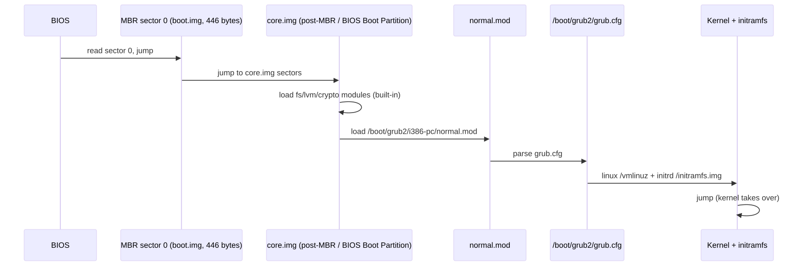
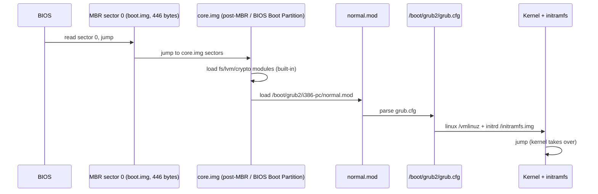
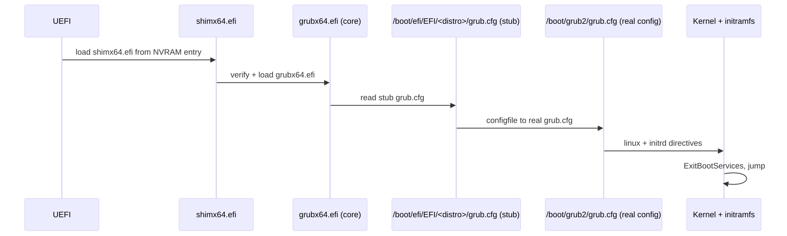
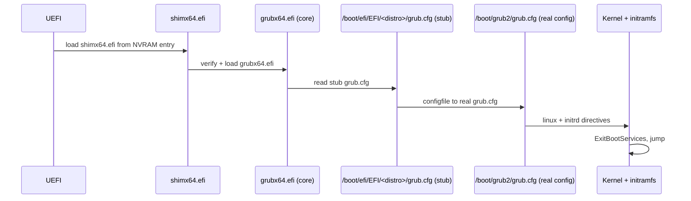

# 02 — GRUB 2 Deep Dive

> **Why this matters:** GRUB is the single most common reason a Linux system shows a black screen after firmware. If you can't read `grub.cfg`, edit a menu entry at boot, drop into a single-user shell, or rebuild a config without bricking the box, you're not a Linux admin yet — you're a tourist. This file makes you fluent.

---

## Concepts

### GRUB 2 in one paragraph

GRUB 2 (GRand Unified Bootloader v2) is a multi-stage loader. Tiny stage 1 lives in firmware-reachable storage (MBR boot sector or `\EFI\<distro>\grubx64.efi`). It loads stage 1.5 / **core image** (`core.img`) which has just enough filesystem drivers (`ext2`, `xfs`, `btrfs`, `lvm`) to read `/boot/grub2/`. Core then loads `normal.mod` which renders the menu, reads `grub.cfg`, presents the menu, and `boot`s the chosen entry — which means loading the kernel (`linux` directive) and initramfs (`initrd` directive) into memory and jumping to the kernel.

### The stages (BIOS path)

<!-- mermaid:rendered -->
<p align="center"></p>

<details><summary>Mermaid source</summary>



</details>

### The stages (UEFI path)

<!-- mermaid:rendered -->
<p align="center"></p>

<details><summary>Mermaid source</summary>



</details>

### File map

```
/etc/default/grub                 ← top-level knobs (timeout, default, cmdline)
/etc/grub.d/                      ← scripts that produce menu entries
  ├── 00_header                   ← timeout, gfxmode
  ├── 10_linux                    ← scans /boot/vmlinuz-* and emits menuentry
  ├── 20_linux_xen
  ├── 30_os-prober                ← detects other OSes (Windows, etc.)
  ├── 40_custom                   ← place your own menuentry blocks here
  └── 41_custom                   ← reads /boot/grub2/custom.cfg
/boot/grub2/                      ← installed grub data
  ├── grub.cfg                    ← THE config (generated, do not edit by hand)
  ├── grubenv                     ← persistent vars (next-boot, saved_entry)
  ├── i386-pc/  or  x86_64-efi/   ← arch-specific modules
  ├── locale/
  ├── fonts/
  ├── themes/
  └── user.cfg                    ← grub2-setpassword writes here
/boot/efi/EFI/<distro>/grub.cfg   ← UEFI stub config (chains to /boot/grub2/grub.cfg)
/boot/loader/entries/             ← BLS (Boot Loader Spec) entries on Fedora ≥ 30
```

### How `grub.cfg` is regenerated

Never edit `/boot/grub2/grub.cfg` by hand. It is generated:

```
/etc/default/grub      \
                        }-->  grub2-mkconfig  -->  /boot/grub2/grub.cfg
/etc/grub.d/*          /
```

The pipeline:
1. `grub2-mkconfig` reads `/etc/default/grub` and exports its variables.
2. It runs each executable in `/etc/grub.d/` in name order.
3. Each script writes shell-style menuentry blocks to stdout.
4. `mkconfig` concatenates them and writes to the file given by `-o`.

### `/etc/default/grub` — the only file you should usually edit

```bash
GRUB_TIMEOUT=5
GRUB_DISTRIBUTOR="Fedora"
GRUB_DEFAULT=saved                       # remember last choice (with grubenv)
GRUB_DISABLE_SUBMENU=true
GRUB_TERMINAL_OUTPUT="console"
GRUB_CMDLINE_LINUX="rhgb quiet rd.lvm.lv=fedora/root rd.lvm.lv=fedora/swap"
GRUB_DISABLE_RECOVERY="false"            # show "rescue" entry per kernel
GRUB_ENABLE_BLSCFG=true                  # use Boot Loader Spec snippets
```

### Kernel command-line directives (the ones you'll actually use)

| Directive | What it does |
|---|---|
| `root=UUID=xxxx` | filesystem to mount as `/` (UUID is kernel's preferred form) |
| `ro` | mount root read-only initially (fsck happens, then remount rw) |
| `quiet` | suppress most kernel boot messages |
| `splash` | show distro splash (Plymouth) |
| `rhgb` | Red Hat graphical boot |
| `nomodeset` | disable KMS — fix for "black screen after boot" with new GPU |
| `single` or `1` | boot to single-user (rescue) — historical SysV |
| `init=/bin/bash` | replace PID 1 with bash — the "I forgot the root password" trick |
| `systemd.unit=rescue.target` | systemd's equivalent of single user |
| `systemd.unit=emergency.target` | even smaller — only sulogin, no mounts |
| `systemd.debug-shell=1` | spawn a debug shell on `/dev/tty9` |
| `console=tty0 console=ttyS0,115200` | mirror kernel logs to serial (use last one for input) |
| `loglevel=7` | maximum kernel verbosity (KERN_DEBUG) |
| `mitigations=off` | turn off CPU vuln mitigations (Spectre etc.) — perf only, not for prod |
| `intel_iommu=on iommu=pt` | enable IOMMU passthrough (PCIe passthrough to VMs) |
| `panic=10` | reboot 10 s after kernel panic |

### Recovery: editing a menuentry at boot

1. At GRUB menu, highlight the entry, press **`e`**.
2. Find the `linux` line.
3. Append (or replace) what you need — common cases:
   - Append `init=/bin/bash` (becomes PID 1, no PAM, no anything — best for password reset).
   - Append `systemd.unit=rescue.target` (single-user with PAM, asks root password).
   - Append `systemd.unit=emergency.target` (smallest possible system).
4. Press **`Ctrl-X`** or **`F10`** to boot.

### Resetting the root password (UEFI/systemd era, full procedure)

```bash
# At GRUB menu, press 'e', append to the linux line:
rd.break enforcing=0
# Boot. You drop to dracut shell.

mount -o remount,rw /sysroot
chroot /sysroot
passwd                       # set new root password
touch /.autorelabel          # SELinux relabel on next boot
exit
exit
# System reboots, relabels SELinux, root password is now what you set.
```

`enforcing=0` is needed because SELinux blocks the password write otherwise; the `.autorelabel` fixes contexts on the next boot.

---

## Files involved

- `/etc/default/grub` — main editable config
- `/etc/grub.d/*` — generator scripts
- `/etc/grub.d/40_custom` — drop your custom menuentries here
- `/boot/grub2/grub.cfg` — generated final config (Fedora/RHEL); on Ubuntu it's `/boot/grub/grub.cfg`
- `/boot/grub2/grubenv` — persistent variables: `saved_entry`, `boot_success`, `kernelopts`
- `/boot/grub2/user.cfg` — generated by `grub2-setpassword` (holds `GRUB2_PASSWORD=...`)
- `/boot/loader/entries/<machineid>-<version>.conf` — BLS (Boot Loader Spec) entries on Fedora 30+
- `/boot/efi/EFI/<distro>/grub.cfg` — UEFI stub
- `/boot/efi/EFI/<distro>/grubx64.efi` — GRUB UEFI binary

---

## Commands

```bash
# Regenerate grub.cfg from /etc/default/grub + /etc/grub.d/*
grub2-mkconfig -o /boot/grub2/grub.cfg              # Fedora/RHEL/CentOS (BIOS)
grub2-mkconfig -o /boot/efi/EFI/fedora/grub.cfg     # Fedora UEFI (older convention)
update-grub                                          # Debian/Ubuntu wrapper
grub-mkconfig -o /boot/grub/grub.cfg                 # Debian raw

# Reinstall GRUB (BIOS)
grub2-install /dev/sda

# Reinstall GRUB (UEFI)
grub2-install --target=x86_64-efi --efi-directory=/boot/efi --bootloader-id=fedora

# Set a one-time alternate boot entry (boots once, then reverts)
grub2-reboot "Advanced options for Fedora>Fedora (5.14.0-rescue)"

# Set the persistent default
grub2-set-default 0                                  # by index
grub2-set-default "Fedora Linux (6.8.5-200.fc39.x86_64) 39 (Workstation Edition)"

# Inspect grubenv
grub2-editenv list
# → saved_entry=Fedora Linux (6.8.5...) 39
# → boot_success=1
# → kernelopts=root=UUID=... ro rhgb quiet

# Edit grubenv directly
grub2-editenv - set saved_entry="Fedora Linux (6.8.5-200.fc39.x86_64) 39 (Workstation Edition)"
grub2-editenv - unset boot_success

# Set / change the GRUB password
grub2-setpassword                                    # writes /boot/grub2/user.cfg

# List BLS entries (Fedora 30+)
ls /boot/loader/entries/
# → abc1234-6.8.5-200.fc39.x86_64.conf
# → abc1234-6.8.4-200.fc39.x86_64.conf

cat /boot/loader/entries/abc1234-6.8.5-200.fc39.x86_64.conf
# → title Fedora Linux (6.8.5-200.fc39.x86_64) 39 (Workstation Edition)
# → version 6.8.5-200.fc39.x86_64
# → linux /vmlinuz-6.8.5-200.fc39.x86_64
# → initrd /initramfs-6.8.5-200.fc39.x86_64.img $tuned_initrd
# → options $kernelopts $tuned_params
# → grub_users $grub_users
# → grub_arg --unrestricted
# → grub_class fedora
```

### GRUB password protection

```bash
# Generates a PBKDF2 hash and writes /boot/grub2/user.cfg
grub2-setpassword
# Password: ********
# Confirm:  ********

cat /boot/grub2/user.cfg
# → GRUB2_PASSWORD=grub.pbkdf2.sha512.10000.A1B2C3...

# By default this protects only menu *editing* (pressing 'e') and the GRUB shell.
# All entries remain bootable (good — you don't want to be paged because nobody can boot).
# To require password to boot specific entries too, edit /etc/grub.d/40_custom and
# remove --unrestricted, then regenerate grub.cfg.
```

---

## Lab — full GRUB walkthrough

```bash
# 1. Confirm GRUB version
grub2-mkconfig --version
# → grub2-mkconfig (GRUB) 2.06

# 2. Inspect /etc/default/grub
grep -v '^#' /etc/default/grub | grep -v '^$'
# → GRUB_TIMEOUT=5
# → GRUB_DISTRIBUTOR="$(sed 's, release .*$,,g' /etc/system-release)"
# → GRUB_DEFAULT=saved
# → GRUB_DISABLE_SUBMENU=true
# → GRUB_TERMINAL_OUTPUT="console"
# → GRUB_CMDLINE_LINUX="rhgb quiet"
# → GRUB_DISABLE_RECOVERY="true"
# → GRUB_ENABLE_BLSCFG=true

# 3. Add a permanent kernel param (e.g. enable IOMMU)
sudo sed -i 's/^GRUB_CMDLINE_LINUX="\(.*\)"/GRUB_CMDLINE_LINUX="\1 intel_iommu=on iommu=pt"/' /etc/default/grub

# 4. Regenerate
sudo grub2-mkconfig -o /boot/grub2/grub.cfg
# → Generating grub configuration file ...
# → Found linux image: /boot/vmlinuz-6.8.5-200.fc39.x86_64
# → Found initrd image: /boot/initramfs-6.8.5-200.fc39.x86_64.img
# → done

# 5. Reboot, then verify
cat /proc/cmdline
# → BOOT_IMAGE=(hd0,gpt2)/vmlinuz-6.8.5-200.fc39.x86_64 root=UUID=... ro rhgb quiet intel_iommu=on iommu=pt

# 6. Make next boot pick the rescue kernel ONLY ONCE
grub2-reboot 1                          # boot index 1 next time
sudo reboot
# After reboot, default reverts to the saved entry.
```

---

## Gotchas

> **Editing `/boot/grub2/grub.cfg` directly is fine until the next kernel update.** dnf/apt regenerate the file and your edits vanish. Always change `/etc/default/grub` (or drop a file in `/etc/grub.d/`) and re-run `grub2-mkconfig`.

> **Fedora ≥ 30 uses BLS** by default. Editing `GRUB_CMDLINE_LINUX` in `/etc/default/grub` no longer changes the cmdline of installed kernels — only new ones. Use `grubby --update-kernel=ALL --args="..."` to update existing entries.

> **`init=/bin/bash` gives you root with no password — but no `/proc`, no PAM, no logging.** Mount `/proc`, `/sys`, and remount `/` rw before doing anything else: `mount -o remount,rw /; mount -t proc proc /proc`.

> **GRUB2 cannot read every filesystem version.** Encrypted root, ZFS root, btrfs subvol root all need the right modules baked into `core.img`. Otherwise `grub-rescue>` prompt.

> **The `grub-rescue>` prompt is not a friendly bash.** It's a tiny shell. `set` lists vars, `ls` lists devices like `(hd0,gpt2)`, `insmod normal` then `normal` will usually get you back to the menu.

---

## 20-year tips

> **`grub2-reboot` is your friend in remote ops.** Want to test a kernel without committing to it? `grub2-reboot N`, reboot. If it works, `grub2-set-default N`. If it bricks, the next reboot returns to the previous kernel automatically.

> **Always keep at least 2 kernels installed.** `dnf` defaults to keeping 3. Don't change that. The day a kernel update breaks NVMe driver, you'll need the previous one.

> **Set a serial console on every server.** `console=tty0 console=ttyS0,115200` in `GRUB_CMDLINE_LINUX`, plus `GRUB_TERMINAL="console serial"` and `GRUB_SERIAL_COMMAND="serial --speed=115200"`. The day the GPU is dead but IPMI/SoL works, you'll thank yourself.

> **Don't `grub2-install` to the wrong disk.** It's a one-liner that has destroyed more boot environments than malware. Always `lsblk` first, always quote the device path.

> **Snapshot `/boot` before kernel updates on critical hosts.** It's < 500 MB. `cp -a /boot /root/boot-backup-$(date +%F)` saves your job once a year.

---

## Common interview questions

**Q: How does GRUB find its config when you only have a 446-byte MBR?**
A: MBR holds `boot.img` which knows the disk-relative offset of `core.img` (in the post-MBR gap or BIOS Boot Partition). `core.img` has the FS driver to read `/boot/grub2/grub.cfg`.

**Q: Where does the kernel command line ultimately come from?**
A: From the `linux` directive in `grub.cfg`. GRUB passes that string to the kernel via the boot protocol. Visible at runtime in `/proc/cmdline`.

**Q: I edited `/etc/default/grub`, rebooted, my change isn't there. Why?**
A: You forgot `grub2-mkconfig -o /boot/grub2/grub.cfg`. Or on Fedora-with-BLS, you needed `grubby --update-kernel=ALL --args=...`.

**Q: How do you reset a forgotten root password?**
A: Edit menu entry at boot, append `rd.break enforcing=0`, drop into dracut, `mount -o remount,rw /sysroot`, `chroot /sysroot`, `passwd`, `touch /.autorelabel`, exit twice, reboot.

**Q: What's the difference between rescue and emergency targets?**
A: `rescue.target` mounts all local filesystems and starts a single-user environment with sulogin (root password required). `emergency.target` mounts only `/` read-only, no other filesystems, no services — minimal sulogin. Use emergency when even rescue won't come up.

**Q: How do you set an entry to boot only once, then revert?**
A: `grub2-reboot <entry>`. It writes `next_entry` to `grubenv`; GRUB consumes it on next boot and clears it.

**Q: Where are GRUB passwords stored?**
A: `/boot/grub2/user.cfg` — variable `GRUB2_PASSWORD=` with PBKDF2-SHA512 hash. Generated by `grub2-setpassword`.

**Q: GRUB drops me to `grub-rescue>`. What now?**
A: `ls` to list devices, find the partition holding `/boot/grub2`. `set prefix=(hd0,gpt2)/grub2`, `set root=(hd0,gpt2)`, `insmod normal`, `normal`. From the menu, boot, then `grub2-install` to fix the install.

**Q: What is BLS?**
A: Boot Loader Specification — each kernel has its own snippet in `/boot/loader/entries/*.conf` instead of one monolithic `grub.cfg`. Easier for `grubby` and other distros sharing `/boot`.

---

## Sources

- `man 8 grub2-mkconfig`, `man 8 grub2-install`, `man 1 grub2-editenv`
- https://www.gnu.org/software/grub/manual/grub/grub.html
- https://systemd.io/BOOT_LOADER_SPECIFICATION/
- https://docs.fedoraproject.org/en-US/fedora/latest/system-administrators-guide/kernel-module-driver-configuration/Working_with_the_GRUB_2_Boot_Loader/
- https://wiki.archlinux.org/title/GRUB
