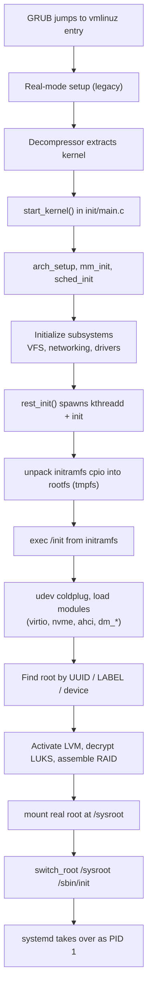

# 03 — Kernel and initramfs Deep Dive

> **Why this matters:** GRUB hands two files to the kernel boot protocol: `vmlinuz` and `initramfs`. Everything between "GRUB jumped to the kernel" and "systemd ran as PID 1" happens inside these two files. If you've ever seen `Cannot open root device "UUID=..."` or `dracut-initqueue timeout`, this file is your fix.

---

## Concepts

### What `vmlinuz` actually is

`vmlinuz` is **not** a raw kernel — it's a self-extracting compressed image (called `bzImage` on x86). Layout (high level):

```
┌──────────────────────────────┐
│ Real-mode setup code (16-bit)│  <- legacy stub, talks to BIOS for early printk
├──────────────────────────────┤
│ Decompressor stub (32/64-bit)│  <- decompresses the rest into memory
├──────────────────────────────┤
│ Compressed kernel (gzip/xz/  │  <- the actual ELF kernel image
│  zstd/lz4 — see CONFIG)      │
└──────────────────────────────┘
```

The decompressor:
1. Sets up paging.
2. Decompresses the kernel into RAM.
3. Jumps to `start_kernel()` (the famous symbol in `init/main.c`).

UEFI bypasses GRUB entirely if you use the **EFI stub**: the kernel itself is a valid PE/COFF binary, so UEFI can `Boot0001` straight to `vmlinuz`.

### What initramfs actually is

`initramfs` is a **gzip/zstd-compressed cpio archive** that the kernel unpacks into a tmpfs and uses as the initial root filesystem. It contains just enough userspace to find and mount the **real** root filesystem.

Why this exists: the kernel can't read your LVM volume group. The kernel can't decrypt your LUKS device. The kernel doesn't know how to assemble your software RAID. All those features live in **userspace tools** (`lvm`, `cryptsetup`, `mdadm`) plus their kernel modules. Those tools have to run before the real root is mounted — chicken-and-egg solved by initramfs.

### What's inside an initramfs (typical)

```
/init                   → script (or systemd) that does the work
/bin/, /sbin/           → busybox or selected binaries
/lib/modules/<ver>/     → only the modules needed for THIS hardware
/etc/                   → fstab snippet, udev rules, lvm.conf, crypttab
/usr/lib/systemd/       → systemd-in-initrd (modern dracut)
/dev/                   → minimal device nodes
```

### Boot flow inside the kernel

<!-- mermaid:rendered -->
<p align="center"></p>

<details><summary>Mermaid source</summary>



</details>
### How root gets mounted

The `root=` kernel parameter is the input. Three resolution paths:

1. `root=/dev/sda2` → mount that block device directly.
2. `root=UUID=abc-...` → udev populates `/dev/disk/by-uuid/`, find the symlink, mount.
3. `root=/dev/mapper/vg-root` → LVM must be activated first (`vgchange -ay`).

If LUKS: `rd.luks.uuid=...` triggers `cryptsetup luksOpen` for the matching device; password prompt appears; then root is mounted.

### Microcode loading

CPU microcode patches load **before** kernel modules to mitigate hardware bugs (Spectre, Meltdown, etc.). Two approaches:

- **As an additional initrd**: `/boot/intel-ucode.img` (Intel) or `/boot/amd-ucode.img` (AMD). GRUB has `initrd /intel-ucode.img /initramfs-X.img` — the kernel concatenates both cpio archives and processes microcode first.
- **From inside initramfs**: dracut bundles microcode into the main initramfs. Default on Fedora.

Verify:
```
dmesg | grep microcode
# → microcode: sig=0x806ec, pf=0x80, revision=0xf4
# → microcode: Microcode Update Driver: v2.2.
```

---

## Files involved

- `/boot/vmlinuz-<kver>` — the compressed kernel image
- `/boot/initramfs-<kver>.img` — the initial RAM filesystem (RHEL/Fedora name)
- `/boot/initrd.img-<kver>` — same thing, Debian/Ubuntu name
- `/boot/System.map-<kver>` — kernel symbol table (used by `klogd`, crash analysis)
- `/boot/config-<kver>` — kernel build config (every `CONFIG_*` setting)
- `/boot/intel-ucode.img`, `/boot/amd-ucode.img` — CPU microcode
- `/etc/dracut.conf`, `/etc/dracut.conf.d/*.conf` — dracut configuration (RHEL/Fedora)
- `/etc/mkinitcpio.conf` — Arch initramfs builder
- `/etc/initramfs-tools/initramfs.conf` — Debian/Ubuntu builder
- `/etc/crypttab` — LUKS volumes to unlock at boot (consumed by initramfs)
- `/etc/fstab` — mount table (consumed AFTER initramfs hands off, except `/` and `/usr`)
- `/proc/cmdline` — what the kernel was actually given
- `/proc/version` — kernel build string
- `/proc/sys/kernel/random/boot_id` — unique ID for this boot

---

## Commands

```bash
# Inspect kernel version and build
uname -a
# → Linux box01 6.8.5-200.fc39.x86_64 #1 SMP Mon Apr 22 ... x86_64 GNU/Linux
uname -r           # → 6.8.5-200.fc39.x86_64
uname -v           # → #1 SMP PREEMPT_DYNAMIC Mon Apr 22 ...

cat /proc/version
# → Linux version 6.8.5-200.fc39.x86_64 (mockbuild@...) (gcc (GCC) 13.2.1) #1 SMP ...

cat /proc/cmdline
# → BOOT_IMAGE=(hd0,gpt2)/vmlinuz-6.8.5-200.fc39.x86_64 root=UUID=... ro rhgb quiet

# Look at what's in initramfs
lsinitrd /boot/initramfs-$(uname -r).img | head -40
# → Image: /boot/initramfs-6.8.5-200.fc39.x86_64.img: 41M
# → ========================================================================
# → Early CPIO image
# → drwxr-xr-x   3 root     root            0 Jan  1  1970 .
# → -rw-r--r--   1 root     root          134 Jan  1  1970 early_cpio
# → drwxr-xr-x   3 root     root            0 Jan  1  1970 kernel
# → drwxr-xr-x   3 root     root            0 Jan  1  1970 kernel/x86
# → drwxr-xr-x   2 root     root            0 Jan  1  1970 kernel/x86/microcode
# → -rw-r--r--   1 root     root      3217408 Jan  1  1970 kernel/x86/microcode/GenuineIntel.bin
# → ========================================================================
# → Version: dracut-059-13.fc39
# → Arguments: ...
# → dracut modules:
# → bash systemd systemd-initrd ...
# → drm dm rootfs-block lvm crypt ...

# List just the kernel modules baked in
lsinitrd /boot/initramfs-$(uname -r).img | grep '\.ko'

# Extract initramfs to inspect / modify
mkdir /tmp/initrd && cd /tmp/initrd
/usr/lib/dracut/skipcpio /boot/initramfs-$(uname -r).img | zcat | cpio -idmv
ls
# → bin  dev  etc  init  lib  lib64  proc  root  run  sbin  shutdown  sys  sysroot  tmp  usr  var

# Show ALL kernel cmdlines for previous boots
journalctl --list-boots
# → -10 abc... Mon 2025-12-01 09:11:00 UTC—Mon 2025-12-01 17:42:11 UTC
# → ...
# →   0 def... Mon 2026-04-26 08:01:14 UTC—  (current)

# Look at kernel ring buffer
dmesg | head -30
dmesg -T | grep -i error
journalctl -k -b 0          # kernel msgs, this boot only
journalctl -k -b -1         # previous boot

# Rebuild initramfs
sudo dracut -f                                            # rebuild for current kernel (Fedora/RHEL)
sudo dracut -f /boot/initramfs-$(uname -r).img $(uname -r)   # explicit
sudo mkinitcpio -P                                        # all presets (Arch)
sudo update-initramfs -u                                  # current (Debian/Ubuntu)
sudo update-initramfs -u -k all                           # every installed kernel

# Force include a module that wasn't auto-detected
sudo dracut -f --add-drivers "i915 e1000e"

# Force include a file
echo 'install_items+=" /etc/some.conf "' | sudo tee /etc/dracut.conf.d/myconf.conf
sudo dracut -f
```

---

## Lab — diagnose "Cannot open root device" panic

```bash
# Symptom (printed during boot):
# → VFS: Cannot open root device "UUID=abcd-..." or unknown-block(0,0): error -6
# → Please append a correct "root=" boot option; here are the available partitions:
# → 0800   209715200 sda
# →  driver: sd
# → Kernel panic - not syncing: VFS: Unable to mount root fs on unknown-block(0,0)

# Root causes (in frequency order):
# 1. UUID changed (filesystem recreated, but grub.cfg not regenerated).
# 2. Required driver not in initramfs (new NVMe controller, virtio-blk in VM, etc.).
# 3. LVM/LUKS not activated because the right dracut module is missing.

# Fix path 1 — UUID drift
# Boot from rescue ISO, mount /, find real UUID:
blkid /dev/sda2
# → /dev/sda2: UUID="real-uuid" TYPE="xfs"
# Mount and chroot:
mount /dev/sda2 /mnt
mount --bind /dev /mnt/dev
mount --bind /proc /mnt/proc
mount --bind /sys /mnt/sys
chroot /mnt
grub2-mkconfig -o /boot/grub2/grub.cfg
exit; reboot

# Fix path 2 — missing driver
# In rescue chroot:
dracut -f --add-drivers "nvme nvme_core" /boot/initramfs-$(uname -r).img $(uname -r)
# Or rebuild "host-only" with current hardware:
dracut -f --hostonly

# Fix path 3 — LVM/crypt module missing
dracut -f --add "lvm crypt"
```

---

## Lab — what's actually in your initramfs

```bash
# 1. Size and basic info
ls -lh /boot/initramfs-$(uname -r).img
# → -rw-------. 1 root root 41M Apr 22 09:11 /boot/initramfs-6.8.5-200.fc39.x86_64.img

# 2. Modules loaded by initramfs
lsinitrd /boot/initramfs-$(uname -r).img -m
# → dracut modules:
# → bash
# → systemd
# → systemd-initrd
# → systemd-ask-password
# → systemd-pcrphase
# → ...
# → dm
# → kernel-modules
# → kernel-modules-extra
# → kernel-network-modules
# → lvm
# → rootfs-block
# → terminfo
# → udev-rules
# → dracut-systemd
# → usrmount
# → base
# → fs-lib
# → shutdown

# 3. Kernel modules included
lsinitrd /boot/initramfs-$(uname -r).img | grep -E '\.ko(\.xz)?$' | head -20

# 4. The init script (or systemd unit)
lsinitrd /boot/initramfs-$(uname -r).img -f init
lsinitrd /boot/initramfs-$(uname -r).img -f /etc/fstab
```

---

## Gotchas

> **Host-only initramfs is smaller but breaks portability.** `dracut --hostonly` only includes drivers for hardware in *this* box. Move the disk to a different machine and it won't boot. Use `--no-hostonly` for ISOs and golden images.

> **Don't delete `/boot/vmlinuz-*` to free space.** Use `dnf remove kernel-X` or `apt purge linux-image-X`. Manual deletion leaves dangling grub entries → "file not found" at boot.

> **`/boot` filling up is a top-3 boot failure.** Each kernel + initramfs is ~70–120 MB. With 5 kernels and a 500 MB `/boot`, you'll fail. Set `installonly_limit=2` in `/etc/dnf/dnf.conf`.

> **Microcode order matters.** GRUB syntax `initrd /intel-ucode.img /initramfs-X.img` — microcode FIRST. Reverse it and the CPU runs old microcode for one boot.

> **`lsinitrd` only works on dracut images.** For Debian initrd use `unmkinitramfs` or `lsinitramfs`.

---

## 20-year tips

> **Always rebuild initramfs after editing `/etc/crypttab`, `/etc/fstab` for the root device, or `/etc/lvm/lvm.conf`.** These are baked in. Edit-then-reboot without `dracut -f` is a classic "worked yesterday" outage.

> **Keep `kernel-debug` packages on hand for one machine per fleet.** When you need stack traces, you'll want the kernel symbols.

> **`dmesg -T` (human timestamps) is what you want 99 % of the time.** Add `alias dmesg='dmesg -T'` to root's bashrc.

> **For VMs, install the matching guest agents in the initramfs.** Otherwise live migration / hypervisor pause breaks things at boot. `dracut --add "qemu-guest-agent"`.

> **When a kernel panics during boot and reboots immediately, you can't read the message.** Add `panic=0` (don't reboot) or `panic=300` (wait 5 minutes). For prod, `panic=10` is humane.

---

## Common interview questions

**Q: Why do we need an initramfs?**
A: The kernel needs userspace tools to mount complex root filesystems (LVM, LUKS, RAID, network FS). Initramfs provides a minimal userspace (busybox + tools + just enough modules) to assemble the real root, then hands off via `switch_root`.

**Q: What's the difference between initrd and initramfs?**
A: initrd was a real block-device image (mounted, then pivot_root). initramfs is a cpio archive unpacked into tmpfs and `switch_root`'d. All modern Linux uses initramfs; the filename `initrd.img` is historical naming.

**Q: How do you add a kernel module to initramfs?**
A: `dracut -f --add-drivers "modname"` and a config drop-in in `/etc/dracut.conf.d/`. Or `mkinitcpio` MODULES= array on Arch.

**Q: What's `vmlinuz` vs `vmlinux`?**
A: `vmlinux` is the uncompressed ELF kernel (huge, used for debug). `vmlinuz` (z = compressed) is the bootable bzImage = setup + decompressor + compressed kernel.

**Q: Where in the source tree is the kernel's first C function?**
A: `init/main.c`, function `start_kernel()`.

**Q: How does `root=UUID=...` get resolved?**
A: udev runs in initramfs, watches block-device events, populates `/dev/disk/by-uuid/`. Once the matching symlink appears, the rootfs script (or systemd-in-initrd) mounts it on `/sysroot`.

**Q: How do you tell what cmdline the kernel actually got?**
A: `cat /proc/cmdline`.

**Q: What is `switch_root`?**
A: A syscall (`pivot_root` then `chroot`) that replaces the current rootfs (initramfs tmpfs) with the real one and execs the new init. The initramfs is freed.

**Q: Microcode is loaded — how do you confirm and from where?**
A: `dmesg | grep microcode`. Source is either an early-cpio additional initrd (`/boot/intel-ucode.img`) or files inside the main initramfs at `kernel/x86/microcode/`.

**Q: What does `dracut --hostonly` change?**
A: Only includes modules and drivers needed for the current hardware and detected filesystems. Smaller, faster initramfs, but not portable across machines.

---

## Sources

- `man 8 dracut`, `man 8 mkinitcpio`, `man 8 update-initramfs`, `man 8 lsinitrd`
- https://www.kernel.org/doc/html/latest/admin-guide/initrd.html
- https://www.kernel.org/doc/html/latest/filesystems/ramfs-rootfs-initramfs.html
- https://www.kernel.org/doc/html/latest/x86/boot.html (boot protocol)
- `Documentation/admin-guide/kernel-parameters.txt` (every cmdline option)
- https://wiki.archlinux.org/title/Mkinitcpio
- https://docs.fedoraproject.org/en-US/quick-docs/kernel-build-custom-kernel/
