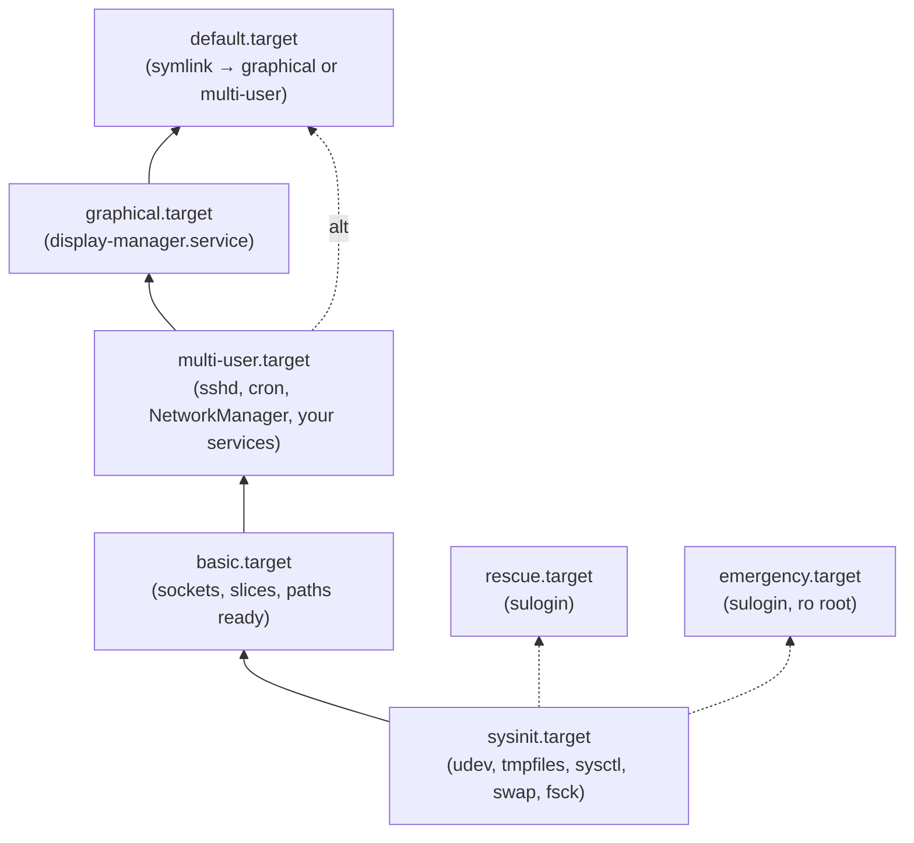
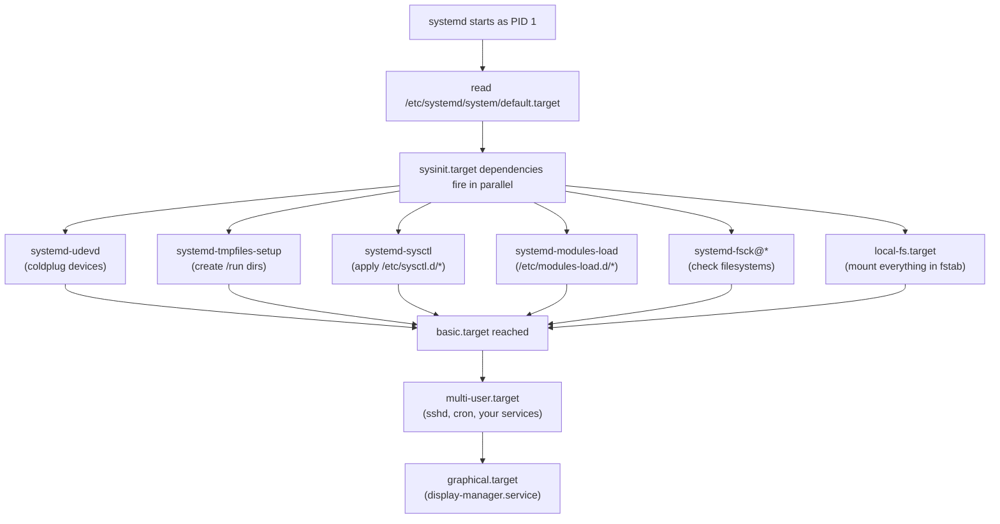

# 04 — systemd Boot, Targets, and `isolate`

> **Why this matters:** Once initramfs hands off, **everything** that happens on a modern Linux box is systemd's responsibility. If you don't understand targets, dependency types, and how to inspect what's blocking a slow boot, you'll burn an hour on every "stuck at starting up" ticket. This file makes targets and `systemd-analyze` second nature.

---

## Concepts

### systemd as PID 1

After `switch_root`, the initramfs execs `/sbin/init` from the real root. On every modern distro that's a symlink:

```
/sbin/init -> /lib/systemd/systemd        (Debian/Ubuntu)
/sbin/init -> ../lib/systemd/systemd      (Fedora/RHEL)
/usr/sbin/init -> ../lib/systemd/systemd  (Arch)
```

systemd becomes PID 1, reads `/etc/systemd/system/default.target` (a symlink to the actual target), and starts pulling in everything that target depends on, in parallel where possible.

### What is a target?

A **target** is a synchronization point — a named group of units that should all be active. Think SysV runlevel, but with proper dependencies and not numbered. A target unit (`*.target`) has no executable body; it just expresses "these other units should be up before I'm considered active."

Built-in targets (the ones you'll touch):

| Target | What it means |
|---|---|
| `default.target` | symlink to the actual default — usually `graphical` or `multi-user` |
| `graphical.target` | full system + display manager |
| `multi-user.target` | full system, no GUI (server) |
| `basic.target` | sysinit done; ready for "normal" services to start |
| `sysinit.target` | early bringup: udev, tmpfiles, sysctl, swap, fsck, mounts |
| `local-fs.target` | all local filesystems mounted |
| `swap.target` | all swap units active |
| `network.target` | network "up" (synchronization point only — see `network-online.target`) |
| `network-online.target` | network is actually reachable (waits for NetworkManager-wait-online or similar) |
| `rescue.target` | single-user with sulogin and basic services |
| `emergency.target` | tiniest possible — sulogin shell only, `/` may still be ro |
| `reboot.target` / `poweroff.target` / `halt.target` | shutdown destinations |

### Target hierarchy

<!-- mermaid:rendered -->
<p align="center"></p>

<details><summary>Mermaid source</summary>



</details>

Read upward: a target on top **wants** everything below it to be already active.

### File map

```
/lib/systemd/system/                  ← distro-shipped units (don't edit)
/usr/lib/systemd/system/              ← same on Fedora/Arch
/etc/systemd/system/                  ← admin overrides (highest priority)
/run/systemd/system/                  ← runtime-generated (volatile, lost on reboot)
/etc/systemd/system/default.target    ← symlink to actual default
/etc/systemd/system/<target>.wants/   ← drop symlinks here to add Wants= relationships
/etc/systemd/system/<unit>.d/*.conf   ← drop-in overrides (preferred over copying full unit)
```

Lookup precedence (highest first):
```
/etc/systemd/system/  >  /run/systemd/system/  >  /usr/lib/systemd/system/
```

### Switching the default target

```bash
# Permanent (next-boot default)
systemctl set-default multi-user.target          # server, no GUI
systemctl set-default graphical.target            # desktop / workstation

# Inspect
systemctl get-default
# → multi-user.target

ls -l /etc/systemd/system/default.target
# → lrwxrwxrwx 1 root root 40 Mar 15 11:02 default.target -> /lib/systemd/system/multi-user.target
```

### Live switching with `isolate`

`isolate` activates a target **and stops every unit that target doesn't pull in**. It's the in-place "change runlevel" operation.

```bash
systemctl isolate multi-user.target              # kill GUI, drop to text
systemctl isolate graphical.target                # bring GUI back up
systemctl isolate rescue.target                   # single-user, asks root pw
systemctl isolate emergency.target                # smallest possible
```

You can also pass `systemd.unit=...` on the kernel cmdline to start in a different target one time only.

### The boot sequence inside systemd

<!-- mermaid:rendered -->
<p align="center"></p>

<details><summary>Mermaid source</summary>



</details>

### Boot analysis

```bash
systemd-analyze
# → Startup finished in 1.234s (firmware) + 2.301s (loader) + 4.117s (kernel) + 8.940s (userspace) = 16.592s
# → graphical.target reached after 8.870s in userspace

systemd-analyze blame
# → 4.512s NetworkManager-wait-online.service       <- the usual culprit
# → 1.221s dnf-makecache.service
# → 0.901s plymouth-quit-wait.service
# → 0.654s systemd-udev-settle.service
# → 0.512s tuned.service

systemd-analyze critical-chain
# → graphical.target @8.870s
# → └─multi-user.target @8.869s
# →   └─NetworkManager-wait-online.service @4.355s +4.512s
# →     └─NetworkManager.service @4.301s +52ms
# →       └─dbus-broker.service @4.240s +50ms

systemd-analyze plot > /tmp/boot.svg              # visualize the whole timeline
xdg-open /tmp/boot.svg

systemd-analyze verify /etc/systemd/system/myapp.service   # syntax check a unit
systemd-analyze security sshd.service              # security-hardening score
systemd-analyze unit-files                         # list all known units and state
```

---

## Files involved

- `/lib/systemd/systemd` — the actual binary
- `/sbin/init` — symlink to it
- `/etc/systemd/system/default.target` — what to boot into
- `/lib/systemd/system/*.target` — distro target definitions
- `/etc/systemd/system/<unit>.d/override.conf` — admin drop-in overrides
- `/etc/systemd/system.conf` — global systemd config (default timeout, log target)
- `/etc/systemd/journald.conf` — journal rotation, persistent storage
- `/etc/systemd/logind.conf` — session and idle behavior
- `/run/systemd/units/` — runtime state of every unit
- `/proc/1/comm` — should print `systemd`
- `/proc/1/cmdline` — should print `/sbin/init` or similar

---

## Commands

```bash
# Confirm systemd is PID 1
cat /proc/1/comm
# → systemd
ps -p 1 -o comm=
# → systemd

# Default target
systemctl get-default
systemctl set-default multi-user.target
systemctl set-default graphical.target

# List targets and their state
systemctl list-units --type=target
# → UNIT                   LOAD   ACTIVE SUB    DESCRIPTION
# → basic.target           loaded active active Basic System
# → cryptsetup.target      loaded active active Local Encrypted Volumes
# → getty.target           loaded active active Login Prompts
# → graphical.target       loaded active active Graphical Interface
# → ...

systemctl list-units --type=target --all          # include inactive
systemctl list-unit-files --type=target           # all target unit files on disk

# What does graphical.target pull in?
systemctl list-dependencies graphical.target
systemctl list-dependencies graphical.target --all

# Switch live
systemctl isolate multi-user.target               # kill GUI
systemctl isolate graphical.target                 # bring it back

# Drop to rescue / emergency
systemctl rescue                                   # warns logged-in users, then isolates rescue.target
systemctl emergency                                # immediate emergency.target

# Boot-time selection (at GRUB, press 'e', append to linux line)
#   systemd.unit=multi-user.target
#   systemd.unit=rescue.target
#   systemd.unit=emergency.target
#   systemd.debug-shell=1                          # debug shell on tty9

# Boot analysis
systemd-analyze
systemd-analyze blame | head -20
systemd-analyze critical-chain
systemd-analyze critical-chain sshd.service       # for one specific unit
systemd-analyze plot > boot.svg

# Why is service X failing/slow?
systemctl status sshd
systemctl cat sshd                                # show effective unit file (with drop-ins)
journalctl -u sshd -b 0 --no-pager
journalctl -xeu sshd

# Reload systemd's own config after editing units
systemctl daemon-reload                           # MANDATORY after editing any unit file

# What's running now? sorted by failure
systemctl --failed
systemctl list-jobs                                # currently-pending jobs (boot in progress)
```

---

## Lab — slow boot investigation

```bash
# Symptom: boot takes 45 seconds, used to take 8.

systemd-analyze
# → Startup finished in 2.1s (kernel) + 43.8s (userspace) = 45.9s
# → graphical.target reached after 43.7s in userspace

systemd-analyze blame | head -10
# → 31.245s NetworkManager-wait-online.service     <-- ding ding ding
# →  4.512s plymouth-quit-wait.service
# →  2.301s dnf-makecache.service
# →  ...

# NetworkManager-wait-online is timing out (default 30 s).
# Either the network is genuinely broken, or you don't actually need to wait.

# Check why:
journalctl -u NetworkManager-wait-online -b 0
# → ...nm-online: timeout 30s
# → NetworkManager-wait-online.service: Main process exited, code=exited, status=1

# Fix A: make wait shorter
systemctl edit NetworkManager-wait-online
# Add:
# [Service]
# ExecStart=
# ExecStart=/usr/bin/nm-online -s -q --timeout=10

# Fix B: don't wait at all unless you actually need network at boot
systemctl disable NetworkManager-wait-online
# (only safe if no service has After=network-online.target hard requirement)

systemctl daemon-reload
sudo reboot
systemd-analyze
# → Startup finished in 2.1s (kernel) + 9.2s (userspace) = 11.3s
```

---

## Lab — emergency boot recovery

```bash
# Scenario: your /etc/fstab has a typo, system halts at "Welcome to emergency mode"
# Press Enter, sulogin asks for root password.

# Mount root rw
mount -o remount,rw /

# Edit fstab
vi /etc/fstab

# Try mounting everything as systemd would
systemctl daemon-reload
mount -a
# → check for errors

# Continue boot
systemctl default                                  # try to reach default.target
# or
exit                                               # tells sulogin to retry boot
```

---

## Dependency types — the cheat-table you actually want

| Directive | Meaning | Stops on failure of dep? | Re-orders timing? |
|---|---|---|---|
| `Wants=` | weak desire — pull in but don't fail | no | no |
| `Requires=` | strong — if dep fails to start, we fail | yes | no |
| `Requisite=` | dep must already be active, or we fail immediately | yes (no start) | no |
| `BindsTo=` | tied for life — if dep stops, we stop | yes | no |
| `PartOf=` | unidirectional — when dep stops, we stop (but our failure doesn't kill it) | yes (downward) | no |
| `Conflicts=` | mutual exclusion — starting us stops them | n/a | n/a |
| `Before=` | order: we start before listed units | no | yes |
| `After=` | order: we start after listed units | no | yes |
| `OnFailure=` | when we fail, start listed units | n/a | n/a |
| `DefaultDependencies=no` | opt out of standard sysinit/local-fs ordering | n/a | yes |

Mnemonic: **Wants/Requires/BindsTo/PartOf** = **what depends on what**. **Before/After** = **timing**. They are independent — you almost always need both.

---

## Gotchas

> **`systemctl isolate` requires `AllowIsolate=yes` on the target.** Most regular service units don't have it. Only `*.target` units typically allow isolation.

> **Editing `/lib/systemd/system/foo.service` directly will be overwritten on package upgrade.** Always use `systemctl edit foo` (drop-in) or copy to `/etc/systemd/system/foo.service`.

> **`systemctl daemon-reload` is mandatory after touching any unit file.** Without it, systemd uses the cached version and your edits are silent no-ops.

> **`network.target` does NOT mean network is up.** It only means "network configuration has been started." Use `network-online.target` if you need actual reachability — but expect it to add seconds to boot.

> **`systemd-analyze blame` is misleading.** A unit with high blame may have started in parallel and not blocked anything. Use `critical-chain` to find what actually delayed boot.

---

## 20-year tips

> **`systemctl edit foo` over copying the whole unit, every time.** Drop-ins survive package upgrades; copies don't, and your "fix" silently regresses on the next `dnf upgrade`.

> **For every custom service, set `Restart=on-failure` and `RestartSec=5s`.** Default is `no`, which means a one-time crash takes you down until manual intervention.

> **Use `systemctl status --no-pager -l <unit>`** in scripts. The pager and truncation will bite you in CI logs.

> **Reserve `emergency.target` for "I can't even get to rescue."** Day-to-day single-user is `rescue.target`.

> **Always `systemd-analyze verify` your custom units before deployment.** It catches typos that `daemon-reload` silently ignores.

---

## Common interview questions

**Q: How does systemd become PID 1?**
A: The initramfs `switch_root`s to the real root and execs `/sbin/init`, which is a symlink to `/lib/systemd/systemd`. The kernel guarantees PID 1 to whatever the initramfs execs.

**Q: What is a target?**
A: A named synchronization point — a unit with no executable body that pulls in (via `Wants=`/`Requires=`) the units that should be active when the target is "reached."

**Q: Difference between `Wants=` and `Requires=`?**
A: `Wants=` is best-effort; failure of the dep is logged and ignored. `Requires=` causes us to fail if the dep fails.

**Q: Difference between `Requires=` and `After=`?**
A: `Requires=` is a dependency relationship (pull-in + fail-on-fail). `After=` is purely about start order. You almost always need both together.

**Q: How do you change the default boot target?**
A: `systemctl set-default <target>` — updates the `/etc/systemd/system/default.target` symlink.

**Q: How do you switch from GUI to text mode without rebooting?**
A: `systemctl isolate multi-user.target`. To go back: `systemctl isolate graphical.target`.

**Q: Boot is slow — how do you find what's responsible?**
A: `systemd-analyze blame` for raw timings, then `systemd-analyze critical-chain` for what actually delayed the chain. `systemd-analyze plot > boot.svg` for the visual.

**Q: Where do admin overrides for a unit go?**
A: `systemctl edit foo` creates `/etc/systemd/system/foo.service.d/override.conf`. That's the canonical place.

**Q: What's the difference between rescue and emergency targets?**
A: Rescue mounts all local filesystems, runs basic.target dependencies, and gives you sulogin. Emergency does almost nothing — root may still be read-only — and gives you sulogin only.

**Q: How do you boot into rescue mode without editing GRUB?**
A: From a running system: `systemctl rescue`. From the GRUB cmdline: append `systemd.unit=rescue.target`.

**Q: A unit you edited isn't picking up changes. Why?**
A: You forgot `systemctl daemon-reload`. systemd caches unit files until you reload.

---

## Sources

- `man 1 systemctl`, `man 1 systemd-analyze`, `man 5 systemd.unit`, `man 5 systemd.service`, `man 7 systemd.special` (the canonical target list)
- https://www.freedesktop.org/software/systemd/man/
- https://systemd.io/ (Lennart's design docs)
- https://0pointer.de/blog/projects/ — historical "systemd for admins" series
- https://wiki.archlinux.org/title/Systemd
