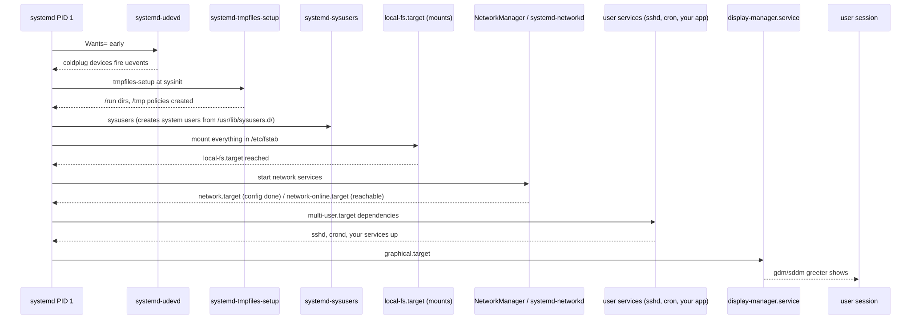
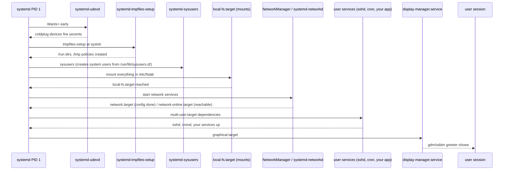

# 05 — Services Startup Sequence (udev, tmpfiles, fstab, network, units)

> **Why this matters:** Between "systemd is PID 1" and "you see a login prompt", a thousand small things happen in parallel. When *one* of them hangs, the whole boot stalls and you stare at a black screen for two minutes. This file walks the userspace startup chain step by step, names the unit files, and gives you the dependency primitives to read (or write) any unit cleanly.

---

## Concepts

### The big picture

<!-- mermaid:rendered -->
<p align="center"></p>

<details><summary>Mermaid source</summary>



</details>
### udev — turning kernel uevents into device nodes

When the kernel discovers a device (USB stick plugged, NVMe found, virtio-blk attached), it emits a **uevent** on a netlink socket. `systemd-udevd` reads that, applies rules from `/lib/udev/rules.d/` and `/etc/udev/rules.d/`, and:

1. Creates the device node under `/dev/` if missing.
2. Creates symlinks like `/dev/disk/by-uuid/abc-...`, `/dev/disk/by-label/data`, `/dev/serial/by-id/...`.
3. Loads the matching kernel module (modalias → modprobe).
4. Sets permissions / ownership (e.g. `uaccess` for plugged USB to give the seat user access).
5. Generates further systemd units (e.g. `dev-sda1.device`).

**Coldplug**: at boot, udev replays events for devices already present (CPUs, disks, network cards) so the system looks the same as a hot-plug discovery.

```bash
udevadm monitor --kernel --udev               # watch events live (try plugging a USB)
udevadm info --query=all --name=/dev/sda      # what udev knows about a device
udevadm test /sys/class/block/sda             # simulate rule processing
udevadm trigger --action=add                  # replay coldplug
```

### tmpfiles — creating runtime files/dirs declaratively

`/run/`, `/tmp/`, lock files, sockets — many programs assume certain dirs exist with certain perms. `systemd-tmpfiles` reads `/usr/lib/tmpfiles.d/*.conf` and `/etc/tmpfiles.d/*.conf` and creates them.

```
# /usr/lib/tmpfiles.d/systemd.conf (excerpt)
d /run/user 0755 root root -
d /run/log/journal 2755 root systemd-journal -
d /tmp 1777 root root 10d         # clean files older than 10 days
```

```bash
systemd-tmpfiles --create               # apply all (idempotent)
systemd-tmpfiles --clean                # apply age-based cleanup (run by timer)
systemd-tmpfiles --remove               # remove anything declared with a 'r' line
```

### sysusers — declarative system user creation

Packages drop snippets into `/usr/lib/sysusers.d/` saying "I need a `nginx` user with UID > 100, group `nginx`, home `/var/lib/nginx`." `systemd-sysusers` reads these at boot (and on package install via `%post`) and creates users that don't exist yet.

```
# /usr/lib/sysusers.d/nginx.conf
u nginx - "nginx user" /var/lib/nginx /sbin/nologin
g nginx -
```

### Mounting `/etc/fstab`

After `local-fs-pre.target`, systemd reads `/etc/fstab` (via `systemd-fstab-generator` which converts each line into a `*.mount` unit) and brings up every entry. `noauto` skips, `nofail` allows boot to continue if the mount fails.

```
# /etc/fstab fields
# <device>          <mountpoint>  <fstype>  <options>            <dump>  <pass>
UUID=abcd-1234-...  /             xfs       defaults              0       1
UUID=ef01-2345-...  /home         xfs       defaults,nodev        0       2
UUID=AB12-CD34      /boot/efi     vfat      umask=0077,shortname=winnt  0  2
/swapfile           none          swap      sw                    0       0
//srv/share         /mnt/share    cifs      _netdev,credentials=/root/.smb  0 0
```

`_netdev` tells systemd "this needs network first." `nofail` tells systemd "don't fail the boot if I'm missing." Use both for network mounts.

### Network at boot

Two competing daemons on Linux:
- **NetworkManager** (default on Fedora/RHEL/Ubuntu desktop) — config in `/etc/NetworkManager/system-connections/*.nmconnection`.
- **systemd-networkd** (default on minimal/server cloud images) — config in `/etc/systemd/network/*.network`.

Either way, two synchronization points exist:
- `network.target` — reached as soon as the network service has *started* (does not mean an interface is up).
- `network-online.target` — reached when at least one configured interface is up and routable. Pulled in by `NetworkManager-wait-online.service` or `systemd-networkd-wait-online.service`.

Rule of thumb: a service that mounts NFS or pulls from S3 should `After=network-online.target Wants=network-online.target`. A service that just listens on a port can use `After=network.target`.

### Unit lookup precedence

Three directories, highest priority first:
1. `/etc/systemd/system/`
2. `/run/systemd/system/`
3. `/usr/lib/systemd/system/` (or `/lib/systemd/system/` on Debian)

If the same unit name exists in multiple, the higher-priority one wins. Drop-ins (`/etc/systemd/system/foo.service.d/*.conf`) **add to** whichever wins.

---

## Files involved

- `/lib/udev/rules.d/`, `/etc/udev/rules.d/` — udev rules (admin overrides in `/etc`)
- `/usr/lib/tmpfiles.d/`, `/etc/tmpfiles.d/` — runtime file/dir specs
- `/usr/lib/sysusers.d/`, `/etc/sysusers.d/` — system user specs
- `/etc/fstab` — mount table
- `/etc/crypttab` — LUKS unlock table
- `/etc/systemd/network/*.network`, `*.netdev` — systemd-networkd config
- `/etc/NetworkManager/system-connections/*.nmconnection` — NetworkManager profiles
- `/etc/NetworkManager/NetworkManager.conf` — NM global config
- `/etc/systemd/system/` — admin unit overrides
- `/usr/lib/systemd/system/` — distro units (don't edit)
- `/etc/systemd/system/<unit>.d/override.conf` — drop-in overrides
- `/etc/systemd/journald.conf` — journal config
- `/etc/systemd/system.conf` — global systemd

---

## Commands

```bash
# udev
udevadm monitor                                    # watch events
udevadm info /dev/sda                              # all attrs
udevadm trigger                                    # replay coldplug
udevadm settle                                     # wait until queue is empty
udevadm test /sys/class/net/eth0                   # rule simulation

# tmpfiles
systemd-tmpfiles --create
systemd-tmpfiles --create --prefix=/var/log        # apply only matching
systemd-tmpfiles --remove --clean

# sysusers
systemd-sysusers
systemd-sysusers --inline 'u myuser - "My User" /var/lib/myuser /sbin/nologin'

# fstab / mounts
findmnt -A                                         # tree of mounts (better than mount)
findmnt --verify --verbose                         # validate fstab
mount -a                                           # try mounting all fstab entries
systemctl daemon-reload                            # MANDATORY after editing fstab

# network
nmcli device status
nmcli connection show
nmcli connection up "Wired connection 1"
networkctl status
networkctl list
ip -br addr                                        # one-line per interface

# unit listing / dependency walking
systemctl list-units                               # active units
systemctl list-units --type=service --state=failed
systemctl list-units --type=mount
systemctl list-dependencies multi-user.target
systemctl list-dependencies multi-user.target --all --reverse

# inspect a unit
systemctl status sshd
systemctl cat sshd                                 # effective unit + drop-ins
systemctl show sshd                                # all properties
systemctl show -p After,Before,Requires,Wants sshd
systemctl edit sshd                                # create drop-in
systemctl edit --full sshd                         # copy whole unit to /etc

# logs
journalctl -u sshd                                 # all
journalctl -u sshd -b 0                            # this boot
journalctl -u sshd -b 0 --no-pager
journalctl -u sshd -f                              # follow
journalctl -xe                                     # explanatory + recent

# pending jobs (during boot)
systemctl list-jobs                                # what's waiting
```

---

## Lab — write your own service the right way

```bash
# 1. Create a script
sudo tee /usr/local/bin/myhello.sh > /dev/null <<'EOF'
#!/bin/bash
while true; do
  echo "hello $(date)" | systemd-cat -t myhello
  sleep 10
done
EOF
sudo chmod +x /usr/local/bin/myhello.sh

# 2. Create the unit
sudo tee /etc/systemd/system/myhello.service > /dev/null <<'EOF'
[Unit]
Description=My hello service
After=network-online.target
Wants=network-online.target

[Service]
Type=simple
ExecStart=/usr/local/bin/myhello.sh
Restart=on-failure
RestartSec=5s
# Hardening
NoNewPrivileges=yes
ProtectSystem=strict
ProtectHome=yes
PrivateTmp=yes

[Install]
WantedBy=multi-user.target
EOF

# 3. Activate
sudo systemctl daemon-reload
sudo systemctl enable --now myhello

# 4. Verify
systemctl status myhello
journalctl -u myhello -f
# → Apr 26 09:41:00 box01 myhello[1234]: hello Sat Apr 26 09:41:00 UTC 2026

# 5. Score the security
systemd-analyze security myhello
# → → Overall exposure level for myhello.service: 3.1 OK
```

---

## Lab — debug "system stuck at startup"

```bash
# Symptom: boot hangs, you see "A start job is running for ..."
# Press Esc / Ctrl-Alt-Del to see what's blocking.

# At the next opportunity (after timeout):
systemctl list-jobs                          # what was pending
# → JOB UNIT                          TYPE  STATE
# →  42 NetworkManager-wait-online.service start running
# → ...

journalctl -b 0 -p err
# → Apr 26 08:01:14 box01 NetworkManager[890]: <error> [...] no IPv4 lease

# Root cause established → DHCP server unreachable. Either fix DHCP, or:
sudo systemctl edit NetworkManager-wait-online
# [Service]
# ExecStart=
# ExecStart=/usr/bin/nm-online -s -q --timeout=5

# Or, if a particular fstab mount hangs:
findmnt --verify --verbose                   # reports broken /etc/fstab entries
# Add nofail to the offending entry; reboot.
```

---

## Dependency cheat-table (the one you'll print and tape to your monitor)

| Directive | Pulls in dep? | Fails us if dep fails? | Affects ordering? | Use for |
|---|---|---|---|---|
| `Wants=foo` | yes | no | no | "I'd like foo, but if it's broken keep going" |
| `Requires=foo` | yes | yes | no | "I literally cannot run without foo" |
| `Requisite=foo` | no | yes | no | "foo must already be active or refuse to start me" |
| `BindsTo=foo` | yes | yes (and stops us if foo stops later) | no | "we live and die together" |
| `PartOf=foo` | no | when foo stops/restarts, we do too | no | "I'm a child of foo" |
| `Conflicts=foo` | no | n/a | n/a | "foo and I are mutually exclusive" |
| `Before=foo` | no | no | yes (we start before foo) | timing only |
| `After=foo` | no | no | yes (we start after foo) | timing only |
| `OnFailure=foo` | no | n/a | n/a | "if I fail, start foo (alert/recovery)" |
| `DefaultDependencies=no` | n/a | n/a | yes (skips standard ordering) | early-boot units, generators |

Two things to internalize:
1. **`Wants/Requires/BindsTo/PartOf` is the *what*, `Before/After` is the *when*.** Always specify both; one without the other is a race.
2. **`DefaultDependencies=no` is dangerous.** It strips standard `After=sysinit.target` etc. Use only for units that genuinely run before sysinit (mount generators, decryption helpers).

---

## Gotchas

> **`After=network.target` does NOT mean network is up.** Use `network-online.target` if you need a working network. But know it costs seconds at boot.

> **Edit `/etc/fstab`, forget `daemon-reload`, run `mount -a` — works. Reboot — fails.** systemd needs `daemon-reload` to regenerate the `*.mount` units from fstab.

> **`systemctl enable foo` does NOT start it.** `enable --now` does both. Forgetting `--now` is a daily papercut.

> **A drop-in that sets `ExecStart=` without first clearing it gets appended.** Always do:
> ```
> [Service]
> ExecStart=
> ExecStart=/new/command
> ```

> **`systemd-tmpfiles` will gleefully delete files in your home dir if you drop a careless `r` rule.** Test with `--dry-run` first.

---

## 20-year tips

> **Every production service deserves `Restart=on-failure`, `RestartSec=5s`, `StartLimitIntervalSec=60`, `StartLimitBurst=3`.** Otherwise a crash loop floods journals and gets the unit blacklisted by systemd's failure protection.

> **Use `EnvironmentFile=` for secrets, not `Environment=`.** The former isn't visible in `systemctl show`.

> **`systemctl cat foo` is the truth.** It shows the effective unit (base + every drop-in in order). When something behaves unexpectedly, this is the first command.

> **Never `disable` something you might want at boot tomorrow.** `mask` it (`systemctl mask foo`) — it leaves a clear marker (symlink to `/dev/null`) that says "intentionally off." `disable` just drops the WantedBy symlink and is invisible later.

> **Hardening your unit is a 5-minute win.** `NoNewPrivileges=yes`, `ProtectSystem=strict`, `ProtectHome=yes`, `PrivateTmp=yes`. Run `systemd-analyze security <unit>` to see your score.

---

## Common interview questions

**Q: What does `systemd-udevd` do at boot?**
A: Listens on the kernel uevent netlink, applies rules from `/lib/udev/rules.d/` and `/etc/udev/rules.d/`, creates device nodes and symlinks under `/dev/`, loads modules, sets permissions, and emits systemd `.device` units.

**Q: Why does `network.target` exist if it doesn't mean network is up?**
A: It's just an ordering anchor — guarantees networking *configuration* has started. `network-online.target` is the real "can talk to internet" anchor and explicitly opt-in (it adds boot time).

**Q: Where do I drop a custom udev rule?**
A: `/etc/udev/rules.d/99-mine.rules`. Then `udevadm control --reload && udevadm trigger`.

**Q: How do I make a network mount not block boot?**
A: Add `nofail,_netdev,x-systemd.mount-timeout=10s` to fstab options.

**Q: What's the difference between `disable` and `mask`?**
A: `disable` removes the `[Install]` symlinks; the unit can still be started by dependencies or manually. `mask` symlinks the unit to `/dev/null` — it cannot be started by anyone until unmasked.

**Q: What's `systemctl edit` actually doing?**
A: Creating `/etc/systemd/system/<unit>.d/override.conf` and running `daemon-reload`. The override merges with the package-shipped unit at runtime.

**Q: How do you find which unit owns a given process?**
A: `systemctl status <PID>` or `ps -o unit= -p <PID>` or `cat /proc/<PID>/cgroup`.

**Q: What's a drop-in?**
A: A `.conf` file in `/etc/systemd/system/<unit>.d/` that adds to or overrides settings of the base unit. Survives package upgrades.

**Q: Why does `mount -a` work but boot fail with the same fstab?**
A: Because you didn't `systemctl daemon-reload`. systemd generates `.mount` units from fstab at startup; live edits need an explicit reload.

**Q: How does systemd handle parallel boot?**
A: Units start as soon as their `After=` constraints and required deps are satisfied. Socket activation, dbus activation, and `Type=notify` allow further parallelism by deferring "ready" signaling.

---

## Sources

- `man 5 systemd.unit`, `man 5 systemd.service`, `man 5 systemd.mount`, `man 5 systemd.network`, `man 5 fstab`, `man 5 tmpfiles.d`, `man 5 sysusers.d`, `man 7 udev`
- https://www.freedesktop.org/software/systemd/man/
- https://systemd.io/NETWORK_ONLINE/
- https://wiki.archlinux.org/title/Udev
- https://wiki.archlinux.org/title/Systemd-networkd
