# 06 — User Sessions: getty, login, PAM, shell, profile.d

> **Why this matters:** Half of all "I can't log in" tickets are not about passwords. They're shell missing, account expired, securetty blocking root, PAM misconfig, full home filesystem, or a broken `~/.bashrc` that hangs the shell. Understanding the exact chain — getty → login → PAM → shell → rc files — turns those tickets into 30-second fixes.

---

## Concepts

### The login chain on a console (no GUI)

```mermaid
flowchart LR
    A["systemd starts<br/>getty@tty1.service"] --> B["agetty opens /dev/tty1"]
    B --> C["agetty execs /bin/login"]
    C --> D["login reads /etc/securetty,<br/>/etc/login.defs"]
    D --> E["login calls PAM stack<br/>/etc/pam.d/login"]
    E --> F["PAM modules:<br/>pam_unix, pam_securetty,<br/>pam_nologin, pam_env,<br/>pam_limits, pam_systemd, ..."]
    F --> G["On success:<br/>setuid to user,<br/>set HOME, PATH,<br/>chdir(HOME)"]
    G --> H["exec user shell from /etc/passwd<br/>(usually /bin/bash)"]
    H --> I["bash sources /etc/profile<br/>then /etc/profile.d/*.sh"]
    I --> J["bash sources ~/.bash_profile<br/>(or ~/.profile)"]
    J --> K["interactive shell prompt"]
```

<!-- mermaid:rendered -->
<p align="center"></p>

<details><summary>Mermaid source</summary>



</details>
### The login chain via SSH

<!-- mermaid:rendered -->
<p align="center"></p>

<details><summary>Mermaid source</summary>


</details>
### The four bash invocation modes (the table you'll memorize)

| Mode | Triggered by | Sources at startup | Used for |
|---|---|---|---|
| Interactive **login** | `/bin/login`, ssh login, `bash -l` | `/etc/profile`, then first of `~/.bash_profile`, `~/.bash_login`, `~/.profile`. On exit: `~/.bash_logout` | console login, ssh |
| Interactive **non-login** | xterm, `bash` inside an existing session | `/etc/bash.bashrc` (Debian) or sourced via `/etc/profile`, then `~/.bashrc` | sub-shells, terminal emulators |
| Non-interactive **non-login** | `bash script.sh`, `ssh host cmd`, cron | If `BASH_ENV` is set, sources its value. **No rc files**. | scripts |
| Non-interactive **login** (rare) | `bash -l script.sh` | Login files as above | startup scripts that need full env |

Practical rules of thumb:
- Put PATH, env vars, locale → `/etc/profile.d/*.sh` or `~/.bash_profile` (login).
- Put aliases, functions, prompt → `~/.bashrc` (non-login).
- Make `~/.bash_profile` source `~/.bashrc` so login shells get aliases too:
  ```bash
  [ -f ~/.bashrc ] && . ~/.bashrc
  ```

### PAM in 60 seconds

PAM (Pluggable Authentication Modules) is **the** authentication framework on Linux. Every program that authenticates a user (`login`, `sshd`, `sudo`, `gdm`, `cron`, `polkit`) loads a stack from `/etc/pam.d/<service>`.

A stack has four management groups:

| Group | What it does |
|---|---|
| `auth` | identify the user (password, key, biometric) |
| `account` | "is this account allowed right now?" (expired? wrong time? wrong host?) |
| `password` | change credentials (`passwd` command) |
| `session` | set up / tear down the session (logging, env, cgroup, ulimits) |

Each line in `/etc/pam.d/<svc>`:

```text
<group>   <control>   <module>.so   [args]
```

`<control>` is one of `required` (must pass, but keep checking), `requisite` (must pass, abort on fail), `sufficient` (if it passes and prior didn't fail, return success), `optional` (success ignored), or fancy `[success=ok default=ignore]` syntax.

Common modules:

| Module | What it does |
|---|---|
| `pam_unix.so` | classic `/etc/passwd` + `/etc/shadow` check |
| `pam_securetty.so` | root only on TTYs listed in `/etc/securetty` |
| `pam_nologin.so` | if `/etc/nologin` exists, deny non-root logins |
| `pam_env.so` | sets env vars from `/etc/environment` and `/etc/security/pam_env.conf` |
| `pam_limits.so` | applies `/etc/security/limits.conf` (ulimits) |
| `pam_systemd.so` | session phase: registers session with logind, sets XDG_RUNTIME_DIR |
| `pam_loginuid.so` | writes the audit loginuid to `/proc/self/loginuid` |
| `pam_motd.so` | shows /etc/motd on login |
| `pam_lastlog.so` | "Last login: ..." line |
| `pam_wheel.so` | only members of `wheel` group can `su` |
| `pam_faillock.so` | locks account after N bad passwords |
| `pam_sss.so` | SSSD (LDAP/AD/IPA) backend |
| `pam_krb5.so` | Kerberos |
| `pam_google_authenticator.so` | TOTP MFA |

### logind and sessions

`systemd-logind` is the per-user session manager. It:
- creates `/run/user/<UID>/` (the **XDG_RUNTIME_DIR**) on first session.
- assigns a **session ID** (visible via `loginctl`).
- assigns a **seat** (which physical hardware: `seat0`).
- handles power keys, lid switches, idle.
- supports **lingering** (user services keep running after logout).

```bash
loginctl list-sessions
# → SESSION  UID  USER     SEAT   TTY
# →       1 1000  alice    seat0  tty2
# →       3 1000  alice    -      pts/0     <- ssh session
loginctl session-status 1
# → 1 - alice (1000)
# →   Since: Sat 2026-04-26 09:00:01 UTC
# →   Leader: 1234 (gdm-session-worker)
# →   Service: gdm-password; type x11; class user
# →   State: active
# →   Unit: session-1.scope

loginctl enable-linger alice              # alice's user services keep running after logout
loginctl user-status alice
```

### SSH path specifics

```text
sshd reads /etc/ssh/sshd_config
  → AuthorizedKeysFile ~/.ssh/authorized_keys
  → PAM stack /etc/pam.d/sshd
  → on success, fork+exec the user shell from /etc/passwd
  → if ForceCommand set in sshd_config, run that instead
  → if Match ChrootDirectory set, chroot first
```

`ForceCommand` is how `git-shell`, `rrsync`, and lockdown shells are implemented. Combine with `Match Group sftponly` in `sshd_config`.

---

## Files involved

### Login-time files (in evaluation order)

| File | Read by | Purpose |
|---|---|---|
| `/etc/passwd` | login, sshd | UID, GID, GECOS, home, shell |
| `/etc/shadow` | pam_unix | hashed password, expiry, age |
| `/etc/securetty` | pam_securetty | TTYs where root can log in |
| `/etc/login.defs` | login, useradd | UMASK, PASS_MAX_DAYS, UID_MIN/MAX |
| `/etc/skel/` | useradd | template for new home dirs |
| `/etc/pam.d/login` | login | console PAM stack |
| `/etc/pam.d/sshd` | sshd | ssh PAM stack |
| `/etc/pam.d/system-auth` | sourced by other PAM stacks | shared auth/account/password |
| `/etc/pam.d/password-auth` | sourced by sshd, su | shared auth |
| `/etc/security/limits.conf` | pam_limits | ulimits per user/group |
| `/etc/security/limits.d/*.conf` | pam_limits | drop-ins (preferred) |
| `/etc/security/pam_env.conf` | pam_env | env vars at session start |
| `/etc/environment` | pam_env | system-wide env (KEY=VALUE format) |
| `/etc/profile` | bash login | system-wide login script |
| `/etc/profile.d/*.sh` | sourced by /etc/profile | drop-in env scripts |
| `/etc/bashrc` (RHEL) or `/etc/bash.bashrc` (Debian) | bash | system-wide non-login |
| `~/.bash_profile` | bash login | per-user login |
| `~/.bash_login` | bash login | (used only if no .bash_profile) |
| `~/.profile` | bash login | (used only if neither above; preferred for sh) |
| `~/.bashrc` | bash non-login | per-user aliases/prompt |
| `~/.bash_logout` | bash login (on exit) | cleanup |
| `/etc/motd` | pam_motd | message of the day after login |
| `/etc/nologin` | pam_nologin | if exists, blocks non-root logins |
| `/var/log/wtmp` | last | login/logout history |
| `/var/log/btmp` | lastb | failed login attempts |
| `/var/log/lastlog` | lastlog | per-user last login |
| `/var/log/secure` (RHEL) or `/var/log/auth.log` (Debian) | sshd, sudo, login | auth events |

---

## Commands

```bash
# Who is logged in
who                                     # current sessions
# → alice  tty2   2026-04-26 09:00 (:0)
# → alice  pts/0  2026-04-26 09:32 (192.168.1.10)

w                                       # who + what they're doing + load
# → 09:33:14 up 25 min,  2 users,  load average: 0.12, 0.20, 0.15
# → USER     TTY      FROM            LOGIN@   IDLE   JCPU   PCPU WHAT
# → alice    tty2     :0               09:00   34:00   1:21   0.05 -bash
# → alice    pts/0    192.168.1.10     09:32   0.00s   0.04s  0.01s w

last -n 10                              # recent logins
last -F                                 # full timestamps
lastb                                   # failed logins (root only)
lastlog                                 # last login per user
lastlog -u alice
lastlog -t 7                            # logins in last 7 days

# User identity
id alice                                # uid, gid, groups
groups alice
getent passwd alice
getent shadow alice                     # root only
chage -l alice                          # password expiry policy
# → Last password change         : Apr 01, 2026
# → Password expires             : never
# → Password inactive            : never
# → Account expires              : never
# → Minimum number of days between password change         : 0
# → Maximum number of days between password change         : 99999
# → Number of days of warning before password expires      : 7

# Force password change at next login
sudo chage -d 0 alice

# Lock / unlock an account
sudo passwd -l alice                    # lock (prepends ! to hash)
sudo passwd -u alice                    # unlock
sudo usermod -L alice                   # equivalent
sudo usermod -U alice
sudo passwd -S alice                    # status: PS = ok, LK = locked, NP = no password

# logind
loginctl list-sessions
loginctl session-status 1
loginctl user-status alice
loginctl enable-linger alice            # run user services after logout
loginctl disable-linger alice
loginctl terminate-session 3            # kill a session
loginctl terminate-user alice           # kill all alice's sessions

# PAM debugging (enables module debug output to /var/log/secure)
# Add 'debug' arg to a pam_unix line, e.g.:
#   auth    required     pam_unix.so debug

# View auth events
sudo journalctl -u sshd -b 0
sudo tail -f /var/log/secure            # RHEL/Fedora
sudo tail -f /var/log/auth.log          # Debian/Ubuntu

# What does a user's PATH look like at login?
sudo -iu alice -- bash -lc 'echo $PATH'

# Test bash startup mode
echo $- $0
# Login shell: $0 starts with '-', $- contains 'i' if interactive
```

---

## Lab — diagnose "user can't log in"

```bash
# 1. Account exists?
getent passwd bob || echo "no such user"

# 2. Shell exists and is in /etc/shells?
SHELL_OF_BOB=$(getent passwd bob | cut -d: -f7)
ls -l "$SHELL_OF_BOB"
grep -Fx "$SHELL_OF_BOB" /etc/shells
# If shell missing or not in /etc/shells, sshd refuses with "no shell".

# 3. Account locked or expired?
sudo passwd -S bob
# → bob LK 2026-04-20 0 99999 7 -1 (Password locked.)
sudo chage -l bob

# 4. Home dir exists and owned by bob?
ls -ld $(getent passwd bob | cut -d: -f6)
# If wrong owner, bash sources ~/.bashrc owned by someone else, may fail or be ignored.

# 5. /etc/nologin exists?
ls -l /etc/nologin && cat /etc/nologin

# 6. SSH-specific: AllowUsers / DenyUsers / AllowGroups in sshd_config?
sudo sshd -T | grep -iE 'allowusers|denyusers|allowgroups|denygroups|permitrootlogin'

# 7. PAM log
sudo journalctl -u sshd -b 0 | grep -i bob
# Look for: pam_unix(sshd:auth): authentication failure
# Look for: pam_faillock: Consecutive login failures...

# 8. Try a verbose ssh from client side
ssh -vvv bob@server 2>&1 | grep -iE 'debug1|publickey|password|denied'

# 9. PAM debug
# Edit /etc/pam.d/sshd, add 'debug' to pam_unix.so line, retry, watch journal.

# 10. Worst case: run sshd in foreground on a high port
sudo /usr/sbin/sshd -d -p 2222
# → debug1: PAM: initializing for "bob"
# → debug1: PAM: setting PAM_RHOST to "192.168.1.10"
# → ...full handshake printed
```

---

## Lab — bash startup file evaluation order (proof)

```bash
# Add traceable echoes
echo 'echo /etc/profile' | sudo tee -a /etc/profile > /dev/null
echo 'echo ~/.bash_profile'  >> ~/.bash_profile
echo 'echo ~/.bashrc'        >> ~/.bashrc
echo 'echo ~/.bash_logout'   >> ~/.bash_logout

# Login shell
ssh localhost
# → /etc/profile
# → /etc/profile.d/colorls.sh
# → ~/.bash_profile
# → ~/.bashrc        (because .bash_profile sources .bashrc, common pattern)

exit
# → ~/.bash_logout

# Non-login interactive (new terminal in GUI)
# → ~/.bashrc only

# Non-interactive (script)
bash -c 'echo hi'
# → hi          (no rc files sourced)

# Clean up
sudo sed -i '/^echo \/etc\/profile$/d' /etc/profile
sed -i '/^echo ~\/\.bash_profile$/d' ~/.bash_profile
sed -i '/^echo ~\/\.bashrc$/d' ~/.bashrc
sed -i '/^echo ~\/\.bash_logout$/d' ~/.bash_logout
```

---

## Gotchas

> **Root cannot log in on a TTY not listed in `/etc/securetty`.** Default lists tty1–tty11, console, vc/*. SSH is not affected by securetty (use `PermitRootLogin` instead).

> **`/etc/nologin` blocks ALL non-root logins.** If a system upgrade leaves this file behind, normal users can't log in. Delete it.

> **`~/.bashrc` is NOT sourced for ssh non-interactive commands** unless you set `BASH_ENV`. This is why `ssh host 'somecmd'` doesn't see your aliases.

> **A broken `~/.bashrc` that hangs (e.g. talks to a slow LDAP server) makes login appear to "hang."** Fix by ssh'ing with a different shell: `ssh -t user@host 'sh'`.

> **`pam_faillock` will lock you out after 3 wrong passwords by default.** Symptom: correct password is rejected. Fix: `faillock --user alice --reset`.

---

## 20-year tips

> **Never put `cd /somewhere` in `/etc/profile.d/`.** It changes the working dir for every login user, breaking scripts that assume `$PWD == $HOME`.

> **Always set `PROMPT_COMMAND='history -a'` in `/etc/bashrc`.** Per-window histories are infuriating during incident response when you want to know what the previous on-call ran.

> **For root accounts, alias `rm` to `rm -i` only in interactive shells** (test `[ -t 0 ]`). Aliasing globally breaks scripts that pipe to `rm`.

> **Use `loginctl enable-linger` for long-running user services** (tmux, jupyter, syncthing) instead of system-wide units. They live in the user's slice, get killed by the user's quota, and don't pollute `systemctl status`.

> **Centralize sshd_config under `/etc/ssh/sshd_config.d/*.conf`.** Modern openssh reads `Include /etc/ssh/sshd_config.d/*.conf`. Drop a file there and your config survives upgrades cleanly.

---

## Common interview questions

**Q: Walk me through a console login.**
A: systemd starts `getty@ttyN.service`, which spawns `agetty` on `/dev/ttyN`. agetty execs `/bin/login`. login reads `/etc/securetty`, then runs the PAM stack at `/etc/pam.d/login` (auth, account, session). On success, it setuid's to the user, exports HOME and PATH, chdirs to home, and execs the shell from `/etc/passwd`. The shell sources `/etc/profile` then `~/.bash_profile`.

**Q: Difference between `/etc/profile` and `/etc/bashrc`?**
A: `/etc/profile` is for login shells (system-wide login env). `/etc/bashrc` is for non-login interactive shells (system-wide aliases/prompt). Most distros have `/etc/profile` source `/etc/bashrc` so login shells get both.

**Q: Why doesn't `ssh host cmd` see my aliases?**
A: Because that's a non-interactive non-login shell — bash doesn't source any rc files. Set `BASH_ENV=~/.bashrc` to force it, or use `ssh -t host 'bash -l -i'`.

**Q: How does PAM work?**
A: A stack of modules in 4 management groups (auth, account, password, session). Each program that authenticates loads its stack from `/etc/pam.d/<service>`. Modules return success/fail; control flags (`required`, `requisite`, `sufficient`, `optional`) determine how to combine results.

**Q: What is `/etc/securetty`?**
A: A file listing TTYs on which root is allowed to log in (used by `pam_securetty.so`). SSH is not gated by this — `PermitRootLogin` in `sshd_config` controls SSH root access.

**Q: User logs in but immediately gets disconnected. Why?**
A: Most common: shell in `/etc/passwd` doesn't exist, isn't executable, or isn't in `/etc/shells`. Other causes: home dir missing or wrong perms, broken `~/.bashrc`, `/etc/nologin` exists.

**Q: How do you force a user to change their password at next login?**
A: `chage -d 0 username`.

**Q: What does `loginctl enable-linger` do?**
A: Lets a user's `systemd --user` services keep running after they log out. Without it, all the user's processes get killed by `KillUserProcesses=yes` in logind.conf.

**Q: How do you find recent failed logins?**
A: `lastb` (reads `/var/log/btmp`) or `journalctl _COMM=sshd | grep -i fail`.

**Q: What's `XDG_RUNTIME_DIR`?**
A: A per-user, per-session tmpfs directory at `/run/user/<UID>/` created by `pam_systemd`. Used for sockets (Wayland, pulseaudio), pid files, and other runtime-only state. Cleaned up when the last session ends (unless lingering is enabled).

---

## Sources

- `man 1 login`, `man 8 sshd`, `man 8 pam`, `man 5 pam.conf`, `man 5 limits.conf`, `man 5 login.defs`, `man 8 agetty`, `man 1 loginctl`, `man 1 bash` (INVOCATION section)
- https://www.man7.org/linux/man-pages/man8/pam.8.html
- https://www.linux-pam.org/Linux-PAM-html/
- https://www.freedesktop.org/software/systemd/man/loginctl.html
