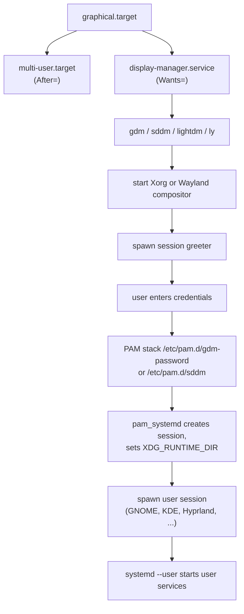
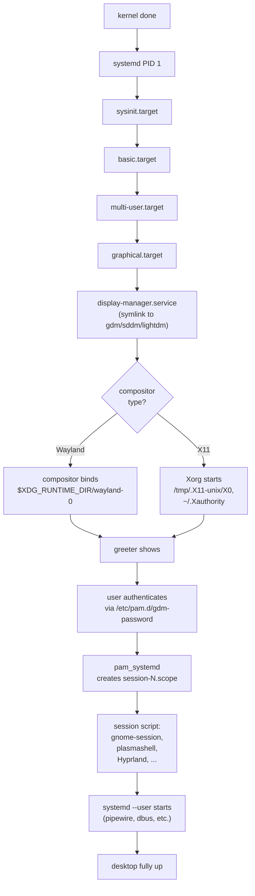

# 07 — Graphical vs CLI: Display Managers, Xorg, Wayland

> **Why this matters:** "GUI doesn't come up after reboot" and "I want this server to never run a desktop again" are both daily tickets. The difference between a CLI server and a workstation is a single symlink — but the chain from `graphical.target` to a logged-in Wayland session has more moving pieces than people realize. This file maps it.

---

## Concepts

### graphical.target dependency chain

<!-- mermaid:rendered -->
<p align="center"></p>

<details><summary>Mermaid source</summary>



</details>
### How GUI vs CLI is selected

There is no special "graphical install." The only difference is which target `default.target` symlinks to:

```bash
systemctl get-default
# → graphical.target           ← workstation
# or
# → multi-user.target          ← server (no GUI)
```

Switching is a single command:

```bash
sudo systemctl set-default multi-user.target     # disable GUI permanently
sudo systemctl set-default graphical.target       # enable GUI permanently
```

If `display-manager.service` isn't installed at all (a true server build), `graphical.target` simply has nothing to pull in for the GUI part — it will reach but no greeter appears.

### Live switching (no reboot)

```bash
sudo systemctl isolate multi-user.target          # stop GUI right now
sudo systemctl isolate graphical.target            # start GUI right now
```

`isolate` stops every unit not pulled in by the target you're isolating to. The GUI session dies (saving nothing) when you isolate to multi-user.

### Display manager comparison

| DM | Default on | Config dir | Session selection | Notes |
|---|---|---|---|---|
| **gdm** | Fedora, RHEL Workstation, Ubuntu (≥ 17.10) | `/etc/gdm/`, `/etc/gdm/custom.conf` | dropdown gear icon | GNOME native; great Wayland support |
| **sddm** | KDE Plasma, openSUSE | `/etc/sddm.conf`, `/etc/sddm.conf.d/*.conf` | session menu | Qt-based; default for Plasma |
| **lightdm** | Xubuntu, Mint, older Ubuntu | `/etc/lightdm/lightdm.conf`, `/etc/lightdm/lightdm.conf.d/` | greeter dependent | lightweight, themeable greeters |
| **ly** | Arch (alt) | `/etc/ly/config.ini` | TUI menu | text-mode greeter, no X needed |
| **xdm** | legacy | `/etc/X11/xdm/` | none | original X DM, rarely used today |

Switching DM:

```bash
sudo systemctl disable --now gdm
sudo systemctl enable --now sddm
# Or on Debian: sudo dpkg-reconfigure <dm-package>
```

There's only one `display-manager.service` on the system — it's a symlink to whichever DM is currently selected:

```bash
ls -l /etc/systemd/system/display-manager.service
# → lrwxrwxrwx 1 root root 36 ... display-manager.service -> /lib/systemd/system/gdm.service
```

### Console TTYs vs the graphical TTY

Linux exposes virtual consoles on `/dev/tty1` … `/dev/tty7` (configurable, often up to tty12). Switch with `Ctrl+Alt+F1` … `Ctrl+Alt+F7`.

| TTY | Traditional use today (varies by distro) |
|---|---|
| tty1 | Ubuntu / Debian: GUI session here |
| tty2 | Fedora: GUI session here |
| tty3–tty6 | text logins (getty@ttyN.service) |
| tty7 | older convention: X server here |

Quick way to find the GUI: `who` shows the seat: `alice tty2 (:0)` means GUI on tty2.

### Xorg vs Wayland

| Aspect | Xorg | Wayland |
|---|---|---|
| Year | 1984 (X11), Xorg fork 2004 | 2008 |
| Architecture | Client-server, network-transparent | Compositor-only, no network protocol |
| Files / sockets | `/tmp/.X11-unix/X0`, `~/.Xauthority`, `/etc/X11/xorg.conf.d/` | `$XDG_RUNTIME_DIR/wayland-0` |
| Config | `xorg.conf.d/*.conf` snippets | per-compositor (gnome, sway, etc.) |
| Screen-sharing / remote | `x11vnc`, ssh -X, XDMCP | `pipewire` + `xdg-desktop-portal` |
| Multi-GPU | works but messy | better (per-window output) |
| Tearing/lag | older API, vsync via extensions | designed for modern compositing |
| Legacy app support | full | via `Xwayland` shim |
| HiDPI / multi-DPI | global scale only | per-monitor scale |
| Default on | XFCE, MATE (still); RHEL 8 | GNOME ≥ 40, KDE Plasma 6, Sway, Hyprland |

Both can coexist on the same system; the DM chooses which to launch based on the session file in `/usr/share/wayland-sessions/` or `/usr/share/xsessions/`.

### Wayland compositor sockets

```bash
echo $WAYLAND_DISPLAY                 # → wayland-0
ls $XDG_RUNTIME_DIR/wayland-0         # → socket file
ls $XDG_RUNTIME_DIR/                  # → bus, dconf, gdm, pipewire-0, pulse, systemd, wayland-0
```

### Removing the GUI for a server

```bash
# RHEL/Fedora
sudo dnf groupremove "Server with GUI"           # or "Workstation"
sudo dnf remove gdm gnome-shell                   # surgical
sudo systemctl set-default multi-user.target

# Debian/Ubuntu
sudo apt remove gnome-shell gdm3                  # surgical
sudo apt purge --auto-remove ubuntu-desktop       # nuclear
sudo systemctl set-default multi-user.target

# Verify nothing GUI-ish remains
systemctl list-dependencies graphical.target | grep -i -E 'gdm|sddm|lightdm|x11|wayland'
```

### Headless servers and "no monitor"

A server with no monitor still boots fine — `graphical.target` would simply hang trying to start `gdm` if installed, so always set `multi-user.target` on headless boxes. SSH in, do work, done.

For remote GUI access on a server (rare but legit, e.g. a build farm running Chrome):
- **VNC**: `tigervnc-server`, systemd unit `vncserver@:1.service`.
- **xrdp**: Windows-friendly RDP.
- **NoMachine / Apache Guacamole**: more polished, browser-based.

---

## Files involved

### Display manager configs

- `/etc/gdm/custom.conf` — gdm settings (autologin, Wayland on/off)
- `/etc/sddm.conf`, `/etc/sddm.conf.d/*.conf` — sddm
- `/etc/lightdm/lightdm.conf`, `/etc/lightdm/lightdm.conf.d/` — lightdm
- `/etc/systemd/system/display-manager.service` — symlink to chosen DM
- `/etc/pam.d/gdm-password`, `/etc/pam.d/gdm-autologin`, `/etc/pam.d/sddm` — DM PAM stacks

### Session definitions

- `/usr/share/xsessions/*.desktop` — X11 session entries shown in DM
- `/usr/share/wayland-sessions/*.desktop` — Wayland session entries

### Xorg

- `/etc/X11/xorg.conf` — legacy single-file config (rarely used now)
- `/etc/X11/xorg.conf.d/*.conf` — preferred drop-in dir
- `/usr/share/X11/xorg.conf.d/` — packaged defaults
- `/var/log/Xorg.0.log` — per-session log
- `~/.Xauthority` — magic cookie for X auth
- `/tmp/.X11-unix/X0` — display socket

### Wayland

- `$XDG_RUNTIME_DIR/wayland-0` — primary compositor socket
- Per-compositor configs (e.g. `~/.config/hypr/hyprland.conf`, gsettings for GNOME)

### Logs

- `/var/log/Xorg.0.log` (X11)
- `journalctl /usr/bin/gdm`
- `journalctl --user` (per-user session services)

---

## Commands

```bash
# Default target (GUI vs CLI)
systemctl get-default
sudo systemctl set-default multi-user.target
sudo systemctl set-default graphical.target

# Live switch
sudo systemctl isolate multi-user.target
sudo systemctl isolate graphical.target

# Display manager status
systemctl status display-manager
ls -l /etc/systemd/system/display-manager.service
sudo systemctl restart display-manager     # restarts DM (kills GUI sessions!)

# Switch DM
sudo systemctl disable gdm
sudo systemctl enable sddm
sudo systemctl set-default graphical.target
sudo reboot

# Am I in X or Wayland?
echo $XDG_SESSION_TYPE
# → wayland   or   x11

loginctl show-session $XDG_SESSION_ID -p Type
# → Type=wayland

# X-only diagnostics
xdpyinfo | head            # X server info
xrandr                     # outputs and resolutions
xinput list                # input devices
xev                        # watch X events for the focused window
xset q                     # X server settings (DPMS, screensaver)

# Wayland diagnostics (compositor-specific tools)
wayland-info               # if installed
wlr-randr                  # for wlroots-based compositors
gnome-control-center       # GNOME

# Switch TTYs
chvt 3                     # like Ctrl+Alt+F3 from a script
fgconsole                  # current foreground console

# Remove GUI on Fedora server
sudo dnf groupremove "Server with GUI"
sudo systemctl set-default multi-user.target

# Remove GUI on Ubuntu server
sudo apt purge --auto-remove ubuntu-desktop gnome-shell gdm3
sudo systemctl set-default multi-user.target

# Force Wayland off in gdm (workstation)
sudo sed -i 's/^#WaylandEnable=false/WaylandEnable=false/' /etc/gdm/custom.conf
sudo systemctl restart gdm
```

---

## Lab — switch between GUI and CLI without reboot

```bash
# Starting state
systemctl get-default
# → graphical.target
who
# → alice  tty2  2026-04-26 09:00 (:0)

# Drop to multi-user (GUI dies; ssh sessions stay)
sudo systemctl isolate multi-user.target
# Console flicks to text. Login prompt on tty1.

# Verify
systemctl is-active display-manager
# → inactive
who
# → alice  pts/0  2026-04-26 09:35 (192.168.1.10)   # ssh stayed

# Bring GUI back
sudo systemctl isolate graphical.target
systemctl is-active display-manager
# → active

# Make permanent
sudo systemctl set-default multi-user.target
sudo reboot           # boots to text from now on
```

---

## Lab — investigate a "black screen after login"

```bash
# 1. Did graphical.target reach?
systemctl is-active graphical.target
systemctl status display-manager

# 2. Look at journals
journalctl -b 0 -u gdm --no-pager
journalctl -b 0 _COMM=Xorg --no-pager
cat /var/log/Xorg.0.log | grep EE         # X errors
# → (EE) Failed to load module "nvidia"
# → (EE) No devices detected.

# 3. Common cause: nvidia driver mismatch after kernel update
sudo dnf reinstall akmod-nvidia
sudo akmods --force
sudo dracut -f
sudo reboot

# 4. Workaround: disable nouveau/nvidia, fall back to llvmpipe
# Add to kernel cmdline: nomodeset
# Then in DM, choose "GNOME on Xorg" from session menu.

# 5. If session starts but immediately exits (login loop):
ls -la ~/.xsession-errors            # X11 sessions
journalctl --user -b 0 | grep -i fail # Wayland / user services
ls -la ~/.config/                    # corrupted dconf or config
# Try a fresh test user to rule out home-dir corruption.
```

---

## Mermaid — full graphical boot path

<!-- mermaid:rendered -->
<p align="center"></p>

<details><summary>Mermaid source</summary>



</details>
---

## Gotchas

> **`systemctl restart display-manager` kills every GUI session immediately, no warnings.** Don't run it on a system someone else is using.

> **Wayland sessions don't accept `ssh -X` forwarding.** Use `waypipe` or run the app under Xwayland.

> **NVIDIA on Wayland is finally usable in 2025+ but still has rough edges.** If GNOME falls back to X11 on NVIDIA, that's why.

> **Removing all GUI packages on a workstation can take `NetworkManager` with it** if your distro pulls it in via the desktop meta-package. Always `apt-mark hold` or `dnf mark install` critical packages first.

> **Switching DM does not switch desktop environment.** GDM can launch Plasma, SDDM can launch GNOME. Session choice is at the greeter.

---

## 20-year tips

> **Set `multi-user.target` on every server, every time.** Even if "they might want a desktop later." Adding it later is one `dnf install` away. A server that boots into a half-broken graphical greeter and won't accept SSH because `gdm` is wedged is a 2 a.m. page.

> **Keep one workstation on Xorg as a fallback.** When a Wayland regression hits in a major release, you'll be glad you didn't burn the bridge.

> **For headless GPU compute boxes, install only the driver, not the desktop.** `cuda-drivers` on Fedora pulls Xorg automatically — use `--exclude=xorg-x11-server-Xorg` or a server-specific repo.

> **Always `Ctrl+Alt+F3` to a text TTY before doing anything that might kill X.** When `restart display-manager` works that 1 in 100 time, you'll already be safely on tty3.

> **Use `loginctl session-status` not `who` for the truth.** `who` lies about session type and seat; `loginctl` knows.

---

## Common interview questions

**Q: How do you tell if a system boots into GUI or CLI by default?**
A: `systemctl get-default`. `graphical.target` = GUI, `multi-user.target` = CLI.

**Q: How do you change it?**
A: `systemctl set-default multi-user.target` (or `graphical.target`). Reboot or `systemctl isolate` for live switch.

**Q: What's the difference between a display manager and a desktop environment?**
A: DM (gdm/sddm/lightdm) is the login screen. DE (GNOME/KDE/XFCE) is what runs after you log in. The DM picks which DE/session to launch.

**Q: Wayland vs Xorg — when would you pick which?**
A: Wayland for modern hardware, HiDPI, multi-monitor, security. Xorg when you need network transparency (`ssh -X`), legacy apps that won't work under Xwayland, NVIDIA edge cases (less of an issue post-555 driver).

**Q: How do you check if your current session is X or Wayland?**
A: `echo $XDG_SESSION_TYPE` or `loginctl show-session $XDG_SESSION_ID -p Type`.

**Q: How do you switch between TTYs from a script?**
A: `chvt N` (e.g. `chvt 3` switches to tty3).

**Q: Server boots into GUI by mistake. How do you fix permanently?**
A: `systemctl set-default multi-user.target && reboot`. Optionally remove `gdm` package.

**Q: GUI doesn't start after kernel update. What do you check first?**
A: `journalctl -u gdm -b 0` and `/var/log/Xorg.0.log`. 90 % of the time it's a binary GPU driver (NVIDIA, etc.) that needs `akmods` rebuild against the new kernel.

**Q: Can you have both gdm and sddm installed?**
A: Yes, but only one is `enable`d. The `display-manager.service` symlink determines which one starts at boot.

**Q: What's `XDG_RUNTIME_DIR` and why does Wayland use it?**
A: A per-user, per-session tmpfs at `/run/user/<UID>/`, created by `pam_systemd`. Wayland places its compositor socket there because it's private to the session and cleaned up at logout — better security model than `/tmp` (where Xorg sockets live world-readable).

---

## Sources

- `man 1 gdm`, `man 5 sddm.conf`, `man 5 xorg.conf`, `man 1 chvt`, `man 1 loginctl`
- https://wayland.freedesktop.org/docs/html/
- https://www.x.org/wiki/
- https://help.gnome.org/admin/system-admin-guide/stable/login-automatic.html.en
- https://wiki.archlinux.org/title/Display_manager
- https://wiki.archlinux.org/title/Wayland
- https://wiki.archlinux.org/title/Xorg
