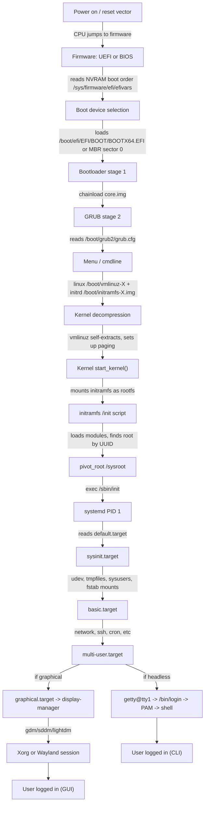

# Linux Boot, Kernel, User Sessions and Swap — Master Module

> Audience: senior Linux admin / SRE who has to debug systems that **won't boot, won't login, won't free memory**. Every page lists the EXACT files, paths and binaries involved at every step so you can map theory to disk.

---

## Why this module exists

When a Linux box is sick, the symptom is almost always one of three things:

1. It will not **boot** (firmware, GRUB, initramfs, kernel panic, systemd target failure).
2. It boots but **no one can log in** (PAM, shadow, securetty, sshd, logind, missing shell).
3. It runs but **runs out of memory** (no swap, swap thrash, OOM-killer, cgroup limits).

This module walks the complete chain — from the moment the CPU starts executing firmware code at the reset vector, to the user typing `ls` in a shell — naming every file, every binary, every log, and every command you'll need to debug each phase.

---

## The full boot chain (Mermaid)

<!-- mermaid:rendered -->

Mermaid source

---

## Files map (phase ↔ files ↔ binaries ↔ commands)

| Phase | Key files / paths | Key binaries | Key commands |
|---|---|---|---|
| Firmware | `/sys/firmware/efi/`, `/sys/firmware/efi/efivars/`, `/boot/efi/EFI/` | UEFI firmware, shim, BOOTX64.EFI | `efibootmgr -v`, `bootctl status`, `mokutil --sb-state` |
| Bootloader | `/boot/grub2/grub.cfg`, `/etc/default/grub`, `/etc/grub.d/`, `/boot/grub2/grubenv` | `grub2-mkconfig`, `grub2-install`, `grub2-editenv` | `grub2-mkconfig -o /boot/grub2/grub.cfg`, `grub2-set-default` |
| Kernel | `/boot/vmlinuz-*`, `/boot/System.map-*`, `/boot/config-*`, `/proc/cmdline`, `/proc/version` | `vmlinuz` (bzImage) | `uname -a`, `cat /proc/cmdline`, `dmesg` |
| initramfs | `/boot/initramfs-*.img`, `/boot/intel-ucode.img` | `dracut`, `mkinitcpio`, `update-initramfs`, `lsinitrd` | `lsinitrd /boot/initramfs-$(uname -r).img`, `dracut -f` |
| systemd | `/lib/systemd/systemd`, `/etc/systemd/system/`, `/usr/lib/systemd/system/`, `/etc/systemd/system/default.target` | `systemctl`, `systemd-analyze`, `journalctl` | `systemctl get-default`, `systemd-analyze blame`, `journalctl -b 0` |
| udev | `/etc/udev/rules.d/`, `/lib/udev/rules.d/`, `/run/udev/` | `udevadm` | `udevadm monitor`, `udevadm info /dev/sda` |
| Mounts | `/etc/fstab`, `/proc/mounts`, `/proc/self/mountinfo` | `mount`, `findmnt` | `findmnt -A`, `mount -a`, `systemctl daemon-reload` |
| Network | `/etc/systemd/network/`, `/etc/NetworkManager/`, `/etc/resolv.conf` | NetworkManager, systemd-networkd | `nmcli`, `networkctl status` |
| Login (CLI) | `/etc/passwd`, `/etc/shadow`, `/etc/securetty`, `/etc/login.defs`, `/etc/pam.d/login`, `/etc/pam.d/sshd`, `/etc/profile`, `/etc/profile.d/*.sh`, `/etc/bashrc`, `~/.bash_profile`, `~/.bashrc` | `agetty`, `/bin/login`, `sshd`, `bash` | `who`, `w`, `last`, `loginctl`, `id` |
| Login (GUI) | `/etc/gdm/`, `/etc/sddm.conf`, `/etc/X11/xorg.conf.d/`, `$XDG_RUNTIME_DIR` | `gdm`, `sddm`, `Xorg`, `Hyprland`/`gnome-shell` | `loginctl session-status`, `Xorg -version` |
| Swap | `/proc/swaps`, `/proc/meminfo`, `/etc/fstab`, `/swapfile`, `/dev/sdaN` | `swapon`, `swapoff`, `mkswap`, `zramctl` | `swapon --show`, `free -h`, `vmstat 1`, `sar -B` |

---

## Index — the 10 sub-files

| # | File | Topic |
|---|---|---|
| 1 | [`01-power-on-to-bootloader.md`](01-power-on-to-bootloader.md) | POST, UEFI vs BIOS, ESP, secure boot, `efibootmgr` |
| 2 | [`02-grub-deep.md`](02-grub-deep.md) | GRUB 2 internals, stages, cmdline, recovery, password |
| 3 | [`03-kernel-and-initramfs.md`](03-kernel-and-initramfs.md) | vmlinuz, initramfs, dracut, root mount, microcode |
| 4 | [`04-systemd-boot-targets.md`](04-systemd-boot-targets.md) | PID 1, targets, `isolate`, `systemd-analyze` |
| 5 | [`05-services-startup-sequence.md`](05-services-startup-sequence.md) | udev, tmpfiles, fstab, network, unit dependency cheat-table |
| 6 | [`06-user-sessions.md`](06-user-sessions.md) | getty → login → PAM → shell, profile.d, logind, ssh |
| 7 | [`07-graphical-vs-cli.md`](07-graphical-vs-cli.md) | display managers, Xorg vs Wayland, switch GUI on/off |
| 8 | [`08-kernel-deep.md`](08-kernel-deep.md) | cmdline, sysctl, modules, dmesg, kdump |
| 9 | [`09-swap-mastery.md`](09-swap-mastery.md) | swap files/partitions, swappiness, zram, zswap, k8s |
| 10 | [`10-files-and-paths-cheatsheet.md`](10-files-and-paths-cheatsheet.md) | one-page reference — every path that matters |

---

## How to use this module

**You're debugging a non-booting system?** Start at file 01 and follow the chain. The system halts at exactly one phase — find it, then jump to the matching file.

**You're locked out?** Skip to file 06. Most "can't login" issues are PAM, shell, or shadow expiry.

**Memory pressure / OOM?** File 09. Always.

**You want to know where something lives on disk?** File 10.

---

## Conventions used in this module

- `# →` prefix in lab output marks **expected output**, not a command.
- Mermaid diagrams use ` ` for line breaks and quote any label with parentheses, slashes, or special characters.
- Commands are annotated with `# what this does` so you can read top to bottom.
- Each file ends with **Gotchas**, **20-year tips** (grizzled-veteran insights), and **Common interview questions**.

---

## Sources

- `man 7 boot`, `man 8 systemd`, `man 8 systemd-analyze`, `man 5 crypttab`
- https://www.freedesktop.org/wiki/Software/systemd/
- https://www.kernel.org/doc/html/latest/admin-guide/index.html
- https://uefi.org/specifications
- https://www.gnu.org/software/grub/manual/grub/grub.html
- Red Hat / Fedora boot guides, Arch Linux wiki (initramfs, systemd, GRUB pages)
