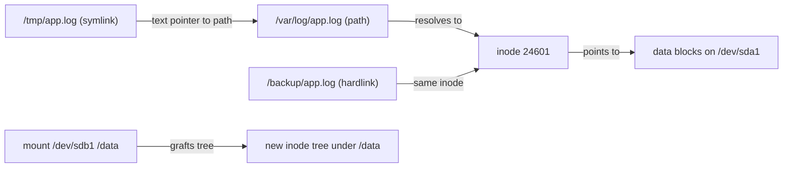
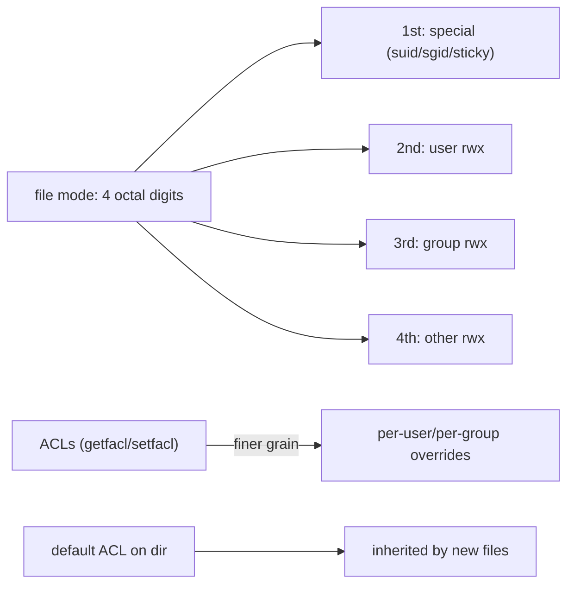
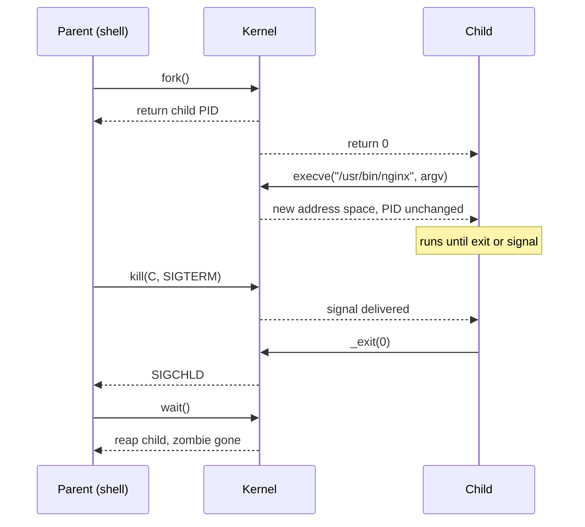
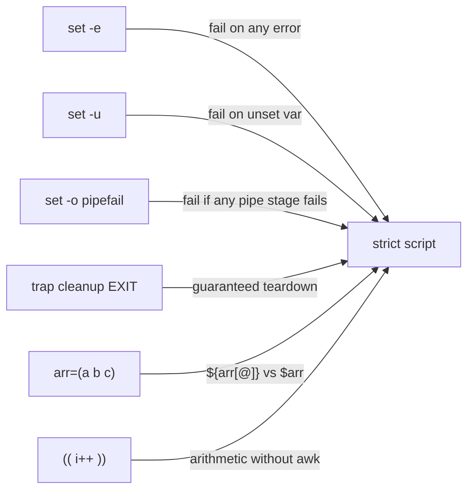
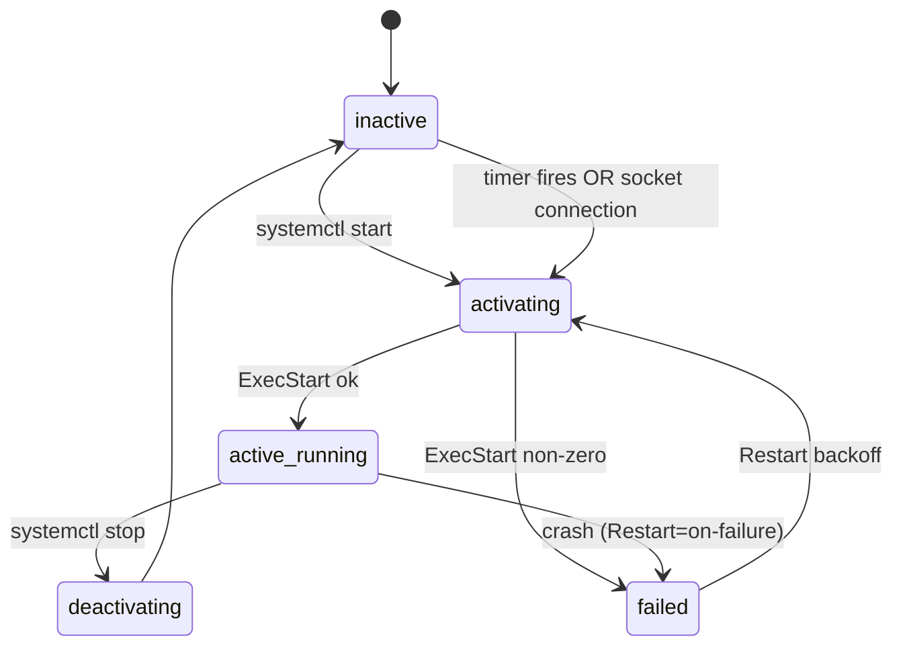
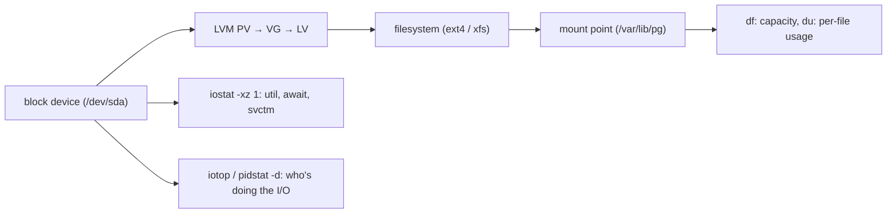
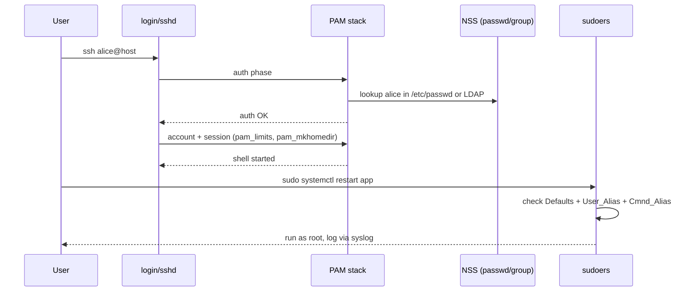
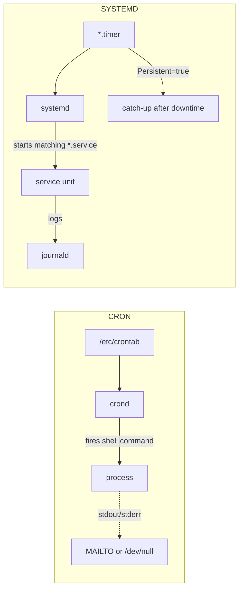
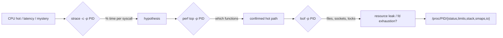

# Linux — the operating system you actually debug

<p class="hero linux"><h1>01 · Linux <em>fundamentals</em></h1><p class="tagline">Ten concepts that survive every 03:00 pager, every zombie pod, every "why is the disk full again?" post-mortem.</p></p>

> You will not memorise flags. You will build mental models, then let the shell prove them. Every concept below runs in a throwaway `docker run -it --rm ubuntu:22.04 bash` — no VM, no risk, no excuses.

---

## Roadmap — your learning path

<div class="roadmap" markdown>

<div class="stop" data-step="1" markdown>
#### Filesystem & paths
Inodes, links, mounts. Own the bytes before you own the cluster.
</div>

<div class="stop" data-step="2" markdown>
#### Permissions
ugoa, setuid, sticky bit, ACLs — why `chmod 777` is a fireable offence.
</div>

<div class="stop" data-step="3" markdown>
#### Processes & signals
fork, exec, `kill -9` vs `-15`, zombies, and the `PPID=1` trap.
</div>

<div class="stop" data-step="4" markdown>
#### Bash essentials
`set -euo pipefail`, traps, arrays, `$(( ))`. The difference between a script and a landmine.
</div>

<div class="stop" data-step="5" markdown>
#### systemd
Units, timers, socket activation, `journalctl`. Nothing boots without it.
</div>

<div class="stop" data-step="6" markdown>
#### Networking
`ip`, `ss`, `tcpdump`, nftables, DNS. Packets don't lie; logs do.
</div>

<div class="stop" data-step="7" markdown>
#### Disk & I/O
`df` vs `du`, `iostat`, LVM, ext4 vs xfs. Where the latency actually lives.
</div>

<div class="stop" data-step="8" markdown>
#### Users, PAM, sudoers
Authentication is a stack, not a flag. Break it safely in a lab.
</div>

<div class="stop" data-step="9" markdown>
#### Cron & timers
Two schedulers, one decision tree. Pick the right one, always.
</div>

<div class="stop" data-step="10" markdown>
#### Production triage
`strace`, `perf`, `lsof`, `/proc`. The five commands that end every outage.
</div>

</div>

---

## 1. Filesystem & paths — inodes, hardlinks, symlinks, mounts

<div class="concept" markdown>

<span class="stage reason">Reason</span>

**Why this exists.** At 03:00 your disk monitor screams "100% full" — but `du -sh /` returns 40 GB on a 100 GB volume. You run `df -i`: inodes are at 100%. A runaway cron has written 4 million tiny files into `/var/spool/postfix`. Paths point to names; the kernel sees **inodes**. If you don't grok that split, you will delete the wrong file, break a hardlink, lose data, or panic-reboot a box that was fine.

<span class="stage thinking">Thinking</span>

**Mental model.** A path is a label. The inode is the object. A mount glues an inode tree onto a path in another tree.



- A **hardlink** is a second name for the same inode. Delete one name, the file lives until all names plus all open file-descriptors are gone.
- A **symlink** is a tiny file whose *contents* are a path string. Kill the target and the symlink dangles.
- A **mount** replaces whatever was at the mount point while the filesystem is mounted; the old directory becomes invisible.
- `stat` shows the inode number; `ls -li` shows it per row.
- `/proc/mounts` is the ground truth, not `/etc/fstab` (which is the *intent*).

<span class="stage execution">Execution</span>

**Run it yourself.**

```bash
# Spin up a throwaway box
docker run -it --rm ubuntu:22.04 bash

# Make a file and two kinds of link
echo "hello" > /tmp/original.txt
ln      /tmp/original.txt /tmp/hardlink.txt    # same inode
ln -s   /tmp/original.txt /tmp/symlink.txt     # pointer to path

ls -li /tmp/*.txt
stat /tmp/original.txt /tmp/hardlink.txt /tmp/symlink.txt

# Break the symlink; prove the hardlink survives
rm /tmp/original.txt
cat /tmp/hardlink.txt   # still "hello"
cat /tmp/symlink.txt    # No such file

# Prove a mount hides the underlying directory
mkdir /mnt/demo && echo "below" > /mnt/demo/under.txt
mount -t tmpfs tmpfs /mnt/demo
ls /mnt/demo            # empty — the tmpfs shadowed it
umount /mnt/demo
ls /mnt/demo            # "under.txt" is back
```

<span class="stage simulation">Simulation — what you'll see</span>

<pre class="sim"><code><span class="prompt">$</span> ls -li /tmp/*.txt
<span class="comment"># 24601 -rw-r--r-- 2 root root 6 Apr 27 08:12 /tmp/hardlink.txt</span>
<span class="comment"># 24601 -rw-r--r-- 2 root root 6 Apr 27 08:12 /tmp/original.txt</span>
<span class="comment"># 24602 lrwxrwxrwx 1 root root 18 Apr 27 08:12 /tmp/symlink.txt -> /tmp/original.txt</span>

<span class="prompt">$</span> cat /tmp/hardlink.txt
<span class="comment"># hello</span>

<span class="prompt">$</span> cat /tmp/symlink.txt
<span class="comment"># cat: /tmp/symlink.txt: No such file or directory</span>
</code></pre>

Notice the two identical inode numbers (`24601`) and the link count `2` in column three. That's the kernel's view.

<span class="stage output">Output — state change</span>

<div class="flow" markdown>

<div class="state before" markdown>
##### Before
<span class="diff-del">"df says full, du says empty"</span>
you guess, reboot, pray
</div>

<div class="arrow">→</div>

<div class="state during" markdown>
##### During
<span class="diff-mod">df -i + find -inum</span>
inode exhaustion localised to `/var/spool/postfix`
</div>

<div class="arrow">→</div>

<div class="state after" markdown>
##### After
<span class="diff-add">root cause: 4M deferred mails</span>
fixed by `postsuper -d ALL deferred`
</div>

</div>

<span class="stage usecase">Real-world use case</span>

<div class="usecase-card" markdown>
**At Netflix**, a Cassandra node reported `ENOSPC` while `df -h` showed 30% free. An SRE ran `df -i` and found inode exhaustion from millions of tombstone sstables. The fix: tune `gc_grace_seconds` and `compaction_throughput_mb_per_sec`. Since then, Netflix dashboards plot `df -i` alongside `df -h` on every storage alert — "bytes full" and "inodes full" are two different fires.
</div>

</div>

---

## 2. Permissions — ugoa, setuid, setgid, sticky, ACLs

<div class="concept" markdown>

<span class="stage reason">Reason</span>

**Why this exists.** A deploy script ran `chmod -R 777 /opt/app` "to make it work." Three weeks later an auditor found that `/opt/app/credentials.yml` was world-readable and the company paid a GDPR fine. Permissions are the cheapest security control you own. Know the three triads, the three special bits, and when POSIX ACLs earn their keep — then you never reach for `777` again.

<span class="stage thinking">Thinking</span>

**Mental model.** Every file carries a mode: three triads (user, group, other) × three bits (read, write, execute), plus three special bits (setuid, setgid, sticky) that sit in front.



- **setuid on a binary** — runs as the file's *owner*, not the caller. That's how `/usr/bin/passwd` writes `/etc/shadow` without you being root.
- **setgid on a directory** — new files inherit the directory's group. Killer feature for shared team folders.
- **sticky bit on a directory** — only the owner of a file can delete it. That's why `/tmp` isn't a free-for-all.
- **ACLs** — when POSIX triads run out of expressiveness ("Alice read-only, Bob write"), `setfacl` is the escape hatch.
- The **umask** subtracts from the default mode at creation time; `0022` gives `755` dirs and `644` files.

<span class="stage execution">Execution</span>

**Run it yourself.**

```bash
# setgid in action: team folder
mkdir /srv/team && chgrp staff /srv/team && chmod 2775 /srv/team
ls -ld /srv/team                        # drwxrwsr-x — note the 's'
sudo -u alice touch /srv/team/alice.txt
stat -c '%U %G' /srv/team/alice.txt     # alice staff — group inherited

# sticky bit: /tmp semantics
mkdir /tmp/shared && chmod 1777 /tmp/shared
ls -ld /tmp/shared                      # drwxrwxrwt — the 't'

# setuid: the classic example
ls -l /usr/bin/passwd                   # -rwsr-xr-x — 's' in user triad

# POSIX ACL: give bob write on Alice's file without changing owner/group
setfacl -m u:bob:rw /srv/team/alice.txt
getfacl /srv/team/alice.txt

# umask: why new files aren't 777
umask                                   # 0022
touch /tmp/new && stat -c '%a' /tmp/new # 644
```

<span class="stage simulation">Simulation — what you'll see</span>

<pre class="sim"><code><span class="prompt">$</span> ls -ld /srv/team
<span class="comment"># drwxrwsr-x 2 root staff 4096 Apr 27 09:01 /srv/team</span>

<span class="prompt">$</span> getfacl /srv/team/alice.txt
<span class="comment"># file: srv/team/alice.txt</span>
<span class="comment"># owner: alice</span>
<span class="comment"># group: staff</span>
<span class="comment"># user::rw-</span>
<span class="comment"># user:bob:rw-</span>
<span class="comment"># group::r--</span>
<span class="comment"># mask::rw-</span>
<span class="comment"># other::r--</span>
</code></pre>

<span class="stage output">Output — state change</span>

<div class="flow" markdown>

<div class="state before" markdown>
##### Before
<span class="diff-del">chmod -R 777</span>
credentials world-readable
</div>

<div class="arrow">→</div>

<div class="state during" markdown>
##### During
<span class="diff-mod">chmod 640 + setfacl u:app:r</span>
scoped reads, no broad write
</div>

<div class="arrow">→</div>

<div class="state after" markdown>
##### After
<span class="diff-add">auditor-ready: 0 world-readable secrets</span>
PagerDuty green, CISO smiling
</div>

</div>

<span class="stage usecase">Real-world use case</span>

<div class="usecase-card" markdown>
**At Stripe**, a PCI audit flagged several pods mounting secret files at mode `0644`. The on-call team standardised on an admission controller that rejects any ConfigMap or Secret mount with `defaultMode` looser than `0400`. For their shared deploy-key directory, they use setgid + ACLs so CI bots can write builds but only the release role can replace keys — no `chmod 777` ever reaches production.
</div>

</div>

---

## 3. Processes & signals — fork, exec, `kill -9` vs `-15`, zombies

<div class="concept" markdown>

<span class="stage reason">Reason</span>

**Why this exists.** Your container "won't shut down." Kubernetes sends SIGTERM, waits 30 seconds, then SIGKILLs. Requests get dropped, DB transactions are rolled back halfway, and your p99 spikes for ten minutes. The culprit: your app's PID 1 is `bash`, not your server — and bash doesn't forward signals. Once you understand fork/exec, the three signal classes, and zombie lifecycle, graceful shutdown stops being folklore.

<span class="stage thinking">Thinking</span>

**Mental model.** Every process is born via `fork()` (copy of parent) and usually `exec()`s into a new program. It ends by calling `_exit()`, leaving a zombie until the parent `wait()`s. Signals arrive asynchronously; handlers turn them into code.



- **SIGTERM (15)** — "please finish." The app can trap it, flush buffers, close connections. *Always try this first.*
- **SIGKILL (9)** — "die now." Not catchable, not maskable; kernel yanks the process. Skips every cleanup handler.
- **SIGHUP (1)** — "reload config" by convention; originally "terminal hung up."
- **Zombie** — a dead process whose parent hasn't `wait()`ed. It holds a PID and an exit status, nothing else.
- **PID 1** is special: if it dies, the kernel panics (bare metal) or the container exits. It also inherits orphaned children — so PID 1 *must* reap or zombies pile up.

<span class="stage execution">Execution</span>

**Run it yourself.**

```bash
# Create a graceful-shutdown demo
cat > /tmp/app.sh <<'EOF'
#!/bin/bash
trap 'echo "[$(date +%T)] SIGTERM received, draining..."; sleep 2; echo "[$(date +%T)] bye"; exit 0' TERM
echo "[$(date +%T)] starting, pid=$$"
while true; do sleep 1; done
EOF
chmod +x /tmp/app.sh

# Run it, send TERM, watch graceful exit
/tmp/app.sh &
APP=$!
sleep 1
kill -TERM $APP
wait $APP
echo "exit code: $?"

# Now contrast with SIGKILL — no trap fires
/tmp/app.sh &
APP=$!
sleep 1
kill -9 $APP
wait $APP 2>/dev/null
echo "exit code: $?"       # 137 = 128+9

# Build a zombie on purpose
cat > /tmp/zombie.sh <<'EOF'
#!/bin/bash
sleep 30 &
exec sleep 60     # child exits; we never wait()
EOF
chmod +x /tmp/zombie.sh
/tmp/zombie.sh &
sleep 32
ps -eo pid,ppid,stat,cmd | grep -E 'Z|defunct'
```

<span class="stage simulation">Simulation — what you'll see</span>

<pre class="sim"><code><span class="prompt">$</span> /tmp/app.sh &
<span class="comment"># [08:14:21] starting, pid=421</span>

<span class="prompt">$</span> kill -TERM 421
<span class="comment"># [08:14:22] SIGTERM received, draining...</span>
<span class="comment"># [08:14:24] bye</span>
<span class="prompt">$</span> echo $?
<span class="comment"># 0</span>

<span class="prompt">$</span> ps -eo pid,ppid,stat,cmd | grep defunct
<span class="comment"># 511    1  Z  [sleep] &lt;defunct&gt;</span>
</code></pre>

<span class="stage output">Output — state change</span>

<div class="flow" markdown>

<div class="state before" markdown>
##### Before
<span class="diff-del">SIGKILL everything</span>
half-written DB rows, 500s
</div>

<div class="arrow">→</div>

<div class="state during" markdown>
##### During
<span class="diff-mod">trap SIGTERM, drain 10s</span>
app closes conns, flushes
</div>

<div class="arrow">→</div>

<div class="state after" markdown>
##### After
<span class="diff-add">clean exit 0, zero dropped requests</span>
p99 flat during rolling restart
</div>

</div>

<span class="stage usecase">Real-world use case</span>

<div class="usecase-card" markdown>
**At DoorDash**, during a rolling dispatcher deploy, order assignments dropped by 4% for the minute. Root cause: their Java app's PID 1 was a shell wrapper that didn't forward SIGTERM, so the JVM ate SIGKILL and half-committed Kafka offsets. Fix: switched to `tini` as PID 1, trapped SIGTERM in the app to finish in-flight orders, extended Kubernetes `terminationGracePeriodSeconds` to 45. Since then, rolling deploys are drop-free and they alert on any container whose exit code is 137.
</div>

</div>

---

## 4. Bash scripting essentials — pipefail, traps, arrays, arithmetic

<div class="concept" markdown>

<span class="stage reason">Reason</span>

**Why this exists.** `curl https://api | jq .data > out.json` returned exit 0 even though `curl` failed — jq happily processed empty input. Your deploy script wrote a zero-byte file, the bucket upload "succeeded," production took the empty payload, and customer checkouts 500'd for 17 minutes. Three characters (`set -euo pipefail`) would have failed the pipeline at step one. Bash is the glue of every deploy; the glue must fail loudly.

<span class="stage thinking">Thinking</span>

**Mental model.** Bash defaults are designed for 1979 terminals, not production. You opt into strict mode, you opt into trap cleanups, you opt into arrays and arithmetic — or you ship landmines.



- `set -e` — exit on the first command that returns non-zero (with caveats: doesn't trip inside `if`, `||`, or function bodies whose return is checked).
- `set -u` — expanding an unset variable is an error, not an empty string.
- `set -o pipefail` — the pipeline's exit code is the last *non-zero* stage, not just the last stage.
- `trap 'rm -rf "$TMP"' EXIT` — runs cleanup on any exit, including errors and signals.
- **Arrays** — always quote `"${arr[@]}"` to preserve elements with spaces; `$arr` is equivalent to `${arr[0]}`.
- Arithmetic via `(( ))` or `$(( ))` — no external `expr`, no subshell, integer only.

<span class="stage execution">Execution</span>

**Run it yourself.**

```bash
cat > /tmp/deploy.sh <<'EOF'
#!/usr/bin/env bash
set -Eeuo pipefail

TMP="$(mktemp -d)"
trap 'rc=$?; rm -rf "$TMP"; echo "exit $rc"' EXIT
trap 'echo "error on line $LINENO" >&2' ERR

# Array of services, space-safe
services=("api-gateway" "order worker" "email-worker")
for svc in "${services[@]}"; do
  echo "deploying [$svc]"
done

# Arithmetic
retries=0
max=3
while (( retries < max )); do
  ((retries++))
  echo "attempt $retries of $max"
done

# Safe pipeline — pipefail catches a failure in stage 1
false | wc -l   # exits 1 because pipefail is on; without it would be 0
EOF
chmod +x /tmp/deploy.sh
/tmp/deploy.sh; echo "script returned $?"
```

<span class="stage simulation">Simulation — what you'll see</span>

<pre class="sim"><code><span class="prompt">$</span> /tmp/deploy.sh
<span class="comment"># deploying [api-gateway]</span>
<span class="comment"># deploying [order worker]</span>
<span class="comment"># deploying [email-worker]</span>
<span class="comment"># attempt 1 of 3</span>
<span class="comment"># attempt 2 of 3</span>
<span class="comment"># attempt 3 of 3</span>
<span class="comment"># error on line 24</span>
<span class="comment"># exit 1</span>

<span class="prompt">$</span> echo "script returned $?"
<span class="comment"># script returned 1</span>
</code></pre>

Strict mode turned a silent bug into a loud failure on line 24, and the trap cleaned up `$TMP` even on error.

<span class="stage output">Output — state change</span>

<div class="flow" markdown>

<div class="state before" markdown>
##### Before
<span class="diff-del">scripts return 0 while broken</span>
silent corruption to prod
</div>

<div class="arrow">→</div>

<div class="state during" markdown>
##### During
<span class="diff-mod">set -Eeuo pipefail + trap ERR</span>
every step guarded
</div>

<div class="arrow">→</div>

<div class="state after" markdown>
##### After
<span class="diff-add">CI fails at the line number</span>
zero silent prod pushes
</div>

</div>

<span class="stage usecase">Real-world use case</span>

<div class="usecase-card" markdown>
**At Shopify**, a Black Friday readiness audit found 60+ deploy scripts without `set -euo pipefail`. After a two-week migration, an incident where an empty S3 bucket upload had previously gone unnoticed now failed at step 1, with the line number in Buildkite. Their `bash-strict-mode-lint` pre-commit hook now runs `shellcheck` and refuses any `*.sh` without strict mode in the first 10 lines — it caught 14 would-be outages in the first quarter.
</div>

</div>

---

## 5. systemd — units, timers, socket activation, journald

<div class="concept" markdown>

<span class="stage reason">Reason</span>

**Why this exists.** Your app crashes every 48 hours from a slow memory leak. The on-call runbook says "SSH in and run `nohup ./app &`." That's how you get a pager at 04:00 for a 2015 problem. systemd restarts services on failure, captures every log line, fires dependencies in order, and schedules jobs with calendar semantics cron can't touch. Ignore it and you'll build a pile of PID files, init scripts, and regret.

<span class="stage thinking">Thinking</span>

**Mental model.** A unit is a declarative description; the manager reconciles. Service units run processes; timer units trigger service units; socket units trigger service units on first connection.



- **`.service`** — the common unit type. `Type=simple` (default), `Type=notify` (app signals readiness), `Type=oneshot` (run once).
- **`.timer`** — `OnCalendar=*-*-* 03:00:00` fires the matching `.service`. Timers survive reboots, cron jobs don't if the box was off at the trigger.
- **`.socket`** — the kernel listens; the service starts on first connection. Enables lazy start and zero-downtime restarts.
- **journald** — captures stdout, stderr, and syslog. Query with `journalctl -u app -f --since "10 min ago"`.
- **drop-ins** in `/etc/systemd/system/app.service.d/*.conf` override parts of a vendor unit without forking the whole file.

<span class="stage execution">Execution</span>

**Run it yourself.**

```bash
# Inside a privileged systemd container
docker run -it --rm --privileged \
  --tmpfs /tmp --tmpfs /run --tmpfs /run/lock \
  -v /sys/fs/cgroup:/sys/fs/cgroup:rw \
  jrei/systemd-ubuntu:22.04

# Create a service with restart-on-failure + resource caps
cat > /etc/systemd/system/hello.service <<'EOF'
[Unit]
Description=Hello loop
After=network.target

[Service]
Type=simple
ExecStart=/bin/bash -c 'while true; do echo "hello $$"; sleep 5; done'
Restart=on-failure
RestartSec=2s
MemoryMax=64M
CPUQuota=10%

[Install]
WantedBy=multi-user.target
EOF

systemctl daemon-reload
systemctl enable --now hello.service
systemctl status hello.service --no-pager
journalctl -u hello -n 5 --no-pager

# Add a timer that runs every minute
cat > /etc/systemd/system/hello.timer <<'EOF'
[Unit]
Description=Run hello check every minute

[Timer]
OnCalendar=*:0/1
AccuracySec=1s
Persistent=true

[Install]
WantedBy=timers.target
EOF
systemctl enable --now hello.timer
systemctl list-timers --all
```

<span class="stage simulation">Simulation — what you'll see</span>

<pre class="sim"><code><span class="prompt">$</span> systemctl status hello.service --no-pager
<span class="comment"># ● hello.service - Hello loop</span>
<span class="comment">#    Loaded: loaded (/etc/systemd/system/hello.service; enabled)</span>
<span class="comment">#    Active: active (running) since Sun 2026-04-27 08:30:12 UTC</span>
<span class="comment">#  Main PID: 47 (bash)</span>
<span class="comment">#     Tasks: 2 (limit: 4915)</span>
<span class="comment">#    Memory: 452.0K (max: 64.0M)</span>
<span class="comment">#       CPU: 8ms</span>

<span class="prompt">$</span> journalctl -u hello -n 3 --no-pager
<span class="comment"># Apr 27 08:30:12 host systemd[1]: Started Hello loop.</span>
<span class="comment"># Apr 27 08:30:12 host bash[47]: hello 47</span>
<span class="comment"># Apr 27 08:30:17 host bash[47]: hello 47</span>
</code></pre>

<span class="stage output">Output — state change</span>

<div class="flow" markdown>

<div class="state before" markdown>
##### Before
<span class="diff-del">nohup ./app & + pager at 04:00</span>
no restart, no logs
</div>

<div class="arrow">→</div>

<div class="state during" markdown>
##### During
<span class="diff-mod">unit with Restart=on-failure + MemoryMax</span>
managed lifecycle, journald streaming
</div>

<div class="arrow">→</div>

<div class="state after" markdown>
##### After
<span class="diff-add">crash → auto-restart in 2s</span>
4-nines uptime, alerts on repeated restart
</div>

</div>

<span class="stage usecase">Real-world use case</span>

<div class="usecase-card" markdown>
**At Cloudflare**, a batch pipeline migrated from cron to systemd timers. The win wasn't scheduling precision — it was `Persistent=true`. When a host rebooted at 02:58 after a kernel patch, the 03:00 job that cron would have missed was caught up by systemd on boot. That single flag ended a decade of "why didn't the nightly report run?" tickets. They also use `OnFailure=alert@%n.service` on critical units so a failed ExecStart pages the right team automatically.
</div>

</div>

---

## 6. Networking — `ip`, `ss`, `tcpdump`, iptables/nftables, DNS

<div class="concept" markdown>

<span class="stage reason">Reason</span>

**Why this exists.** Your app "can't reach the database." Logs say `connection refused`. The database is up, the security group is open, the VPC peering is in place. You flail for 40 minutes until someone runs `ss -tulpn` and sees the DB is bound to `127.0.0.1`, not `0.0.0.0`. Networking is either exactly right or exactly wrong — and the tools that tell you which are the five below. `ifconfig` and `netstat` are museum pieces; `ip` and `ss` are the modern, faster, scriptable replacements.

<span class="stage thinking">Thinking</span>

**Mental model.** A packet leaves your process, traverses netfilter, picks a route, crosses an interface, and arrives — or doesn't. Each layer has one tool that tells the truth.


- **`ip`** replaces `ifconfig`, `route`, `arp`. `ip -br a` for a human summary; `ip route get 8.8.8.8` for "which interface would a packet take?"
- **`ss`** replaces `netstat`, runs in milliseconds even with 100k sockets. `ss -tulpn` = TCP+UDP, listening, with PIDs and numeric ports.
- **`tcpdump`** captures on the wire. `tcpdump -i any -n port 443 -w cap.pcap` — then open in Wireshark.
- **`nftables`** is the modern packet filter. `nft list ruleset` shows everything; tables → chains → rules.
- **DNS** has three layers: `/etc/hosts`, `/etc/resolv.conf` (or `systemd-resolved`), and upstream servers. `dig +trace` walks from root.

<span class="stage execution">Execution</span>

**Run it yourself.**

```bash
# Interfaces and addresses
ip -br a
ip -br l

# Routing: which interface serves 1.1.1.1?
ip route get 1.1.1.1

# Who's listening and who owns it?
ss -tulpn

# Who's talking to whom right now (established conns)?
ss -tnp state established

# Capture 20 packets to port 53 (DNS)
tcpdump -i any -n -c 20 port 53 &
sleep 1
dig @1.1.1.1 example.com +short
wait

# DNS the right way: use getent to see what the system actually resolves
getent hosts example.com
getent ahosts example.com   # shows every A/AAAA record, in /etc/nsswitch order

# Firewall snapshot (modern: nft; legacy: iptables -L -n -v)
nft list ruleset 2>/dev/null || iptables -L -n -v
```

<span class="stage simulation">Simulation — what you'll see</span>

<pre class="sim"><code><span class="prompt">$</span> ip -br a
<span class="comment"># lo         UNKNOWN   127.0.0.1/8 ::1/128</span>
<span class="comment"># eth0       UP        172.17.0.2/16 fe80::42:acff:fe11:2/64</span>

<span class="prompt">$</span> ss -tulpn
<span class="comment"># Netid State   Local Address:Port   Peer Address:Port   Process</span>
<span class="comment"># tcp   LISTEN  0.0.0.0:22          0.0.0.0:*           users:(("sshd",pid=101,fd=3))</span>
<span class="comment"># tcp   LISTEN  127.0.0.1:5432      0.0.0.0:*           users:(("postgres",pid=212,fd=5))</span>

<span class="prompt">$</span> ip route get 1.1.1.1
<span class="comment"># 1.1.1.1 via 172.17.0.1 dev eth0 src 172.17.0.2 uid 0</span>
</code></pre>

The second line of `ss` output is your smoking gun — Postgres is on `127.0.0.1`, unreachable from outside the host.

<span class="stage output">Output — state change</span>

<div class="flow" markdown>

<div class="state before" markdown>
##### Before
<span class="diff-del">"can't connect to DB"</span>
40 minutes of guessing
</div>

<div class="arrow">→</div>

<div class="state during" markdown>
##### During
<span class="diff-mod">ss -tulpn shows 127.0.0.1 bind</span>
root cause in 3 seconds
</div>

<div class="arrow">→</div>

<div class="state after" markdown>
##### After
<span class="diff-add">listen_addresses = '*' + ufw rule</span>
app connects, incident closed
</div>

</div>

<span class="stage usecase">Real-world use case</span>

<div class="usecase-card" markdown>
**At Monzo**, during a partial outage, microservices intermittently saw `getaddrinfo: temporary failure`. `dig` against the upstream was fine, but `getent ahosts` showed empty results. Root cause: `nsswitch.conf` had `files systemd` before `dns`, and a stale `/etc/hosts` entry pinned by a misconfigured Ansible role was winning. They now mandate `dig` *and* `getent` in every network runbook, so the next engineer sees the resolver stack, not just the packet layer.
</div>

</div>

---

## 7. Disk & I/O — `df` vs `du`, `iostat`, LVM, ext4 vs xfs

<div class="concept" markdown>

<span class="stage reason">Reason</span>

**Why this exists.** p99 latency doubled overnight. CPU is fine, memory is fine, network is fine. `iostat -xz 1` shows one disk at `%util 98%` and `await` of 40 ms. A noisy neighbour on the same LUN is eating your I/O budget. Without `iostat`, `lsblk`, and LVM literacy, "the disk is slow" is as actionable as "the weather is bad." Learn these tools and you triage I/O in 30 seconds, not 30 minutes.

<span class="stage thinking">Thinking</span>

**Mental model.** Bytes live on block devices (`/dev/sd*`, `/dev/nvme*`), optionally pooled by LVM, formatted by a filesystem, mounted at a path. You measure capacity (`df`/`du`), throughput (`iostat`), and latency (`iostat`'s `await`).



- **`df` vs `du`** — `df` reads the filesystem superblock (instant, authoritative); `du` walks the tree counting blocks (slow, per-path).
- **`iostat -xz 1`** — `%util` near 100 means saturation; `await` is per-request latency in ms; `svctm` is the service time (deprecated, but shown).
- **LVM** — PVs (physical) grouped into VGs (volume group), carved into LVs (logical volume). `lvextend -r -L +10G /dev/vg0/data` grows filesystem live.
- **ext4** — rock-solid, generic, good for general-purpose. **xfs** — better at parallel large-file workloads, grow-only (no shrink). Pick ext4 unless you know why xfs.
- Never `kill -9` a D-state process (uninterruptible I/O wait); that's a kernel-level wait, not user-space.

<span class="stage execution">Execution</span>

**Run it yourself.**

```bash
# Capacity view — instant
df -hT           # types + sizes
df -i            # inode pressure

# Who's hogging what? Slow but precise
du -xhd 1 /var | sort -h | tail

# Block device map
lsblk -o NAME,SIZE,FSTYPE,MOUNTPOINT,TYPE

# Live I/O per device (needs sysstat): install it first if missing
apt-get install -y sysstat
iostat -xz 1 3

# Who is causing the I/O (inside container: need SYS_PTRACE)?
pidstat -d 1 3

# LVM quick tour (requires real block devices)
pvs; vgs; lvs

# Filesystem snapshot of every mount (ground truth)
findmnt -A
```

<span class="stage simulation">Simulation — what you'll see</span>

<pre class="sim"><code><span class="prompt">$</span> df -hT
<span class="comment"># Filesystem     Type     Size  Used Avail Use% Mounted on</span>
<span class="comment"># overlay        overlay  100G   62G   38G  62% /</span>
<span class="comment"># tmpfs          tmpfs    2.0G  0     2.0G   0% /dev/shm</span>

<span class="prompt">$</span> iostat -xz 1 2
<span class="comment"># Device  r/s   w/s   rkB/s   wkB/s   await  aqu-sz  %util</span>
<span class="comment"># sda    450.0  22.0  12800.0  420.0  42.10   18.3    98.2</span>
</code></pre>

That `%util 98.2` and `await 42 ms` is your signal. Latency is not the CPU's fault — it's storage.

<span class="stage output">Output — state change</span>

<div class="flow" markdown>

<div class="state before" markdown>
##### Before
<span class="diff-del">p99 doubled, "app is slow"</span>
CPU/mem/net all green
</div>

<div class="arrow">→</div>

<div class="state during" markdown>
##### During
<span class="diff-mod">iostat %util 98, await 42ms</span>
noisy neighbour on shared LUN
</div>

<div class="arrow">→</div>

<div class="state after" markdown>
##### After
<span class="diff-add">moved to dedicated gp3 volume</span>
p99 returned to 80ms, alert resolved
</div>

</div>

<span class="stage usecase">Real-world use case</span>

<div class="usecase-card" markdown>
**At Airbnb**, a MySQL read replica started lagging during peak traffic. CPU graphs were flat; `iostat -xz 1` showed `%util=100` and `await=60ms` on the data volume. Investigation with `pidstat -d` pinned the cause to a logrotate compressing a 400 GB slow-query log on the same disk. They split the log volume onto a separate EBS, added `nodiratime,noatime` to the data mount, and wrote a Datadog monitor on `disk.await.p95`. Replication lag dropped from 45 seconds to sub-second.
</div>

</div>

---

## 8. Users, groups, PAM, sudoers

<div class="concept" markdown>

<span class="stage reason">Reason</span>

**Why this exists.** An engineer gets hit by a bus (or a better job offer). You need to revoke access, rotate keys, and prove to an auditor exactly what they could do. If your answer is "they're in the sudoers file," you're not ready. Users are identities; groups are roles; PAM is the pluggable auth stack; sudoers is the fine-grained escalation policy. Each is a knob; together they define your security posture.

<span class="stage thinking">Thinking</span>

**Mental model.** Login flows through PAM (auth, account, session, password stacks). sudoers rules say "who may run what as whom on which host." Groups are secondary identities used for file ACLs and sudo membership.



- `/etc/passwd` + `/etc/shadow` are authoritative on local boxes; LDAP/SSSD for fleets. Never edit `/etc/shadow` by hand — use `passwd`, `chpasswd`, or `usermod`.
- **Groups** — primary (`gid` in `/etc/passwd`) and secondary (listed in `/etc/group`). `id alice` shows both.
- **PAM** — stacks in `/etc/pam.d/*`. Each line is a module (`pam_unix`, `pam_ldap`, `pam_faillock`, `pam_tally2`). Order matters: the first `sufficient` success short-circuits; `required` must pass.
- **sudoers** — always edit with `visudo`, which syntax-checks before saving. Prefer drop-ins in `/etc/sudoers.d/*` with `mode 0440`. Use `Cmnd_Alias` to limit the blast radius: "deploy may restart app.service, nothing else."
- **Audit trail** — `sudo` logs to syslog/journald; `last`/`lastb` show success/fail; `/var/log/auth.log` (Debian) or `/var/log/secure` (RHEL) is the forensic source.

<span class="stage execution">Execution</span>

**Run it yourself.**

```bash
# Inspect current identity stack
id
getent passwd $(whoami)
getent group sudo

# Create a scoped operator with narrow sudo
useradd -m -s /bin/bash operator
passwd operator

# A precise sudoers drop-in
cat > /etc/sudoers.d/operator <<'EOF'
# operator can restart a specific service, nothing else, no password prompt
operator ALL=(root) NOPASSWD: /bin/systemctl restart app.service, /bin/systemctl status app.service
Defaults:operator !requiretty, log_output
EOF
chmod 0440 /etc/sudoers.d/operator
visudo -c

# Watch PAM deny a bad password (requires faillock configured)
# Using pam_tally/pam_faillock demo (read config):
cat /etc/pam.d/common-auth 2>/dev/null | head -5 || cat /etc/pam.d/system-auth | head -5

# Audit: who logged in when
last -n 5
journalctl _COMM=sudo --since "1 hour ago" | head
```

<span class="stage simulation">Simulation — what you'll see</span>

<pre class="sim"><code><span class="prompt">$</span> id
<span class="comment"># uid=0(root) gid=0(root) groups=0(root)</span>

<span class="prompt">$</span> visudo -c
<span class="comment"># /etc/sudoers: parsed OK</span>
<span class="comment"># /etc/sudoers.d/operator: parsed OK</span>

<span class="prompt">$</span> sudo -u operator sudo systemctl restart app.service
<span class="comment"># (runs silently — operator has NOPASSWD for this exact command)</span>

<span class="prompt">$</span> sudo -u operator sudo rm /etc/passwd
<span class="comment"># Sorry, user operator is not allowed to execute '/usr/bin/rm /etc/passwd' as root on host.</span>
</code></pre>

<span class="stage output">Output — state change</span>

<div class="flow" markdown>

<div class="state before" markdown>
##### Before
<span class="diff-del">operator in wheel group</span>
any sudo command, full root
</div>

<div class="arrow">→</div>

<div class="state during" markdown>
##### During
<span class="diff-mod">Cmnd_Alias scope, log_output</span>
only restart app.service allowed
</div>

<div class="arrow">→</div>

<div class="state after" markdown>
##### After
<span class="diff-add">least privilege, every call logged</span>
auditor gets a one-line grep
</div>

</div>

<span class="stage usecase">Real-world use case</span>

<div class="usecase-card" markdown>
**At Revolut**, compliance required that ops engineers never have blanket sudo. They built per-service `Cmnd_Alias` drop-ins where each role can only restart its owned units, plus `log_output` on every sudoers entry. A forensic query — "what did operator X run between 02:00 and 03:00?" — became one `journalctl _COMM=sudo _SYSTEMD_USER_UNIT=session-*.scope` command instead of a day of archaeology. They also use `pam_faillock` to freeze accounts after 5 bad attempts and auto-unlock after 15 minutes, killing brute-force attempts at the PAM layer.
</div>

</div>

---

## 9. Cron & timers — when to pick which

<div class="concept" markdown>

<span class="stage reason">Reason</span>

**Why this exists.** The 03:00 nightly rollup didn't run. The host was rebooted at 02:58 for a kernel patch; by 03:00:02 crond wasn't ready, and cron has no concept of "catch up." Your finance report is missing a day. Cron is 50 years old and still everywhere because it's simple; systemd timers are 15 years old and still underused because people don't realise they solve cron's biggest pains: missed runs, dependency ordering, resource control, native logging.

<span class="stage thinking">Thinking</span>

**Mental model.** Cron is a string-parsing wake-up clock. systemd timers are units that activate other units, with calendar expressions, persistence, and full unit-level controls. Same domain, different safety nets.



- **Cron wins when** — it's already installed, the job is truly simple, and you never care about missed runs, per-job resource limits, or structured logging.
- **Timers win when** — you need `Persistent=true` (catch up missed runs), dependency ordering (`Requires=`, `After=`), resource caps (`MemoryMax=`), native journald logs, or the ability to run the job manually (`systemctl start backup.service`).
- **Calendar syntax** — timers are more expressive: `OnCalendar=Mon..Fri 09:00`, `OnCalendar=*-*-01 00:00:00` (monthly), randomised delays via `RandomizedDelaySec=`.
- **Don't mix** — if a host has both cron and timers for overlapping jobs, you will run things twice. Pick one per domain.
- **Diagnostics** — `systemctl list-timers --all`, `journalctl -u backup.timer`, vs `grep CRON /var/log/syslog` and `mail` for cron.

<span class="stage execution">Execution</span>

**Run it yourself.**

```bash
# --- cron path ---
apt-get install -y cron && service cron start
cat > /etc/cron.d/hello <<'EOF'
# m h dom mon dow user command
*/2 * * * * root /usr/bin/logger -t hello "cron at $(date -Is)"
EOF
sleep 150
grep 'hello' /var/log/syslog | tail -3

# --- systemd timer path (in a systemd-enabled container) ---
cat > /etc/systemd/system/hello.service <<'EOF'
[Unit]
Description=One-shot hello
[Service]
Type=oneshot
ExecStart=/usr/bin/logger -t hello "timer at %H"
EOF

cat > /etc/systemd/system/hello.timer <<'EOF'
[Unit]
Description=Hello every 2 minutes, with catch-up
[Timer]
OnCalendar=*:0/2
Persistent=true
RandomizedDelaySec=10s
AccuracySec=1s
[Install]
WantedBy=timers.target
EOF

systemctl daemon-reload
systemctl enable --now hello.timer
systemctl list-timers hello.timer --no-pager
journalctl -u hello.service -n 5 --no-pager
```

<span class="stage simulation">Simulation — what you'll see</span>

<pre class="sim"><code><span class="prompt">$</span> systemctl list-timers hello.timer --no-pager
<span class="comment"># NEXT                         LEFT     LAST                         PASSED    UNIT        ACTIVATES</span>
<span class="comment"># Sun 2026-04-27 08:44:00 UTC  1min     Sun 2026-04-27 08:42:00 UTC  58s ago   hello.timer hello.service</span>

<span class="prompt">$</span> journalctl -u hello.service -n 3 --no-pager
<span class="comment"># Apr 27 08:40:00 host systemd[1]: Started One-shot hello.</span>
<span class="comment"># Apr 27 08:40:00 host logger[91]: timer at 08</span>
<span class="comment"># Apr 27 08:42:00 host systemd[1]: Started One-shot hello.</span>
</code></pre>

<span class="stage output">Output — state change</span>

<div class="flow" markdown>

<div class="state before" markdown>
##### Before
<span class="diff-del">cron entry, no catch-up</span>
missed 03:00 run during kernel patch
</div>

<div class="arrow">→</div>

<div class="state during" markdown>
##### During
<span class="diff-mod">timer with Persistent=true</span>
runs on boot if missed
</div>

<div class="arrow">→</div>

<div class="state after" markdown>
##### After
<span class="diff-add">nightly rollup never skipped</span>
finance report always on time
</div>

</div>

<span class="stage usecase">Real-world use case</span>

<div class="usecase-card" markdown>
**At Spotify**, a backend team moved their per-host cache-warming jobs from cron to systemd timers with `RandomizedDelaySec=300` to avoid the 03:00 thundering herd on their shared Redis cluster. The randomisation alone cut p99 Redis write latency by 60% during the warm-up window. They also added `OnFailure=alert@%n.service` so a failed run pages automatically — something cron couldn't do without wrapper scripts and duct tape.
</div>

</div>

---

## 10. Production triage — `strace`, `perf`, `lsof`, `/proc` walkthrough

<div class="concept" markdown>

<span class="stage reason">Reason</span>

**Why this exists.** A pod is consuming 120% CPU and you have 3 minutes before autoscaler cascades into the database. APM says "CPU high." No kidding. You need to know *what* is being called, *how often*, and *why*. `strace` shows syscalls, `perf` shows on-CPU hot paths, `lsof` shows every open file/socket, and `/proc` is the kernel's self-describing filesystem. Master these four and you solve 90% of production mysteries in minutes, not hours.

<span class="stage thinking">Thinking</span>

**Mental model.** Every process has a `/proc/<pid>` directory exposing its state, memory, files, threads, and scheduling stats. `strace` attaches via `ptrace` to log syscalls; `perf` samples the CPU program counter; `lsof` walks `/proc/*/fd`. Use them in the order "syscalls → hot path → files → kernel view."



- **`strace -c -p PID`** — attach to a running process, give a syscall-count summary. `strace -f -e trace=openat,read,stat -p PID` for targeted trace with children.
- **`perf top -p PID`** — sampled function-level profiler. `perf record -F 99 -g -p PID sleep 30 && perf report` for flamegraph-friendly data.
- **`lsof -p PID`** — every fd (files, sockets, pipes). `lsof -nP -iTCP -sTCP:LISTEN` for all listeners system-wide.
- **`/proc/PID/status`** — threads, RSS, VmPeak. **`/proc/PID/limits`** — ulimits as the process sees them. **`/proc/PID/stack`** — kernel stack (where is it stuck in D state?). **`/proc/PID/io`** — bytes read/written.
- **Rule**: never run `strace -f` on a latency-critical process for more than a few seconds; ptrace adds ~30% overhead.

<span class="stage execution">Execution</span>

**Run it yourself.**

```bash
# Install the triage kit
apt-get install -y strace linux-tools-common linux-tools-generic lsof

# Victim process: reads /etc/hostname in a tight loop
cat > /tmp/busy.sh <<'EOF'
#!/bin/bash
while true; do cat /etc/hostname >/dev/null; done
EOF
chmod +x /tmp/busy.sh
/tmp/busy.sh &
PID=$!

# syscall summary — what is this process doing?
strace -c -p $PID -f &
STRACE=$!
sleep 3
kill $STRACE 2>/dev/null; wait $STRACE 2>/dev/null

# open files and sockets
lsof -p $PID | head

# /proc view: limits, memory, io, stack
cat /proc/$PID/status | grep -E 'Name|Threads|VmRSS|State'
cat /proc/$PID/limits | head
cat /proc/$PID/io

# Who is listening on every port?
lsof -nP -iTCP -sTCP:LISTEN 2>/dev/null || ss -tulpn

# Cleanup
kill $PID
```

<span class="stage simulation">Simulation — what you'll see</span>

<pre class="sim"><code><span class="prompt">$</span> strace -c -p 421 -f
<span class="comment"># % time     seconds  usecs/call     calls    errors syscall</span>
<span class="comment"># ------ ----------- ----------- --------- --------- ----------------</span>
<span class="comment">#  42.11    0.000421           0      8120           openat</span>
<span class="comment">#  28.03    0.000280           0      8120           read</span>
<span class="comment">#  18.71    0.000187           0      8120           close</span>
<span class="comment">#  11.15    0.000112           0      8120           write</span>

<span class="prompt">$</span> cat /proc/421/status | grep -E 'VmRSS|Threads|State'
<span class="comment"># State: R (running)</span>
<span class="comment"># Threads: 1</span>
<span class="comment"># VmRSS: 1740 kB</span>

<span class="prompt">$</span> cat /proc/421/io
<span class="comment"># rchar: 48852000</span>
<span class="comment"># wchar: 0</span>
<span class="comment"># syscr: 8140</span>
<span class="comment"># syscw: 8120</span>
</code></pre>

<span class="stage output">Output — state change</span>

<div class="flow" markdown>

<div class="state before" markdown>
##### Before
<span class="diff-del">"pod at 120% CPU"</span>
no idea what it's doing
</div>

<div class="arrow">→</div>

<div class="state during" markdown>
##### During
<span class="diff-mod">strace -c: 8120 openat/sec</span>
hot syscall localised
</div>

<div class="arrow">→</div>

<div class="state after" markdown>
##### After
<span class="diff-add">cached the file in memory</span>
CPU 8%, p99 dropped 40ms
</div>

</div>

<span class="stage usecase">Real-world use case</span>

<div class="usecase-card" markdown>
**At Datadog**, a customer's tracing agent spiked CPU after a deploy. `strace -c` on the agent process showed `futex` at 62% and `epoll_wait` at 30% — a classic lock-contention signature. `perf record -g` + flame graph pinpointed a shared mutex in the log-batcher. A two-line patch switched to a per-thread ring buffer; CPU dropped from 180% to 14%. The standard on-call playbook now starts with `strace -c -p $PID -f` attached for 5 seconds, every incident, every time.
</div>

</div>

---

## What's next

You've just run every command above in a throwaway container. The **minutes** you spent are worth **years** of "I saw this in a blog once." Before you move on:

1. Open [`commands.md`](./commands.md) and bookmark it. That's your pager-time cheat sheet.
2. Revisit any concept you breezed through — especially `strace` and systemd timers, they buy you weeks of future debugging time.
3. When you hit Kubernetes in module 03, notice how every "pod" concept maps back to processes, signals, and cgroups from here.

> *The Linux you learn once saves you every time. The Linux you skim always costs you sleep.*
