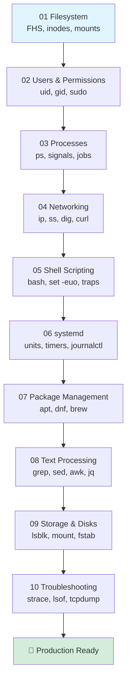

# 🐧 Linux Fundamentals for DevOps

> Zero to production-ready Linux skills via hands-on labs. Every concept ships with copy-pasteable commands you can run inside a throwaway Docker container.

## 🗺️ Learning Roadmap



## 📚 Index

| # | Topic | What you learn | Time | Difficulty |
|---|-------|----------------|------|------------|
| 01 | [Filesystem](./01-filesystem/README.md) | FHS layout, paths, inodes, mounts | 45 min | ⭐ |
| 02 | [Users & Permissions](./02-users-permissions/README.md) | uid/gid, chmod, chown, sudo | 60 min | ⭐⭐ |
| 03 | [Processes](./03-processes/README.md) | ps, signals, jobs, nice, nohup | 60 min | ⭐⭐ |
| 04 | [Networking](./04-networking/README.md) | ip, ss, dig, curl, iptables | 90 min | ⭐⭐⭐ |
| 05 | [Shell Scripting](./05-shell-scripting/README.md) | bash, conditionals, loops, traps | 120 min | ⭐⭐⭐ |
| 06 | [systemd](./06-systemd/README.md) | units, services, timers, journalctl | 90 min | ⭐⭐⭐ |
| 07 | [Package Management](./07-package-management/README.md) | apt, dnf, brew, snap | 30 min | ⭐ |
| 08 | [Text Processing](./08-text-processing/README.md) | grep, sed, awk, jq, xargs | 90 min | ⭐⭐⭐ |
| 09 | [Storage & Disks](./09-storage-disks/README.md) | lsblk, mount, fstab, LVM | 75 min | ⭐⭐⭐ |
| 10 | [Troubleshooting](./10-troubleshooting/README.md) | strace, lsof, tcpdump, dmesg | 90 min | ⭐⭐⭐⭐ |
| 📋 | [Cheatsheet](./labs/cheatsheet.md) | Single-page command reference | — | — |

**Total: ~12 hours of focused learning.**

## 🐳 How to Run Labs (Recommended)

Don't break your host. Spin up a disposable Ubuntu container:

```bash
# Single throwaway container — destroyed on exit
docker run -it --rm ubuntu:22.04 bash

# Inside the container, install learning tools once
apt-get update && apt-get install -y \
  vim curl wget git iproute2 iputils-ping dnsutils \
  procps psmisc lsof strace tcpdump net-tools \
  jq tree htop sudo systemd
```

For systemd labs (06), use a privileged container:

```bash
docker run -it --rm --privileged \
  --tmpfs /tmp --tmpfs /run --tmpfs /run/lock \
  -v /sys/fs/cgroup:/sys/fs/cgroup:rw \
  jrei/systemd-ubuntu:22.04
```

For storage labs (09), allocate a loopback file:

```bash
docker run -it --rm --privileged ubuntu:22.04 bash
# inside: dd if=/dev/zero of=/tmp/disk.img bs=1M count=100
# then: losetup -fP /tmp/disk.img
```

## 🎯 How to Use This Repo

1. Work top-to-bottom; topics build on each other.
2. Read the README, then **type** every command — don't copy-paste blindly.
3. Break things on purpose. Recovery is a skill.
4. Keep the [cheatsheet](./labs/cheatsheet.md) open in a second tab.
5. After each topic, write one paragraph in your own notes: "Today I learned…"

## 📖 Authoritative References

- [The Linux man-pages project](https://man7.org/linux/man-pages/) — canonical man pages
- [Filesystem Hierarchy Standard 3.0](https://refspecs.linuxfoundation.org/FHS_3.0/fhs/index.html)
- [The Linux Kernel Documentation](https://www.kernel.org/doc/html/latest/)
- [systemd documentation](https://systemd.io/)
- [ArchWiki](https://wiki.archlinux.org/) — best distro-agnostic reference
- [tldr pages](https://tldr.sh/) — quick command examples

> 💡 **Tip:** When stuck, run `man <command>` first, then search ArchWiki, then Google. In that order.
