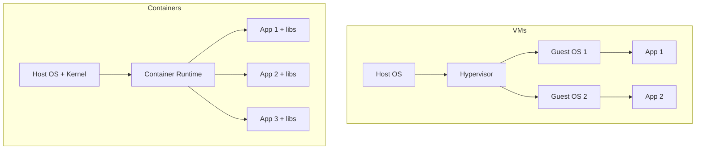
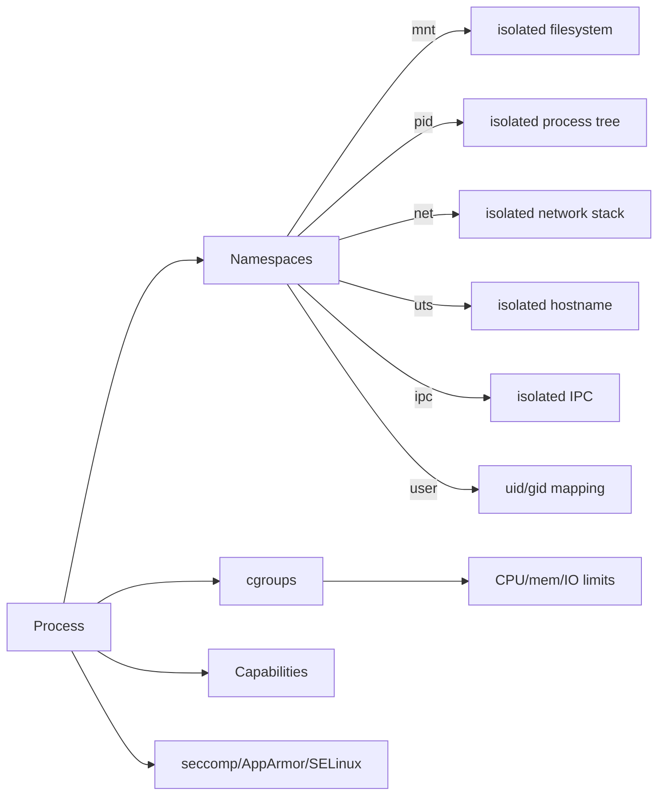
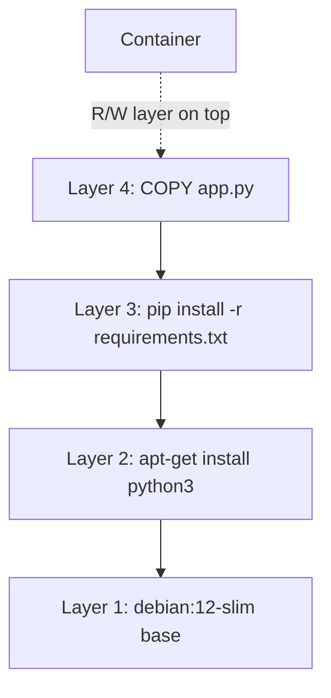

# 01 — Concepts

> Containers are *not* lightweight VMs. They are isolated processes on a shared kernel.

## Containers vs VMs

<!-- mermaid:rendered -->
<p align="center"></p>

<details><summary>Mermaid source</summary>



</details>
| | VM | Container |
|---|----|-----------|
| Boot | seconds–minutes | milliseconds |
| Size | GBs | MBs |
| Kernel | own | shared with host |
| Isolation | hardware-virtualized | namespaces + cgroups |
| Density | 10s/host | 100s–1000s/host |

## Quick reference

=== ":material-lightbulb-outline: Concept"
    A container is just a Linux process wrapped in namespaces (what it can see) and cgroups (what it can use), running on the host kernel. Images are stacks of read-only layers defined by the OCI spec, so the same artifact runs under Docker, containerd, or podman.

=== ":material-file-code-outline: Snippet"
    ```yaml
    # OCI image config (excerpt)
    architecture: amd64
    os: linux
    rootfs:
      type: layers
      diff_ids:
        - sha256:aaa...
        - sha256:bbb...
    config:
      Cmd: ["nginx", "-g", "daemon off;"]
    ```

=== ":material-console: Command"
    ```bash
    docker pull nginx:1.27-alpine
    docker history nginx:1.27-alpine
    docker run --rm -d --name demo nginx:1.27-alpine
    docker exec demo ls -la /proc/1/ns
    docker rm -f demo
    ```

=== ":material-text-box-outline: Expected output"
    ```text
    IMAGE        CREATED       CREATED BY                          SIZE
    <sha>        2 weeks ago   CMD ["nginx" "-g" "daemon off;"]    0B
    lrwxrwxrwx ... mnt -> 'mnt:[4026532...]'
    lrwxrwxrwx ... net -> 'net:[4026532...]'
    lrwxrwxrwx ... pid -> 'pid:[4026532...]'
    ```

## How isolation actually works (Linux)

A container is just a Linux process with some kernel features wrapped around it:

<!-- mermaid:rendered -->
<p align="center"></p>

<details><summary>Mermaid source</summary>



</details>
### Namespaces — *what the process can see*
- `mnt` — own filesystem mounts
- `pid` — own PID 1, can't see host processes
- `net` — own interfaces, routes, iptables
- `uts` — own hostname
- `ipc` — own SystemV IPC, message queues
- `user` — UID/GID remapping (root in container ≠ root on host)
- `cgroup` — own view of cgroups

### cgroups — *what the process can use*
Resource limits: CPU shares, memory ceiling, block IO weight, PIDs max.

### Capabilities — *what the process can do*
Linux splits root's powers into ~40 capabilities (`CAP_NET_ADMIN`, `CAP_SYS_ADMIN`, etc). Containers drop most by default.

## OCI — the standards

The Open Container Initiative defines three specs everyone follows:
- **image-spec** — what an image looks like on disk (manifest, layers, config)
- **runtime-spec** — what a runtime must do (runc, crun, youki)
- **distribution-spec** — how registries serve images

Docker, containerd, podman, CRI-O all implement these. An image you build with Docker runs on Kubernetes with containerd because of OCI.

## Image layers

An image is an ordered stack of read-only filesystem layers + a JSON config. Each Dockerfile instruction *can* create a layer.

<!-- mermaid:rendered -->
<p align="center"></p>

<details><summary>Mermaid source</summary>



</details>
When you start a container, Docker stacks all read-only layers and adds a thin **read-write layer** on top (copy-on-write). Stop the container → R/W layer is discarded unless committed.

## Try it — see the layers

```bash
docker pull nginx:1.27-alpine
# → 1.27-alpine: Pulling from library/nginx

docker history nginx:1.27-alpine
# → IMAGE          CREATED         CREATED BY                                      SIZE
# → <sha>          2 weeks ago     CMD ["nginx" "-g" "daemon off;"]                0B
# → <missing>      2 weeks ago     STOPSIGNAL SIGQUIT                              0B
# → <missing>      2 weeks ago     EXPOSE map[80/tcp:{}]                           0B
# → ...

docker inspect nginx:1.27-alpine | jq '.[0].RootFS'
# → { "Type": "layers", "Layers": [ "sha256:...", "sha256:...", ... ] }
```

## Try it — peek at namespaces

```bash
docker run --rm -d --name demo nginx:1.27-alpine
docker exec demo ls -la /proc/1/ns
# → lrwxrwxrwx ... cgroup -> 'cgroup:[...]'
# → lrwxrwxrwx ... ipc    -> 'ipc:[...]'
# → lrwxrwxrwx ... mnt    -> 'mnt:[...]'
# → lrwxrwxrwx ... net    -> 'net:[...]'
# → lrwxrwxrwx ... pid    -> 'pid:[...]'
# → lrwxrwxrwx ... user   -> 'user:[...]'
# → lrwxrwxrwx ... uts    -> 'uts:[...]'

# Compare to host (Linux) — different inode numbers = different namespaces
ls -la /proc/1/ns
docker rm -f demo
```

## Concepts checklist

- [ ] Container = process + namespaces + cgroups
- [ ] Image = ordered layers + JSON config
- [ ] OCI = the spec everyone obeys
- [ ] Runtime (runc/containerd) does the actual `clone()` syscalls
- [ ] Docker daemon = high-level UX over containerd
- [ ] Copy-on-write means starting 100 containers from one image is cheap

> ⚠️ Gotcha: On macOS and Windows, Docker Desktop runs a tiny Linux VM under the hood. The "lightweight" claim is true *on Linux*; on Mac you're paying VM overhead.

> ⚠️ Gotcha: `root` inside a container *is* root on the host kernel unless you enable user namespaces. Always run as a non-root UID in production.

## Docs

- https://docs.docker.com/get-started/docker-overview/
- https://github.com/opencontainers/image-spec/blob/main/spec.md
- https://github.com/opencontainers/runtime-spec/blob/main/spec.md
- https://man7.org/linux/man-pages/man7/namespaces.7.html
- https://man7.org/linux/man-pages/man7/cgroups.7.html
