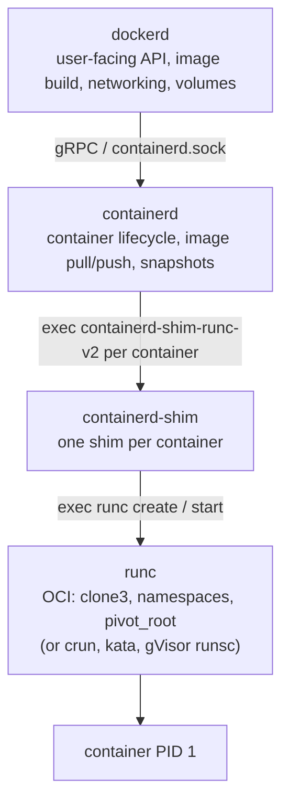
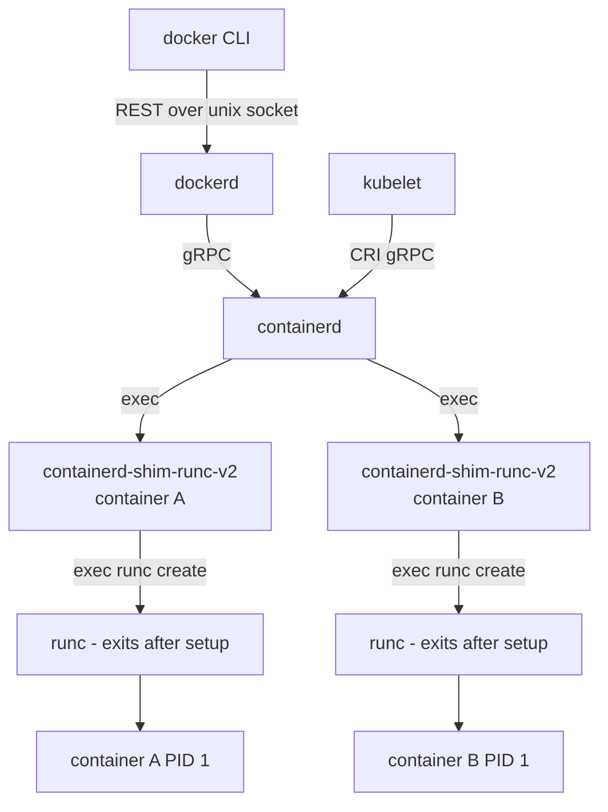

# Deep Dive: The Docker Runtime Stack — dockerd, containerd, runc

## Why this matters

"Docker" is not a single binary. It is a layered set of daemons, each with a precise responsibility, communicating over Unix sockets and gRPC. The same containerd that runs under Docker also runs under Kubernetes (via CRI). When you debug a stuck container, an "OCI runtime create failed" error, or a `containerd-shim` zombie — you must know which daemon owns what.

---

## Mental model

Three layers, each replaceable:



Each arrow is a process boundary. `runc` is short-lived — it sets up the container and then `exec`s the user's process, exiting itself. The **shim** is the one that stays around.

---

## Architecture

<!-- mermaid:rendered -->
<p align="center"></p>

<details><summary>Mermaid source</summary>



</details>
Note: in Kubernetes, `dockerd` is gone (deprecated and removed in v1.24+). kubelet talks **directly** to containerd over the CRI socket. The stack underneath is identical.

---

## Layer by layer

### dockerd (moby engine)

- Exposes the REST API on `/var/run/docker.sock` (the thing you talk to with `docker` CLI or `curl --unix-socket`).
- Owns the **builder** (BuildKit), **image store** (when not delegating), **networking** (libnetwork: bridge, overlay, macvlan), **volumes**, and Swarm.
- Stateful — keeps `/var/lib/docker/`.
- Translates user intent into containerd gRPC calls.

```bash
# Inspect what dockerd is actually doing
journalctl -u docker -f
curl --unix-socket /var/run/docker.sock http://localhost/version
```

### containerd

- Container lifecycle daemon. Knows nothing about `Dockerfile` or networks.
- Exposes a gRPC API at `/run/containerd/containerd.sock`.
- Owns: **image store** (snapshotters: overlayfs, btrfs, zfs, native, stargz), **content store** (CAS of OCI blobs), **namespaces** (gRPC-level multi-tenancy), **task service**.
- Used by Docker, Kubernetes (CRI plugin), nerdctl, BuildKit.

```bash
# Direct CLI for containerd (low level)
ctr version
ctr namespaces list                 # 'moby' (Docker), 'k8s.io' (kubelet), 'default'
ctr -n moby containers list
ctr -n k8s.io tasks list

# nerdctl is a Docker-compatible CLI on top of containerd
nerdctl ps
```

### containerd-shim

One shim process **per container**. Its job:

1. Be the **parent** of the container's PID 1, so containerd can restart or be killed without orphaning the container to PID 1 of the host.
2. Own the container's **stdio** (FIFOs in `/run/containerd/...`).
3. Reap the container when it exits and **report exit code** back to containerd via the shim API.
4. Hold the **TTY** if attached.

If you `kill -9 containerd`, every shim keeps running, every container keeps running. When containerd restarts, it reconnects to existing shims via their socket. This is the **shim's whole reason to exist** — decoupling.

```bash
# See the shims
ps -ef | grep shim
# root  1234  1  ... containerd-shim-runc-v2 -namespace moby -id abc123 ...
```

### runc

- The reference **OCI Runtime Specification** implementation. Single static Go binary.
- Reads `config.json` (the OCI runtime spec), creates the container.
- Executes: `clone3` with namespace flags, mount namespace setup (rootfs, masked paths, `/proc`, `/sys`), apply cgroups, set capabilities, set seccomp filter, set apparmor/SELinux, then `execve` the user command.
- After `exec`, **runc exits**. The shim becomes the container's parent.

```bash
# What runc actually does
runc --root /run/containerd/runc/moby spec    # generate sample config.json
runc list                                     # list containers in this root
runc state <id>                               # JSON state
```

Alternative OCI runtimes (drop-in via `runtime` setting):
- **crun** — C implementation, faster startup, lower memory.
- **runsc** (gVisor) — userspace kernel, sandboxing.
- **kata-runtime** — VM-based isolation.
- **youki** — Rust implementation.

---

## OCI specs in plain English

The **Open Container Initiative** publishes three specs:

| Spec | Purpose | Lives in |
|------|---------|----------|
| **Image spec** | how an image is laid out (manifest + layers + config JSON) | the registry, on disk |
| **Runtime spec** | how to start a container from a rootfs + `config.json` | the bundle directory |
| **Distribution spec** | the registry HTTP API (push/pull) | `registry/2.0` |

A container "bundle" passed to runc is just a directory:

```text
bundle/
├── config.json         # OCI runtime spec - command, env, mounts, namespaces, caps
└── rootfs/             # the container's root filesystem
    ├── bin/
    ├── etc/
    └── ...
```

Snippet of `config.json`:

```json
{
  "ociVersion": "1.0.2",
  "process": {
    "terminal": false,
    "user": { "uid": 0, "gid": 0 },
    "args": ["sh"],
    "env": ["PATH=/usr/local/sbin:/usr/local/bin:/usr/sbin:/usr/bin:/sbin:/bin"],
    "cwd": "/",
    "capabilities": { "bounding": ["CAP_AUDIT_WRITE","CAP_KILL","CAP_NET_BIND_SERVICE"] }
  },
  "root": { "path": "rootfs", "readonly": false },
  "mounts": [
    { "destination": "/proc", "type": "proc", "source": "proc" }
  ],
  "linux": {
    "namespaces": [
      { "type": "pid" }, { "type": "network" }, { "type": "mount" },
      { "type": "ipc" }, { "type": "uts" }
    ],
    "resources": {
      "memory": { "limit": 2147483648 },
      "cpu":    { "quota": 200000, "period": 100000 }
    }
  }
}
```

---

## Why this layering exists

| Property | Achieved by |
|----------|-------------|
| Restart `dockerd` without killing containers | shim holds the container |
| Restart `containerd` without killing containers | shim again |
| Swap Docker for Kubernetes | both speak to containerd via gRPC |
| Use gVisor for one container, runc for another | containerd dispatches by `runtime` field |
| Build images without dockerd | BuildKit talks to containerd directly |

This is the classic Unix philosophy: each daemon does one thing, replaceable.

---

## Walkthrough — what happens on `docker run alpine echo hi`

1. `docker` CLI POSTs `/containers/create` to dockerd.
2. dockerd resolves the image (pulls if missing, via containerd's content store).
3. dockerd asks containerd to create a container from a snapshot.
4. containerd materializes a rootfs via the **overlayfs snapshotter**, writes `config.json`.
5. containerd `exec`s `containerd-shim-runc-v2 -id <cid> -namespace moby ...`.
6. The shim `exec`s `runc create <cid>`. runc creates namespaces, applies cgroups, sets up rootfs, then **stops** at the OCI "created" state.
7. dockerd asks containerd to start. Containerd tells the shim. The shim tells runc to `start`. runc signals the suspended init process to `execve` the user command.
8. runc exits. The shim becomes the parent of `echo hi` (PID 1 inside the container).
9. `echo hi` runs, writes "hi" to the shim's stdout FIFO, exits.
10. Shim reaps it, sends exit event up the chain. dockerd surfaces it as the container's exit code.

---

## Common interview questions

> Interviewers love this stack because it tests whether you actually know what runs on a node.

**Q1. What is the difference between Docker, containerd, and runc?**
Docker (moby) is the user-facing engine: builds, networks, CLI, REST API. containerd is the lifecycle/image daemon underneath. runc is the OCI runtime that actually creates the container via `clone3` and `execve`. Docker calls containerd, containerd spawns a shim, the shim invokes runc.

**Q2. Why does each container have a `containerd-shim-runc-v2` process?**
So that containerd can restart or crash without orphaning the container to host PID 1, and so the container's stdio and exit code have a stable owner. The shim is the container's parent and the IO/exit-code custodian.

**Q3. Kubernetes removed Docker support. What changed under the hood?**
The kubelet stopped using `dockershim` (a CRI shim that translated CRI to Docker API). Kubernetes now talks CRI directly to containerd (or CRI-O). The runtime stack is the same below: containerd -> shim -> runc.

**Q4. Where does the OCI image spec live vs the OCI runtime spec?**
Image spec: in the registry — manifest, layers, image config JSON. Runtime spec: on the host, inside the bundle directory — `config.json` + `rootfs/`. containerd unpacks layers (image spec) into a snapshot, then synthesizes `config.json` (runtime spec) for runc.

**Q5. Can I use a different runtime per container?**
Yes. `docker run --runtime=runsc nginx` selects gVisor; the Docker daemon must have it registered in `/etc/docker/daemon.json` under `runtimes`. Kubernetes does the same with `RuntimeClass`.

**Q6. What is in a "bundle" handed to runc?**
A directory with `config.json` (the OCI runtime spec) and `rootfs/` (the filesystem the container will see as `/`). runc reads config.json, sets up the namespaces/cgroups/mounts described, and execs the process.

**Q7. Why is runc a short-lived process while the shim sticks around?**
runc only does setup (clone, mount, cgroup, exec). After it `execve`s the container command, it has nothing to do — its memory image is replaced. The shim, however, must remain alive to own the container's IO and exit reporting for the entire lifetime.

**Q8. How does the same containerd serve both Docker and Kubernetes on the same node?**
Containerd has a built-in concept of **namespaces** at the gRPC level. Docker uses the `moby` namespace; kubelet uses `k8s.io`. Containers, images, and snapshots are isolated per namespace inside a single containerd process. `ctr -n k8s.io ...` shows the kubelet's view.

---

## Sources

- moby (Docker engine): https://github.com/moby/moby
- containerd: https://containerd.io/ — https://github.com/containerd/containerd
- runc: https://github.com/opencontainers/runc
- OCI Runtime Spec: https://github.com/opencontainers/runtime-spec
- OCI Image Spec: https://github.com/opencontainers/image-spec
- OCI Distribution Spec: https://github.com/opencontainers/distribution-spec
- CRI (Kubernetes): https://kubernetes.io/blog/2016/12/container-runtime-interface-cri-in-kubernetes/
- "Don't panic — Kubernetes and Docker": https://kubernetes.io/blog/2020/12/02/dont-panic-kubernetes-and-docker/
- crun: https://github.com/containers/crun
- gVisor: https://gvisor.dev/
