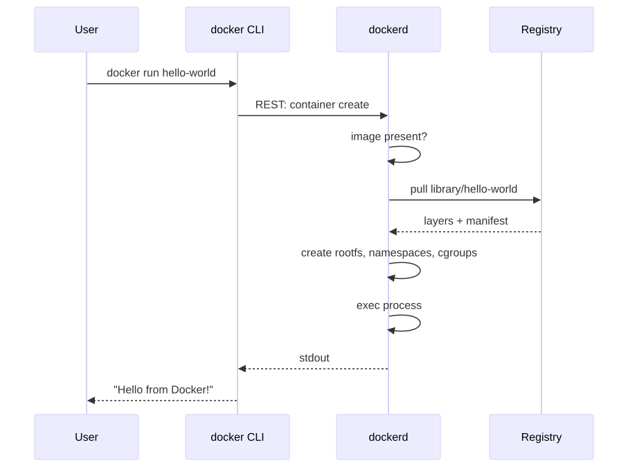
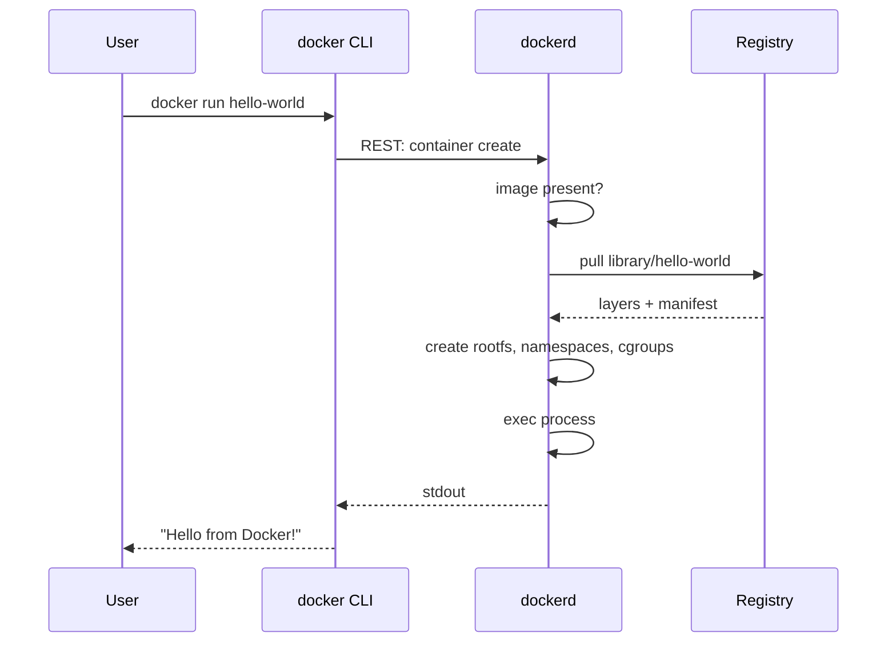

# 02 — Install + Hello World

## Install

### macOS (Apple Silicon or Intel)
```bash
brew install --cask docker
open -a Docker          # start the daemon
docker version
# → Client: Docker Engine - Community
# → Version: 27.x.x
# → Server: Docker Desktop
```
Or download Docker Desktop: https://docs.docker.com/desktop/setup/install/mac-install/

### Linux (Ubuntu/Debian)
```bash
# Convenience script (dev only — read it first!)
curl -fsSL https://get.docker.com | sh
sudo usermod -aG docker $USER     # log out + back in
docker run hello-world
```
Production install: https://docs.docker.com/engine/install/ubuntu/

### Windows
Install Docker Desktop with WSL2 backend: https://docs.docker.com/desktop/setup/install/windows-install/

## Verify

```bash
docker version
docker info | head -20
# → Client: Docker Engine - Community
# → Server:
# →  Containers: 0
# →  Images: 0
# →  Server Version: 27.x.x
# →  Storage Driver: overlay2
# →  Cgroup Driver: systemd
```

## First container

<!-- mermaid:rendered -->
<p align="center"></p>

<details><summary>Mermaid source</summary>

<!-- mermaid:rendered -->
<p align="center"></p>

<details><summary>Mermaid source</summary>

<!-- mermaid:rendered -->
<p align="center"></p>

<details><summary>Mermaid source</summary>



</details>

</details>

</details>

```bash
docker run hello-world
# → Unable to find image 'hello-world:latest' locally
# → latest: Pulling from library/hello-world
# → Digest: sha256:...
# → Status: Downloaded newer image for hello-world:latest
# →
# → Hello from Docker!
# → This message shows that your installation appears to be working correctly.
```

## The 12 commands you'll use 90% of the time

```bash
# images
docker pull <image>                    # download
docker images                          # list
docker rmi <image>                     # delete

# containers
docker run [opts] <image> [cmd]        # create + start
docker ps                              # list running
docker ps -a                           # list all (incl. stopped)
docker logs <id>                       # stdout/stderr
docker exec -it <id> sh                # shell into running container
docker stop <id>                       # SIGTERM then SIGKILL
docker rm <id>                         # delete stopped container

# building
docker build -t myapp:1.0 .            # build from Dockerfile in cwd
docker tag myapp:1.0 ghcr.io/me/myapp  # rename for push
```

## Try it — full flow

```bash
# 1. Pull the GCR hello-app
docker pull gcr.io/google-samples/hello-app:1.0

# 2. Run it detached, name it, map port
docker run -d --name hello -p 8080:8080 gcr.io/google-samples/hello-app:1.0
# → <container-id>

# 3. Check it
docker ps
# → CONTAINER ID   IMAGE                                    ...   PORTS                    NAMES
# → abc123def456   gcr.io/google-samples/hello-app:1.0      ...   0.0.0.0:8080->8080/tcp   hello

curl localhost:8080
# → Hello, world!
# → Version: 1.0.0
# → Hostname: abc123def456

# 4. Logs
docker logs hello
# → 2026/04/26 12:00:00 Server listening on port 8080

# 5. Shell in
docker exec -it hello sh
/ # ps
# → PID   USER     TIME  COMMAND
# →     1 root      0:00 /hello-app
/ # exit

# 6. Stop + remove
docker stop hello && docker rm hello
```

## Anatomy of `docker run`

```bash
docker run \
  -d                    # detached (background)
  --name web            # human name (default = random)
  -p 8080:80            # publish hostPort:containerPort
  -e ENV=value          # env var
  -v $PWD:/app          # bind-mount cwd into /app
  --restart unless-stopped \
  --memory 256m         # cgroup limit
  --cpus 0.5
  nginx:1.27-alpine     # image
  nginx -g "daemon off;" # cmd override (rare)
```

> ⚠️ Gotcha: `-p 80:80` requires root on Linux for ports < 1024. Use a high port or rootless docker.

> ⚠️ Gotcha: `docker run` always *creates a new container*. To restart a stopped one, use `docker start <name>`, not `docker run` again.

> ⚠️ Gotcha: Forgetting `--rm` on throwaway containers leaves a graveyard. Run `docker ps -a` and you'll see hundreds. Clean: `docker container prune`.

## Cleanup commands you'll need weekly

```bash
docker container prune          # remove stopped containers
docker image prune              # dangling images
docker image prune -a           # all unused images
docker volume prune             # unused volumes
docker network prune            # unused networks
docker system prune -a --volumes  # nuke everything unused (careful!)
```

## Docs

- https://docs.docker.com/get-started/
- https://docs.docker.com/reference/cli/docker/container/run/
- https://docs.docker.com/engine/install/
