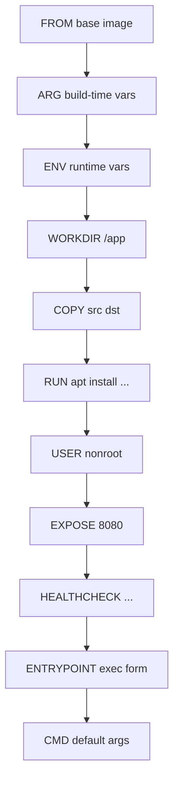

# 03 — Images and Dockerfile

> A Dockerfile is a recipe. Each instruction *can* produce a layer. Order matters for cache hits.

## The instructions you'll actually use



| Instruction | Purpose | Creates layer? |
|-------------|---------|----------------|
| `FROM` | Base image | yes (the layers from base) |
| `ARG` | Build-time variable | no |
| `ENV` | Runtime env var | yes (metadata) |
| `WORKDIR` | Set + create cwd | yes (metadata) |
| `COPY` / `ADD` | Files into image | **yes** |
| `RUN` | Execute command | **yes** |
| `USER` | Set UID for following layers | yes (metadata) |
| `EXPOSE` | Documents intended ports | yes (metadata) |
| `HEALTHCHECK` | Container health probe | yes (metadata) |
| `ENTRYPOINT` | Fixed command | yes (metadata) |
| `CMD` | Default args (or full cmd) | yes (metadata) |
| `LABEL` | OCI metadata | yes (metadata) |

## ENTRYPOINT vs CMD — the eternal confusion

```dockerfile
ENTRYPOINT ["python", "app.py"]   # always runs
CMD ["--port", "8080"]            # default args, overridable
```

```bash
docker run myimg                    # → python app.py --port 8080
docker run myimg --port 9090        # → python app.py --port 9090
docker run --entrypoint sh myimg    # → sh (entrypoint replaced)
```

**Rule:** use **exec form** (`["cmd", "arg"]`) — not shell form (`cmd arg`). Shell form spawns `/bin/sh -c` which breaks signal handling (your `SIGTERM` never reaches the app).

## Layer caching — the most important thing in this whole folder

Docker hashes each instruction. Same hash → reuse cached layer. Change ONE byte → cache busted from that line down.

**Pattern:** put slow + rarely changing instructions *first*, fast + churn-heavy *last*.

```dockerfile
# ❌ BAD — every code change re-runs pip install
FROM python:3.12-slim
COPY . /app
RUN pip install -r /app/requirements.txt
CMD ["python", "/app/app.py"]
```

```dockerfile
# ✅ GOOD — pip install only re-runs when requirements.txt changes
FROM python:3.12-slim
WORKDIR /app
COPY requirements.txt .
RUN pip install --no-cache-dir -r requirements.txt
COPY . .
CMD ["python", "app.py"]
```

## Examples in this folder

| Folder | Demonstrates |
|--------|--------------|
| [examples/01-basic](./examples/01-basic/) | Simple Flask app — every instruction explained |
| [examples/02-multistage](./examples/02-multistage/) | Multi-stage build for a Go binary (~10MB final image) |
| [examples/03-distroless](./examples/03-distroless/) | Distroless base — no shell, minimal attack surface |

## Try it — build the basic example

```bash
cd examples/01-basic
docker build -t flask-hello:1.0 .
# → [+] Building 12.3s (10/10) FINISHED
# → => => writing image sha256:...
# → => => naming to docker.io/library/flask-hello:1.0

docker images flask-hello
# → REPOSITORY    TAG   IMAGE ID       CREATED          SIZE
# → flask-hello   1.0   abc123def456   10 seconds ago   125MB

docker run --rm -p 5000:5000 flask-hello:1.0
curl localhost:5000
# → Hello from Flask in a container!
```

## Dockerfile linting — `hadolint`

```bash
docker run --rm -i hadolint/hadolint < Dockerfile
# → -:5 DL3008 warning: Pin versions in apt-get install
# → -:7 DL3009 info: Delete the apt-get lists after installing
```

## .dockerignore — don't ship your `.git` folder

```
.git
.gitignore
node_modules
*.md
.env
__pycache__
*.pyc
dist
build
.vscode
.idea
```

Without it: every `COPY . .` includes 50 MB of `.git` history. Cache invalidation hell.

## Gotchas

> ⚠️ `ADD` vs `COPY`: `ADD` auto-extracts tarballs and can fetch URLs. **Prefer `COPY`** unless you specifically want those behaviors.

> ⚠️ `RUN apt-get update && apt-get install -y X` must be on **one line**. Splitting them caches `update` separately → stale package lists.

> ⚠️ Each `RUN` is a layer. Chain related commands with `&&` and clean up in the same layer:
> ```dockerfile
> RUN apt-get update && \
>     apt-get install -y --no-install-recommends curl && \
>     rm -rf /var/lib/apt/lists/*
> ```

> ⚠️ `latest` is not a version. It's a moving tag. **Pin** to a SHA digest in production:
> `FROM python@sha256:abc123...`

> ⚠️ `WORKDIR /app` creates the dir if missing — never use `RUN cd /app` (each RUN is a fresh shell).

## Docs

- https://docs.docker.com/reference/dockerfile/
- https://docs.docker.com/build/building/best-practices/
- https://github.com/hadolint/hadolint
