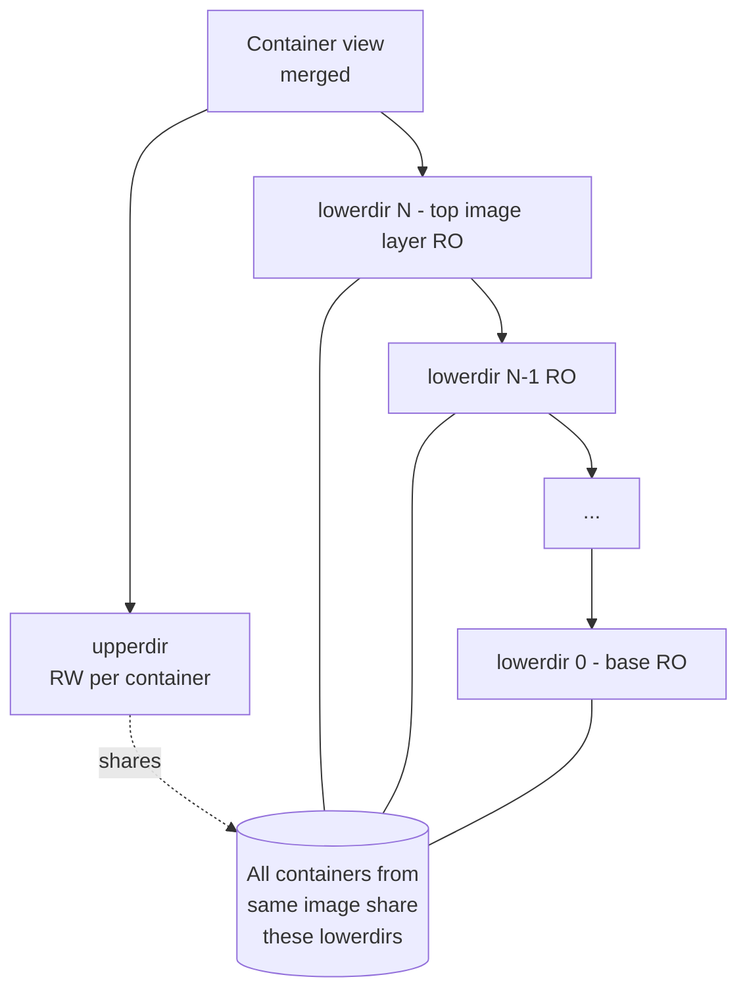
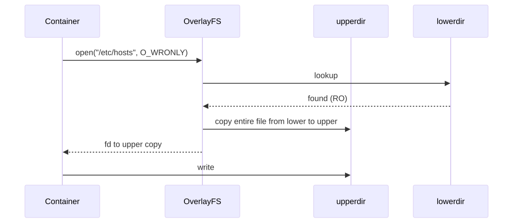
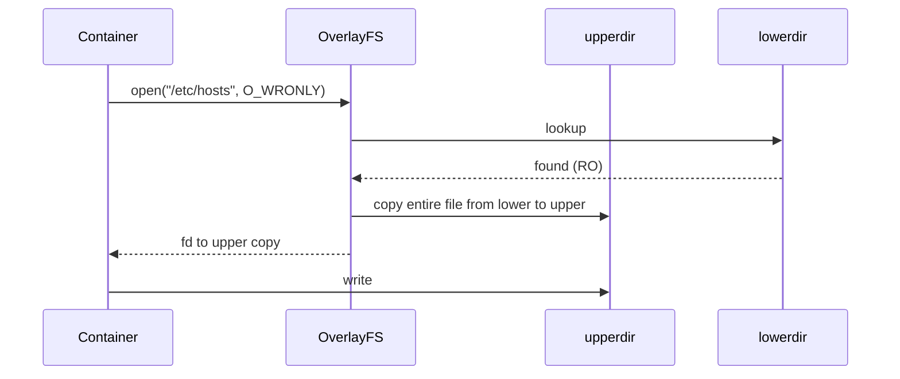

# Deep Dive: OverlayFS — How Docker Image Layers Actually Work

## Why this matters

Every container's filesystem is an OverlayFS mount. Every Dockerfile instruction creates a layer. Every "copy-on-write" surprise (slow first write to a big file, image rebuild that "should" be cached but isn't, mysterious disk usage) traces back to overlay semantics. Understanding lower/upper/merged dirs is essential for debugging image bloat, optimizing builds, and reasoning about volume vs bind-mount performance.

---

## Mental model

OverlayFS is a **union mount**: it shows the merged view of a stack of read-only "lower" directories with a single read-write "upper" directory on top. Reads check upper first then walk lower layers; writes always go to upper.

```
+---------------------+   what the container sees as /
|   merged (mount)    |
+---------------------+
       /\
       || union
+------||------+
| upperdir (RW)|   <- changes made by the container live here
+------||------+
| workdir      |   <- overlay scratchpad (atomic ops)
+------||------+
| lowerdir N   |   <- topmost image layer (RO)
| lowerdir ... |
| lowerdir 0   |   <- base image layer (RO)
+--------------+
```

**Key invariant:** lower layers are immutable. Many containers from the same image **share** the same lower layers on disk — this is why pulling 50 containers from one image takes one image's worth of space.

---

## The four overlay directories

| Dir | Role |
|-----|------|
| `lowerdir` | colon-separated list of read-only layers (rightmost is the base) |
| `upperdir` | the only writable directory; container modifications land here |
| `workdir`  | overlay's private scratch space, must be on the SAME filesystem as upperdir |
| `merged`   | the resulting unified view that the container sees as `/` |

```bash
# Inspect a running container
docker inspect <id> --format '{{ json .GraphDriver }}' | jq
# {
#   "Data": {
#     "LowerDir": "/var/lib/docker/overlay2/abc/diff:/var/lib/docker/overlay2/def/diff",
#     "MergedDir": "/var/lib/docker/overlay2/xyz/merged",
#     "UpperDir":  "/var/lib/docker/overlay2/xyz/diff",
#     "WorkDir":   "/var/lib/docker/overlay2/xyz/work"
#   },
#   "Name": "overlay2"
# }
```

---

## Architecture

<!-- mermaid:rendered -->
<p align="center"></p>

<details><summary>Mermaid source</summary>



</details>

---

## Read, write, delete — the three operations

### Read

1. Look up the path in `upperdir`.
2. If absent, walk `lowerdir` from top to bottom, return the first hit.

Reads from lower layers are zero-copy — the kernel just reads the underlying file directly.

### Write — copy-up

If the file exists only in lower and the container writes to it, overlay performs a **copy-up**:

<!-- mermaid:rendered -->
<p align="center"></p>

<details><summary>Mermaid source</summary>



</details>

Implication: the **first write** to a 5 GB file copies 5 GB before the write returns. Subsequent writes are fast. This is why benchmarks of "first write" inside containers look terrible.

### Delete — whiteouts

You cannot remove a file from a read-only lower layer. Instead, overlay creates a **whiteout** in upperdir: a character device with major=0, minor=0. The merged view hides the lower file.

```bash
# Inside the upperdir after `rm /etc/motd`
ls -la /var/lib/docker/overlay2/xyz/diff/etc/
# c--------- 1 root root 0, 0 motd      <-- this is a whiteout
```

**Image bloat trap:** running `rm -rf /var/cache/apt` in a *later* RUN does NOT shrink the image — the previous layer still has those files; you only added whiteouts. Reduce image size by deleting in the **same** RUN that created the files.

```dockerfile
# BAD - cache files exist forever in layer N, whiteouts added in layer N+1
RUN apt-get update && apt-get install -y curl
RUN rm -rf /var/lib/apt/lists/*

# GOOD - cache never lands in any layer
RUN apt-get update \
    && apt-get install -y --no-install-recommends curl \
    && rm -rf /var/lib/apt/lists/*
```

---

## How an image becomes overlay layers

A Docker image is a **tarball per layer** (the "diff") plus a JSON config and a manifest. On pull, containerd's overlay snapshotter:

1. Downloads each layer blob (gzip'd tar).
2. Extracts each into `/var/lib/docker/overlay2/<sha>/diff/`.
3. Records the chain in `link` and `lower` files.
4. When a container starts, builds a fresh `upperdir` + `workdir`, mounts overlay with all those `diff/` directories as `lowerdir`.

```bash
ls /var/lib/docker/overlay2/<id>/
# diff/        <-- the layer's content (or upperdir for container layers)
# link         <-- short symlink name
# lower        <-- colon-separated lower chain (only for container layers)
# work/        <-- overlay scratch (only for container layers)
# merged/      <-- mount point (only when container is running)
```

---

## Why image rebuild flushes the cache

Docker's build cache is keyed on:

| Instruction | Cache key |
|-------------|-----------|
| `FROM`      | image digest |
| `RUN`       | parent layer + the literal command string |
| `COPY` / `ADD` | parent layer + checksum of files being copied |
| `ARG` / `ENV` | parent layer + the value |

A change to **any** instruction invalidates the cache for that step **and every step after it**, because each subsequent layer's `lowerdir` chain depends on the prior layer's content hash.

```dockerfile
FROM node:20-alpine
WORKDIR /app
COPY package*.json ./        # cache invalidated only when package.json changes
RUN npm ci                   # heavy step - cached as long as the line above is cached
COPY . .                     # cache invalidated on ANY source change
RUN npm run build
```

If you write `COPY . .` **before** `npm ci`, every source change re-runs `npm ci` because the `lowerdir` for that layer is now different. Order from least-to-most-frequently-changed.

---

## Walkthrough — build an overlay mount by hand

```bash
mkdir -p /tmp/ov/{lower1,lower2,upper,work,merged}

# Lower layers (immutable image content, in order: rightmost = base)
echo "from lower1 (top)"  > /tmp/ov/lower1/a.txt
echo "from lower2 (base)" > /tmp/ov/lower2/a.txt
echo "from lower2 (base)" > /tmp/ov/lower2/b.txt

mount -t overlay overlay \
  -o lowerdir=/tmp/ov/lower1:/tmp/ov/lower2,upperdir=/tmp/ov/upper,workdir=/tmp/ov/work \
  /tmp/ov/merged

cat /tmp/ov/merged/a.txt          # -> "from lower1 (top)"  (top wins)
cat /tmp/ov/merged/b.txt          # -> "from lower2 (base)"

# Trigger copy-up
echo "modified" >> /tmp/ov/merged/b.txt
ls /tmp/ov/upper/                  # b.txt now exists in upper

# Whiteout
rm /tmp/ov/merged/a.txt
ls -la /tmp/ov/upper/              # a.txt is now char device 0,0

umount /tmp/ov/merged
```

This is exactly what containerd does — the only difference is the directory paths and that lowerdirs come from extracted image tarballs.

---

## Performance characteristics

| Operation | Cost |
|-----------|------|
| Read from lower | native (no overhead) |
| Read from upper | native |
| Write to upper (already there) | native |
| **First write to a large lower file** | full copy-up = O(file size) |
| Stat across deep lower chain | one syscall per layer until found |
| Delete a lower file | small (whiteout creation) |
| Rename across lower/upper | tricky — may force copy-up |

Mitigations for hot, large, mutable files: use a **volume** or **tmpfs** mount, bypassing overlay entirely. Volumes go straight to the underlying filesystem with no copy-up penalty.

---

## Common interview questions

> Most candidates can recite "Docker uses layers". Few can explain copy-up or whiteouts. Be the one who can.

**Q1. What is copy-up and when does it happen?**
When a container writes to a file that exists only in a lower (read-only) layer, OverlayFS copies the entire file to upperdir before the write is allowed. Cost = O(file size). The next write is free.

**Q2. Why doesn't `RUN rm -rf /tmp/big-file` in a later layer shrink my image?**
Layers are append-only. The `rm` adds a whiteout in the new layer but the file still occupies space in the previous layer. The image's total on-disk size is the sum of all layers. To remove it, delete the file in the **same RUN** that created it, or use multi-stage builds.

**Q3. What is a whiteout in OverlayFS?**
A character device with major=0, minor=0 placed in upperdir to mask a file that exists in a lower layer. The merged view treats it as if the lower file does not exist.

**Q4. Two containers run the same image. How much disk does the second one use?**
Just its upperdir's worth — the size of files modified or created since starting. Lower layers are shared via the snapshotter and exist on disk exactly once per image.

**Q5. Why does `COPY . .` early in a Dockerfile destroy build caching?**
Because the cache key for any RUN/COPY after it depends on the parent layer's content hash. If `COPY . .` runs first, any source change changes that layer and invalidates everything after it — including expensive `npm ci` or `pip install`.

**Q6. Lower layers are listed left-to-right. Which one wins on conflict?**
Leftmost wins (it is the topmost layer). In Docker's `LowerDir` string, leftmost = most recently added image layer.

**Q7. Why must `workdir` be on the same filesystem as `upperdir`?**
Overlay uses `workdir` for atomic operations like rename and copy-up via hard links. Cross-filesystem hard links are not allowed, so the kernel rejects the mount.

**Q8. When would you skip overlay and use a volume?**
For hot, mutable, large data: databases, caches, build artifacts. Volumes write to the underlying filesystem directly, no copy-up, no per-container scratch growth, and they survive container removal.

---

## Sources

- Kernel OverlayFS docs: https://www.kernel.org/doc/html/latest/filesystems/overlayfs.html
- Docker storage drivers — overlay2: https://docs.docker.com/storage/storagedriver/overlayfs-driver/
- OCI Image Spec — layers: https://github.com/opencontainers/image-spec/blob/main/layer.md
- containerd snapshotters: https://github.com/containerd/containerd/blob/main/docs/snapshotters/README.md
- "Why does my Docker image keep growing?" — Jérôme Petazzoni's classic talks
- LWN — OverlayFS: https://lwn.net/Articles/635443/
