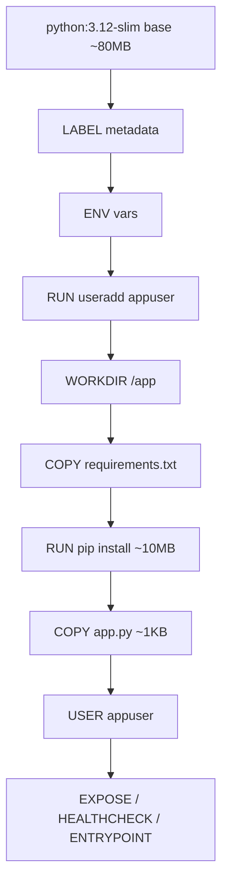

# 01-basic — Flask in a slim Python image

## Build
```bash
docker build -t flask-hello:1.0 .
```

## Run
```bash
docker run --rm -p 5000:5000 flask-hello:1.0
curl localhost:5000
# → Hello from Flask in a container!
```

## Observe
- `docker images flask-hello:1.0` → ~125 MB
- `docker history flask-hello:1.0` → see each layer
- `docker inspect flask-hello:1.0 | jq '.[0].Config.User'` → `"appuser"`
- Healthcheck: `docker ps` shows `(healthy)` after ~30s

## Layer structure

<!-- mermaid:rendered -->
<p align="center"></p>

<details><summary>Mermaid source</summary>



</details>
Change `app.py` → only L8+ rebuild. Change `requirements.txt` → L6+ rebuild.
