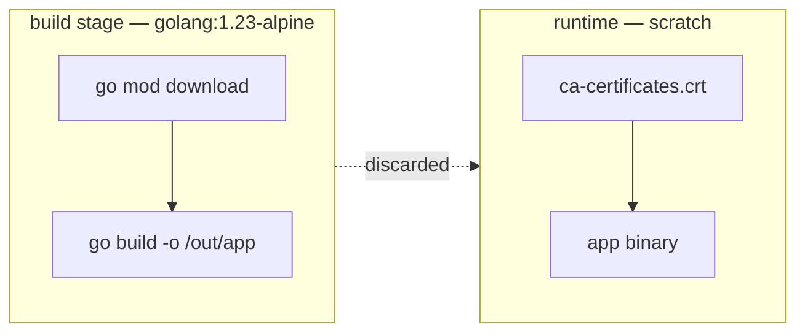

# 02-multistage — Go binary in `scratch`

## Build
```bash
docker build -t go-hello:1.0 .
```

## Run
```bash
docker run --rm -p 8080:8080 go-hello:1.0
curl localhost:8080
# → Hello from Go!
# → Hostname: <id>
```

## Observe
```bash
docker images go-hello:1.0
# → SIZE: ~7 MB  (vs ~350 MB for a naive single-stage golang image)
```

## Layer structure

<!-- mermaid:rendered -->
<p align="center"></p>

<details><summary>Mermaid source</summary>

<!-- mermaid:rendered -->
<p align="center"></p>

<details><summary>Mermaid source</summary>



</details>

</details>

Only the *final stage* ships. The build toolchain (~300 MB of Go) stays behind.

## Try changing it
- Drop `-ldflags="-s -w"` and rebuild — binary grows by ~30%.
- Replace `FROM scratch` with `FROM alpine:3.20` — image grows by ~5 MB but you get a shell for `docker exec`.
