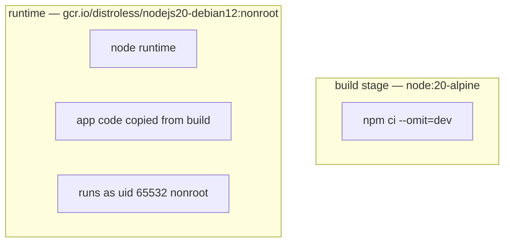

# 03-distroless — Node.js on Google's distroless base

Distroless = base image with **only your app + runtime + minimal libs**. No shell, no package manager, no `apt`, no `sh`.

## Build
```bash
docker build -t distroless-hello:1.0 .
```

## Run
```bash
docker run --rm -p 8080:8080 distroless-hello:1.0
curl localhost:8080
# → Hello from distroless Node!
```

## Observe
```bash
docker exec -it <id> sh
# → OCI runtime exec failed: exec failed: unable to start container process: exec: "sh": executable file not found in $PATH
# That's the point — no shell to compromise.
```

## Layer structure

<!-- mermaid:rendered -->
<p align="center"></p>

<details><summary>Mermaid source</summary>

<!-- mermaid:rendered -->
<p align="center"></p>

<details><summary>Mermaid source</summary>



</details>

</details>

## Why bother
- Smaller (~150 MB vs ~400 MB for `node:20`)
- No shell → many CVEs simply not exploitable
- Forces you to do health checks via exec of a binary or HTTP probe — not `curl`

## Docs
- https://github.com/GoogleContainerTools/distroless
