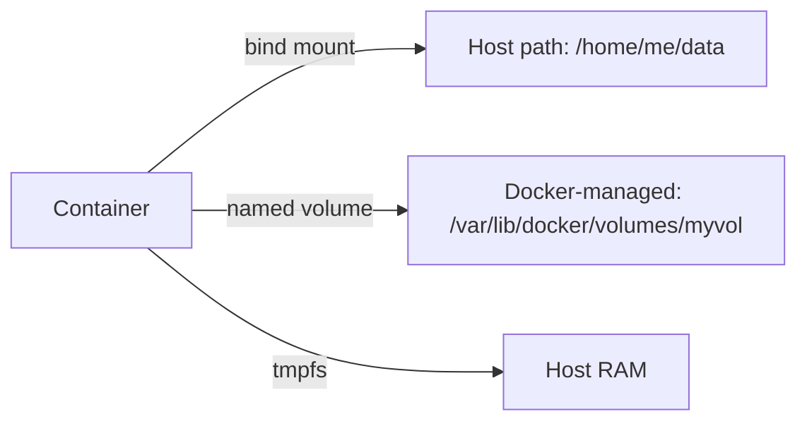

# 04 — Volumes and Storage

> Containers are ephemeral. The R/W layer dies with the container. Use volumes for anything you want to survive.

## Three storage modes

<!-- mermaid:rendered -->
<p align="center"></p>

<details><summary>Mermaid source</summary>



</details>
| Mode | Where data lives | Use for |
|------|------------------|---------|
| **bind mount** | Anywhere on host | dev (live-reload code), config files |
| **named volume** | Managed by Docker | prod databases, anything portable |
| **tmpfs** | Host RAM | secrets, scratch caches (Linux only) |

## Quick reference

=== ":material-lightbulb-outline: Concept"
    A container's R/W layer dies with the container. To persist data, attach a **bind mount** (host path), a **named volume** (Docker-managed), or a **tmpfs** (RAM). Named volumes are the portable choice for production databases.

=== ":material-file-code-outline: Manifest / Snippet"
    ```yaml
    # compose.yaml — Postgres on a named volume
    services:
      db:
        image: postgres:16
        environment:
          POSTGRES_PASSWORD: secret
        volumes:
          - pgdata:/var/lib/postgresql/data
    volumes:
      pgdata:
    ```

=== ":material-console: Command"
    ```bash
    docker volume create pgdata
    docker run -d --name pg -e POSTGRES_PASSWORD=secret \
      -v pgdata:/var/lib/postgresql/data postgres:16
    docker volume ls
    docker volume inspect pgdata
    ```

=== ":material-text-box-outline: Expected output"
    ```text
    DRIVER    VOLUME NAME
    local     pgdata
    [
      {
        "Name": "pgdata",
        "Mountpoint": "/var/lib/docker/volumes/pgdata/_data",
        "Driver": "local"
      }
    ]
    ```

## Bind mounts

```bash
# Mount cwd into /app inside container
docker run --rm -it -v "$PWD":/app -w /app node:20-alpine sh
/app # ls
# → (your local files appear here)
```

Or with the more explicit syntax:
```bash
docker run --rm -it \
  --mount type=bind,source="$PWD",target=/app \
  -w /app node:20-alpine sh
```

> ⚠️ Gotcha (macOS/Windows): bind mounts cross the Docker Desktop VM boundary → SLOW for many small files (node_modules, .git). Use **named volumes** for those, bind mount only your source.

## Named volumes

```bash
docker volume create pgdata
docker run -d --name pg \
  -e POSTGRES_PASSWORD=secret \
  -v pgdata:/var/lib/postgresql/data \
  postgres:16

docker volume ls
# → DRIVER    VOLUME NAME
# → local     pgdata

docker volume inspect pgdata
# → "Mountpoint": "/var/lib/docker/volumes/pgdata/_data"

# kill container — data survives
docker rm -f pg
docker run -d --name pg2 -e POSTGRES_PASSWORD=secret -v pgdata:/var/lib/postgresql/data postgres:16
# Data still there.
```

## tmpfs

```bash
docker run --rm -it --tmpfs /scratch:size=64m alpine sh
/ # df -h /scratch
# → tmpfs   64.0M   0  64.0M   0% /scratch
```

## Try it — full lab

```bash
# 1. Create volume + write
docker run --rm -v mydata:/data alpine sh -c 'echo "persistent!" > /data/file.txt'

# 2. Read from a different container
docker run --rm -v mydata:/data alpine cat /data/file.txt
# → persistent!

# 3. Inspect
docker volume inspect mydata
# → "Mountpoint": "/var/lib/docker/volumes/mydata/_data"

# 4. Backup
docker run --rm \
  -v mydata:/source:ro \
  -v "$PWD":/backup \
  alpine tar czf /backup/mydata.tar.gz -C /source .

ls -lh mydata.tar.gz

# 5. Restore into a new volume
docker volume create newdata
docker run --rm \
  -v newdata:/target \
  -v "$PWD":/backup:ro \
  alpine tar xzf /backup/mydata.tar.gz -C /target

docker run --rm -v newdata:/data alpine cat /data/file.txt
# → persistent!

# 6. Cleanup
docker volume rm mydata newdata
```

## Read-only mounts

```bash
docker run --rm -v "$PWD/config.yaml":/etc/app/config.yaml:ro alpine cat /etc/app/config.yaml
```

Append `:ro` to make it read-only inside the container. Critical for config files you don't want apps to overwrite.

## Anonymous volumes

`-v /data` (no name) → Docker creates an unnamed volume. Hard to find later. **Avoid** — always name them.

## Volume drivers

`local` is default. Plugins exist for NFS, EBS, GCE PD, Ceph, etc:
```bash
docker volume create --driver local \
  --opt type=nfs \
  --opt o=addr=10.0.0.1,rw \
  --opt device=:/exported/path \
  nfs-vol
```

## Gotchas

> ⚠️ **Bind mount masking:** if `/app` already has files in the image and you bind-mount over it, the original files become invisible. They're still in the layer — just hidden by the mount.

> ⚠️ **UID mismatch:** files written from container as UID 1000 may be unreadable on host if your host UID is 501 (macOS) or 1001. Set `--user $(id -u):$(id -g)` for symmetry.

> ⚠️ **`docker rm -v` deletes anonymous volumes** but **NOT named ones**. Named are protected. Use `docker volume prune` to clean unused.

> ⚠️ **Database in a bind mount on macOS/Windows = pain.** Filesystem semantics differ → fsync slowness, locking bugs. Always use named volumes for DBs.

## Docs
- https://docs.docker.com/engine/storage/
- https://docs.docker.com/engine/storage/volumes/
- https://docs.docker.com/engine/storage/bind-mounts/
- https://docs.docker.com/engine/storage/tmpfs/
