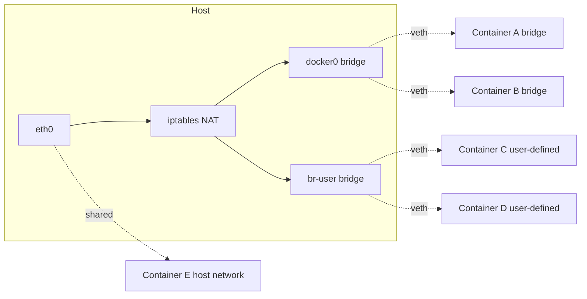
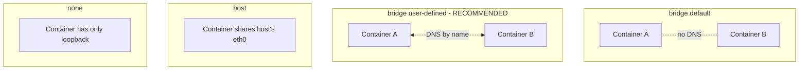

# 05 — Networking

> Every container gets its own network namespace. Docker glues namespaces together with virtual networks.

## The drivers



| Driver | What it does | When to use |
|--------|--------------|-------------|
| `bridge` (default) | Each container on `docker0` bridge with NAT'd outbound | Single-host default |
| **user-defined bridge** | Custom bridge with **DNS between containers** | Anything multi-container on one host |
| `host` | Container shares host's net ns (no isolation) | Perf-critical, port conflict OK |
| `none` | No networking at all | Batch jobs, fully isolated |
| `overlay` | Multi-host (Swarm/multi-node) | Swarm clusters |
| `macvlan` | Container gets its own MAC on physical net | Legacy apps needing real IPs |

## The single most important rule

**Default `bridge` does NOT do DNS between containers.** Always create a user-defined bridge for multi-container apps:

```bash
docker network create app-net
docker run -d --name api    --network app-net myapi
docker run -d --name worker --network app-net myworker
# now `worker` can resolve `api` by name
```

## Try it — DNS between containers

```bash
# 1. Create network
docker network create demo-net

# 2. Run a server
docker run -d --name web --network demo-net nginx:1.27-alpine

# 3. Run a client and resolve by name
docker run --rm --network demo-net alpine sh -c 'apk add --no-cache curl >/dev/null && curl -s http://web'
# → <!DOCTYPE html>... Welcome to nginx!

# 4. Without a user-defined network, this fails:
docker run -d --name web2 nginx:1.27-alpine    # default bridge
docker run --rm alpine sh -c 'apk add --no-cache bind-tools >/dev/null && nslookup web2'
# → ** server can't find web2: NXDOMAIN

# 5. Cleanup
docker rm -f web web2
docker network rm demo-net
```

## Port publishing

```bash
docker run -d -p 8080:80 nginx                  # 8080/tcp on all host ifaces
docker run -d -p 127.0.0.1:8080:80 nginx        # bind to localhost only
docker run -d -p 8080:80/udp nginx              # UDP
docker run -d -P nginx                          # auto-assign random host ports for every EXPOSE
```

```bash
docker port <container>
# → 80/tcp -> 0.0.0.0:8080
```

## Inspect a network

```bash
docker network inspect bridge
# → "Subnet": "172.17.0.0/16"
# → "Gateway": "172.17.0.1"
# → "Containers": { ... mac, ipv4, ipv6 ... }
```

## host network mode (Linux only — degraded on Mac/Win)

```bash
docker run --rm --network host nginx:1.27-alpine
# nginx now binds host:80 directly — no -p needed
```

> ⚠️ On macOS/Windows, `--network host` does NOT actually share the host network — Docker Desktop runs containers in a VM. Use port publishing instead.

## Container-to-host

From inside a container, the host is reachable as `host.docker.internal` (Docker Desktop) or via the bridge gateway IP (`172.17.0.1`) on Linux.

```bash
docker run --rm alpine ping -c1 host.docker.internal
```

## Network drivers in one diagram



## Gotchas

> ⚠️ Default bridge has **no automatic DNS**. Use user-defined networks. Always.

> ⚠️ Publishing a port (`-p`) opens it on **all interfaces** by default. Bind to `127.0.0.1:` for dev-only services.

> ⚠️ `docker0` bridge IPs (172.17.x.x) can collide with corporate VPN ranges. Override with `daemon.json` `bip` setting.

> ⚠️ `--link` is **deprecated**. Don't learn it. Use user-defined networks.

## Docs
- https://docs.docker.com/engine/network/
- https://docs.docker.com/engine/network/drivers/bridge/
- https://docs.docker.com/engine/network/drivers/overlay/
