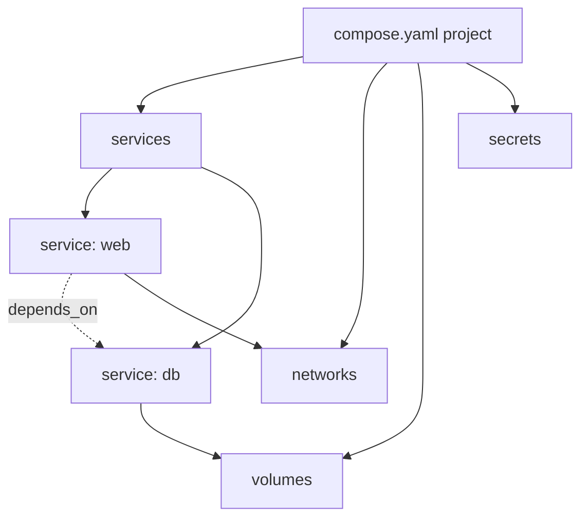

# 06 — Docker Compose

> One YAML file = your entire local stack. `docker compose up` and you're running.

## The model

<!-- mermaid:rendered -->
<p align="center"></p>

<details><summary>Mermaid source</summary>

<!-- mermaid:rendered -->
<p align="center"></p>

<details><summary>Mermaid source</summary>

<!-- mermaid:rendered -->
<p align="center"></p>

<details><summary>Mermaid source</summary>



</details>

</details>

</details>

Compose v2 ships with Docker Engine — invoke as `docker compose` (space, not hyphen).

## Anatomy

```yaml
name: myapp                       # project name (folder name by default)

services:
  web:
    image: nginx:1.27-alpine      # OR build: ./web
    ports:
      - "8080:80"
    environment:
      - LOG_LEVEL=info
    volumes:
      - ./html:/usr/share/nginx/html:ro
    depends_on:
      db:
        condition: service_healthy
    restart: unless-stopped
    networks: [app]

  db:
    image: postgres:16
    environment:
      POSTGRES_PASSWORD: secret
    volumes:
      - pgdata:/var/lib/postgresql/data
    healthcheck:
      test: ["CMD-SHELL", "pg_isready -U postgres"]
      interval: 5s
      timeout: 3s
      retries: 5
    networks: [app]

volumes:
  pgdata:

networks:
  app:
    driver: bridge
```

## Lifecycle

```bash
docker compose up -d              # create + start in background
docker compose ps                 # status
docker compose logs -f web        # tail logs of one service
docker compose exec web sh        # shell into running service
docker compose restart web        # restart one
docker compose down               # stop + remove containers + network
docker compose down -v            # ALSO remove volumes (data loss!)
docker compose pull               # update images
docker compose build              # build local Dockerfiles
docker compose config             # validate + render final yaml
```

## depends_on with healthcheck

Plain `depends_on` only waits for the container to **start** — not be **ready**. Use `condition: service_healthy`:

```yaml
depends_on:
  db:
    condition: service_healthy
```

Then add a `healthcheck:` to the dep service. Compose waits for healthy before starting the dependent.

## Examples

| Folder | Stack |
|--------|-------|
| [examples/wordpress-mysql](./examples/wordpress-mysql/) | Classic 2-tier app |
| [examples/observability](./examples/observability/) | Prometheus + Grafana + node-exporter |

## Try it — WordPress

```bash
cd examples/wordpress-mysql
docker compose up -d
# → [+] Running 4/4
# →  ✔ Network wordpress-mysql_default  Created
# →  ✔ Volume "wordpress-mysql_dbdata"  Created
# →  ✔ Container wordpress-mysql-db-1   Healthy
# →  ✔ Container wordpress-mysql-wp-1   Started

open http://localhost:8000        # WordPress install wizard

docker compose down               # stop, keep data
docker compose down -v            # nuke including DB
```

## Try it — Prometheus + Grafana

```bash
cd examples/observability
docker compose up -d
open http://localhost:9090        # Prometheus
open http://localhost:3000        # Grafana (admin/admin)
docker compose down -v
```

## Override files

`compose.override.yaml` is auto-merged. Use it for dev-only overrides (mount source, debug ports):

```bash
docker compose -f compose.yaml -f compose.prod.yaml up -d
```

## profiles

Group services into profiles to opt-in:

```yaml
services:
  debug:
    image: nicolaka/netshoot
    profiles: [debug]
```

```bash
docker compose --profile debug up
```

## Gotchas

> ⚠️ `version: "3.8"` at the top is **obsolete** in Compose v2 — drop it.

> ⚠️ `depends_on` does NOT wait for app readiness without `condition: service_healthy`. Many tutorials get this wrong.

> ⚠️ `docker compose down -v` **deletes named volumes**. Don't muscle-memory it in prod.

> ⚠️ Service names become DNS names on the project network. Don't use names that clash with public hosts.

> ⚠️ Env interpolation: `${VAR}` reads from your shell + `.env` file in the project dir. Quote literal `$` as `$$`.

## Docs
- https://docs.docker.com/compose/
- https://docs.docker.com/reference/compose-file/
- https://docs.docker.com/compose/how-tos/startup-order/
