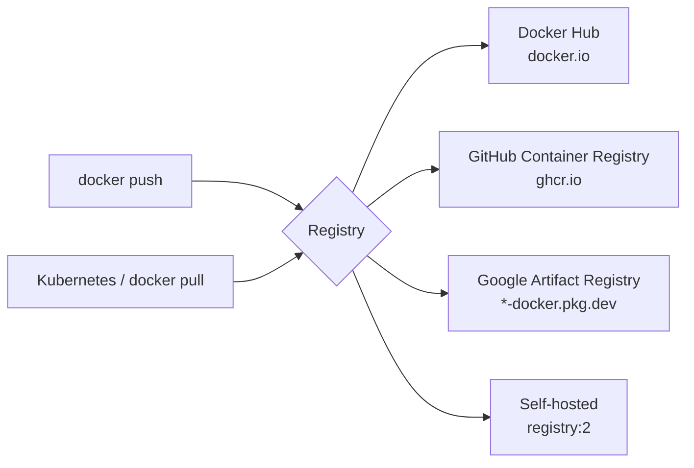

# 07 — Registries

> A registry stores OCI image manifests + layer blobs and serves them over HTTPS.

## The big three (and a private option)



| Registry | Hostname prefix | Auth |
|----------|-----------------|------|
| Docker Hub | `docker.io/` (implicit) | username + PAT |
| GHCR | `ghcr.io/<user>/` | GitHub PAT with `write:packages` |
| Google Artifact Registry | `<region>-docker.pkg.dev/<project>/<repo>/` | gcloud creds or service account |
| AWS ECR | `<acct>.dkr.ecr.<region>.amazonaws.com/` | `aws ecr get-login-password` |
| Azure ACR | `<name>.azurecr.io/` | `az acr login` |
| Private | your-host:5000 | basic auth / mTLS |

## Tag, login, push, pull

```bash
# 1. Build
docker build -t myapp:1.0 .

# 2. Tag for the destination registry
docker tag myapp:1.0 ghcr.io/myuser/myapp:1.0
docker tag myapp:1.0 ghcr.io/myuser/myapp:latest

# 3. Login (one time per registry)
echo $GITHUB_PAT | docker login ghcr.io -u myuser --password-stdin

# 4. Push
docker push ghcr.io/myuser/myapp:1.0
docker push ghcr.io/myuser/myapp:latest

# 5. Pull (anywhere)
docker pull ghcr.io/myuser/myapp:1.0
```

## Try it — pull from GCR (no auth needed for public images)

```bash
docker pull gcr.io/google-samples/hello-app:1.0
docker pull gcr.io/google-samples/hello-app:2.0
docker images gcr.io/google-samples/hello-app
# → REPOSITORY                              TAG   IMAGE ID       CREATED      SIZE
# → gcr.io/google-samples/hello-app         1.0   ...            x years ago  ~10MB
# → gcr.io/google-samples/hello-app         2.0   ...            x years ago  ~10MB
```

## Run a private registry locally

```bash
# 1. Start the registry
docker run -d -p 5000:5000 --name registry \
  -v regdata:/var/lib/registry \
  registry:2

# 2. Tag for it
docker tag alpine:3.20 localhost:5000/alpine:3.20

# 3. Push
docker push localhost:5000/alpine:3.20

# 4. Pull from a fresh client
docker rmi localhost:5000/alpine:3.20
docker pull localhost:5000/alpine:3.20

# 5. Browse the API
curl http://localhost:5000/v2/_catalog
# → {"repositories":["alpine"]}
curl http://localhost:5000/v2/alpine/tags/list
# → {"name":"alpine","tags":["3.20"]}

docker rm -f registry
```

## Tagging strategy (do this in CI)

```bash
SHA=$(git rev-parse --short HEAD)
VERSION=$(git describe --tags --always)

docker build -t myapp:$SHA -t myapp:$VERSION -t myapp:latest .
docker tag myapp:$SHA   ghcr.io/me/myapp:$SHA
docker tag myapp:$VERSION ghcr.io/me/myapp:$VERSION
docker push --all-tags ghcr.io/me/myapp
```

**Always push at least 2 tags:** an immutable one (`:$SHA`) and a moving one (`:latest` or `:v1`).

## Where credentials live

```bash
cat ~/.docker/config.json
# → {
# →   "auths": {
# →     "ghcr.io": { "auth": "base64(user:pat)" }
# →   }
# → }
```

> ⚠️ This is **base64, not encryption**. Use `docker login` with a credential helper (osxkeychain, secretservice, wincred) for real safety.

## Inspect a remote image without pulling

```bash
docker manifest inspect ghcr.io/myuser/myapp:1.0
# → { "schemaVersion": 2, "manifests": [...] }
```

Or with `crane` (https://github.com/google/go-containerregistry):
```bash
crane manifest gcr.io/google-samples/hello-app:1.0 | jq .
crane config gcr.io/google-samples/hello-app:1.0  | jq .
```

## Gotchas

> ⚠️ Docker Hub rate-limits anonymous pulls (100/6h per IP). Authenticate even for public images in CI.

> ⚠️ `docker push` without a registry prefix pushes to **Docker Hub**. Tagging matters.

> ⚠️ `:latest` is just a tag. The registry doesn't auto-update it. *You* must re-push.

> ⚠️ Pulled images are content-addressed by **digest** (`@sha256:...`). Pin by digest in K8s manifests for true immutability.

## Docs
- https://docs.docker.com/reference/cli/docker/login/
- https://docs.docker.com/reference/cli/docker/image/push/
- https://distribution.github.io/distribution/
- https://docs.github.com/en/packages/working-with-a-github-packages-registry/working-with-the-container-registry
- https://cloud.google.com/artifact-registry/docs/docker
