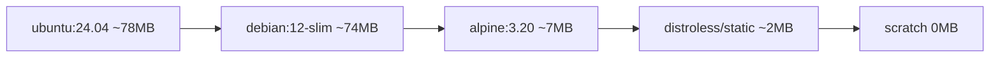

# 08 — Image Optimization

> Smaller image = faster pulls = faster deploys = smaller attack surface.

## The size hierarchy

<!-- mermaid:rendered -->
<p align="center"></p>

<details><summary>Mermaid source</summary>

<!-- mermaid:rendered -->
<p align="center"></p>

<details><summary>Mermaid source</summary>

<!-- mermaid:rendered -->
<p align="center"></p>

<details><summary>Mermaid source</summary>



</details>

</details>

</details>

But **smaller isn't always better** — alpine uses musl (libc differences), distroless has no shell (no `docker exec sh`), scratch has no CA certs.

## The 5 levers

1. **Pick a slim base** — `python:3.12-slim` not `python:3.12`
2. **Multi-stage build** — toolchain stays in build stage
3. **`.dockerignore`** — don't ship `.git`, `node_modules`, `__pycache__`
4. **Order layers by churn** — deps before code (cache hits)
5. **Combine `RUN` commands + clean in same layer**

## Before → after

### ❌ Naive Python (450 MB)
```dockerfile
FROM python:3.12
COPY . /app
RUN cd /app && pip install -r requirements.txt
CMD python /app/app.py
```

### ✅ Optimized (130 MB)
```dockerfile
FROM python:3.12-slim AS build
WORKDIR /app
COPY requirements.txt .
RUN pip install --user --no-cache-dir -r requirements.txt
COPY . .

FROM python:3.12-slim
WORKDIR /app
COPY --from=build /root/.local /root/.local
COPY --from=build /app /app
ENV PATH=/root/.local/bin:$PATH
CMD ["python", "app.py"]
```

## .dockerignore (always start with this)

```
.git
.gitignore
.github
.vscode
.idea
node_modules
__pycache__
*.pyc
*.pyo
.pytest_cache
.coverage
.env
.env.*
dist
build
*.md
docs/
tests/
Dockerfile
docker-compose*.yml
.DS_Store
```

## Try it — measure with `dive`

`dive` is a TUI that shows layer-by-layer waste:

```bash
docker run --rm -it \
  -v /var/run/docker.sock:/var/run/docker.sock \
  wagoodman/dive:latest myapp:1.0
```

You'll see:
- **Wasted Space** (files added then deleted in later layers)
- **Image efficiency score** (target > 95%)

## Common waste patterns

### apt-get cache
```dockerfile
# ❌ leaves 30+ MB of /var/lib/apt/lists
RUN apt-get update && apt-get install -y curl

# ✅ clean in same layer
RUN apt-get update && \
    apt-get install -y --no-install-recommends curl && \
    rm -rf /var/lib/apt/lists/*
```

### pip cache
```dockerfile
RUN pip install --no-cache-dir -r requirements.txt
```

### npm cache
```dockerfile
RUN npm ci --omit=dev && npm cache clean --force
```

### Build artifacts left behind
```dockerfile
# ❌ wheel/source still in image
RUN python setup.py bdist_wheel && pip install dist/*.whl

# ✅ multi-stage
FROM python:3.12 AS build
RUN python setup.py bdist_wheel
FROM python:3.12-slim
COPY --from=build /app/dist/*.whl /tmp/
RUN pip install /tmp/*.whl && rm /tmp/*.whl
```

## Layer cache: order by frequency of change

```dockerfile
FROM node:20-alpine
WORKDIR /app

# 1. Rare changes → top
COPY package*.json ./
RUN npm ci --omit=dev

# 2. Frequent changes → bottom
COPY src/ ./src/
COPY public/ ./public/

CMD ["node", "src/server.js"]
```

Edit `src/server.js` → only the bottom 2 layers rebuild. `npm ci` (slow) is cached.

## BuildKit cache mounts (huge speedup for package managers)

```dockerfile
# syntax=docker/dockerfile:1.7
FROM python:3.12-slim
WORKDIR /app
COPY requirements.txt .
RUN --mount=type=cache,target=/root/.cache/pip \
    pip install -r requirements.txt
COPY . .
```

The pip cache **persists across builds** but isn't included in the final image.

## Measure your savings

```bash
docker images myapp
# → myapp   v1-naive     1.0   abc   2 min ago    450MB
# → myapp   v2-slim      1.0   def   1 min ago    130MB
# → myapp   v3-distroless 1.0  ghi   30 sec ago    65MB

# how many bytes per layer
docker history myapp:v3-distroless --no-trunc --format "table {{.Size}}\t{{.CreatedBy}}"
```

## Gotchas

> ⚠️ Alpine uses **musl libc** — Python wheels compiled for glibc may not work. Use `python:3.12-slim` (Debian glibc) if pip installs fail.

> ⚠️ `pip install --user` writes to `~/.local` — but `~` differs between build and runtime stages if `USER` changes. Be explicit with `--target=/install` and `PYTHONPATH`.

> ⚠️ `COPY` order matters for cache. Sorting `requirements.txt` lines alphabetically also stabilizes cache keys.

> ⚠️ `:latest` defeats caching in CI — always tag with SHA.

## Docs
- https://docs.docker.com/build/cache/
- https://docs.docker.com/build/building/best-practices/
- https://github.com/wagoodman/dive
- https://docs.docker.com/build/cache/optimize/
