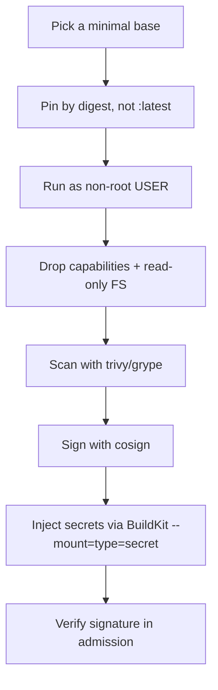

# 09 — Security

> Default Docker is convenient, not safe. Tighten before prod.

## The hardening checklist

<!-- mermaid:rendered -->
<p align="center"></p>

<details><summary>Mermaid source</summary>

<!-- mermaid:rendered -->
<p align="center"></p>

<details><summary>Mermaid source</summary>

<!-- mermaid:rendered -->
<p align="center"></p>

<details><summary>Mermaid source</summary>



</details>

</details>

</details>

## 1. Non-root USER

Default container UID is **0 (root)** — same UID as host root unless user namespaces are on.

```dockerfile
RUN groupadd --system app && useradd --system --gid app --no-create-home app
USER app
```

In compose / `docker run`:
```bash
docker run --user 1000:1000 myimg
```

## 2. Pin by digest

```dockerfile
# ❌ moving target
FROM python:3.12-slim

# ✅ pinned (use docker buildx imagetools inspect to get the digest)
FROM python:3.12-slim@sha256:abc123def456...
```

## 3. Read-only root filesystem + drop caps

```bash
docker run \
  --read-only \
  --tmpfs /tmp:size=64m \
  --cap-drop=ALL \
  --cap-add=NET_BIND_SERVICE \
  --security-opt no-new-privileges \
  myimg
```

In compose:
```yaml
services:
  api:
    image: myapi
    read_only: true
    tmpfs: [/tmp]
    cap_drop: [ALL]
    cap_add: [NET_BIND_SERVICE]
    security_opt:
      - no-new-privileges:true
```

## 4. Scan — Trivy

```bash
brew install trivy

trivy image --severity HIGH,CRITICAL myapp:1.0
# → myapp:1.0 (debian 12.5)
# → ===========================
# → Total: 3 (HIGH: 2, CRITICAL: 1)
# →
# → ┌──────────┬──────────────────┬──────────┬─────────┬───────────────┐
# → │ Library  │ Vulnerability    │ Severity │ Status  │ Fixed Version │
# → ├──────────┼──────────────────┼──────────┼─────────┼───────────────┤
# → │ libssl3  │ CVE-2024-XXXX    │ CRITICAL │ fixed   │ 3.0.13-1+deb12│
```

CI gate:
```bash
trivy image --exit-code 1 --severity CRITICAL myapp:1.0
```

## 5. Scan — Grype

```bash
brew install grype
grype myapp:1.0
```

## 6. Sign + verify with cosign (Sigstore)

```bash
brew install cosign

# Generate keypair (or use keyless OIDC in CI)
cosign generate-key-pair

# Sign the image
cosign sign --key cosign.key ghcr.io/me/myapp:1.0

# Verify
cosign verify --key cosign.pub ghcr.io/me/myapp:1.0
# → Verification for ghcr.io/me/myapp:1.0 --
# → The following checks were performed:
# →   - The cosign claims were validated
# →   - The signatures were verified against the specified public key
```

Keyless (CI, GitHub Actions OIDC):
```bash
cosign sign ghcr.io/me/myapp:1.0    # uses Fulcio / Rekor
```

## 7. Build-time secrets (BuildKit)

```dockerfile
# syntax=docker/dockerfile:1.7
FROM alpine
RUN --mount=type=secret,id=npmrc,target=/root/.npmrc \
    npm install
```

```bash
DOCKER_BUILDKIT=1 docker build \
  --secret id=npmrc,src=$HOME/.npmrc \
  -t myapp .
```

The secret is **only mounted during that RUN** and **never lands in any layer**.

## 8. Don't pass secrets via `--build-arg` or `ENV`

```dockerfile
# ❌ NEVER — leaks into layer history forever
ARG AWS_SECRET_ACCESS_KEY
ENV API_TOKEN=$AWS_SECRET_ACCESS_KEY
```

`docker history` will show them. Even after `unset`, they're in the layer config.

## 9. SBOM generation

```bash
docker buildx build --sbom=true -t myapp:1.0 .
docker buildx imagetools inspect myapp:1.0 --format '{{ json .SBOM }}'
```

Or with syft:
```bash
syft myapp:1.0 -o spdx-json > sbom.json
```

## 10. The Docker daemon socket

```bash
# ❌ THIS IS REMOTE ROOT ON YOUR HOST
docker run -v /var/run/docker.sock:/var/run/docker.sock alpine
```

Mounting the socket = the container can launch any other container, mount any path, escape easily. Use socket-proxies (`tecnativa/docker-socket-proxy`) and only expose the minimum API surface.

## Try it — full hardened run

```bash
docker run -d --name hardened \
  --user 65532:65532 \
  --read-only \
  --tmpfs /tmp:size=32m \
  --cap-drop=ALL \
  --security-opt no-new-privileges \
  --memory 128m --cpus 0.5 \
  --pids-limit 100 \
  -p 8080:8080 \
  gcr.io/distroless/static-debian12:nonroot \
  /bin/sleep infinity 2>&1 | head -1
# (will fail because distroless/static has no sleep — point is to see the flags)
```

## Gotchas

> ⚠️ `--privileged` disables **every** safeguard. Treat as `sudo rm -rf /` for containers.

> ⚠️ Mounting `/var/run/docker.sock` into a container = giving it root on the host.

> ⚠️ `USER 1000` doesn't help if your **app needs to bind port 80**. Either use `setcap` or run on a high port + reverse proxy.

> ⚠️ Scanners report CVEs against installed packages — they don't know if your app actually *uses* the vulnerable function. Triage before alerting.

## Docs
- https://docs.docker.com/engine/security/
- https://docs.docker.com/build/building/secrets/
- https://aquasecurity.github.io/trivy/
- https://docs.sigstore.dev/cosign/overview/
- https://github.com/anchore/grype
