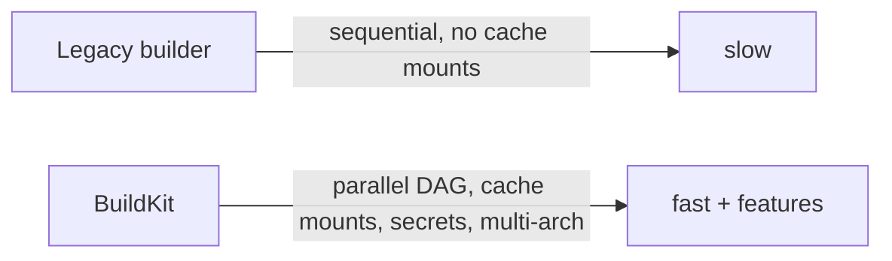

# 10 — BuildKit and buildx

> BuildKit is the new build engine. `buildx` is the CLI that exposes its full power.

## Why care

<!-- mermaid:rendered -->
<p align="center"></p>

<details><summary>Mermaid source</summary>



</details>
| Feature | Legacy | BuildKit |
|---------|--------|----------|
| Parallel stages | ❌ | ✅ |
| Cache mounts (`--mount=type=cache`) | ❌ | ✅ |
| Secret mounts (`--mount=type=secret`) | ❌ | ✅ |
| SSH agent mounts | ❌ | ✅ |
| Multi-platform | ❌ | ✅ (via QEMU or remote nodes) |
| Cache export to registry | ❌ | ✅ |
| SBOM + provenance | ❌ | ✅ |

BuildKit is **default since Docker 23**. To force it on older:
```bash
export DOCKER_BUILDKIT=1
```

## buildx — the multi-builder CLI

```bash
docker buildx version
# → github.com/docker/buildx v0.17.x

docker buildx ls
# → NAME/NODE       DRIVER/ENDPOINT  STATUS  PLATFORMS
# → default*        docker            running linux/amd64, linux/arm64
```

## Multi-platform builds

```bash
# 1. Create a buildx builder that uses QEMU emulation
docker buildx create --name multi --use --bootstrap

# 2. Build for amd64 + arm64 in one shot, push to registry
docker buildx build \
  --platform linux/amd64,linux/arm64 \
  -t ghcr.io/me/myapp:1.0 \
  --push \
  .
```

> ⚠️ Multi-arch images **must be pushed** to a registry — local Docker can only hold one arch per tag. Use `--load` only for single-platform.

## Cache mounts — kill repeated dep installs

```dockerfile
# syntax=docker/dockerfile:1.7
FROM python:3.12-slim
WORKDIR /app
COPY requirements.txt .
RUN --mount=type=cache,target=/root/.cache/pip \
    pip install -r requirements.txt
COPY . .
```

The first `# syntax=` line **must be on line 1** to enable BuildKit frontend features.

For Go:
```dockerfile
# syntax=docker/dockerfile:1.7
FROM golang:1.23 AS build
WORKDIR /src
COPY . .
RUN --mount=type=cache,target=/go/pkg/mod \
    --mount=type=cache,target=/root/.cache/go-build \
    go build -o /out/app .
```

## Secret mounts

```dockerfile
# syntax=docker/dockerfile:1.7
FROM alpine
RUN --mount=type=secret,id=ghtoken \
    apk add --no-cache curl && \
    curl -H "Authorization: token $(cat /run/secrets/ghtoken)" \
         https://api.github.com/user
```

```bash
docker buildx build --secret id=ghtoken,env=GH_TOKEN -t myimg .
```

## SSH agent forwarding (private repos)

```dockerfile
# syntax=docker/dockerfile:1.7
FROM alpine
RUN apk add --no-cache git openssh
RUN --mount=type=ssh git clone git@github.com:me/private.git
```

```bash
docker buildx build --ssh default -t myimg .
```

## Cache export to a registry

```bash
docker buildx build \
  --cache-to   type=registry,ref=ghcr.io/me/myapp:cache,mode=max \
  --cache-from type=registry,ref=ghcr.io/me/myapp:cache \
  -t ghcr.io/me/myapp:1.0 \
  --push .
```

CI builds pull cache from the registry → near-instant cold builds.

## Inline cache (simpler, less powerful)

```bash
docker buildx build \
  --cache-to   type=inline \
  --cache-from ghcr.io/me/myapp:1.0 \
  -t ghcr.io/me/myapp:1.0 \
  --push .
```

Stores cache metadata **inside the image** itself.

## Try it — multi-arch build

```bash
docker buildx create --name demo --use --bootstrap
cd ../03-images-and-dockerfile/examples/02-multistage
docker buildx build \
  --platform linux/amd64,linux/arm64 \
  -t go-hello:multi \
  --load .
# → ERROR: docker exporter does not currently support exporting manifest lists
# (expected — that's why multi-arch needs --push to a registry)
```

Single arch with cache:
```bash
docker buildx build --platform linux/amd64 -t go-hello:1.0 --load .
```

## Build outputs (not just images)

```bash
# Export filesystem instead of an image
docker buildx build -o type=local,dest=./out .

# Export as a tarball
docker buildx build -o type=tar,dest=./image.tar .

# OCI image tarball
docker buildx build -o type=oci,dest=./oci.tar .
```

## Inspect what BuildKit produced

```bash
docker buildx imagetools inspect ghcr.io/me/myapp:1.0
# → Name:      ghcr.io/me/myapp:1.0
# → MediaType: application/vnd.oci.image.index.v1+json
# → Digest:    sha256:...
# →
# → Manifests:
# →   linux/amd64  digest: sha256:...
# →   linux/arm64  digest: sha256:...
```

## Gotchas

> ⚠️ Cache mounts are **builder-local**. Switching builders loses them. Use registry cache for CI.

> ⚠️ Multi-arch via QEMU is **slow** (10–30× native). For fast cross-builds use remote builders on native hardware.

> ⚠️ `--load` and `--push` are mutually exclusive. `--load` only works for single-platform.

> ⚠️ The `# syntax=` directive must be **first line**, not after a comment header.

## Docs
- https://docs.docker.com/build/buildkit/
- https://docs.docker.com/build/building/multi-platform/
- https://docs.docker.com/build/cache/backends/
- https://docs.docker.com/reference/cli/docker/buildx/
- https://github.com/moby/buildkit
