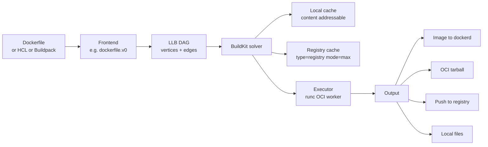
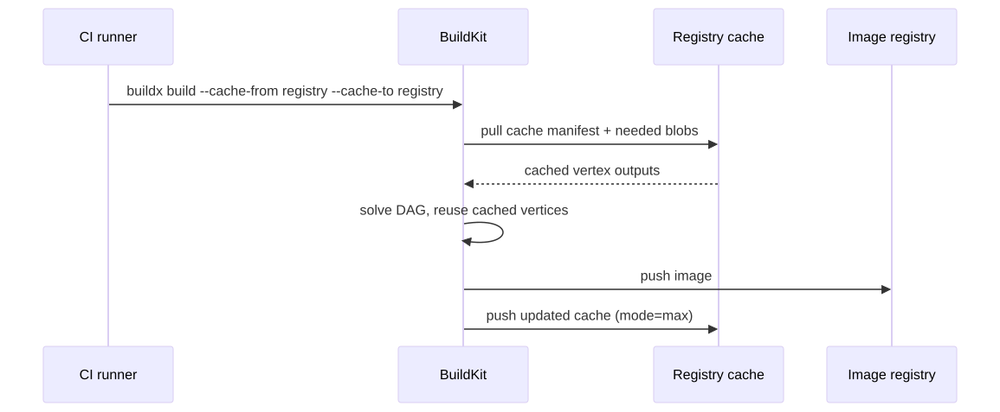
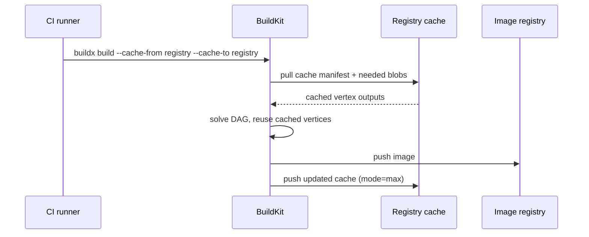

# Deep Dive: BuildKit — LLB, Frontends, and the Cache

## Why this matters

BuildKit is the modern Docker build engine and the default in `docker buildx`. It transforms a `Dockerfile` (or any other build definition) into a directed acyclic graph called **LLB**, then executes nodes in **parallel** with content-addressable caching that can be exported to a registry. If you have ever wondered why your CI builds the same image in 8 minutes when locally it takes 30 seconds, the answer is almost always: BuildKit cache strategy. Knowing LLB, frontends, `--mount=type=cache`, and registry cache export is the difference between minutes-long CI and second-long CI.

---

## Mental model

The classic builder evaluated a Dockerfile linearly: one instruction at a time, sequential, cache by parent layer hash. BuildKit changed everything:

1. The Dockerfile is parsed by a **frontend** into LLB (Low Level Build).
2. LLB is a DAG of vertices (operations) — copy, run, source, mount.
3. The **solver** walks the DAG, runs independent vertices in **parallel**, and consults a content-addressable cache.
4. Outputs are produced and optionally exported (image, tar, local files, registry).

```
Dockerfile  --[dockerfile frontend]-->  LLB DAG  --[solver]-->  result
                                            |
                                            +---> cache lookup (local + remote)
                                            +---> parallel execution
                                            +---> export (image, oci, local, registry)
```

---

## Architecture

<!-- mermaid:rendered -->
<p align="center"></p>

<details><summary>Mermaid source</summary>



</details>

---

## Frontends

A frontend is a program that knows how to translate some build definition into LLB. BuildKit ships with `dockerfile.v0` but you can pin any image as a frontend with the syntax directive:

```dockerfile
# syntax=docker/dockerfile:1.7
FROM alpine
RUN echo hi
```

That `# syntax` line tells BuildKit: "pull this image, run it as the frontend, and let it parse this file". This is how new Dockerfile features (`RUN --mount`, `COPY --link`, heredocs) ship without upgrading dockerd.

Other frontends:
- **buildpacks-frontend** — turns a source repo + buildpack into LLB.
- **mopy / dockerfile-hcl** — HCL-flavored Dockerfile.
- Custom — any image that implements the gateway protocol.

---

## LLB — Low Level Build

LLB is a protobuf-defined IR that describes a build as a DAG. Vertex types include:

| Op | Meaning |
|----|---------|
| `source` | image, git, http, local context |
| `exec` | run a command in a container with mounts |
| `file` | mkdir, copy, rm |
| `merge` / `diff` | layer composition |

Every vertex has a deterministic **digest** computed from its inputs. Two vertices with the same digest produce the same output — that is the cache key. This is why LLB gives you "free" parallelism and content-addressable caching.

You can dump the LLB of any Dockerfile:

```bash
docker buildx debug --invoke /bin/sh build .
# or
buildctl debug dump-llb < <(buildctl debug dump-metadata --frontend=dockerfile.v0 --local context=. --local dockerfile=.)
```

---

## Parallel execution — the part that feels like magic

Multi-stage Dockerfiles map to independent LLB subgraphs. Stages with no data dependency between them run **at the same time**.

```dockerfile
# syntax=docker/dockerfile:1.7

FROM golang:1.22 AS gobuild
WORKDIR /src
COPY go.* ./
RUN --mount=type=cache,target=/go/pkg/mod go mod download
COPY . .
RUN --mount=type=cache,target=/root/.cache/go-build \
    --mount=type=cache,target=/go/pkg/mod \
    go build -o /out/api ./cmd/api

FROM node:20 AS jsbuild
WORKDIR /web
COPY web/package*.json ./
RUN --mount=type=cache,target=/root/.npm npm ci
COPY web/ .
RUN npm run build

FROM gcr.io/distroless/base-debian12 AS final
COPY --from=gobuild /out/api /api
COPY --from=jsbuild /web/dist /web
ENTRYPOINT ["/api"]
```

`gobuild` and `jsbuild` have no data flow between them. BuildKit runs them concurrently. Total wall time = max(go build, node build) + final assembly, not the sum.

---

## Cache mounts — `--mount=type=cache`

A cache mount is a writable directory **shared across builds** but **not** included in the resulting image. It is owned by BuildKit, scoped by an `id` (defaults to the target path), and survives between builds.

```dockerfile
RUN --mount=type=cache,target=/root/.cache/go-build,id=go-build \
    --mount=type=cache,target=/go/pkg/mod,id=go-mod \
    go build ./...
```

Without it: every cache miss re-downloads modules and recompiles everything from scratch.
With it: only changed packages recompile. Typical 10x-100x speedup on incremental builds.

Other useful mount types:
- `--mount=type=secret,id=npmrc,target=/root/.npmrc` — never lands in the image, never in cache key
- `--mount=type=ssh` — forward SSH agent for `git clone` of private repos
- `--mount=type=bind,from=stage,source=/x,target=/y` — pull files from another stage without `COPY`
- `--mount=type=tmpfs` — fast scratch

---

## Cache export — making CI as fast as local

By default the cache lives in `/var/lib/buildkit` (or `/var/lib/docker/buildkit`). On a stateless CI runner, that disappears between jobs.

The fix: **export and import** cache from a remote location.

```bash
# Build, push image, AND push cache as a sibling tag in registry
docker buildx build \
  --tag registry.example.com/app:latest \
  --cache-to   type=registry,ref=registry.example.com/app:buildcache,mode=max \
  --cache-from type=registry,ref=registry.example.com/app:buildcache \
  --push \
  .
```

| Cache backend | Use |
|---------------|-----|
| `type=inline`   | embed cache in the image manifest (small, single-platform) |
| `type=registry` | dedicated tag in the registry, multi-platform, granular |
| `type=local`    | path on disk |
| `type=gha`      | GitHub Actions cache |
| `type=s3`       | S3 bucket |
| `type=azblob`   | Azure blob |

`mode=min` (default) caches only the layers that end up in the final image. `mode=max` caches **every** intermediate vertex — much larger but yields perfect cache hits on multi-stage builds.

<!-- mermaid:rendered -->
<p align="center"></p>

<details><summary>Mermaid source</summary>



</details>

---

## Walkthrough — from Dockerfile to LLB to image

1. `docker buildx build .` invokes the buildx CLI which talks to a buildkitd instance (in-container by default).
2. buildkitd fetches the frontend image (from `# syntax`) and runs it.
3. The frontend reads the Dockerfile, the build context, args, secrets, and emits an LLB DAG.
4. The solver computes the digest of each vertex.
5. For each vertex: check local cache, then remote `--cache-from` sources. If hit, materialize the cached output. If miss, schedule on a worker (runc executor).
6. Independent miss vertices run in parallel.
7. As vertices complete, downstream ones become ready.
8. The final stage's layers are assembled into an OCI manifest and exported per `--output` / `--push`.
9. If `--cache-to` is set, every executed vertex's output is pushed to the cache backend.

---

## Common interview questions

> If you can answer Q3 and Q6 cleanly, you're already ahead of most candidates.

**Q1. What is LLB and why does BuildKit need it?**
Low Level Build is a DAG-based intermediate representation of a build. It decouples "what to build" (Dockerfile, HCL, buildpack) from "how to execute" (parallel solver, caching). Each vertex is content-addressed, enabling cache lookups and parallel execution.

**Q2. How is the build cache key computed?**
For each LLB vertex, the digest is a hash of its operation type, parameters, and input vertices' digests. Two vertices with the same digest produce the same output, so the cache key is the digest itself. This is purely content-addressable — order does not matter as long as inputs match.

**Q3. Difference between `--mount=type=cache` and a layer?**
A cache mount is a writable directory persisted by BuildKit between builds, but **never** included in the image. Its contents do not affect the layer's digest. A layer is part of the image — its content is hashed and stored as an OCI blob.

**Q4. `cache-to mode=min` vs `mode=max`?**
`min` only caches layers that end up in the final image. `max` caches every intermediate vertex, including builder-stage outputs. `max` is much larger but gives perfect cache hits on multi-stage builds where intermediate stages do heavy work.

**Q5. Why does multi-stage suddenly build in parallel under BuildKit?**
The Dockerfile frontend turns each stage with no data dependency into an independent LLB subgraph. The solver schedules them concurrently on the executor. Classic builder was sequential by construction.

**Q6. How do `# syntax=docker/dockerfile:1.7` directives work?**
BuildKit treats the value as a frontend image. It pulls and runs it with the build context, and the image's entrypoint translates the Dockerfile into LLB. This decouples Dockerfile feature releases from dockerd upgrades — new instructions ship by bumping the syntax line.

**Q7. Why might `--cache-from registry` not give you any cache hits?**
Common causes: (1) the cache was exported with `mode=min` but you need intermediate stages — switch to `mode=max`; (2) base image digest changed (new pull resolves to different sha); (3) different platform (amd64 vs arm64 caches are separate); (4) secrets or args that participate in the cache key changed.

**Q8. How do you safely use a private npm token in a build without baking it into the image?**
`RUN --mount=type=secret,id=npm,target=/root/.npmrc npm ci`. Provide it on the CLI: `--secret id=npm,src=$HOME/.npmrc`. The file is only mounted during that RUN, never in any layer, never in the cache key.

---

## Sources

- BuildKit repo: https://github.com/moby/buildkit
- LLB design: https://github.com/moby/buildkit/blob/master/docs/dev/solver.md
- Dockerfile frontend reference: https://docs.docker.com/reference/dockerfile/
- Cache backends: https://docs.docker.com/build/cache/backends/
- `RUN --mount` reference: https://docs.docker.com/reference/dockerfile/#run---mount
- buildx: https://github.com/docker/buildx
- "Tonis Tiigi: BuildKit deep dive" (DockerCon talks)
- "Faster CI builds with BuildKit": https://docs.docker.com/build/ci/
