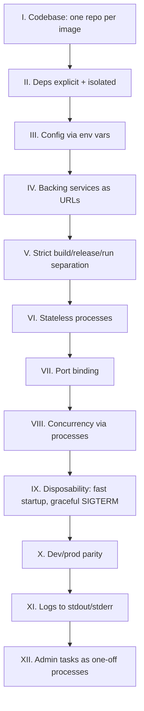
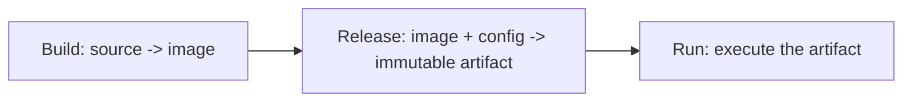

# 11 — Production Patterns

> The difference between a Dockerfile that works on your laptop and one that survives Black Friday.

## The 12-factor checklist for containers



## Pattern 1 — Init system (`tini`) for proper signal handling

PID 1 in Linux has special responsibilities: reap zombies, forward signals. Most apps don't do this.

```dockerfile
FROM alpine:3.20
RUN apk add --no-cache tini
ENTRYPOINT ["/sbin/tini", "--"]
CMD ["myapp"]
```

Or use Docker's built-in:
```bash
docker run --init myimg
```

## Pattern 2 — Graceful shutdown

`docker stop` sends `SIGTERM`, waits 10s (default), then `SIGKILL`. Your app must handle SIGTERM:

```python
# Python
import signal, sys
def shutdown(signum, frame):
    print("draining...", flush=True)
    sys.exit(0)
signal.signal(signal.SIGTERM, shutdown)
```

```go
// Go
ctx, stop := signal.NotifyContext(context.Background(), syscall.SIGTERM, syscall.SIGINT)
defer stop()
server.Shutdown(ctx)
```

Configure grace window:
```bash
docker stop --time 30 mycontainer
```

## Pattern 3 — Logs to stdout/stderr

Never write logs to files inside the container.

```python
# ❌ WRONG
logging.basicConfig(filename='/var/log/app.log')

# ✅ RIGHT
logging.basicConfig(stream=sys.stdout, level=logging.INFO)
```

Docker captures stdout/stderr → `docker logs` → log driver (json-file, journald, fluentd, gelf, awslogs...).

```yaml
# compose: ship logs to a remote collector
services:
  app:
    image: myapp
    logging:
      driver: gelf
      options:
        gelf-address: "udp://logstash:12201"
```

## Pattern 4 — Healthchecks

```dockerfile
HEALTHCHECK --interval=30s --timeout=3s --start-period=10s --retries=3 \
  CMD wget -qO- http://localhost:8080/healthz || exit 1
```

`docker ps` shows `(healthy)` / `(unhealthy)`. Compose's `depends_on: condition: service_healthy` uses this. K8s ignores it — use K8s probes instead.

## Pattern 5 — Stateless + externalize state

- DB → Postgres / managed
- Cache → Redis / managed
- Files → S3 / object store
- Sessions → cookie / external store

If `docker rm -f` deletes user data, you've done it wrong.

## Pattern 6 — Resource limits (always)

```bash
docker run \
  --memory 512m \
  --memory-swap 512m \
  --cpus 1.0 \
  --pids-limit 200 \
  myimg
```

Without limits, one container OOMs the host. Set them.

## Pattern 7 — Restart policies

```bash
docker run --restart unless-stopped myimg
```

| Policy | Behavior |
|--------|----------|
| `no` (default) | never restart |
| `on-failure[:N]` | restart on non-zero exit, max N times |
| `always` | always restart, even after `docker stop` (after daemon restart) |
| `unless-stopped` | always, except if user stopped it |

## Pattern 8 — Config via env, secrets via mounts

```bash
docker run \
  -e DATABASE_URL=postgres://... \
  -e LOG_LEVEL=info \
  --secret source=db-password,target=/run/secrets/db-password \
  myimg
```

```python
import os
db_url = os.environ["DATABASE_URL"]
db_pw = open("/run/secrets/db-password").read().strip()
```

## Pattern 9 — Build/release/run separation



Same image runs in dev, staging, prod. Only **env config** differs. Never rebuild for prod.

## Pattern 10 — Pin EVERYTHING

```dockerfile
FROM python:3.12.6-slim@sha256:abc...
RUN pip install --no-cache-dir flask==3.0.3 gunicorn==23.0.0
```

Floating tags = your prod image silently changes. Pin base, pin deps, pin OS packages where you can (`apt-get install nginx=1.22.1-9`).

## Pattern 11 — One concern per container

```yaml
# ❌ supervisord running nginx + app + cron in one container
# ✅ three containers in compose, each one process
services:
  app:    { image: myapp }
  nginx:  { image: nginx, depends_on: [app] }
  cron:   { image: myapp, command: ["python", "scheduler.py"] }
```

## Pattern 12 — Reproducible builds

- Use `docker buildx --provenance=true --sbom=true`
- Pin everything
- Don't depend on build-time clock (`COPY --link` for stable hashes)

## Production-ready Dockerfile template

```dockerfile
# syntax=docker/dockerfile:1.7
ARG PY_VERSION=3.12.6

# ---- builder ----
FROM python:${PY_VERSION}-slim AS build
WORKDIR /app
COPY requirements.txt .
RUN --mount=type=cache,target=/root/.cache/pip \
    pip install --user --no-cache-dir -r requirements.txt
COPY . .

# ---- runtime ----
FROM python:${PY_VERSION}-slim AS runtime

ARG APP_USER=app
ARG APP_UID=10001

RUN groupadd --system --gid ${APP_UID} ${APP_USER} && \
    useradd  --system --uid ${APP_UID} --gid ${APP_USER} --no-create-home ${APP_USER}

ENV PYTHONUNBUFFERED=1 \
    PYTHONDONTWRITEBYTECODE=1 \
    PATH=/home/${APP_USER}/.local/bin:$PATH

WORKDIR /app
COPY --from=build --chown=${APP_USER}:${APP_USER} /root/.local /home/${APP_USER}/.local
COPY --from=build --chown=${APP_USER}:${APP_USER} /app /app

USER ${APP_USER}

EXPOSE 8080

HEALTHCHECK --interval=30s --timeout=3s --start-period=10s --retries=3 \
  CMD python -c "import urllib.request,sys; sys.exit(0 if urllib.request.urlopen('http://127.0.0.1:8080/healthz').status==200 else 1)"

STOPSIGNAL SIGTERM

ENTRYPOINT ["python", "-m", "gunicorn", "--bind=0.0.0.0:8080", "--workers=2", "app:app"]
```

## Gotchas

> ⚠️ Forgetting `STOPSIGNAL` — some apps (nginx) want `SIGQUIT` not `SIGTERM` for graceful drain.

> ⚠️ Long startup + no `start-period` on healthcheck → container marked unhealthy and killed before it's ready.

> ⚠️ `gunicorn` workers don't reap children unless you use `--preload` carefully — use `tini` or `--init`.

> ⚠️ Logging to a file inside an ephemeral container = lost logs forever.

> ⚠️ K8s ignores `HEALTHCHECK` and `RESTART` — those are Docker concepts. Re-implement as K8s probes + `restartPolicy`.

## Docs
- https://12factor.net/
- https://docs.docker.com/engine/containers/start-containers-automatically/
- https://docs.docker.com/engine/logging/configure/
- https://github.com/krallin/tini
