# 02 — Docker

> From "what's a container?" to building production-grade, multi-arch, signed images.

```
 ____             _             _                          _
|  _ \  ___   ___| | _____ _ __| |    ___  __ _ _ __ _ __ (_)_ __   __ _
| | | |/ _ \ / __| |/ / _ \ '__| |   / _ \/ _` | '__| '_ \| | '_ \ / _` |
| |_| | (_) | (__|   <  __/ |  | |__|  __/ (_| | |  | | | | | | | | (_| |
|____/ \___/ \___|_|\_\___|_|  |_____\___|\__,_|_|  |_| |_|_|_| |_|\__, |
                                                                   |___/
```

## The Journey

```mermaid
flowchart LR
  A[01 Concepts] --> B[02 Install + Hello]
  B --> C[03 Images + Dockerfile]
  C --> D[04 Volumes]
  D --> E[05 Networking]
  E --> F[06 Compose]
  F --> G[07 Registries]
  G --> H[08 Optimization]
  H --> I[09 Security]
  I --> J[10 BuildKit/buildx]
  J --> K[11 Production]
```



## Index

| # | Topic | What you learn |
|---|-------|----------------|
| 01 | [Concepts](./01-concepts/README.md) | Containers vs VMs, namespaces, cgroups, OCI, layers |
| 02 | [Install + Hello World](./02-install-and-hello-world/README.md) | Engine install on macOS/Linux/Windows; first commands |
| 03 | [Images + Dockerfile](./03-images-and-dockerfile/README.md) | Every instruction with runnable examples |
| 04 | [Volumes + Storage](./04-volumes-and-storage/README.md) | bind mounts, named volumes, tmpfs |
| 05 | [Networking](./05-networking/README.md) | bridge, host, none, overlay, user-defined |
| 06 | [Compose](./06-compose/README.md) | Multi-container with WordPress + observability stacks |
| 07 | [Registries](./07-registries/README.md) | Docker Hub, GHCR, GCR; private registry |
| 08 | [Image Optimization](./08-image-optimization/README.md) | Layer caching, .dockerignore, slim, multistage, dive |
| 09 | [Security](./09-security/README.md) | Non-root, scan, sign, secrets via BuildKit |
| 10 | [BuildKit + buildx](./10-buildkit-and-buildx/README.md) | Multi-platform, cache export |
| 11 | [Production Patterns](./11-production-patterns/README.md) | tini, signals, 12-factor, log to stdout |
| – | [Cheatsheet](./cheatsheet.md) | One-page reference |

## Your very first container — pull from Google Container Registry

The simplest possible thing: pull and run a hello-world image hosted on GCR (Google Container Registry).

```bash
docker pull gcr.io/google-samples/hello-app:1.0
# → 1.0: Pulling from google-samples/hello-app
# → Status: Downloaded newer image for gcr.io/google-samples/hello-app:1.0

docker run --rm -p 8080:8080 gcr.io/google-samples/hello-app:1.0
# → 2026/04/26 12:00:00 Server listening on port 8080
```

In another terminal:
```bash
curl http://localhost:8080
# → Hello, world!
# → Version: 1.0.0
# → Hostname: <container-id>
```

`Ctrl+C` to stop. You just pulled an OCI image, ran a container, mapped a port, and served HTTP traffic. Everything that follows is "more of this, with sharper tools".

## Prerequisites

- Docker Engine 24+ (or Docker Desktop) — `docker --version`
- ~5 GB disk for images
- Basic shell knowledge

## How to use this folder

1. Read each topic README in order — they build on each other.
2. Run every "Try it" lab. Don't just read — type.
3. Break things deliberately. Then fix them.
4. Update notes inline with your own gotchas.

> Next: head to `../03-kubernetes-core` to deploy these images on K8s.

## Official docs (the only links you should trust)

- https://docs.docker.com/
- https://docs.docker.com/reference/dockerfile/
- https://github.com/opencontainers/image-spec
