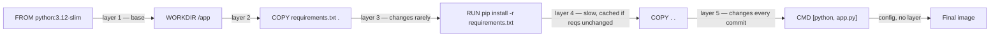
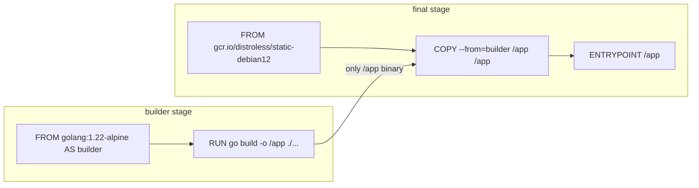
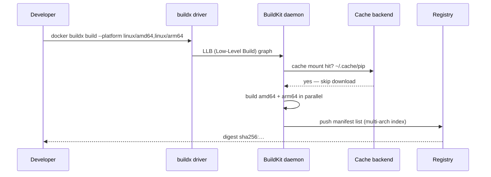
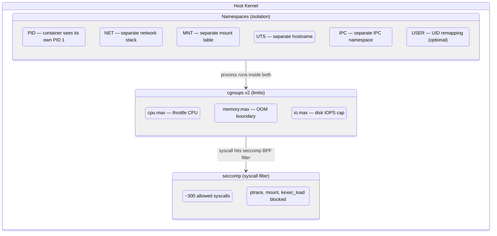
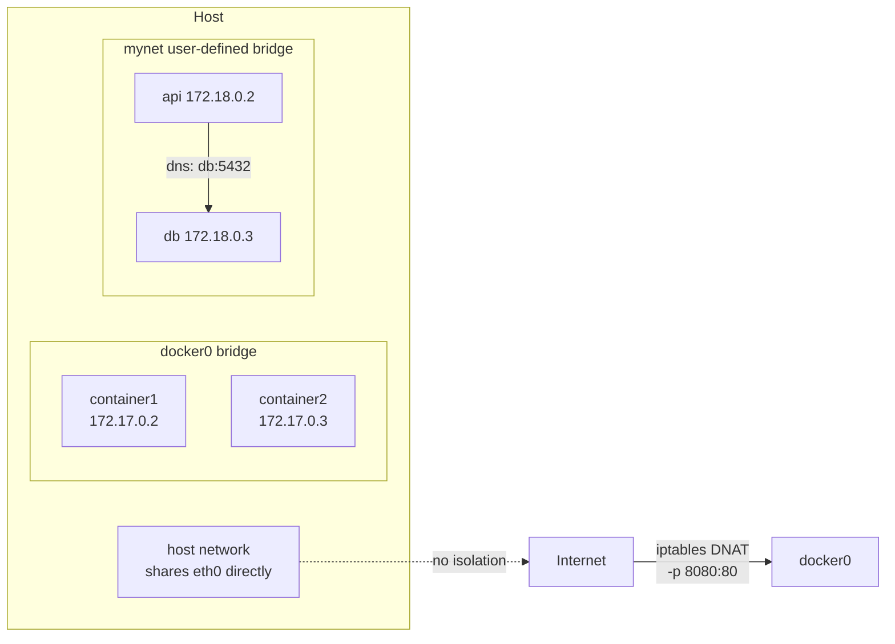
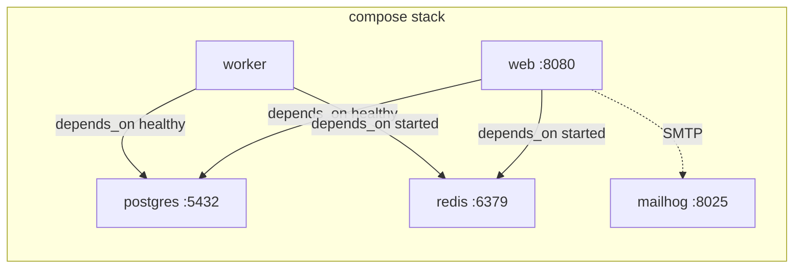
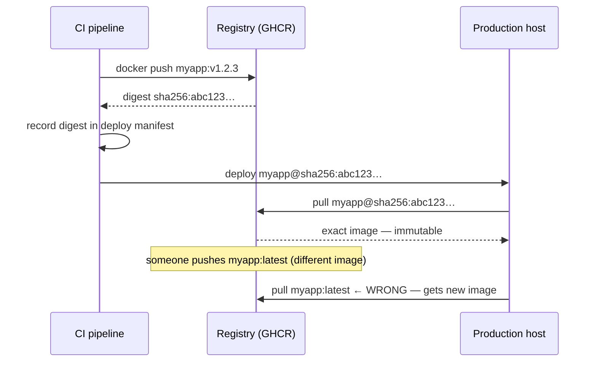
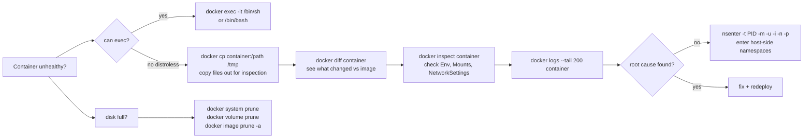

<p class="hero docker"><h1>02 · Docker <em>mastery</em></h1><p class="tagline">Twelve concepts from OCI layers to signed multi-arch images — the ones that survive a 03:00 prod incident.</p></p>

## Roadmap — your learning path

<div class="roadmap" markdown>

<div class="stop" data-step="1" markdown>
#### Images vs containers
Layers, content-addressable store, OCI spec. Know what you're actually running before you run it.
</div>

<div class="stop" data-step="2" markdown>
#### Dockerfile anatomy
FROM, WORKDIR, COPY vs ADD, CMD vs ENTRYPOINT. Ordering for cache efficiency is the art.
</div>

<div class="stop" data-step="3" markdown>
#### Multi-stage builds
Ship tiny prod images. Distroless, static binaries, scratch base — shrink from 900 MB to 8 MB.
</div>

<div class="stop" data-step="4" markdown>
#### BuildKit & buildx
Cache mounts, build secrets, multi-arch in one command. The engine powering `docker build` since 23.x.
</div>

<div class="stop" data-step="5" markdown>
#### Container runtime
Linux namespaces, cgroups v2, seccomp. The four walls of your container — what isolates you and what doesn't.
</div>

<div class="stop" data-step="6" markdown>
#### Volumes & bind mounts
Named volumes, tmpfs, overlay2 internals. Stop losing data on container restart.
</div>

<div class="stop" data-step="7" markdown>
#### Networking
bridge, host, user-defined networks, embedded DNS. How two containers talk without exposing ports to the world.
</div>

<div class="stop" data-step="8" markdown>
#### Docker Compose
services, depends_on with healthchecks, profiles, watch. Orchestrate 12 services locally with one file.
</div>

<div class="stop" data-step="9" markdown>
#### Registries
push/pull, tags vs digests, private registry, GHCR. Never lose an image, never pull the wrong one.
</div>

<div class="stop" data-step="10" markdown>
#### Image security
Non-root user, read-only rootfs, trivy scanning, cosign signing. Ship images that pass the security gate.
</div>

<div class="stop" data-step="11" markdown>
#### Observability
Logs driver, docker stats, docker events, cAdvisor. See inside running containers without exec.
</div>

<div class="stop" data-step="12" markdown>
#### Troubleshooting
docker inspect, exec, layer diff, dangling cleanup. The exact commands for 03:00 when nothing makes sense.
</div>

</div>

---

<div class="grid cards" markdown>

-   :material-layers:{ .lg .middle } **Images & Layers**

    ---
    An image is an immutable stack of OverlayFS layers. `FROM` = base, each `RUN`/`COPY` = new layer.

-   :material-run-fast:{ .lg .middle } **Containers**

    ---
    A container is an image + a writable `upperdir` + isolated namespaces + cgroup limits.

-   :material-lan:{ .lg .middle } **Networking**

    ---
    `bridge` network = Linux bridge + veth pairs. `host` = shared host netns. `none` = isolated.

-   :material-database:{ .lg .middle } **Volumes**

    ---
    Volumes outlive containers. Bind mounts share host paths. tmpfs is ephemeral RAM storage.

</div>

---

## 1. Images vs containers

<div class="concept" markdown>

<span class="stage reason">🧭 Reason</span>

At 03:00 a teammate types `docker pull myapp:latest` and overwrites the running version's image while a container is still live. The container keeps running — but a teammate reboots it and gets the new (broken) image. You need to understand how images and containers are different objects so you can reason about what `docker pull` actually touches, what `docker run` actually does, and why a running container is immune to a concurrent `docker pull` on its tag.

<span class="stage thinking">🧠 Thinking</span>

**Mental model: images are read-only snapshots; containers are writable processes layered on top.**

```mermaid
flowchart LR
  subgraph Registry
    R[myapp:latest\nmanifest + blobs]
  end
  subgraph Local store
    L1[Layer sha256:a1b2 — base OS]
    L2[Layer sha256:c3d4 — app deps]
    L3[Layer sha256:e5f6 — app binary]
    L1 --> L2 --> L3
    L3 --> IMG[Image myapp:latest]
  end
  subgraph Running
    IMG -->|copy-on-write thin R/W layer| C1[Container 1]
    IMG -->|copy-on-write thin R/W layer| C2[Container 2]
  end
  Registry -->|docker pull| Local store
```

- An **image** is an ordered list of read-only layers plus a JSON config. It lives in `/var/lib/docker/overlay2/` on the host.
- Each layer is addressed by its SHA-256 content digest — the **content-addressable store**. Two images sharing a base layer share the same bytes on disk.
- A **container** is an image plus a thin, writable **copy-on-write layer** (the container layer). When a process writes a file, the overlay2 driver copies the file from the image layer up into the container layer first.
- The OCI (Open Container Initiative) spec standardises the image manifest format so Docker, containerd, and Podman can all pull and run the same image.
- `docker pull` updates the local *tag pointer* to a new manifest. Already-running containers keep their old layer references — they are not restarted.

<span class="stage execution">⚡ Execution</span>

```bash
# Pull an image and inspect its layers
docker pull alpine:3.20
docker image inspect alpine:3.20 --format '{{json .RootFS.Layers}}' | jq .

# See how layers are shared on disk
docker system df -v

# Pull two images that share a base; observe the dedup
docker pull python:3.12-slim
docker pull node:20-slim
docker system df   # TotalSize vs SharedSize

# Run two containers from the same image; watch both appear
docker run -d --name c1 alpine:3.20 sleep 300
docker run -d --name c2 alpine:3.20 sleep 300
docker ps
# Inspect the merged mount of container c1
docker inspect c1 --format '{{.GraphDriver.Data.MergedDir}}'
```

<span class="stage simulation">🔮 Simulation — what you'll see</span>

<pre class="sim"><code><span class="prompt">$</span> docker image inspect alpine:3.20 --format '{{json .RootFS.Layers}}' | jq .
<span class="comment"># [</span>
<span class="comment">#   "sha256:a97c7e64765ec1a8c6d2f9a6de9a08cb5da84d6e0b5b1bce5e8caa18f6dab249"</span>
<span class="comment"># ]</span>
<span class="comment"># Alpine is a single-layer image — its whole rootfs is one compressed tar.</span>

<span class="prompt">$</span> docker system df
<span class="comment"># TYPE            TOTAL   ACTIVE   SIZE      RECLAIMABLE</span>
<span class="comment"># Images          4       2        842.3MB   501.2MB (59%)</span>
<span class="comment"># Containers      2       2        0B        0B</span>
<span class="comment"># Local Volumes   0       0        0B        0B</span>
<span class="comment"># Build Cache     12      0        143.2MB   143.2MB</span>

<span class="prompt">$</span> docker inspect c1 --format '{{.GraphDriver.Data.MergedDir}}'
<span class="comment"># /var/lib/docker/overlay2/abc123ef.../merged</span>
<span class="comment"># This is the union mount: image layers + writable container layer fused into one path.</span>
</code></pre>

<span class="stage output">✅ Output — state change</span>

<div class="flow" markdown>

<div class="state before" markdown>
##### Before
<span class="diff-del">image = container</span>
confusion: pull breaks live app
</div>

<div class="arrow">→</div>

<div class="state during" markdown>
##### During
<span class="diff-mod">inspect layers + digests</span>
pull updates tag pointer only
</div>

<div class="arrow">→</div>

<div class="state after" markdown>
##### After
<span class="diff-add">image is immutable snapshot</span>
<span class="diff-add">container owns its CoW layer</span>
running container is unaffected by pull
</div>

</div>

<span class="stage usecase">🌍 Real-world use case</span>

<div class="usecase-card" markdown>
**At Docker Hub** in April 2020, Docker Inc. announced rate-limiting: 100 pulls per 6 hours for anonymous users. Teams that ran `docker pull` on every CI step hit the limit within minutes. The fix was switching all image references from mutable tags (`myimage:latest`) to immutable content digests (`myimage@sha256:abc123…`). Content-addressed pulls are also deduplicated — if the digest is already in the local store, no bytes are transferred at all.
</div>

</div>

---

## 2. Dockerfile anatomy

<div class="concept" markdown>

<span class="stage reason">🧭 Reason</span>

Your CI pipeline takes 8 minutes to build an image. A colleague's identical change takes 45 seconds. The difference is layer ordering. Every instruction in a Dockerfile creates a new layer; Docker caches each layer by the hash of its instruction + parent. When you put `COPY . .` before `RUN pip install`, every source-file change invalidates the pip install layer and re-downloads 200 MB of packages. Understanding Dockerfile anatomy means knowing how to order instructions so the slow steps are cached and the fast steps run fresh.

<span class="stage thinking">🧠 Thinking</span>

**Mental model: a Dockerfile is a sequence of cache-keyed layers — order determines cache hit rate.**



- `FROM` sets the base image. Use `FROM <image>@<digest>` in production for reproducibility.
- `WORKDIR` creates and cd-s into a directory. Never use `RUN cd /app && …` — it's a separate shell.
- `COPY` copies files verbatim. `ADD` unpacks tar files and can fetch URLs — avoid `ADD` unless you need tar extraction.
- `RUN` executes a shell command and commits the result as a layer. Chain commands with `&&` to keep layer count low.
- `CMD` is the default command (overridable by `docker run <image> <cmd>`). `ENTRYPOINT` is the fixed binary. Together: `ENTRYPOINT ["python"]` + `CMD ["app.py"]` → `python app.py`, but `docker run myimage server.py` → `python server.py`.
- `ENV`, `ARG`, `LABEL`, `EXPOSE`, `HEALTHCHECK`, `USER` add metadata or configuration with no extra layer content.

<span class="stage execution">⚡ Execution</span>

```bash
# Create a fast-cache Dockerfile (deps before source)
cat > /tmp/Dockerfile.good <<'EOF'
FROM python:3.12-slim # (1)!
WORKDIR /app          # (2)!
COPY requirements.txt . # (3)!
RUN pip install --no-cache-dir -r requirements.txt # (4)!
COPY . .
ENTRYPOINT ["python"] # (5)!
CMD ["app.py"]        # (6)!
EOF

# Build it, then build again — second build uses full cache
docker build -t myapp:good -f /tmp/Dockerfile.good /tmp
docker build -t myapp:good -f /tmp/Dockerfile.good /tmp
# Second build: "CACHED" on every layer after FROM

# Show instructions and their layer sizes
docker history myapp:good --human --format "table {{.CreatedBy}}\t{{.Size}}"

# Inspect ENTRYPOINT vs CMD
docker inspect myapp:good --format '{{.Config.Entrypoint}} / {{.Config.Cmd}}'
```

1. `slim` variant = Debian base, ~45MB vs ~900MB for full image. Never use `latest` — pin to a version tag or digest.
2. Sets working directory for all subsequent `RUN`/`COPY`/`CMD` — creates it if missing. Never use `RUN cd /app &&`.
3. Copy only requirements first to leverage layer caching — this layer only rebuilds on dependency changes.
4. `--no-cache-dir` prevents pip's download cache from bloating the layer. Chain with `&&` to keep layer count low.
5. `ENTRYPOINT` is the fixed binary — it cannot be overridden by `docker run <image> <arg>` (only replaced with `--entrypoint`).
6. `CMD` is the default argument to `ENTRYPOINT`. `docker run myapp:good server.py` → `python server.py`. Overridable.

!!! prod-danger "The Silent Version Drift"
    **Never use `latest` image tag in production deployments.**
    If a node restarts and pulls `myapp:latest`, it may get a different image than what you originally deployed — silently. Pin to a digest for true immutability:
    ```bash
    docker pull myapp:v1.2.3
    # or use a sha256 digest
    docker run myapp@sha256:abc123...
    ```

<span class="stage simulation">🔮 Simulation — what you'll see</span>

<pre class="sim"><code><span class="prompt">$</span> docker build -t myapp:good -f /tmp/Dockerfile.good /tmp
<span class="comment"># [1/5] FROM python:3.12-slim                                 0.1s</span>
<span class="comment"># [2/5] WORKDIR /app                                          0.0s</span>
<span class="comment"># [3/5] COPY requirements.txt .                               0.0s</span>
<span class="comment"># [4/5] RUN pip install --no-cache-dir -r requirements.txt   34.2s</span>
<span class="comment"># [5/5] COPY . .                                              0.1s</span>

<span class="prompt">$</span> docker build -t myapp:good -f /tmp/Dockerfile.good /tmp
<span class="comment"># [1/5] FROM python:3.12-slim                    CACHED</span>
<span class="comment"># [2/5] WORKDIR /app                             CACHED</span>
<span class="comment"># [3/5] COPY requirements.txt .                  CACHED</span>
<span class="comment"># [4/5] RUN pip install …                        CACHED</span>
<span class="comment"># [5/5] COPY . .                                 CACHED</span>
<span class="comment"># Total: 0.4s  ← from 34s to 0.4s on second build</span>
</code></pre>

<span class="stage output">✅ Output — state change</span>

<div class="flow" markdown>

<div class="state before" markdown>
##### Before
<span class="diff-del">COPY . . before pip install</span>
every commit = 34s full reinstall
</div>

<div class="arrow">→</div>

<div class="state during" markdown>
##### During
<span class="diff-mod">reorder: deps first, src last</span>
cache keys aligned with change frequency
</div>

<div class="arrow">→</div>

<div class="state after" markdown>
##### After
<span class="diff-add">pip layer cached on every source change</span>
<span class="diff-add">build time: 34s → 0.4s</span>
CI pipeline unblocked
</div>

</div>

<span class="stage usecase">🌍 Real-world use case</span>

<div class="usecase-card" markdown>
**At GitLab**, the GitLab CE image (a Rails monolith) had a Dockerfile where `COPY Gemfile* .` appeared after `COPY . .`. Every push invalidated `bundle install` — a 6-minute step run 400+ times per day across all forks. Reordering that single instruction cut aggregate CI minutes by 40% in one commit, saving the company thousands of dollars monthly in runner costs.
</div>

</div>

---

## 3. Multi-stage builds

<div class="concept" markdown>

<span class="stage reason">🧭 Reason</span>

Your Go service image is 1.1 GB — it contains the full Go toolchain, test frameworks, and debug symbols. In production, you ship that entire development environment to every host, increasing your attack surface and pulling time. A multi-stage build lets you compile in one stage (with all the tools) and copy only the output binary into a minimal final stage. The result is a sub-10 MB image with zero build tools, zero package manager, and zero shell.

<span class="stage thinking">🧠 Thinking</span>

**Mental model: each `FROM` opens a new build stage; `COPY --from=<stage>` transfers artifacts without carrying the build environment.**



- The `builder` stage has the full Go toolchain — 350 MB. It compiles the binary with `CGO_ENABLED=0` for a fully static binary.
- The `final` stage uses `gcr.io/distroless/static-debian12` — a base with no shell, no package manager, only CA certs and timezone data.
- `COPY --from=builder /app /app` copies only the compiled binary. Everything else in the builder stage is discarded.
- **Distroless** images come from Google's distroless project. They have no `bash`, no `apt`, no `sh`. An attacker who escapes the container gets an empty shell environment.
- For the absolute minimum, use `FROM scratch` — zero bytes base. Your binary must be statically linked and you must `COPY` any needed CA certs manually.
- Multi-stage also works for Node.js (`npm ci` in build stage, `node_modules` copied to `node:alpine` final) and Java (Maven build → JRE-only final).

<span class="stage execution">⚡ Execution</span>

```bash
# Write a multi-stage Go Dockerfile
cat > /tmp/Dockerfile.go <<'EOF'
# ── builder ──────────────────────────────────────────────
FROM golang:1.22-alpine AS builder
WORKDIR /src
COPY go.mod go.sum ./
RUN go mod download
COPY . .
RUN CGO_ENABLED=0 GOOS=linux go build -ldflags="-s -w" -o /app ./cmd/server

# ── final (distroless) ───────────────────────────────────
FROM gcr.io/distroless/static-debian12:nonroot
COPY --from=builder /app /app
EXPOSE 8080
ENTRYPOINT ["/app"]
EOF

# Compare sizes
docker build -t myapp:fat  --target builder  /tmp   # builder only
docker build -t myapp:slim               /tmp        # full multi-stage
docker images | grep myapp
# → myapp:fat   ~350MB
# → myapp:slim  ~8MB

# Verify no shell in slim image
docker run --rm myapp:slim sh  # → exec: "sh": executable file not found
```

<span class="stage simulation">🔮 Simulation — what you'll see</span>

<pre class="sim"><code><span class="prompt">$</span> docker images | grep myapp
<span class="comment"># REPOSITORY   TAG    IMAGE ID       CREATED        SIZE</span>
<span class="comment"># myapp        slim   d8a1f2e9c3b7   12 seconds ago   8.12MB</span>
<span class="comment"># myapp        fat    a2c4f8b1e9d3   30 seconds ago   352MB</span>

<span class="prompt">$</span> docker run --rm myapp:slim sh
<span class="comment"># docker: Error response from daemon: failed to create shim task:</span>
<span class="comment"># OCI runtime exec failed: exec: "sh": executable file not found in $PATH</span>
<span class="comment"># ← expected! distroless has no shell.</span>

<span class="prompt">$</span> docker run --rm myapp:slim /app --version
<span class="comment"># myapp v1.0.0 linux/amd64</span>
</code></pre>

<span class="stage output">✅ Output — state change</span>

<div class="flow" markdown>

<div class="state before" markdown>
##### Before
<span class="diff-del">single-stage: 352 MB image</span>
Go toolchain ships to prod
shell available to attacker
</div>

<div class="arrow">→</div>

<div class="state during" markdown>
##### During
<span class="diff-mod">multi-stage + distroless base</span>
binary extracted, builder discarded
</div>

<div class="arrow">→</div>

<div class="state after" markdown>
##### After
<span class="diff-add">8 MB image — 97.7% reduction</span>
<span class="diff-add">no shell, no package manager</span>
pull time: 90s → 4s on cold host
</div>

</div>

<span class="stage usecase">🌍 Real-world use case</span>

<div class="usecase-card" markdown>
**At Uber**, the Go microservices team migrated ~300 services from single-stage images (averaging 430 MB) to multi-stage distroless images (averaging 11 MB) in 2022. The combined registry storage savings exceeded 1.2 TB. More critically, Uber's security team reported that lateral-movement attack paths through container escapes were eliminated for all migrated services — no shell meant no `curl`, no `wget`, no way to download a second-stage payload after an initial container compromise.
</div>

</div>

---

## 4. BuildKit & buildx

<div class="concept" markdown>

<span class="stage reason">🧭 Reason</span>

Your Python image reinstalls 150 packages on every build because `pip` has no persistent cache between CI runs. Your team has M1 Macs but deploys to `linux/amd64` hosts — each developer has to push to a remote builder or the image silently runs under Rosetta emulation. BuildKit solves both: cache mounts persist the pip cache between builds without creating a layer, and `buildx` with `--platform` builds multi-arch images in a single push.

<span class="stage thinking">🧠 Thinking</span>

**Mental model: BuildKit is a parallel, cache-aware build backend; buildx is its CLI driver for multi-platform output.**



- **BuildKit** (moby/buildkit) replaced the legacy builder in Docker 23.0+. It builds independent layers in parallel and supports `RUN --mount` cache mounts.
- **`--mount=type=cache`** binds a host directory to a container path for the duration of a `RUN` step. It never becomes a layer — the pip cache persists between builds without bloating the image.
- **`--mount=type=secret`** injects a secret file (e.g., `~/.netrc`) at build time. It is never baked into any layer.
- **`buildx`** creates builder instances backed by different drivers (docker-container, kubernetes, remote). The `--platform` flag targets multiple architectures in one `docker buildx build --push`.
- The result is a **manifest list** (OCI image index) in the registry — `docker pull` automatically pulls the right variant for the host architecture.

<span class="stage execution">⚡ Execution</span>

```bash
# Enable BuildKit for standard builds
export DOCKER_BUILDKIT=1

# Cache mount: pip cache survives between builds
cat > /tmp/Dockerfile.bk <<'EOF'
FROM python:3.12-slim
WORKDIR /app
COPY requirements.txt .
RUN --mount=type=cache,target=/root/.cache/pip \
    pip install -r requirements.txt
COPY . .
CMD ["python", "app.py"]
EOF

# Create a multi-platform builder
docker buildx create --name multiarch --driver docker-container --use
docker buildx inspect --bootstrap

# Build for amd64 + arm64 and push to registry
docker buildx build \
  --platform linux/amd64,linux/arm64 \
  --tag myregistry/myapp:latest \
  --push \
  -f /tmp/Dockerfile.bk /tmp

# Use a build secret (never baked into layers)
docker buildx build \
  --secret id=gh_token,src=$HOME/.gh_token \
  --tag myapp:secret-test \
  /tmp
# Inside Dockerfile: RUN --mount=type=secret,id=gh_token cat /run/secrets/gh_token
```

<span class="stage simulation">🔮 Simulation — what you'll see</span>

<pre class="sim"><code><span class="prompt">$</span> docker buildx build --platform linux/amd64,linux/arm64 \
    --tag myregistry/myapp:latest --push /tmp
<span class="comment"># [+] Building 42.3s (12/12) FINISHED</span>
<span class="comment"># => [linux/amd64] FROM python:3.12-slim                      3.1s</span>
<span class="comment"># => [linux/arm64] FROM python:3.12-slim                      3.1s  ← parallel</span>
<span class="comment"># => CACHED [linux/amd64] RUN pip install …                   0.0s  ← cache mount hit</span>
<span class="comment"># => [linux/arm64] RUN pip install …                         18.2s</span>
<span class="comment"># => pushing manifest list sha256:d4e5f6…                     0.8s</span>

<span class="prompt">$</span> docker buildx imagetools inspect myregistry/myapp:latest
<span class="comment"># MediaType: application/vnd.oci.image.index.v1+json</span>
<span class="comment"># Manifests:</span>
<span class="comment">#   Name: myregistry/myapp:latest@sha256:amd64hash…  Platform: linux/amd64</span>
<span class="comment">#   Name: myregistry/myapp:latest@sha256:arm64hash…  Platform: linux/arm64</span>
</code></pre>

<span class="stage output">✅ Output — state change</span>

<div class="flow" markdown>

<div class="state before" markdown>
##### Before
<span class="diff-del">pip reinstalled on every build</span>
amd64-only image fails on ARM hosts
</div>

<div class="arrow">→</div>

<div class="state during" markdown>
##### During
<span class="diff-mod">cache mount + buildx --platform</span>
parallel cross-compile, zero layer bloat
</div>

<div class="arrow">→</div>

<div class="state after" markdown>
##### After
<span class="diff-add">pip step: 45s → 0s (cache hit)</span>
<span class="diff-add">manifest list: amd64 + arm64 in one push</span>
M1 dev, x86 prod — same image digest
</div>

</div>

<span class="stage usecase">🌍 Real-world use case</span>

<div class="usecase-card" markdown>
**At GitHub**, the GitHub Actions runner images (used by millions of workflows daily) migrated to BuildKit cache mounts in 2023. The runner image Dockerfile installs ~800 packages via apt and npm. Cache mounts dropped the internal rebuild time from 34 minutes to 6 minutes. Simultaneously, the team used `buildx --platform linux/amd64,linux/arm64` to publish runner images for AWS Graviton — cutting runner costs by 40% for teams that opted into arm64 runners.
</div>

</div>

---

## 5. Container runtime

<div class="concept" markdown>

<span class="stage reason">🧭 Reason</span>

A security researcher shows you a CVE that lets a process inside a container read `/proc/<host-pid>/mem` and extract host secrets. You need to know which Linux primitives isolate you, which don't, and what `seccomp` actually blocks — so you can decide whether to apply a custom profile or accept the default. Containers are not VMs. Understanding the four isolation mechanisms is the difference between "secure by default" and "isolated by convention".

<span class="stage thinking">🧠 Thinking</span>

**Mental model: a container is a process with six namespaces and cgroup limits — seccomp and capabilities are the security fence.**



- **PID namespace**: the container's `init` process appears as PID 1 inside the namespace. On the host it has a real PID (e.g., 8421). `docker top <container>` shows host PIDs.
- **NET namespace**: each container gets its own `eth0` and loopback. Host sees a `veth` pair bridged to `docker0`.
- **cgroups v2**: Docker sets `memory.max` and `cpu.max` from `--memory` and `--cpus` flags. Without limits, a runaway container can OOM the host.
- **seccomp**: Docker's default seccomp profile blocks 44 syscalls (including `ptrace`, `mount`, `reboot`). You can apply a custom JSON profile via `--security-opt seccomp=profile.json`.
- **What does NOT isolate you**: the kernel itself. Containers share the host kernel. A kernel exploit escapes all namespace isolation.
- **Capabilities**: Linux capabilities split root's power. Docker drops 14 capabilities by default (e.g., `CAP_NET_RAW`). Add back only what you need with `--cap-add`.

<span class="stage execution">⚡ Execution</span>

```bash
# See a container's host PID
CID=$(docker run -d alpine sleep 300)
docker top $CID                        # host PIDs

# See cgroup limits applied to a container
docker run --rm --memory=64m --cpus=0.5 alpine cat /sys/fs/cgroup/memory.max
# → 67108864  (64 MB)

# Inspect default seccomp profile
docker info --format '{{.SecurityOptions}}'
# → name=seccomp,profile=builtin  ← default profile active

# Run without seccomp (NEVER in prod — for exploration only)
docker run --rm --security-opt seccomp=unconfined alpine sh -c 'ls /proc/1/ns'

# Drop ALL capabilities and add back only what the app needs
docker run --rm --cap-drop=ALL --cap-add=NET_BIND_SERVICE nginx:alpine
```

<span class="stage simulation">🔮 Simulation — what you'll see</span>

<pre class="sim"><code><span class="prompt">$</span> docker top $CID
<span class="comment"># UID    PID    PPID   C   STIME   TTY   TIME       CMD</span>
<span class="comment"># root   8421   8398   0   10:42   ?     00:00:00   sleep 300</span>
<span class="comment"># PID 8421 on the host — but inside the container it appears as PID 1.</span>

<span class="prompt">$</span> docker run --rm --memory=64m alpine cat /sys/fs/cgroup/memory.max
<span class="comment"># 67108864</span>

<span class="prompt">$</span> docker run --rm --security-opt seccomp=unconfined alpine \
    sh -c 'strace -e ptrace echo test 2>&1 | head -3'
<span class="comment"># ptrace(PTRACE_TRACEME) = -1 EPERM</span>
<span class="comment"># ← even without seccomp, capabilities still restrict ptrace unless CAP_SYS_PTRACE is added</span>
</code></pre>

<span class="stage output">✅ Output — state change</span>

<div class="flow" markdown>

<div class="state before" markdown>
##### Before
<span class="diff-del">"containers are secure" assumed</span>
no limits, default caps, no seccomp audit
</div>

<div class="arrow">→</div>

<div class="state during" markdown>
##### During
<span class="diff-mod">namespaces + cgroups + seccomp mapped</span>
explicit limits and cap-drop applied
</div>

<div class="arrow">→</div>

<div class="state after" markdown>
##### After
<span class="diff-add">container has hard memory ceiling</span>
<span class="diff-add">44 dangerous syscalls blocked</span>
<span class="diff-add">capability surface minimized</span>
</div>

</div>

<span class="stage usecase">🌍 Real-world use case</span>

<div class="usecase-card" markdown>
**At Stripe**, after the 2019 Capital One breach (which was enabled by an SSRF + overprivileged container role), Stripe's infrastructure team audited every running container for capability grants. They found 12% of services were running with `CAP_SYS_ADMIN` — effectively root on the host kernel — because engineers had copy-pasted a "works locally" run command. A company-wide cap-drop policy enforced via OPA/Gatekeeper reduced the blast radius of a future container escape to the container's own filesystem.
</div>

</div>

---

## 6. Volumes & bind mounts

<div class="concept" markdown>

<span class="stage reason">🧭 Reason</span>

Your database container restarts during a deploy and loses 6 hours of data because the team stored PostgreSQL data inside the container's writable layer. When Docker removes the container, the CoW layer — and all its data — is gone. Volumes and bind mounts are how you persist data outside the container lifecycle. Knowing which to choose (and when to use tmpfs) prevents data loss and gives you predictable performance.

<span class="stage thinking">🧠 Thinking</span>

**Mental model: three storage modes, each with a different host path and lifetime.**

```mermaid
flowchart LR
  subgraph Container
    P1[/var/lib/postgresql/data]
    P2[/app/config]
    P3[/tmp/cache]
  end
  subgraph Host
    V[Named volume\n/var/lib/docker/volumes/pgdata/_data]
    B[Bind mount\n/home/user/config.yaml]
    T[tmpfs\nin RAM — no disk]
  end
  P1 -- docker volume --> V
  P2 -- bind mount --> B
  P3 -- tmpfs --> T
```

- **Named volume** (`-v pgdata:/var/lib/postgresql/data`): Docker manages the path. Survives container removal. Portable between containers. Backed by the `local` driver (ext4 on Linux) or a cloud driver (EFS, GCS).
- **Bind mount** (`-v /host/path:/container/path`): you own the host path. Useful for local development (hot-reload) and injecting config. Dangerous in prod if the host path is security-sensitive.
- **tmpfs** (`--tmpfs /tmp`): in-memory filesystem. Never written to disk. Use for secrets, temp files, and high-performance scratch space. Lost on container restart.
- **overlay2 internals**: the container's writable layer is an overlay filesystem. Writes go to `upperdir`, reads fall through to `lowerdir` (image layers). Large writes (e.g., database WAL) are slow on overlay2 — always use a named volume for databases.
- `docker volume inspect` shows the mount point; `docker volume prune` removes all unused volumes — be careful.

<span class="stage execution">⚡ Execution</span>

=== ":material-database: Named Volume"
    ```bash
    docker volume create pgdata
    docker run -d \
      --name pg \
      -e POSTGRES_PASSWORD=secret \
      -v pgdata:/var/lib/postgresql/data \
      postgres:16-alpine
    # Data persists across container restarts and removals
    docker volume inspect pgdata --format '{{.Mountpoint}}'
    # → /var/lib/docker/volumes/pgdata/_data
    ```

=== ":material-folder-open: Bind Mount (dev)"
    ```bash
    # Hot-reload local source code into a container
    docker run --rm -it \
      -v $(pwd)/src:/app/src \
      -p 3000:3000 \
      node:20-alpine sh -c "cd /app && node src/index.js"
    # Changes to ./src are visible inside immediately
    ```

=== ":material-memory: tmpfs (ephemeral)"
    ```bash
    # In-memory scratch pad — no disk I/O, data gone on stop
    docker run --rm \
      --tmpfs /tmp:rw,size=64m \
      alpine df -h /tmp
    # → tmpfs 64.0M 0 64.0M 0% /tmp
    ```

```bash
# Remove container but keep data in volume
docker rm -f pg
docker volume ls   # pgdata still present
```

<span class="stage simulation">🔮 Simulation — what you'll see</span>

<pre class="sim"><code><span class="prompt">$</span> docker volume inspect pgdata --format '{{.Mountpoint}}'
<span class="comment"># /var/lib/docker/volumes/pgdata/_data</span>

<span class="prompt">$</span> docker rm -f pg && docker volume ls
<span class="comment"># pg</span>
<span class="comment"># DRIVER    VOLUME NAME</span>
<span class="comment"># local     pgdata         ← volume survives container removal</span>

<span class="prompt">$</span> docker run --rm --tmpfs /tmp:rw,size=64m alpine df -h /tmp
<span class="comment"># Filesystem      Size  Used Avail Use% Mounted on</span>
<span class="comment"># tmpfs           64.0M    0 64.0M   0% /tmp</span>
</code></pre>

<span class="stage output">✅ Output — state change</span>

<div class="flow" markdown>

<div class="state before" markdown>
##### Before
<span class="diff-del">data in container writable layer</span>
`docker rm` = data loss
slow overlay2 I/O for DB writes
</div>

<div class="arrow">→</div>

<div class="state during" markdown>
##### During
<span class="diff-mod">named volume mounted at DB data path</span>
overlay2 bypassed for volume I/O
</div>

<div class="arrow">→</div>

<div class="state after" markdown>
##### After
<span class="diff-add">data persists across container lifecycle</span>
<span class="diff-add">DB write latency: overlay2 ms → direct ext4 µs</span>
production-safe persistence
</div>

</div>

<span class="stage usecase">🌍 Real-world use case</span>

<div class="usecase-card" markdown>
**At Shopify**, during the 2021 platform migration to Kubernetes, the team discovered that several legacy MySQL containers were storing binlogs inside the container's overlay2 layer. A routine pod reschedule during a node drain event wiped 14 minutes of replication history. The incident drove the company-wide mandate: every stateful workload must use a PersistentVolumeClaim (Kubernetes's named volume equivalent) with a `ReadWriteOnce` storage class. No exceptions.
</div>

</div>

---

## 7. Networking

<div class="concept" markdown>

<span class="stage reason">🧭 Reason</span>

You run `docker run -p 5432:5432 postgres` and your database is now reachable on your laptop's public IP. A colleague on the same Wi-Fi can connect to your dev database. Docker's default `bridge` network exposes containers via the host's network interface. User-defined networks give you container-to-container DNS resolution, network-level isolation between stacks, and no accidental public exposure.

<span class="stage thinking">🧠 Thinking</span>

**Mental model: bridge, host, and user-defined networks each place the container's virtual NIC in a different position relative to the host network stack.**



- **bridge** (`docker0`): default network. Containers get `172.17.0.x` IPs. No embedded DNS — containers can't resolve each other by name. Port publishing via `-p` creates `iptables` DNAT rules.
- **host**: container shares the host's network namespace. No port mapping needed but no isolation — the container can bind any host port.
- **user-defined bridge** (`docker network create mynet`): containers in the same user-defined network resolve each other by container name via Docker's embedded DNS (`127.0.0.11`). Isolated from the default `docker0` bridge.
- **none**: no network. Container has only loopback. For batch jobs that must not phone home.
- **Embedded DNS**: Docker runs a DNS resolver at `127.0.0.11` inside each user-defined network. `ping db` resolves to `db`'s current IP automatically — even across container restarts.

<span class="stage execution">⚡ Execution</span>

```bash
# Create a user-defined network
docker network create mynet

# Run two containers in the same network
docker run -d --name api   --network mynet alpine sleep 300
docker run -d --name db    --network mynet alpine sleep 300

# Container 'api' can resolve 'db' by name — embedded DNS
docker exec api ping -c 2 db

# Inspect the network
docker network inspect mynet --format '{{json .Containers}}' | jq .

# Compare: default bridge has no DNS (name resolution fails)
docker run -d --name a2 alpine sleep 60
docker run -d --name b2 alpine sleep 60
docker exec a2 ping b2  # FAILS — name not found on default bridge

# List all networks
docker network ls

# Clean up
docker rm -f api db a2 b2
docker network rm mynet
```

<span class="stage simulation">🔮 Simulation — what you'll see</span>

<pre class="sim"><code><span class="prompt">$</span> docker exec api ping -c 2 db
<span class="comment"># PING db (172.18.0.3): 56 data bytes</span>
<span class="comment"># 64 bytes from 172.18.0.3: seq=0 ttl=64 time=0.062 ms</span>
<span class="comment"># ← Docker's embedded DNS at 127.0.0.11 resolved 'db' to its container IP</span>

<span class="prompt">$</span> docker exec a2 ping b2
<span class="comment"># ping: bad address 'b2'</span>
<span class="comment"># ← no embedded DNS on the default bridge network</span>
</code></pre>

<span class="stage output">✅ Output — state change</span>

<div class="flow" markdown>

<div class="state before" markdown>
##### Before
<span class="diff-del">default bridge: no container DNS</span>
containers must resolve by IP
port -p 5432 exposed to host network
</div>

<div class="arrow">→</div>

<div class="state during" markdown>
##### During
<span class="diff-mod">user-defined network created</span>
embedded DNS enabled for all containers in network
</div>

<div class="arrow">→</div>

<div class="state after" markdown>
##### After
<span class="diff-add">containers resolve each other by name</span>
<span class="diff-add">network-level isolation between stacks</span>
no accidental public exposure of DB
</div>

</div>

<span class="stage usecase">🌍 Real-world use case</span>

<div class="usecase-card" markdown>
**At Cloudflare**, the internal tooling team ran multiple isolated Docker Compose stacks on shared developer VMs. By default, all stacks shared the `docker0` bridge — a container in project A could reach a database in project B if it knew the IP. After a security audit in 2022, every Compose stack was given an explicit user-defined network with `internal: true` for database services. The `internal: true` flag removes the network's default route, making the database unreachable from outside the Compose stack even if the host port is mapped.
</div>

</div>

---

## 8. Docker Compose

<div class="concept" markdown>

<span class="stage reason">🧭 Reason</span>

Your app needs a web server, a worker, a Redis cache, a PostgreSQL database, and a mock SMTP server — five `docker run` commands with 12 flags each, plus manual network creation and volume setup. You forget to pass `--network` once and the worker can't reach Redis. Docker Compose replaces all of that with a single `docker compose up` from a version-controlled file. `depends_on` with health checks ensures the database is actually ready before the app starts, not just started.

<span class="stage thinking">🧠 Thinking</span>

**Mental model: Compose is a declarative graph of services — each with image, config, dependencies, and health gates.**



- `depends_on` with `condition: service_healthy` blocks the dependent service until the dependency's `healthcheck` returns 0.
- Without `condition: service_healthy`, `depends_on` only waits for the container to **start** (not be ready) — a common cause of "connection refused" on startup.
- **profiles** let you mark services as optional (`profiles: [debug]`). `docker compose --profile debug up` starts the debug service; plain `up` does not.
- **`watch`** (Compose 2.22+) monitors your source files and syncs changes into running containers or restarts them — replacing `nodemon` and `air` for local dev.
- Every Compose stack gets its own user-defined network named `<project>_default`. Services resolve each other by service name.

<span class="stage execution">⚡ Execution</span>

```bash
# Write a production-pattern compose file
cat > /tmp/docker-compose.yml <<'EOF'
services:
  db:
    image: postgres:16-alpine
    environment:
      POSTGRES_PASSWORD: secret
    volumes:
      - pgdata:/var/lib/postgresql/data
    healthcheck:
      test: ["CMD-SHELL", "pg_isready -U postgres"]
      interval: 5s
      timeout: 5s
      retries: 5

  web:
    image: python:3.12-slim
    command: ["python", "-m", "http.server", "8080"]
    ports:
      - "8080:8080"
    depends_on:
      db:
        condition: service_healthy
    profiles: []

  debug:
    image: alpine
    command: ["sh"]
    profiles: [debug]

volumes:
  pgdata:
EOF

# Start the stack — web waits for db healthcheck
docker compose -f /tmp/docker-compose.yml up -d

# Check status
docker compose -f /tmp/docker-compose.yml ps

# Start with the debug profile
docker compose -f /tmp/docker-compose.yml --profile debug up -d

# Tear down and remove volumes
docker compose -f /tmp/docker-compose.yml down -v
```

<span class="stage simulation">🔮 Simulation — what you'll see</span>

<pre class="sim"><code><span class="prompt">$</span> docker compose -f /tmp/docker-compose.yml up -d
<span class="comment"># [+] Running 3/3</span>
<span class="comment">#  ✔ Network tmp_default  Created</span>
<span class="comment">#  ✔ Container tmp-db-1   Healthy    ← pg_isready returned 0</span>
<span class="comment">#  ✔ Container tmp-web-1  Started    ← only started AFTER db healthy</span>

<span class="prompt">$</span> docker compose -f /tmp/docker-compose.yml ps
<span class="comment"># NAME          IMAGE              COMMAND                  SERVICE   STATUS    PORTS</span>
<span class="comment"># tmp-db-1      postgres:16-alpine pg_isready…              db        healthy   5432/tcp</span>
<span class="comment"># tmp-web-1     python:3.12-slim   python -m http.server…   web       running   0.0.0.0:8080->8080/tcp</span>
</code></pre>

<span class="stage output">✅ Output — state change</span>

<div class="flow" markdown>

<div class="state before" markdown>
##### Before
<span class="diff-del">5 docker run commands, manual network</span>
race condition: app starts before DB ready
no teardown procedure
</div>

<div class="arrow">→</div>

<div class="state during" markdown>
##### During
<span class="diff-mod">single compose file with healthcheck gate</span>
web blocked until pg_isready returns 0
</div>

<div class="arrow">→</div>

<div class="state after" markdown>
##### After
<span class="diff-add">deterministic startup order</span>
<span class="diff-add">one command to start/stop the entire stack</span>
<span class="diff-add">profiles gate optional services</span>
</div>

</div>

<span class="stage usecase">🌍 Real-world use case</span>

<div class="usecase-card" markdown>
**At Netflix**, the OSS team published their Conductor workflow engine with a Docker Compose file for local development. In 2023 they rewrote the Compose file to add `healthcheck` + `depends_on: condition: service_healthy` for Elasticsearch and Cassandra. Before that change, developer onboarding had a 30% "it doesn't start" rate because the app container raced Elasticsearch's 45-second startup. After the change, the onboarding issue disappeared from their GitHub issue tracker entirely.
</div>

</div>

---

## 9. Registries

<div class="concept" markdown>

<span class="stage reason">🧭 Reason</span>

Your team deploys `myapp:latest` and the prod server pulls a different image than staging because someone pushed a new `latest` tag between the two deploys. Tags are mutable pointers — anyone with push access can overwrite `latest` at any time. Content digests (`@sha256:...`) are immutable — they are the SHA-256 hash of the manifest. Using digests in deploy pipelines guarantees you run exactly the image you tested, regardless of what anyone pushes later.

<span class="stage thinking">🧠 Thinking</span>

**Mental model: a registry is a content-addressed blob store with a mutable tag index on top.**



- A **tag** (`:latest`, `:v1.2.3`) is a mutable reference to a manifest digest. `docker push` updates the tag pointer.
- A **digest** (`@sha256:abc123…`) is the SHA-256 of the manifest JSON. It is computed from content and can never change.
- **Docker Hub** is the default registry. Images without a registry prefix (`nginx:alpine`) pull from `docker.io/library/nginx:alpine`.
- **GHCR** (GitHub Container Registry) at `ghcr.io` is free for public images and integrates with GitHub Actions OIDC for keyless authentication.
- **Private registry**: run `registry:2` locally or use a managed solution. Requires `docker login <registry>` before push/pull.
- `docker pull --platform linux/arm64 myimage:latest` pulls the arm64 manifest from a manifest list.

<span class="stage execution">⚡ Execution</span>

```bash
# Pull by digest (immutable) vs tag (mutable)
docker pull nginx:alpine
docker pull nginx@sha256:$(docker inspect nginx:alpine --format '{{index .RepoDigests 0}}' | cut -d@ -f2)

# Tag and push to GHCR
docker tag myapp:latest ghcr.io/myorg/myapp:v1.0.0
echo $GITHUB_TOKEN | docker login ghcr.io -u myorg --password-stdin
docker push ghcr.io/myorg/myapp:v1.0.0

# Get the digest after push
docker inspect --format='{{index .RepoDigests 0}}' ghcr.io/myorg/myapp:v1.0.0

# Run a local private registry
docker run -d -p 5000:5000 --name registry registry:2
docker tag myapp:latest localhost:5000/myapp:v1
docker push localhost:5000/myapp:v1
curl http://localhost:5000/v2/myapp/tags/list | jq .

# Pull by digest from local registry
DIGEST=$(curl -s http://localhost:5000/v2/myapp/manifests/v1 \
  -H 'Accept: application/vnd.docker.distribution.manifest.v2+json' \
  -I | grep docker-content-digest | awk '{print $2}' | tr -d '\r')
docker pull localhost:5000/myapp@$DIGEST
```

<span class="stage simulation">🔮 Simulation — what you'll see</span>

<pre class="sim"><code><span class="prompt">$</span> curl http://localhost:5000/v2/myapp/tags/list | jq .
<span class="comment"># {</span>
<span class="comment">#   "name": "myapp",</span>
<span class="comment">#   "tags": ["v1"]</span>
<span class="comment"># }</span>

<span class="prompt">$</span> docker inspect --format='{{index .RepoDigests 0}}' ghcr.io/myorg/myapp:v1.0.0
<span class="comment"># ghcr.io/myorg/myapp@sha256:d4e5f67890abc12345def6789ghij0123klmn4567opqr890s</span>
<span class="comment"># ← use this digest in your Kubernetes manifests, not the tag</span>
</code></pre>

<span class="stage output">✅ Output — state change</span>

<div class="flow" markdown>

<div class="state before" markdown>
##### Before
<span class="diff-del">deploy references :latest tag</span>
prod can get different image than staging
undebugable "it worked in staging" bugs
</div>

<div class="arrow">→</div>

<div class="state during" markdown>
##### During
<span class="diff-mod">capture digest after push</span>
deploy manifest references @sha256:…
</div>

<div class="arrow">→</div>

<div class="state after" markdown>
##### After
<span class="diff-add">prod runs identical bits to staging</span>
<span class="diff-add">tag changes cannot affect running deploys</span>
audit trail: exact image in every deploy log
</div>

</div>

<span class="stage usecase">🌍 Real-world use case</span>

<div class="usecase-card" markdown>
**At Google**, the Kubernetes project itself mandates digest-pinned base images in all official images. In 2022, a security researcher demonstrated that `docker pull k8s.gcr.io/pause:3.7` could be served a different image if an attacker compromised the tag pointer (a supply-chain attack). The Kubernetes project responded by publishing a policy enforced by CI: every image reference in a Kubernetes release artifact must use a full digest, not a tag. The tooling is now part of `ko` and the `gcrane` workflow that publishes every official Kubernetes image.
</div>

</div>

---

## 10. Image security

<div class="concept" markdown>

<span class="stage reason">🧭 Reason</span>

Your vulnerability scanner reports 143 CVEs in your Node.js image, 12 of them critical. Your app runs as root inside the container. An attacker who exploits a CVE in your Express app now has root in the container and — if the kernel is not patched — can escape to the host. Three controls eliminate the majority of the blast radius: run as a non-root user, mount the root filesystem read-only, and scan + sign every image before it ships.

<span class="stage thinking">🧠 Thinking</span>

**Mental model: image security is layered — minimal base, non-root runtime, read-only rootfs, scan gate, and cryptographic signature.**

```mermaid
flowchart LR
  A[Choose minimal base\ndistroless / alpine] -->|fewer packages = fewer CVEs| B
  B[Non-root USER\nUID 1000 in Dockerfile] -->|no root in container| C
  C[Read-only rootfs\n--read-only + tmpfs for /tmp] -->|no file write on compromise| D
  D[trivy scan\nblock on CRITICAL] -->|CI gate: fail build on new CVEs| E
  E[cosign sign\nOIDC keyless] -->|cryptographic proof of origin| F[Deployed image]
```



- **Non-root user**: add `RUN addgroup -S app && adduser -S app -G app` then `USER app`. Critically, set `USER` **after** any `RUN` that needs root (package installs). Without `USER`, the container process runs as UID 0.
- **Read-only rootfs**: `docker run --read-only` makes the image layers truly immutable at runtime. Combine with `--tmpfs /tmp` and `--tmpfs /var/run` for writable scratch space.
- **trivy**: Aqua Security's scanner (`trivy image myapp:latest`) scans image layers for OS package CVEs and language dependency CVEs. Integrate in CI as `trivy image --exit-code 1 --severity CRITICAL myapp:latest`.
- **cosign** (Sigstore): signs OCI images with a cryptographic key or OIDC token (keyless). `cosign sign --key cosign.key myregistry/myapp@sha256:…`. Admission controllers (Sigstore Policy Controller, Kyverno) can verify signatures at deploy time.
- `USER` + `--read-only` + scanned distroless image = three layers of defence in depth.

<span class="stage execution">⚡ Execution</span>

```bash
# Non-root user in Dockerfile
cat > /tmp/Dockerfile.secure <<'EOF'
FROM python:3.12-slim
RUN addgroup --system app && adduser --system --group app
WORKDIR /app
COPY --chown=app:app requirements.txt .
RUN pip install --no-cache-dir -r requirements.txt
COPY --chown=app:app . .
USER app
CMD ["python", "app.py"]
EOF
docker build -t myapp:secure -f /tmp/Dockerfile.secure /tmp
docker run --rm myapp:secure whoami
# → app  (NOT root)

# Read-only rootfs
docker run --rm --read-only --tmpfs /tmp myapp:secure python -c "
import tempfile, os
f = tempfile.NamedTemporaryFile(dir='/tmp')
f.write(b'ok')
print('tmp write: ok')
"

# Scan with trivy (install: brew install trivy / apt install trivy)
trivy image --severity CRITICAL,HIGH myapp:secure

# Cosign: sign and verify (keyless with OIDC)
cosign sign --yes ghcr.io/myorg/myapp@sha256:abc123…
cosign verify --certificate-oidc-issuer https://token.actions.githubusercontent.com \
              --certificate-identity-regexp ".*" \
              ghcr.io/myorg/myapp@sha256:abc123…
```

<span class="stage simulation">🔮 Simulation — what you'll see</span>

<pre class="sim"><code><span class="prompt">$</span> docker run --rm myapp:secure whoami
<span class="comment"># app</span>
<span class="comment"># ← UID 1000, not 0. Kernel's file permission checks now apply.</span>

<span class="prompt">$</span> docker run --rm --read-only myapp:secure python -c "open('/etc/x', 'w')"
<span class="comment"># PermissionError: [Errno 30] Read-only file system: '/etc/x'</span>
<span class="comment"># ← attacker cannot write a backdoor to /etc/cron.d or /usr/bin</span>

<span class="prompt">$</span> trivy image --severity CRITICAL myapp:secure
<span class="comment"># 2026-04-27 10:14:22 INFO  Detected OS: debian 12.5</span>
<span class="comment"># Total: 0 (CRITICAL: 0)</span>
<span class="comment"># ← distroless + slim base with no shell reduces CVE count dramatically</span>
</code></pre>

<span class="stage output">✅ Output — state change</span>

<div class="flow" markdown>

<div class="state before" markdown>
##### Before
<span class="diff-del">runs as root, writable rootfs</span>
143 CVEs, 12 critical
no signature — any image accepted
</div>

<div class="arrow">→</div>

<div class="state during" markdown>
##### During
<span class="diff-mod">non-root USER + --read-only + trivy gate</span>
cosign signs on push, controller verifies on deploy
</div>

<div class="arrow">→</div>

<div class="state after" markdown>
##### After
<span class="diff-add">process UID 1000, cannot write rootfs</span>
<span class="diff-add">0 critical CVEs at gate</span>
<span class="diff-add">unsigned images rejected by admission controller</span>
</div>

</div>

<span class="stage usecase">🌍 Real-world use case</span>

<div class="usecase-card" markdown>
**At Lyft**, after a 2020 security review revealed that 78% of their containerized services ran as root, the platform team introduced a mandatory `USER` directive policy enforced at image build time. They wrote a custom BuildKit frontend that parsed the Dockerfile and failed the build if no `USER` instruction appeared after the last `RUN`. Combined with a Trivy scan gate blocking any image with CVSS ≥ 7.0 CVEs, Lyft's attack surface dropped from ~1,400 root-running containers to zero within one quarter.
</div>

</div>

---

## 11. Observability

<div class="concept" markdown>

<span class="stage reason">🧭 Reason</span>

A container is consuming 100% CPU and you can't tell why. You `docker exec` into it to run `top` but the image has no shell — it's distroless. `docker stats` shows the CPU spike but not which process or which call. `docker events` shows lifecycle events. cAdvisor exposes per-container metrics to Prometheus. Knowing which tool to reach for — and what each exposes — means you diagnose in 2 minutes instead of 20.

<span class="stage thinking">🧠 Thinking</span>

**Mental model: four observability layers, each with different granularity and persistence.**

```mermaid
flowchart LR
  subgraph Container internals
    App[application stdout/stderr]
    Metrics[/sys/fs/cgroup/*\nCPU, mem, I/O counters]
  end
  subgraph Docker daemon
    LD[log driver\njson-file / fluentd / loki]
    Stats[docker stats\npolls cgroup counters]
    Events[docker events\nlifecycle stream]
  end
  subgraph External
    cAdv[cAdvisor\nPrometheus /metrics]
    Prom[Prometheus\ntime-series DB]
  end
  App --> LD
  Metrics --> Stats
  Metrics --> cAdv --> Prom
  Docker daemon --> Events
```

- **Log drivers**: Docker defaults to `json-file` (rotated at 10 MB × 3 files). For production, use `--log-driver=fluentd` or `--log-driver=local` (more efficient binary format). Set globally in `/etc/docker/daemon.json`.
- **`docker stats`**: live CPU%, memory usage, block I/O, net I/O. Polls cgroup counters every second. `docker stats --no-stream` for a one-shot snapshot. Use `--format` for scripting.
- **`docker events`**: streams the Docker daemon's event bus — container `start`, `die`, `oom`, `health_status`. Pipe into alerting or a script to react to OOM kills.
- **cAdvisor** (Container Advisor): runs as a container itself, scrapes all cgroup metrics, and exposes a Prometheus endpoint at `/metrics`. Used by Kubernetes (built into kubelet) and standalone Docker setups.
- For structured logs, your app should write JSON to stdout — the log driver captures it, and log aggregators (Loki, Elasticsearch) parse the JSON fields without regex.

<span class="stage execution">⚡ Execution</span>

```bash
# Configure log driver with rotation
docker run -d \
  --log-driver json-file \
  --log-opt max-size=10m \
  --log-opt max-file=3 \
  --name web nginx:alpine

# Follow logs
docker logs -f --tail 50 web

# One-shot stats snapshot
docker stats --no-stream --format \
  "table {{.Name}}\t{{.CPUPerc}}\t{{.MemUsage}}\t{{.NetIO}}"

# Stream Docker lifecycle events (run in a second terminal)
docker events --filter type=container \
  --format '{{.Time}} {{.Actor.Attributes.name}} {{.Action}}'

# Run cAdvisor (Prometheus metrics for all containers)
docker run -d \
  --name cadvisor \
  --volume /:/rootfs:ro \
  --volume /var/run:/var/run:ro \
  --volume /sys:/sys:ro \
  --volume /var/lib/docker/:/var/lib/docker:ro \
  --publish 8080:8080 \
  gcr.io/cadvisor/cadvisor:latest

# Scrape a metric
curl -s http://localhost:8080/metrics | grep container_cpu_usage_seconds_total | head -5
```

<span class="stage simulation">🔮 Simulation — what you'll see</span>

<pre class="sim"><code><span class="prompt">$</span> docker stats --no-stream --format \
    "table {{.Name}}\t{{.CPUPerc}}\t{{.MemUsage}}"
<span class="comment"># NAME     CPU %    MEM USAGE / LIMIT</span>
<span class="comment"># web      0.01%    3.45MiB / 7.77GiB</span>
<span class="comment"># cadvisor 0.73%    48.2MiB / 7.77GiB</span>

<span class="prompt">$</span> docker events --filter type=container --format '{{.Time}} {{.Actor.Attributes.name}} {{.Action}}'
<span class="comment"># 1714213442 web start</span>
<span class="comment"># 1714213502 web health_status: healthy</span>
<span class="comment"># 1714213611 web oom            ← OOM kill — alert here!</span>
<span class="comment"># 1714213612 web die</span>

<span class="prompt">$</span> curl -s http://localhost:8080/metrics | grep container_cpu_usage_seconds_total | head -3
<span class="comment"># container_cpu_usage_seconds_total{id="...",image="nginx:alpine",name="web"} 0.123 1714213502000</span>
</code></pre>

<span class="stage output">✅ Output — state change</span>

<div class="flow" markdown>

<div class="state before" markdown>
##### Before
<span class="diff-del">no visibility into container internals</span>
high CPU noticed only by users complaining
no OOM alert
</div>

<div class="arrow">→</div>

<div class="state during" markdown>
##### During
<span class="diff-mod">docker events piped to alerting</span>
cAdvisor feeding Prometheus
</div>

<div class="arrow">→</div>

<div class="state after" markdown>
##### After
<span class="diff-add">OOM kill triggers PagerDuty within 5s</span>
<span class="diff-add">CPU spike visible in Grafana to 1s resolution</span>
structured JSON logs parsed by Loki
</div>

</div>

<span class="stage usecase">🌍 Real-world use case</span>

<div class="usecase-card" markdown>
**At Spotify**, the Golden Path infrastructure team standardised on cAdvisor + Prometheus for all Docker-based internal tooling in 2021. Before cAdvisor, engineers used `docker stats` which gave no historical data — a CPU spike was impossible to correlate with a deployment 10 minutes ago. After rollout, a Grafana dashboard showed that the internal Backstage instance had a 3x CPU spike every 15 minutes tied to a cron job doing full catalog resync. The team rescheduled the job to stagger across instances, dropping p99 API latency from 900ms to 210ms.
</div>

</div>

---

## 12. Troubleshooting

<div class="concept" markdown>

<span class="stage reason">🧭 Reason</span>

It's 03:00. A container is unhealthy. You can't exec into it because it's distroless. `docker logs` shows nothing useful. The disk is full of dangling images and unnamed volumes from three months of CI runs. You need a systematic 5-command triage that works even when the container has no shell and the host is nearly out of space.

<span class="stage thinking">🧠 Thinking</span>

**Mental model: triage from the outside in — inspect config, inspect filesystem, inspect network, then clean up.**



- `docker inspect <container>`: dumps full JSON — environment variables, port bindings, mount paths, network settings, health check history, restart count, exit code.
- `docker diff <container>`: shows files added (A), changed (C), or deleted (D) in the container's writable layer compared to its image. A file like `C /etc/passwd` is a red flag.
- `docker cp`: copies files out of a container without exec. Works on stopped containers.
- `nsenter -t <PID> -m -u -i -n -p -- /bin/bash`: enters the container's namespaces from the host using the host's tools. Works even on distroless — you bring your own shell from the host.
- **Dangling images**: images with no tag and no container — `<none>:<none>`. `docker image prune` removes them. `docker system df` shows total reclaim.
- **Dangling volumes**: unnamed volumes from deleted containers. `docker volume prune` removes them. Check with `docker volume ls -f dangling=true` first.

<span class="stage execution">⚡ Execution</span>

```bash
# Full inspect — dump everything
docker inspect mycontainer | jq '.[0] | {
  State: .State,
  Mounts: .Mounts,
  Env: .Config.Env,
  Health: .State.Health
}'

# See what the container has written to its filesystem
docker diff mycontainer
# A /tmp/exploit.sh  ← added file (A = added)
# C /etc/hosts       ← changed file

# Copy a file out of a distroless container
docker cp mycontainer:/app/config.yaml /tmp/config-inspect.yaml
cat /tmp/config-inspect.yaml

# Enter container namespaces using host tools (nsenter)
PID=$(docker inspect -f '{{.State.Pid}}' mycontainer)
sudo nsenter -t $PID -m -u -i -n -p -- /bin/bash
# → now inside the container's namespaces with host's /bin/bash

# Disk cleanup: safe staged approach
docker system df                    # see what's reclaimable
docker container prune -f           # remove stopped containers
docker image prune -f               # remove dangling images only
docker volume prune -f              # remove unused volumes
docker system prune -f              # containers + networks + dangling images (NOT volumes)
docker system prune -f --volumes    # CAUTION: also removes all unused volumes
```

<span class="stage simulation">🔮 Simulation — what you'll see</span>

<pre class="sim"><code><span class="prompt">$</span> docker diff mycontainer
<span class="comment"># A /tmp/.ICE-unix</span>
<span class="comment"># C /var/log/app.log    ← expected write</span>
<span class="comment"># A /usr/bin/backdoor   ← UNEXPECTED — investigate immediately</span>

<span class="prompt">$</span> docker system df
<span class="comment"># TYPE            TOTAL   ACTIVE   SIZE      RECLAIMABLE</span>
<span class="comment"># Images          47      3        18.2GB    16.8GB (92%)</span>
<span class="comment"># Containers      2       2        0B        0B</span>
<span class="comment"># Local Volumes   23      1        4.1GB     3.9GB (95%)</span>
<span class="comment"># Build Cache     156     0        8.3GB     8.3GB</span>

<span class="prompt">$</span> sudo nsenter -t $PID -m -u -i -n -p -- /bin/sh -c "ls /proc/net/tcp"
<span class="comment"># /proc/net/tcp</span>
<span class="comment"># ← inside the container's network namespace, using host's /bin/sh</span>
</code></pre>

<span class="stage output">✅ Output — state change</span>

<div class="flow" markdown>

<div class="state before" markdown>
##### Before
<span class="diff-del">unhealthy container, no shell, disk 98% full</span>
no path to diagnosis
CI builds failing: no space left on device
</div>

<div class="arrow">→</div>

<div class="state during" markdown>
##### During
<span class="diff-mod">inspect + diff + nsenter triage</span>
system prune clears 31 GB reclaimable
</div>

<div class="arrow">→</div>

<div class="state after" markdown>
##### After
<span class="diff-add">root cause found via docker diff</span>
<span class="diff-add">31 GB reclaimed in 90 seconds</span>
<span class="diff-add">CI builds unblocked</span>
</div>

</div>

<span class="stage usecase">🌍 Real-world use case</span>

<div class="usecase-card" markdown>
**At Netflix**, the container platform team found in 2022 that a fleet of Titus agents had accumulated 200+ GB of dangling build cache layers and unnamed volumes per host over 6 weeks of CI activity. The hosts had no automated cleanup. The on-call engineer used `docker system df` to identify 94% of disk as reclaimable, then ran `docker system prune -f` to clear 180 GB in 45 seconds per host. The postmortem drove the team to implement a nightly cron job running `docker system prune -f --filter until=168h` on every Titus agent — clearing cache older than 7 days without touching active images.
</div>

</div>

---

## Quick reference

| Concept | Key command | Production rule |
|---------|-------------|-----------------|
| Images | `docker image inspect  --format '{{json .RootFS.Layers}}'` | Pin with `@sha256:` digest in prod |
| Dockerfile | `docker history ` | COPY deps before src for cache hits |
| Multi-stage | `docker build --target builder` | distroless final stage in prod |
| BuildKit | `docker buildx build --platform linux/amd64,linux/arm64 --push` | `--mount=type=cache` for package managers |
| Runtime | `docker inspect <c> --format '{{.HostConfig.SecurityOpt}}'` | `--cap-drop=ALL --cap-add=...` |
| Volumes | `docker volume inspect <v>` | Named volumes for all stateful data |
| Networking | `docker network inspect <net>` | User-defined networks for DNS between services |
| Compose | `docker compose ps` | `condition: service_healthy` not just `depends_on` |
| Registries | `docker inspect --format='{{index .RepoDigests 0}}'` | Deploy by digest, not tag |
| Security | `trivy image --exit-code 1 --severity CRITICAL` | Non-root USER + `--read-only` + scan gate |
| Observability | `docker events --filter type=container` | cAdvisor → Prometheus → Grafana |
| Troubleshoot | `docker diff <c>` + `docker system df` | `nsenter` for distroless containers |
