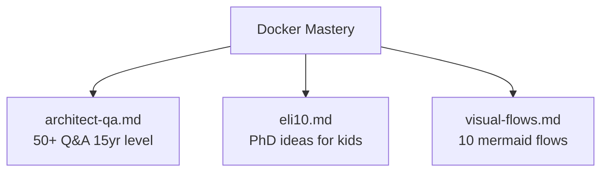

# Docker Mastery

A three-tier learning path: deep architect Q&A, child-friendly explanations of PhD-level concepts, and visual end-to-end flows.

## Organization

<!-- mermaid:rendered -->

Mermaid source

## How to Use

| If you are... | Read |
|---------------|------|
| Designing fleet image distribution, registry tiers, runtime isolation | `architect-qa.md` |
| Trying to internalize how containers, namespaces, cgroups truly work | `eli10.md` |
| Debugging a `docker` command and want to see what happens under the hood | `visual-flows.md` |

## Learning Path

<!-- mermaid:rendered -->

Mermaid source

## Index

### architect-qa.md
- Image distribution at scale (10k-node fleets)
- Multi-arch supply chain (buildx, attestations, SBOM)
- Registry tiering (pull-through cache, edge mirrors, P2P)
- BuildKit cache topology (local, registry, S3, GHA)
- Security hardening tradeoffs (rootless, user namespaces, seccomp)
- Runtime selection: runc vs gVisor vs Kata vs Firecracker
- Storage drivers (overlay2, fuse-overlayfs, stargz)
- Networking deep dive (CNI, libnetwork, macvlan, IPVS)
- OCI spec, image manifest v2, distribution spec
- Production incidents and root causes

### eli10.md
- Containers as boxes pretending to be tiny computers
- Layers as transparent stacked sheets
- Namespaces as labeled rooms
- Cgroups as lunchbox limits
- Networking as pipes between rooms
- Volumes as shared lockers
- Images as recipes vs cakes
- Each section: tiny analogy, real explanation, mermaid diagram, demo commands

### visual-flows.md
- `docker build` end-to-end
- `docker push` to registry
- `docker pull` with layer dedup
- `docker run` lifecycle
- `docker exec` into running container
- BuildKit cache hit path
- Image layer deduplication on disk
- Network DNAT for port publishing
- Volume mount resolution
- Signal forwarding to PID 1

## 20-Year Tips Inline

Each file embeds short admonitions of the form:

> 20-year tip: when you see X, the real cause is usually Y. Reach for Z first.

These come from production scars: registry rate-limits at 6 AM, OOM kills with no logs, "works on my machine" because a base image silently flipped from glibc to musl, BuildKit cache poisoning across PR branches, and the eternal `--platform` foot-gun on M-series Macs pulling amd64 images.

## Critical Rules (read before anything else)

1. Pin image digests in production, not tags. Tags lie; digests don't.
2. Always set `--init` or use a real PID 1 (`tini`, `dumb-init`) for signal handling.
3. Multi-stage builds — final stage must be `FROM scratch` or `distroless` when possible.
4. Set `USER` in Dockerfile; never run as root in production.
5. Resource limits (`--memory`, `--cpus`) are mandatory, not optional.
6. Health checks belong in the orchestrator, not (only) the Dockerfile.
7. `latest` is a smell. Treat it as a bug.
8. BuildKit cache mounts (`--mount=type=cache`) save hours; learn them.
9. Registry credentials live in a credential helper, never `~/.docker/config.json` plaintext.
10. Multi-arch: build on native runners, not QEMU, when CI time matters.

## Conventions

- All mermaid diagrams use `flowchart LR` or `flowchart TB`
- Max 6 nodes per diagram for readability
- Labels are 2-4 words, no special chars
- Code blocks are runnable; copy-paste should work on Docker 24+
- Commands assume Linux/macOS; Windows users adjust paths

## Cross-References

- `../cheatsheet.md` for daily commands
- `../09-security/` for hardening playbooks
- `../10-buildkit-and-buildx/` for advanced builds
- `../11-production-patterns/` for runbooks

## Maintenance

This folder is curated. When a new concept is mastered, add a Q&A pair to `architect-qa.md`, an analogy to `eli10.md` if it shifts your mental model, and a flow to `visual-flows.md` if the operation is non-obvious. Keep mermaid diagrams under 6 nodes; split into multiple if needed.
