# Docker for Curious 10-Year-Olds (with PhD-level depth)

Each idea has four parts:
- Tiny analogy a kid gets
- The real explanation
- A small picture (mermaid)
- The actual commands to see it work

> 20-year tip: every senior engineer started by getting one of these wrong. The order matters: containers, then layers, then namespaces, then cgroups, then networking. Skip and you build wrong models.

---

## 1. Containers — Boxes That Pretend to Be Tiny Computers

### Tiny analogy
Imagine you have one big house. Inside it, you build little cardboard boxes. Each box has its own toys, its own labels on the walls, and the kids inside think the box is the whole world. But really, they all share the same house, the same heater, the same kitchen. They just can't see each other.

A container is one of those boxes. Your computer is the house.

### Real explanation
A container is a regular Linux process that has been put inside several isolation features the kernel offers: namespaces (which limit what it can see), cgroups (which limit how much it can use), and a layered filesystem (which gives it its own view of files). It is not a virtual machine. There is no second operating system. It is one process with a fancy fence around it.

The kernel of the host is the kernel of the container. Always. This is why you cannot run a Linux container on Windows directly — Windows runs a tiny Linux VM behind the scenes to host the kernel.

### Picture
<!-- mermaid:rendered -->
<p align="center"></p>

<details><summary>Mermaid source</summary>

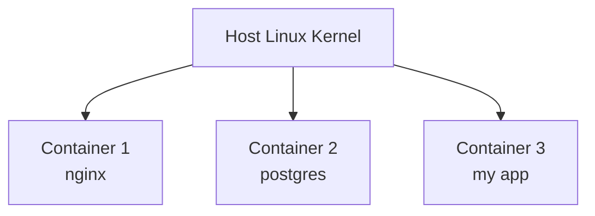

</details>
### Demo it yourself
```bash
docker run -d --name web nginx
docker top web              # see the process
ps -ef | grep nginx          # same process from the host!
docker exec web cat /etc/os-release   # container says debian
cat /etc/os-release          # host might say ubuntu
uname -r                     # but kernel is the same!
docker exec web uname -r     # identical
```

> 20-year tip: when someone says "the container has its own OS," they're wrong. It has its own userland (the files in the image). The kernel is shared. This is the whole game.

---

## 2. Layers — Transparent Sheets Stacked

### Tiny analogy
Imagine drawing a picture using clear plastic sheets. The bottom sheet has the sky. The next sheet adds clouds. The next adds a bird. When you look down through the stack, you see the whole picture. But each sheet only holds its own drawing. If you want to share the sky with five different pictures, you only draw it once.

Image layers work like this. Each `RUN` or `COPY` in a Dockerfile makes one new sheet. All your images can share the bottom sheets.

### Real explanation
A Docker image is a stack of read-only layers. Each layer is a tarball of filesystem changes (additions, modifications, deletions) made by one step in the Dockerfile. When you start a container, Docker adds one writable layer on top using overlayfs. Reads walk down the stack until a file is found; writes go to the top layer. Deletes use a special "whiteout" file.

This is why pulling 10 images that all use `FROM ubuntu:22.04` only downloads ubuntu once. Layers are content-addressable by SHA-256, so identical layers are stored once globally on the host.

### Picture
<!-- mermaid:rendered -->
<p align="center"></p>

<details><summary>Mermaid source</summary>

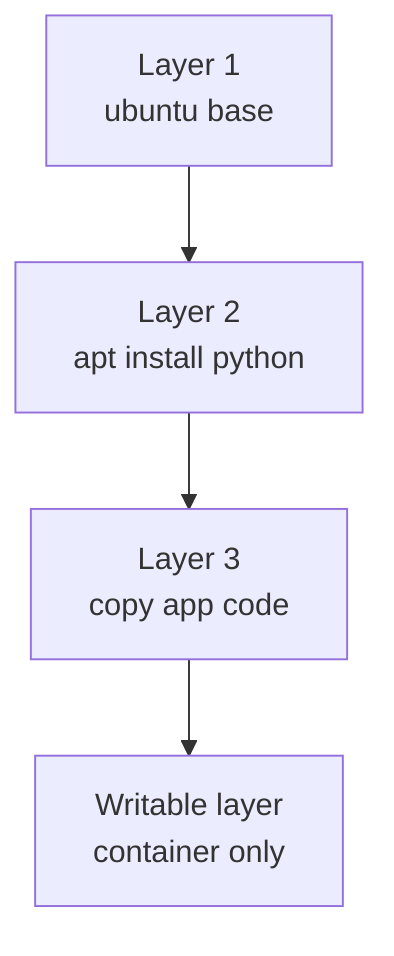

</details>
### Demo it yourself
```bash
docker pull nginx
docker history nginx          # shows every layer
docker image inspect nginx --format '{{json .RootFS.Layers}}' | jq
docker pull nginx:alpine      # shares some layers? (no, different base)
docker pull httpd             # also debian-based, may share with nginx

# See actual layer storage
sudo ls /var/lib/docker/overlay2/

# Run and modify
docker run -d --name test nginx
docker exec test sh -c "echo hi > /tmp/x"
docker diff test              # shows the writable layer changes
```

> 20-year tip: the order of `COPY` matters. Put rarely-changing things (dependencies) above frequently-changing things (your code). Otherwise every code change invalidates the cache for everything below.

---

## 3. Namespaces — Rooms with Their Own Labels

### Tiny analogy
Imagine a school where every classroom has its own list of students named "Student 1, Student 2, Student 3." From inside Room A, "Student 1" is Alice. From Room B, "Student 1" is Bob. The names don't collide because each room has its own list. The students don't even know other rooms exist.

Linux namespaces are these rooms. There's a list for processes (PID), a list for network interfaces, a list for users, a list for mount points, and a few more. Each container gets its own copy of each list.

### Real explanation
A namespace is a kernel feature that gives a process a private view of one global resource. There are 8 namespace types:
- PID: process IDs (container's PID 1 is host's PID 12345)
- NET: network interfaces, routes, ports
- MNT: mount points
- UTS: hostname, domainname
- IPC: System V IPC, POSIX message queues
- USER: UIDs, GIDs (lets containers think they're root without being root on host)
- CGROUP: cgroup root view
- TIME: monotonic clock offset (newest)

A container is just a process that's been placed in fresh instances of these namespaces. You can do it yourself with `unshare` — Docker is mostly orchestration around this.

### Picture
<!-- mermaid:rendered -->
<p align="center"></p>

<details><summary>Mermaid source</summary>

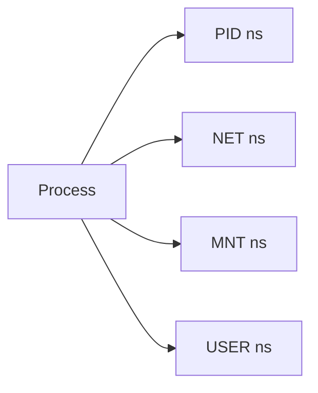

</details>
### Demo it yourself
```bash
# Make a "container" by hand using just the kernel
sudo unshare --pid --net --mount --uts --fork --mount-proc bash
# inside the new shell:
hostname my-room       # only this shell sees this
ps -ef                 # only sees its own processes
ip a                   # no network at all
exit

# In Docker:
docker run --rm -it alpine sh
# inside:
ps -ef                 # PID 1 is the shell itself
ip a                   # private network with eth0
hostname               # random container ID
```

> 20-year tip: `--pid=host` and `--net=host` flags share the host's namespace. They're powerful and dangerous. Use them only for debugging tools (like netshoot) or system-level monitors.

---

## 4. Cgroups — Lunchbox Limits

### Tiny analogy
Mom packs you a lunchbox with exactly 1 sandwich, 1 juice, and 2 cookies. You can eat them in any order. You can give the cookie away. But you cannot get a third cookie. The lunchbox is the limit; you live inside it.

Cgroups are lunchboxes for processes. They say "this group of processes can use at most 2 CPU cores and 1 GB of RAM." If a process tries to use more RAM, the kernel kills it (the famous OOMKilled).

### Real explanation
Cgroups (control groups) are a kernel feature for limiting and accounting resource use of a group of processes. cgroups v2 (current) has controllers for:
- cpu: CPU shares, quotas, weights
- memory: hard and soft limits, swap limits
- io: disk read/write throughput and IOPS
- pids: max number of processes
- hugetlb, rdma, misc: specialized

When you say `docker run --memory=512m --cpus=1.5`, Docker creates a cgroup with those limits and puts the container's processes in it. The kernel enforces. There's no Docker daemon involved at runtime — the kernel is the cop.

### Picture
<!-- mermaid:rendered -->
<p align="center"></p>

<details><summary>Mermaid source</summary>

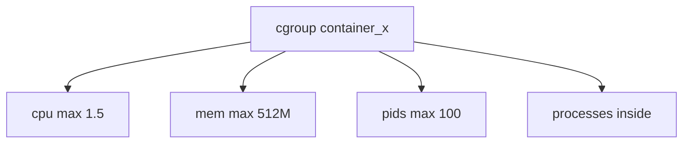

</details>
### Demo it yourself
```bash
docker run -d --name limited --memory=100m --cpus=0.5 nginx

# Find the cgroup
CID=$(docker inspect limited -f '{{.Id}}')
ls /sys/fs/cgroup/system.slice/docker-$CID.scope/

# See limits
cat /sys/fs/cgroup/system.slice/docker-$CID.scope/memory.max
cat /sys/fs/cgroup/system.slice/docker-$CID.scope/cpu.max

# Trigger OOM
docker run --rm -it --memory=20m alpine sh -c \
  "dd if=/dev/zero of=/tmp/x bs=1M count=100"
# OOMKilled!
docker inspect $(docker ps -lq) --format '{{.State.OOMKilled}}'
```

> 20-year tip: never run a container in production without memory limits. An unbounded process will eventually eat the whole host and take your other containers down with it. JVM workloads need especially careful tuning because the JVM's idea of "available memory" is not the cgroup's idea, before Java 11.

---

## 5. Networking — Pipes Between Rooms

### Tiny analogy
Each room (container) has its own door. Some doors open to a hallway (the bridge network) where rooms can talk to each other. Some doors open to the outside (the host network). A doorkeeper (NAT) translates "Room 3, port 80" into "Hallway port 8080" so visitors from outside can find it.

### Real explanation
Docker creates a Linux bridge (`docker0` by default) on the host. Each container gets a virtual ethernet pair (veth) — one end inside the container's network namespace as `eth0`, the other on the host attached to the bridge. Containers on the same bridge can talk directly. To reach the outside, packets are SNAT'd to the host's IP. To accept incoming traffic, Docker adds DNAT iptables rules mapping host ports to container ports.

When you `docker run -p 8080:80`, Docker:
1. Creates the veth pair, attaches container side as eth0
2. Adds container's veth to docker0 bridge
3. Adds iptables DNAT: host:8080 → container:80
4. Adds iptables SNAT for outgoing traffic

### Picture
<!-- mermaid:rendered -->
<p align="center"></p>

<details><summary>Mermaid source</summary>

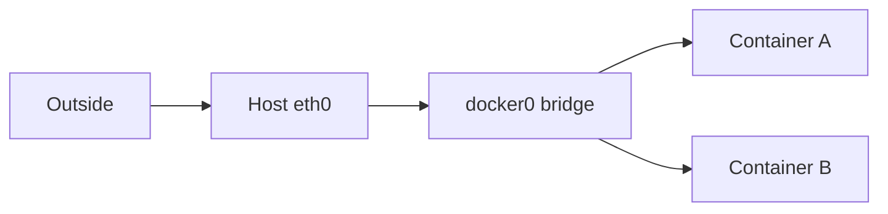

</details>
### Demo it yourself
```bash
docker network ls
docker network inspect bridge

# Run two containers on a custom network so DNS works
docker network create demo
docker run -d --name api --network demo nginx
docker run --rm --network demo alpine ping -c 2 api   # name resolves

# Look at host-side networking
ip link show docker0
ip link | grep veth
sudo iptables -t nat -L DOCKER -n

# Port publish
docker run -d -p 8080:80 --name web nginx
sudo iptables -t nat -L DOCKER -n  # see the DNAT rule
curl localhost:8080
```

> 20-year tip: the default `bridge` network has no DNS for container names. Always create a user-defined network for multi-container apps. `docker compose` does this automatically; that's a big reason it exists.

---

## 6. Volumes — Shared Lockers

### Tiny analogy
Containers are temporary; they get thrown away. But sometimes you want to keep your stuff. A volume is a locker outside the box. The box has a hole in the wall pointing to the locker. When you write to that hole, your stuff stays even after the box is gone.

### Real explanation
A volume is a directory on the host filesystem that's bind-mounted into the container at a specific path. Three types:
- Named volumes: managed by Docker, stored under `/var/lib/docker/volumes/`
- Bind mounts: any host path mounted into container
- tmpfs: in-memory, lost on stop

The container sees the volume as a regular directory; the kernel's mount namespace makes it appear at the path you specified. Reads and writes hit the host filesystem directly — no overlayfs in the path, so volumes are fast.

### Picture
<!-- mermaid:rendered -->
<p align="center"></p>

<details><summary>Mermaid source</summary>

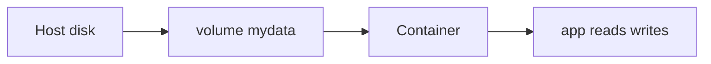

</details>
### Demo it yourself
```bash
docker volume create mydata
docker run -d --name db -v mydata:/var/lib/postgresql/data postgres

# Find on host
docker volume inspect mydata
sudo ls /var/lib/docker/volumes/mydata/_data

# Survive container deletion
docker rm -f db
docker run -d --name db2 -v mydata:/var/lib/postgresql/data postgres
# data still there

# Bind mount
docker run --rm -v $(pwd):/work alpine ls /work
```

> 20-year tip: never bind-mount a host path that contains files Docker might write to as root. UID mismatches between host user and container user are the #1 source of permission errors. Use named volumes or align UIDs deliberately.

---

## 7. Images — Recipes vs Cakes

### Tiny analogy
A recipe (Dockerfile) is the instructions to bake a cake. The cake (image) is the actual baked thing. You eat slices of the cake (containers). You can bake a thousand identical cakes from one recipe, and each cake feeds many people.

### Real explanation
A Dockerfile is a build script. An image is the result: a manifest (JSON) listing layers + a config (env vars, entrypoint, working dir, etc.) + the actual layer blobs. An image is identified by a content hash; tags (`nginx:latest`) are mutable pointers to digests (`sha256:abc...`). A container is an image plus a writable layer plus runtime config (cmd, env, mounts, network).

### Picture
<!-- mermaid:rendered -->
<p align="center"></p>

<details><summary>Mermaid source</summary>

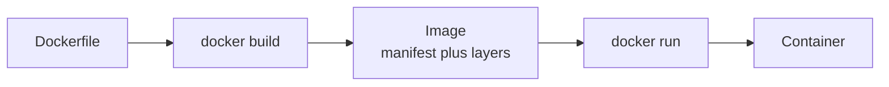

</details>
### Demo it yourself
```bash
mkdir demo && cd demo
cat > Dockerfile <<'EOF'
FROM alpine:3.19
RUN echo "hello" > /greeting
CMD ["cat", "/greeting"]
EOF

docker build -t demo:1 .
docker image inspect demo:1 | jq '.[0].Id, .[0].Config'
docker run --rm demo:1            # prints hello
docker run --rm demo:1 ls /        # override CMD
```

> 20-year tip: the `latest` tag is a lie — it's whatever the publisher last pushed. In production, always pull by digest: `nginx@sha256:...`. This is the single most impactful security hardening you can do.

---

## 8. Bringing It All Together — How a `docker run` Really Works

When you type `docker run -d -p 8080:80 --memory=256m nginx`:

1. **Image resolve**: Docker checks local store; if missing, pulls from registry (manifest, then layers).
2. **Layer assembly**: overlay2 mounts read-only layers + a fresh writable layer at a path.
3. **Namespace creation**: kernel creates new PID, NET, MNT, UTS, IPC, USER namespaces.
4. **Cgroup creation**: a new cgroup is made under `/sys/fs/cgroup/` with the memory limit.
5. **veth pair**: created; one end in container netns, other on docker0 bridge.
6. **iptables DNAT**: rule added for host:8080 → container:80.
7. **runc invoked**: with an OCI spec describing all of the above.
8. **PID 1 exec**: nginx starts as PID 1 inside the container.

<!-- mermaid:rendered -->
<p align="center"></p>

<details><summary>Mermaid source</summary>

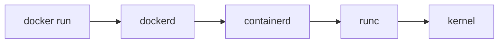

</details>
### Demo every step
```bash
docker run -d --name full -p 8080:80 --memory=256m nginx
docker inspect full | jq '.[0].State.Pid'         # host PID of nginx
sudo ls /proc/$(docker inspect full -f '{{.State.Pid}}')/ns/   # all namespaces
sudo cat /sys/fs/cgroup/system.slice/docker-$(docker inspect full -f '{{.Id}}').scope/memory.max
sudo iptables -t nat -L DOCKER -n | grep 8080
```

> 20-year tip: when something breaks, ask "which of these 8 steps failed?" Pull, mount, namespace, cgroup, network, iptables, runc, exec. The answer is almost always one specific step, and the fix is specific to that step.

---

## Closing Thought

You now understand more about how containers actually work than 90% of people who use them daily. The hard part wasn't the technology — it was the mental model. Containers are not VMs. They're processes wearing kernel-issued costumes. Once you see them that way, every command and every error makes sense.
