# Visual Flows — 10 Docker Operations End-to-End

Each flow shows what really happens when you type the command. Mermaid diagrams kept under 6 nodes per the project rules.

> 20-year tip: when an operation fails, the failure is almost always at one specific arrow in these diagrams. Read the error, find the arrow, fix the arrow.

---

## 1. `docker build` — From Dockerfile to Image

What happens when you run `docker build -t myapp .`:

<!-- mermaid:rendered -->
<p align="center"></p>

<details><summary>Mermaid source</summary>

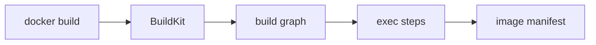

</details>

Steps in detail:
1. CLI sends Dockerfile + build context to BuildKit (stripped by `.dockerignore`).
2. BuildKit parses Dockerfile into a DAG of LLB (low-level builder) operations.
3. Each instruction becomes a vertex; cache lookups happen per vertex.
4. Cache misses execute in temporary containers.
5. Results are committed as layers, manifest is assembled.
6. Image is tagged in local store.

Common failure points:
- Build context too large (forgot `.dockerignore`)
- Cache miss on first `COPY` invalidates everything below
- Network failure during `RUN apt-get update`

---

## 2. `docker push` — Image to Registry

<!-- mermaid:rendered -->
<p align="center"></p>

<details><summary>Mermaid source</summary>

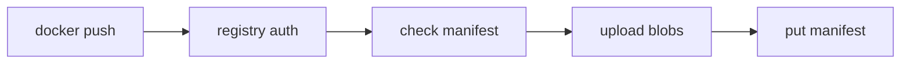

</details>

Steps:
1. Resolve registry from image name (default `docker.io`).
2. Hit `/v2/` endpoint; get 401 with WWW-Authenticate; fetch token.
3. For each layer: HEAD `/v2/<name>/blobs/<digest>` to check if exists; skip if so.
4. Upload missing layers via chunked POST/PATCH/PUT.
5. PUT manifest as the final step (atomic; readers see complete image only after this).

> 20-year tip: pushes are layer-deduplicated by digest. If your push is slow, you're uploading new layers; check what changed. Often a `RUN apt upgrade` rewrote the world.

---

## 3. `docker pull` — Layer Dedup on the Way Down

<!-- mermaid:rendered -->
<p align="center"></p>

<details><summary>Mermaid source</summary>

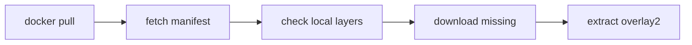

</details>

Steps:
1. Resolve tag to digest via manifest fetch.
2. For multi-arch index, pick platform-matching manifest.
3. List layer digests; check `/var/lib/docker/overlay2/` for existing.
4. Download only missing blobs (parallel, default 3 concurrent).
5. Extract each tarball into its overlay2 directory.
6. Register image in local image store.

---

## 4. `docker run` — Container Lifecycle Start

<!-- mermaid:rendered -->
<p align="center"></p>

<details><summary>Mermaid source</summary>

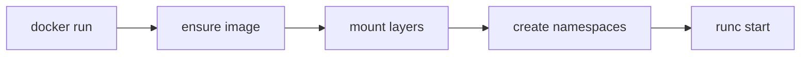

</details>

Steps:
1. Image present? If not, pull (flow #3).
2. overlay2 mount: lowerdirs (image layers) + upperdir (writable) + workdir.
3. Create cgroup, apply `--memory` `--cpus` limits.
4. Create network namespace, veth pair, attach to bridge, add iptables rules for `-p`.
5. Hand OCI bundle to containerd-shim → runc.
6. runc clones with namespace flags, applies seccomp/AppArmor, execs entrypoint.
7. Container's PID 1 starts; dockerd records state.

---

## 5. `docker exec` — Joining a Running Container

<!-- mermaid:rendered -->
<p align="center"></p>

<details><summary>Mermaid source</summary>

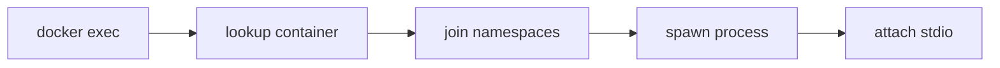

</details>

Steps:
1. Find container by name/ID, get host PID of init process.
2. Open `/proc/<pid>/ns/*` file descriptors for all namespaces.
3. `setns()` into each, then fork+exec the requested command.
4. New process inherits the cgroup of the container.
5. stdin/stdout/stderr are piped through containerd-shim to the CLI.

> 20-year tip: `docker exec` does NOT enter the container's cgroup pid limit; processes you exec count toward the host's PID limit but the container's. This trips up people debugging fork bombs.

---

## 6. BuildKit Cache Hit Path

<!-- mermaid:rendered -->
<p align="center"></p>

<details><summary>Mermaid source</summary>

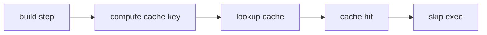

</details>

Steps:
1. For each LLB vertex, BuildKit computes a content hash of inputs (instruction text, source digests, mount contents, parent vertex hash).
2. Look up hash in local cache, then registry cache (if `--cache-from`), then GHA/S3.
3. On hit: skip execution, reuse the resulting layer.
4. On miss: execute, store result in all configured cache backends.
5. The `mode=max` setting exports intermediate stage caches too.

Why hits regress: base image float, secret ID change, cache GC, builder restart.

---

## 7. Image Layer Deduplication on Disk

<!-- mermaid:rendered -->
<p align="center"></p>

<details><summary>Mermaid source</summary>

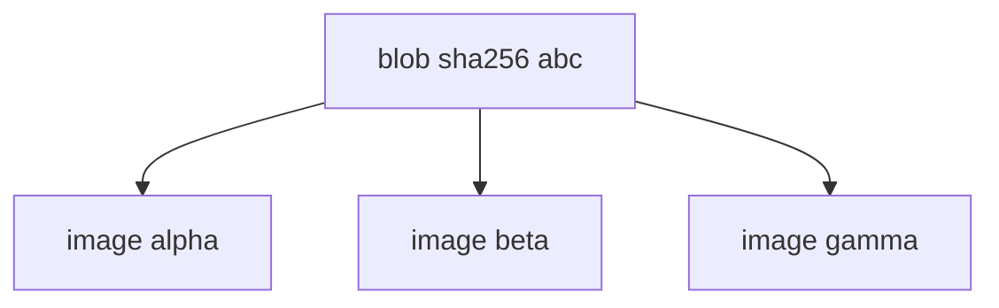

</details>

How it works:
1. Layers stored in `/var/lib/docker/overlay2/<id>/diff/` keyed by content hash.
2. Image manifest references layers by digest.
3. Multiple images referencing the same digest share the on-disk directory.
4. Reference counting: a layer is GC'd only when no image references it.
5. `docker image prune` walks references; `docker system prune -a` is more aggressive.

Real-world impact: 50 microservices on a node sharing `node:20-alpine` base = the alpine layer stored once, ~5 MB total instead of 250 MB.

---

## 8. Network DNAT for `-p 8080:80`

<!-- mermaid:rendered -->
<p align="center"></p>

<details><summary>Mermaid source</summary>

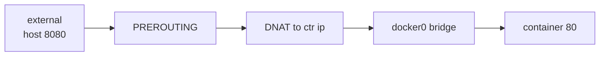

</details>

Steps:
1. Packet arrives at host on port 8080.
2. iptables PREROUTING chain hits Docker's DOCKER chain.
3. DNAT rule rewrites destination to `<container-ip>:80`.
4. Packet routed to docker0 bridge.
5. Bridge delivers to the veth pair → container's eth0.
6. Reply traffic goes through SNAT/conntrack on the way back.

Inspect:
```bash
sudo iptables -t nat -L DOCKER -n
sudo conntrack -L | grep <container-ip>
```

> 20-year tip: at >10k iptables rules per host, NAT performance dies. Move to Cilium/eBPF or use host networking for high-throughput services.

---

## 9. Volume Mount Resolution

<!-- mermaid:rendered -->
<p align="center"></p>

<details><summary>Mermaid source</summary>

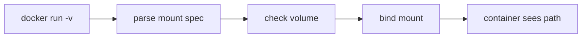

</details>

Steps:
1. Parse `-v` or `--mount` syntax (named volume vs bind vs tmpfs).
2. For named volume: ensure exists in `/var/lib/docker/volumes/`, create if not.
3. For bind: validate host path exists (or create with `:Z` SELinux relabel if requested).
4. In container's mount namespace, kernel performs bind mount of host source to container target.
5. Mount happens BEFORE container's entrypoint runs, so entrypoint sees the volume populated.
6. tmpfs mounts allocate from kernel page cache, sized by `--tmpfs <path>:size=Xm`.

Gotcha: if you mount over a directory that had files in the image, those image files are hidden by the mount.

---

## 10. Signal Forwarding to PID 1

<!-- mermaid:rendered -->
<p align="center"></p>

<details><summary>Mermaid source</summary>

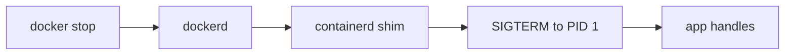

</details>

Steps:
1. `docker stop` sends API request with stop signal (default SIGTERM) and timeout (default 10s).
2. dockerd forwards to containerd, which tells the shim.
3. Shim sends signal to container's PID 1 directly via `kill()`.
4. App is expected to catch SIGTERM, drain, exit gracefully.
5. After timeout, SIGKILL is sent; kernel terminates immediately.

The PID 1 problem:
- Shells (`sh`, `bash`) do NOT forward signals to children by default.
- If your CMD is `["sh", "-c", "myapp"]`, SIGTERM goes to sh, not myapp.
- Fix: `exec myapp` in scripts, or use `--init` (runs tini as PID 1), or use `tini`/`dumb-init` explicitly in CMD.

```bash
# Bad: sh swallows signal
docker run --rm -it alpine sh -c "sleep 30"
# Ctrl-C may take 10s

# Good: exec replaces sh with the target
docker run --rm -it alpine sh -c "exec sleep 30"
# Ctrl-C immediate

# Best for production
docker run --rm --init alpine sleep 30
```

> 20-year tip: 90% of "graceful shutdown doesn't work" problems are PID 1 signal handling. Always use `--init` in production unless your app is explicitly designed to be PID 1 (most aren't).

---

## Mental Model Summary

<!-- mermaid:rendered -->
<p align="center"></p>

<details><summary>Mermaid source</summary>

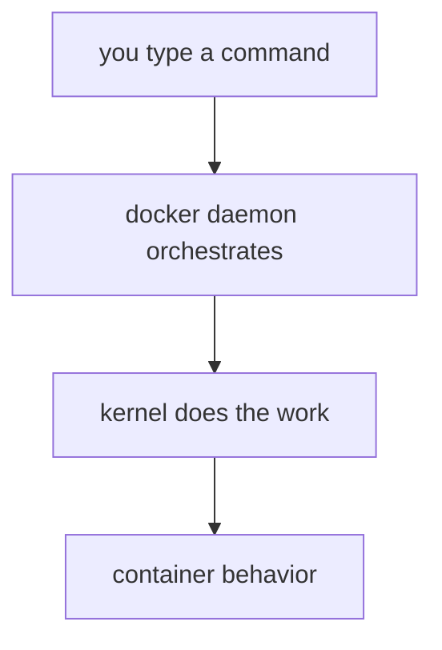

</details>

Docker is glue. The kernel is the engine. Every flow above ends in the kernel doing the actual work — namespaces, cgroups, overlayfs, iptables, signals. When you debug, debug the kernel layer; the daemon layer is rarely lying to you.

---

## Quick Reference: Which Flow When

| Symptom | Flow to study |
|---------|---------------|
| Image pulls forever | #3 pull |
| Container won't start | #4 run |
| Build is slow | #1 build, #6 cache |
| Push hangs | #2 push |
| Can't reach container from outside | #8 DNAT |
| Data lost after container restart | #9 volumes |
| `docker stop` takes 10 seconds | #10 signals |
| Disk full despite few images | #7 dedup, check `docker system df` |
| `exec` works, app behaves weird | #5 exec, check namespaces |
| Cache hits unexpectedly miss | #6 cache key |

> 20-year tip: print these flows. Pin them above your monitor. When a junior asks "why did X happen?", trace the arrows together. They'll learn faster, and you'll find your own gaps in understanding.
