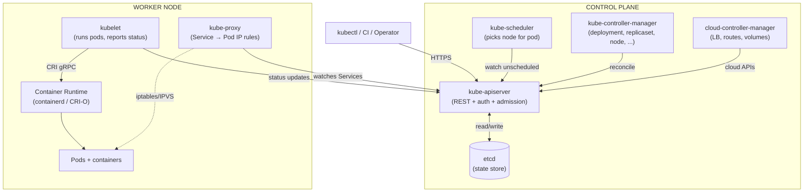
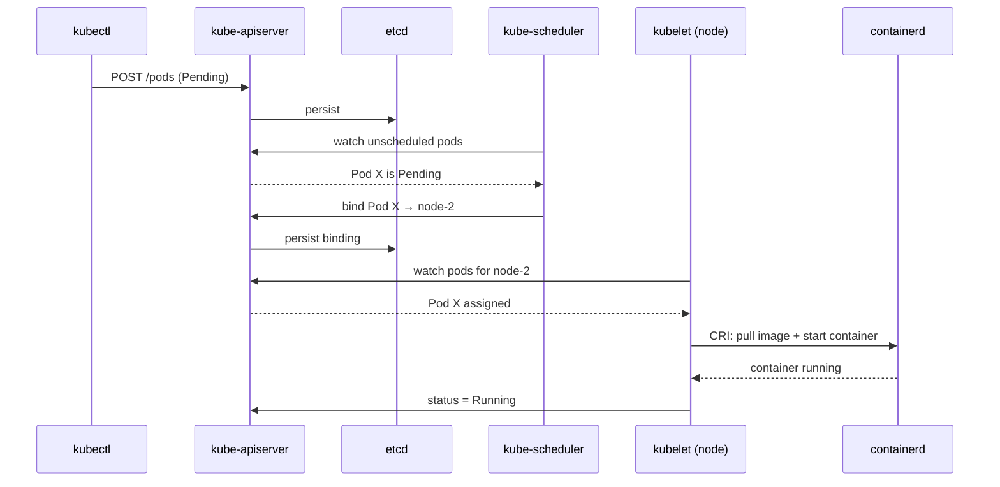

# 01 — Architecture

> Know the moving parts. When something breaks, you'll know which one to log into.

## Why architecture matters

Every `kubectl apply` is a chain reaction across 6+ components. When a pod gets stuck, the question "which component owns this state transition?" is the difference between a 5-minute fix and a 5-hour rabbit hole.

## Full architecture



## Pod creation sequence



## Component cheat-sheet

### Control plane
| Component | Job | Port | Logs |
|-----------|-----|------|------|
| **kube-apiserver** | Frontend for the cluster — every read/write goes here | 6443 | `kubectl logs -n kube-system kube-apiserver-*` |
| **etcd** | Strongly consistent k/v store; the single source of truth | 2379 | `kubectl logs -n kube-system etcd-*` |
| **kube-scheduler** | Assigns Pending pods to nodes (filter + score) | — | `kubectl logs -n kube-system kube-scheduler-*` |
| **kube-controller-manager** | Runs Deployment, ReplicaSet, Node, Endpoint, etc. controllers | — | `kubectl logs -n kube-system kube-controller-manager-*` |
| **cloud-controller-manager** | Cloud-specific: load balancers, routes, EBS volumes | — | provider-dependent |

### Node
| Component | Job |
|-----------|-----|
| **kubelet** | Talks to API server; runs containers via CRI; reports node + pod status |
| **kube-proxy** | Programs iptables/IPVS so Service VIPs reach Pod IPs |
| **Container runtime** | containerd / CRI-O. Pulls images, runs containers (via CRI gRPC) |
| **CNI plugin** | Calico, Cilium, Flannel — assigns pod IPs and wires up network |

## Apply & observe

```bash
# control plane components (kind/kubeadm clusters)
kubectl get pods -n kube-system

# node components
kubectl get nodes -o wide
kubectl describe node kind-worker | head -40

# what's actually inside the API server
kubectl api-resources --verbs=list -o name | head -20

# raw state in etcd (read-only via API)
kubectl get --raw /api/v1/namespaces | head
```

## Gotchas

> ⚠️ **etcd is fragile.** Always back it up in production. A corrupt etcd = dead cluster. Managed K8s (EKS/GKE/AKS) hides this from you.

> ⚠️ **The scheduler doesn't run pods.** It only writes the `nodeName` field. The kubelet on that node actually starts the container.

> ⚠️ **kube-proxy in iptables mode** doesn't load-balance — it picks a random backend per connection. Use IPVS mode for true round-robin at scale.

## Reference

- [Kubernetes Components](https://kubernetes.io/docs/concepts/overview/components/)
- [Architecture: Control Plane–Node Communication](https://kubernetes.io/docs/concepts/architecture/control-plane-node-communication/)
- [etcd documentation](https://etcd.io/docs/)
