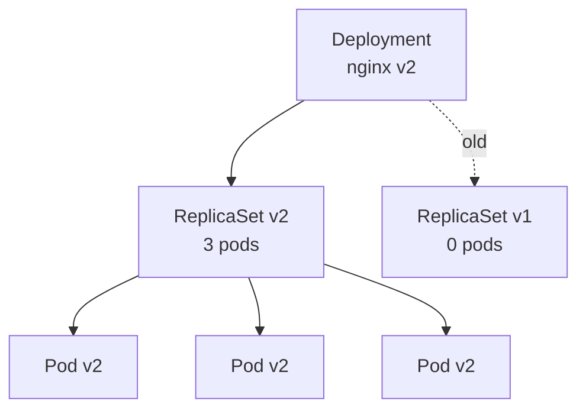
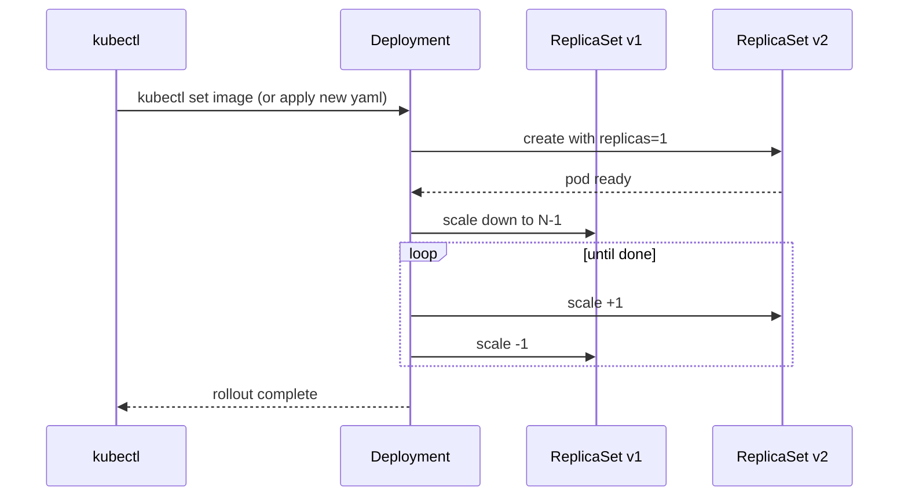

# 03 — Deployments

> A **Deployment** is the controller you'll use 90% of the time for stateless apps. It manages ReplicaSets, which manage Pods.

## Why Deployments

Bare Pods don't self-heal across node failures. ReplicaSets keep N pods alive but can't roll updates. Deployments add **declarative rolling updates + rollback**.



## Rolling update mechanics



Tunable via `strategy.rollingUpdate.maxSurge` and `maxUnavailable`.

## Manifest walkthrough — `deployment.yaml`

3 replicas of GCR hello-app, with proper resource requests/limits, liveness + readiness probes, and update strategy.

## Apply & observe

```bash
kubectl apply -f deployment.yaml
kubectl get deploy,rs,pod -l app=hello-app
kubectl rollout status deployment/hello-app

# Scale
kubectl scale deployment/hello-app --replicas=5

# Update image (creates a new ReplicaSet)
kubectl set image deployment/hello-app hello=gcr.io/google-samples/hello-app:2.0
kubectl rollout status deployment/hello-app

# History + rollback
kubectl rollout history deployment/hello-app
kubectl rollout undo deployment/hello-app

# Pause / resume (stage multiple changes before rollout)
kubectl rollout pause deployment/hello-app
kubectl set env deployment/hello-app FOO=bar
kubectl rollout resume deployment/hello-app
```

## Cleanup

```bash
kubectl delete -f deployment.yaml
```

## Gotchas

> ⚠️ **Selector is immutable.** If you want to change `spec.selector.matchLabels`, you must delete and recreate the Deployment.

> ⚠️ **No probes = bad rollouts.** Without `readinessProbe`, K8s thinks pods are ready the instant they start — traffic hits a not-yet-listening process and fails.

> ⚠️ **`Recreate` strategy = downtime.** Only use for apps that can't run two versions in parallel (e.g. exclusive DB locks).

> ⚠️ **`kubectl edit` is dangerous in CI.** Always `kubectl apply -f` from a versioned file.

## Reference

- [Deployments](https://kubernetes.io/docs/concepts/workloads/controllers/deployment/)
- [ReplicaSet](https://kubernetes.io/docs/concepts/workloads/controllers/replicaset/)
- [Rolling update strategy](https://kubernetes.io/docs/concepts/workloads/controllers/deployment/#rolling-update-deployment)
