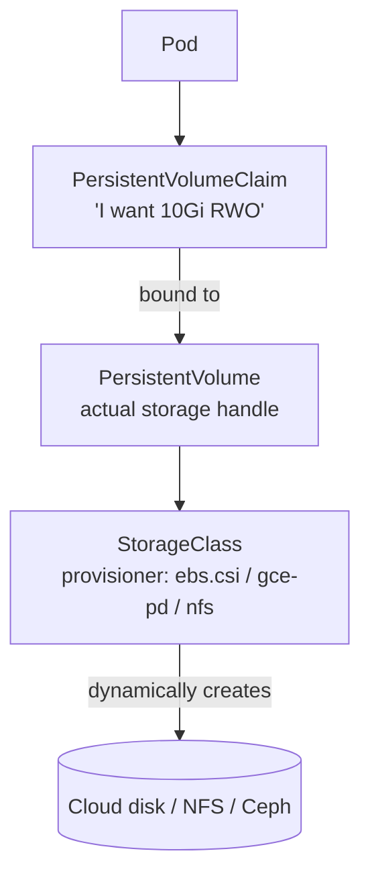
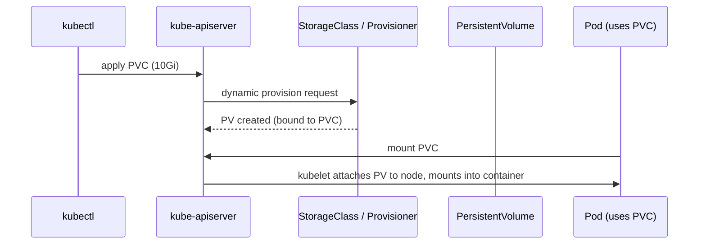

# 06 — Storage

> Containers are ephemeral. To survive restarts, you need **Volumes**. To survive pod deletion, you need **PersistentVolumes (PV)** + **PersistentVolumeClaims (PVC)**.

## Storage hierarchy



## Volume types (in-pod, ephemeral)

| Type | Lives | Use |
|------|-------|-----|
| `emptyDir` | Pod lifetime | Scratch, sidecar communication |
| `hostPath` | Node | Logs collectors (DaemonSets); avoid otherwise |
| `configMap`, `secret`, `projected` | Pod | Config injection |
| `downwardAPI` | Pod | Pod metadata as files |

## PV / PVC lifecycle



## Access modes

| Mode | Meaning |
|------|---------|
| `ReadWriteOnce` (RWO) | One node mounts RW. Most cloud disks. |
| `ReadOnlyMany` (ROX) | Many nodes mount RO. |
| `ReadWriteMany` (RWX) | Many nodes mount RW. NFS, EFS, CephFS. |
| `ReadWriteOncePod` (RWOP) | Exactly one pod RW. K8s 1.22+. |

## Reclaim policies

| Policy | When PVC deleted |
|--------|------------------|
| `Delete` | Underlying volume is destroyed (default for dynamic provisioning) |
| `Retain` | Volume + data preserved; admin must clean up manually |

## Apply & observe

```bash
# See available storage classes (kind ships 'standard')
kubectl get storageclass

# Create a PVC; check it gets bound
kubectl apply -f pvc.yaml
kubectl get pvc data-pvc          # STATUS should be Bound after a few seconds
kubectl get pv                    # the dynamically created PV

# Use a StatefulSet which gives each pod its own PVC
kubectl apply -f statefulset-with-pvc.yaml
kubectl get pods -l app=cache -o wide
kubectl get pvc -l app=cache      # one PVC per replica: data-cache-0, data-cache-1, ...

# Write data, delete pod, verify persistence
kubectl exec cache-0 -- sh -c 'echo "persisted!" > /data/test.txt'
kubectl delete pod cache-0
kubectl exec cache-0 -- cat /data/test.txt   # still there
```

## Cleanup

```bash
kubectl delete -f statefulset-with-pvc.yaml
kubectl delete pvc -l app=cache    # ← StatefulSet does NOT auto-delete PVCs
kubectl delete -f pvc.yaml
```

## Gotchas

> ⚠️ **Deleting a StatefulSet does NOT delete its PVCs.** This is on purpose — your data outlives the workload. Clean up manually or use `persistentVolumeClaimRetentionPolicy` (K8s 1.27+).

> ⚠️ **RWO disks can't move pods across nodes** without detaching first. A `Pending` reschedule can hang for minutes.

> ⚠️ **`hostPath` is a security hole.** It mounts a node directory into the pod. Use only for system-level DaemonSets (log/metric collectors).

> ⚠️ **Resize a PVC by editing `spec.resources.requests.storage`** — only works if the StorageClass has `allowVolumeExpansion: true`.

## Reference

- [Volumes](https://kubernetes.io/docs/concepts/storage/volumes/)
- [Persistent Volumes](https://kubernetes.io/docs/concepts/storage/persistent-volumes/)
- [Storage Classes](https://kubernetes.io/docs/concepts/storage/storage-classes/)
- [CSI drivers](https://kubernetes-csi.github.io/docs/drivers.html)
