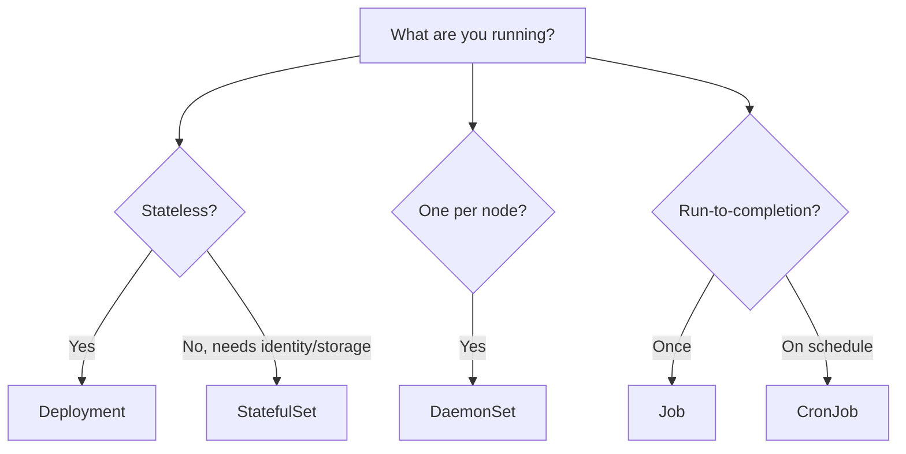
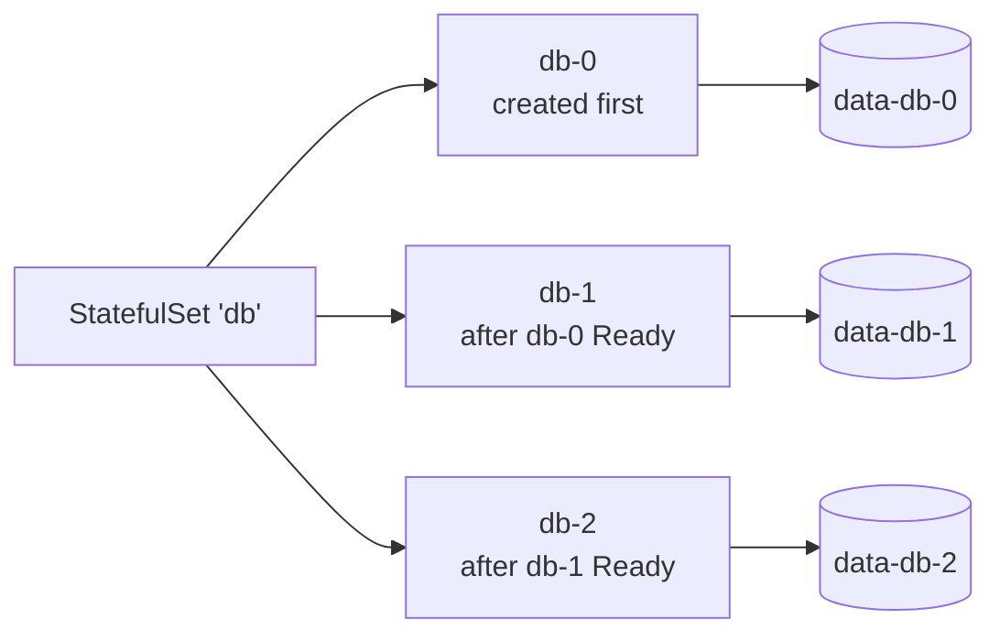

# 07 — Workloads

> Five workload controllers. Pick the right one for the job.

## Decision tree



## Comparison

| Controller | Pod identity | Storage | Order | Use case |
|------------|--------------|---------|-------|----------|
| **Deployment** | Random suffix | Shared / none | Parallel | Stateless web apps, APIs |
| **StatefulSet** | `name-0`, `name-1` (stable) | Per-pod PVC | Ordered (0→N) | Databases, Kafka, Zookeeper |
| **DaemonSet** | One per node | hostPath usually | All-at-once | Log/metric collectors, CNI, kube-proxy |
| **Job** | Random | Optional | Parallel up to `parallelism` | Batch processing, migrations |
| **CronJob** | Generates Jobs | Optional | Schedule-driven | Backups, reports, periodic ETL |

## StatefulSet specifics



Stable network identity: `db-0.cache.default.svc.cluster.local` (requires headless Service).

## Apply & observe

```bash
# StatefulSet
kubectl apply -f statefulset.yaml
kubectl get pods -l app=zk -w        # zk-0, zk-1, zk-2 created in order

# DaemonSet — one pod per node
kubectl apply -f daemonset.yaml
kubectl get ds,pods -l app=node-agent -o wide

# Job — runs to completion
kubectl apply -f job.yaml
kubectl get jobs,pods -l app=pi
kubectl logs -l app=pi
# → 3.14159265358979323846...

# CronJob — fires every minute
kubectl apply -f cronjob.yaml
kubectl get cronjob
sleep 70 && kubectl get jobs -l app=hello-cron
kubectl logs -l app=hello-cron --tail=10
```

## Cleanup

```bash
kubectl delete -f statefulset.yaml -f daemonset.yaml -f job.yaml -f cronjob.yaml
kubectl delete pvc -l app=zk         # StatefulSet PVCs are NOT auto-deleted
```

## Gotchas

> ⚠️ **StatefulSet rolling updates are ordered (N → 0).** A failing pod blocks the rollout — use `podManagementPolicy: Parallel` if you need faster rollouts and can tolerate it.

> ⚠️ **DaemonSet doesn't run on tainted nodes** (e.g. control-plane) unless you add a matching toleration.

> ⚠️ **Jobs leave completed Pods** for log inspection. Set `ttlSecondsAfterFinished` to auto-clean.

> ⚠️ **CronJob `concurrencyPolicy: Forbid`** prevents overlapping runs — critical for backups.

> ⚠️ **CronJob schedule is in the controller's timezone** (UTC by default in K8s 1.25+, set `spec.timeZone`).

## Reference

- [Workloads](https://kubernetes.io/docs/concepts/workloads/)
- [StatefulSet](https://kubernetes.io/docs/concepts/workloads/controllers/statefulset/)
- [DaemonSet](https://kubernetes.io/docs/concepts/workloads/controllers/daemonset/)
- [Jobs](https://kubernetes.io/docs/concepts/workloads/controllers/job/)
- [CronJob](https://kubernetes.io/docs/concepts/workloads/controllers/cron-jobs/)
