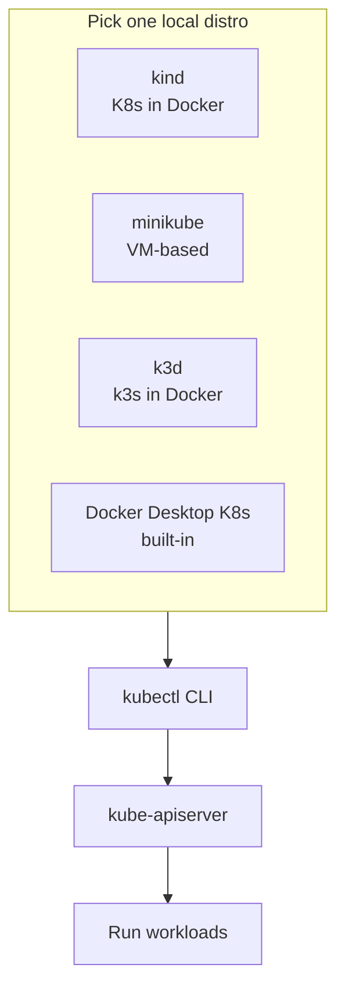

# 00 — Cluster Setup

> A real cluster on your laptop in 60 seconds. Pick **one** local distro and stick with it for this folder.

## Why local clusters

Cloud clusters cost money and hide failure modes. Local clusters reproduce 95% of production behavior (scheduling, networking, RBAC, storage) for free.

<!-- mermaid:rendered -->
<p align="center"></p>

<details><summary>Mermaid source</summary>



</details>
## Comparison

| Tool | Best for | Multi-node | Speed | Notes |
|------|----------|------------|-------|-------|
| **kind** | CI, fast iter | Yes | Fastest | Recommended for this folder |
| **minikube** | Beginners, addons | Yes (driver) | Medium | Rich addon ecosystem |
| **k3d** | Edge / lightweight | Yes | Fast | k3s under the hood |
| **Docker Desktop** | Mac/Win devs | No | Easy | Single-node only |

## Install kubectl

```bash
# macOS
brew install kubectl

# Linux
curl -LO "https://dl.k8s.io/release/$(curl -L -s https://dl.k8s.io/release/stable.txt)/bin/linux/amd64/kubectl"
sudo install -o root -g root -m 0755 kubectl /usr/local/bin/kubectl

# verify
kubectl version --client
```

## Install kind (recommended)

```bash
# macOS
brew install kind

# Linux
[ "$(uname -m)" = x86_64 ] && curl -Lo ./kind https://kind.sigs.k8s.io/dl/v0.23.0/kind-linux-amd64
chmod +x ./kind && sudo mv ./kind /usr/local/bin/kind
```

## Create the cluster

```bash
kind create cluster --config kind-cluster.yaml
./verify.sh
```

## Manifest walkthrough — `kind-cluster.yaml`

A 1 control-plane + 2 worker setup with port mappings for ingress later.

## Apply & observe

```bash
kubectl cluster-info                       # API server endpoint
kubectl get nodes -o wide                  # 3 nodes Ready
kubectl get pods -A                        # system pods running
kubectl config current-context             # kind-kind
```

Expected:
```
NAME                 STATUS   ROLES           AGE   VERSION
kind-control-plane   Ready    control-plane   45s   v1.30.x
kind-worker          Ready    <none>          30s   v1.30.x
kind-worker2         Ready    <none>          30s   v1.30.x
```

## Cleanup

```bash
kind delete cluster --name devops-learning
```

## Alternatives

```bash
# minikube
minikube start --nodes 3 --cpus 2 --memory 4g --kubernetes-version=v1.30.0

# k3d
k3d cluster create devops --servers 1 --agents 2 -p "80:80@loadbalancer"

# Docker Desktop: Settings → Kubernetes → Enable
```

> ⚠️ kind on Apple Silicon: use `--image kindest/node:v1.30.0` to pin the arch-correct image. If pods stay `Pending`, run `docker system prune` — kind reserves a lot of disk.

> ⚠️ Don't run multiple distros at once on the same machine — they'll fight over Docker's network/CPU.

## Reference

- [kind quick start](https://kind.sigs.k8s.io/docs/user/quick-start/)
- [minikube start](https://minikube.sigs.k8s.io/docs/start/)
- [k3d](https://k3d.io/)
- [kubectl install](https://kubernetes.io/docs/tasks/tools/)
