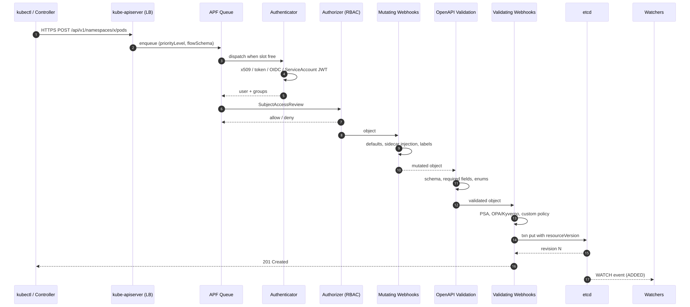
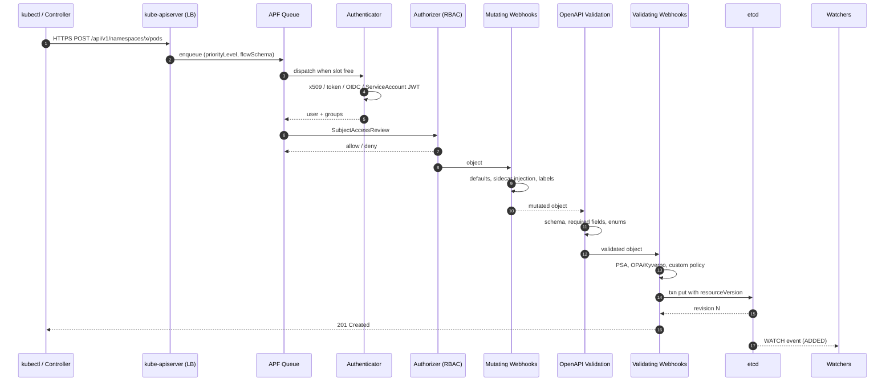
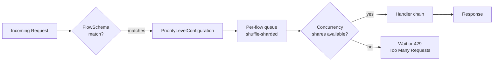

# Deep Dive: Kubernetes API Request Flow

## Why this matters

Every action in Kubernetes — `kubectl apply`, a controller reconciling, a kubelet reporting status, a pod creating a ConfigMap — flows through the **kube-apiserver**. Understanding the path a request takes (authentication → authorization → admission → validation → etcd) is the difference between debugging a `403 Forbidden` in 30 seconds versus 30 minutes. It is also the foundation for writing admission webhooks, designing RBAC, and understanding why a misbehaving controller can take down a cluster via API Priority and Fairness (APF) starvation.

This is the single most-asked Kubernetes architecture interview topic.

---

## Mental Model

> The apiserver is a **stateless RESTful proxy in front of etcd** with a pipeline of cross-cutting concerns. It does NOT store anything itself. Every request is filtered through ordered stages; any stage can reject.

Pipeline order (memorize this):

```
HTTP request
  → APF (priority & fairness queueing)
  → Authentication      (who are you?)
  → Authorization       (are you allowed?)
  → Mutating Admission  (rewrite the object)
  → Schema Validation   (does it match OpenAPI?)
  → Validating Admission(business rules ok?)
  → etcd write          (persist)
  → Watch fanout        (notify watchers)
  → HTTP response
```

If any stage fails, the request is rejected and **nothing is persisted**.

---

## Diagram 1 — End-to-end sequence

<!-- mermaid:rendered -->
<p align="center"></p>

<details><summary>Mermaid source</summary>



</details>

---

## Diagram 2 — APF (API Priority & Fairness) flow control

APF replaces the old `--max-requests-inflight` flag (GA in 1.29). It prevents a single noisy controller from starving the apiserver.

<!-- mermaid:rendered -->
<p align="center"></p>

<details><summary>Mermaid source</summary>



</details>

Key objects:
- `FlowSchema` — matches a request to a priority level (subject, resource, verb).
- `PriorityLevelConfiguration` — defines concurrency shares and queueing strategy.

System defaults: `system`, `leader-election`, `workload-high`, `workload-low`, `global-default`, `catch-all`, `exempt`.

---

## Walkthrough: annotated YAML for a custom FlowSchema

```yaml
apiVersion: flowcontrol.apiserver.k8s.io/v1   # GA in 1.29
kind: FlowSchema
metadata:
  name: my-controller-priority
spec:
  matchingPrecedence: 900       # lower = checked first; system=1, exempt=1
  priorityLevelConfiguration:
    name: workload-high         # bucket this traffic into the high pool
  distinguisherMethod:
    type: ByUser                # shuffle-shard per user (alt: ByNamespace)
  rules:
    - subjects:
        - kind: ServiceAccount
          serviceAccount:
            name: my-controller
            namespace: platform
      resourceRules:
        - verbs: ["get","list","watch","create","update","patch"]
          apiGroups: ["apps"]
          resources: ["deployments","statefulsets"]
          namespaces: ["*"]
---
apiVersion: flowcontrol.apiserver.k8s.io/v1
kind: PriorityLevelConfiguration
metadata:
  name: workload-high
spec:
  type: Limited                 # Limited|Exempt
  limited:
    nominalConcurrencyShares: 30   # share of total apiserver concurrency
    limitResponse:
      type: Queue                  # Queue or Reject (429)
      queuing:
        queues: 64
        handSize: 6                # shuffle shard width
        queueLengthLimit: 50
```

Inspect APF live:

```bash
kubectl get --raw /debug/api_priority_and_fairness/dump_priority_levels | jq
kubectl get --raw /metrics | grep apiserver_flowcontrol
```

---

## Walkthrough: a Mutating + Validating Admission webhook pair

```yaml
apiVersion: admissionregistration.k8s.io/v1
kind: MutatingWebhookConfiguration
metadata:
  name: inject-sidecar.example.com
webhooks:
  - name: inject.example.com
    clientConfig:
      service:
        name: webhook-svc
        namespace: webhook-system
        path: /mutate
      caBundle: <base64 CA>
    rules:                       # which objects trigger the webhook
      - operations: ["CREATE"]
        apiGroups: [""]
        apiVersions: ["v1"]
        resources: ["pods"]
    admissionReviewVersions: ["v1"]
    sideEffects: None            # MUST be None or NoneOnDryRun
    failurePolicy: Fail          # Fail = block on webhook outage
    timeoutSeconds: 5            # max 30s; keep it small (≤ 5s)
    reinvocationPolicy: IfNeeded # rerun if other mutators changed the object
    matchConditions:             # 1.30+ CEL preflight (skip cheap cases)
      - name: skip-system
        expression: "request.namespace != 'kube-system'"
```

Order matters: **all mutating** webhooks run first (in undefined order, possibly multiple passes via `reinvocationPolicy`). Only after mutation completes does **OpenAPI schema validation** run, then **all validating** webhooks (parallel).

---

## Common debugging facts

| Symptom | Likely stage | Probe |
|---|---|---|
| `401 Unauthorized` | AuthN | check token, `kubectl auth whoami` |
| `403 Forbidden` | AuthZ | `kubectl auth can-i ... --as=user` |
| `Internal error … webhook` | Admission | `kubectl get mutatingwebhookconfigurations`, check webhook pod logs |
| `Invalid value` / `unknown field` | Schema validation | OpenAPI mismatch, check CRD `x-kubernetes-validations` |
| `Too Many Requests (429)` | APF | check `apiserver_flowcontrol_rejected_requests_total` |
| `etcdserver: request timed out` | etcd | check etcd leader, disk fsync latency |

---

## Interview Q&A

> The following questions appear in 80%+ of senior Kubernetes interviews. Memorize the **why**, not just the order.

**Q1. What is the order of admission controllers, and why does mutation come before validation?**
Mutation rewrites the object (defaults, injected sidecars, labels). If validation ran first, the validated object would not match what is persisted. Validation runs on the final, mutated object.

**Q2. What happens if a mutating webhook has `failurePolicy: Fail` and is unreachable?**
Every matching API request is rejected with a 500. This is how a single broken webhook can break the whole cluster — including its own deployment if the webhook matches its own namespace. Always exclude `kube-system` and the webhook's own namespace via `namespaceSelector` or `matchConditions`.

**Q3. Difference between Authentication and Authorization?**
AuthN proves identity (cert, token, OIDC ID token, ServiceAccount JWT). AuthZ decides if that identity may perform the verb on the resource (RBAC, ABAC, Webhook, Node). They are independent stages; AuthN populates `user.Info`, AuthZ consumes it.

**Q4. What is API Priority and Fairness solving?**
Pre-APF, a single hot-loop controller could exhaust `--max-requests-inflight` and starve `kubectl get nodes`. APF buckets traffic into priority levels with concurrency shares, and within a level uses shuffle sharding so one bad actor cannot block all queues.

**Q5. How does `kubectl apply` differ from `create` at the API level?**
`apply` uses **Server-Side Apply** (SSA, GA in 1.22): a PATCH with `Content-Type: application/apply-patch+yaml`, tracked by `managedFields`. The apiserver merges based on field ownership, so two controllers can co-own different fields without overwriting each other. `create` is a simple POST, `replace` is a PUT.

**Q6. Why does a Pod sometimes have fields you did not set (e.g. `imagePullPolicy`, `terminationGracePeriodSeconds: 30`)?**
Mutating admission controllers (`DefaultStorageClass`, `MutatingAdmissionPolicy` 1.30+, in-tree defaulters) plus OpenAPI schema defaults inject these. The persisted object in etcd is post-mutation.

**Q7. What is the role of `resourceVersion`?**
It is etcd's revision number returned to the client. On `update`, the apiserver does an atomic compare-and-swap against the current `resourceVersion`; mismatch returns `409 Conflict`. Watchers use it to resume from a known point.

**Q8. What replaced ABAC and the legacy admission controllers in 1.30+?**
ABAC is essentially dead; RBAC is universal. Many in-tree admission plugins are being migrated to **ValidatingAdmissionPolicy** (GA 1.30) and **MutatingAdmissionPolicy** (beta 1.32), which use CEL expressions in-process — no webhook latency, no TLS, no failure-policy footgun.

---

## Sources

- [Kubernetes API concepts](https://kubernetes.io/docs/reference/using-api/api-concepts/)
- [Controlling access to the Kubernetes API](https://kubernetes.io/docs/concepts/security/controlling-access/)
- [Admission Controllers reference](https://kubernetes.io/docs/reference/access-authn-authz/admission-controllers/)
- [Dynamic Admission Control (webhooks)](https://kubernetes.io/docs/reference/access-authn-authz/extensible-admission-controllers/)
- [API Priority and Fairness](https://kubernetes.io/docs/concepts/cluster-administration/flow-control/)
- [ValidatingAdmissionPolicy (CEL)](https://kubernetes.io/docs/reference/access-authn-authz/validating-admission-policy/)
- [Server-Side Apply](https://kubernetes.io/docs/reference/using-api/server-side-apply/)
- SIG repos: [sig-api-machinery](https://github.com/kubernetes/community/tree/master/sig-api-machinery), [sig-auth](https://github.com/kubernetes/community/tree/master/sig-auth)
- KEP index: [kubernetes/enhancements](https://github.com/kubernetes/enhancements/tree/master/keps/sig-api-machinery)
