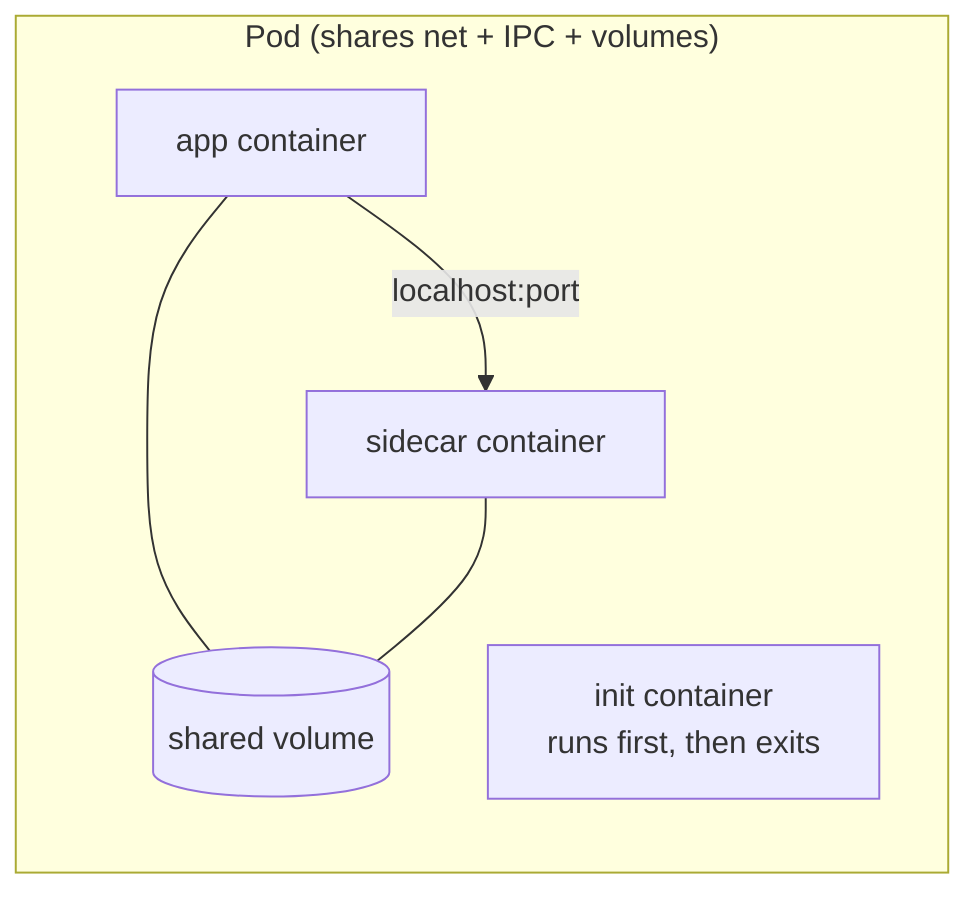
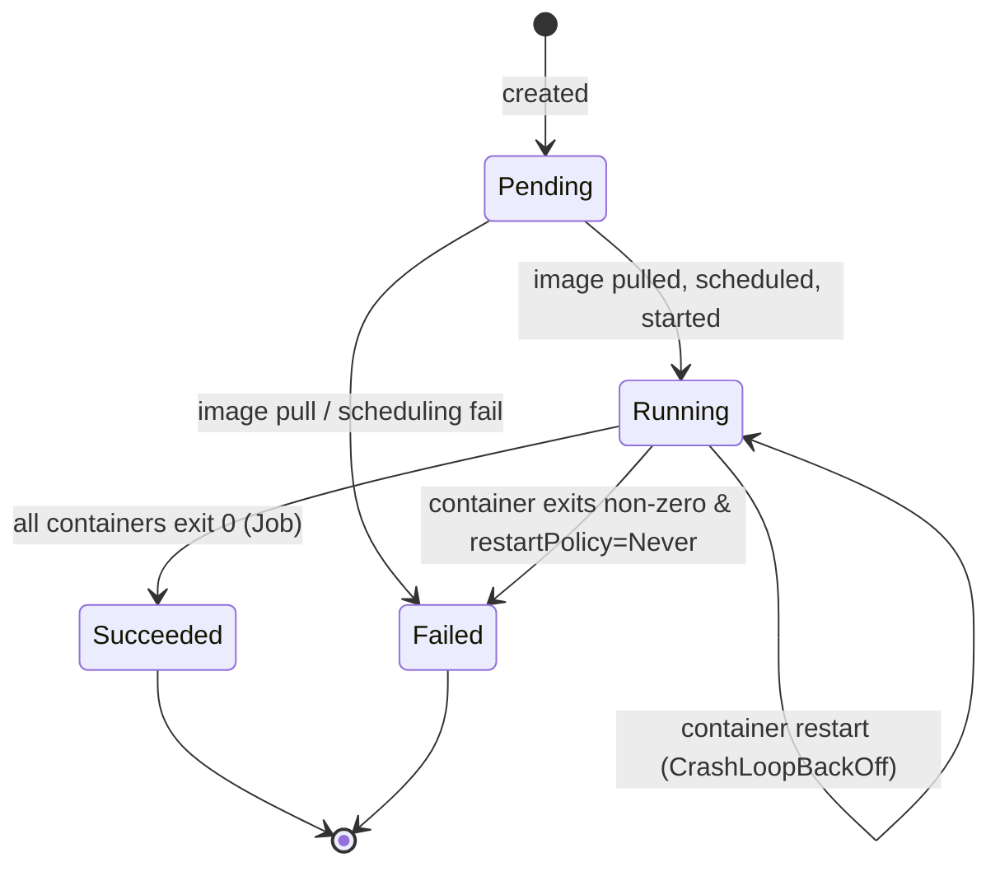

# 02 — Pods

> The smallest deployable unit in Kubernetes. **One pod = one or more containers that share network and storage.**

## Why pods (and not just containers)?

Containers are isolated. But sometimes two processes are so tightly coupled (app + log shipper, app + proxy) that they must share `localhost` and a volume. A Pod is that "logical host" wrapper.

<!-- mermaid:rendered -->
<p align="center"></p>

<details><summary>Mermaid source</summary>



</details>
## Quick reference

=== ":material-lightbulb-outline: Concept"
    A Pod is the atomic scheduling unit in Kubernetes — one or more tightly-coupled containers that share a network namespace, IPC, and volumes. They live and die together on a single node.

=== ":material-file-code-outline: Manifest"
    ```yaml
    apiVersion: v1
    kind: Pod
    metadata:
      name: hello-world
      labels:
        app: hello-world
    spec:
      restartPolicy: Always
      containers:
        - name: hello
          image: gcr.io/google-samples/hello-app:1.0
          ports:
            - containerPort: 8080
          resources:
            requests: { cpu: "50m", memory: "64Mi" }
            limits:   { cpu: "200m", memory: "128Mi" }
    ```

=== ":material-console: kubectl"
    ```bash
    kubectl apply -f 01-hello-world.yaml
    kubectl get pod hello-world -w
    kubectl describe pod hello-world | tail -20
    kubectl logs hello-world
    kubectl port-forward pod/hello-world 8080:8080
    ```

=== ":material-text-box-outline: Expected output"
    ```text
    NAME          READY   STATUS              RESTARTS   AGE
    hello-world   0/1     ContainerCreating   0          1s
    hello-world   1/1     Running             0          4s

    Events:
      Type    Reason     Age   From               Message
      ----    ------     ----  ----               -------
      Normal  Scheduled  5s    default-scheduler  Assigned to kind-worker
      Normal  Pulled     4s    kubelet            Image already present
      Normal  Created    4s    kubelet            Created container hello
      Normal  Started    4s    kubelet            Started container hello
    ```

## Pod lifecycle

<!-- mermaid:rendered -->
<p align="center"></p>

<details><summary>Mermaid source</summary>



</details>
## The 3 manifests in this folder

| File | Pattern | Use case |
|------|---------|----------|
| `01-hello-world.yaml` | Single container | Smoke test, learning kubectl |
| `02-multi-container.yaml` | Sidecar | Log shipper, proxy, mesh agent |
| `03-init-container.yaml` | Init container | Wait-for-DB, schema migrate, fetch config |

## Apply & observe

```bash
# Hello world
kubectl apply -f 01-hello-world.yaml
kubectl get pod hello-world -w           # watch until Running
kubectl logs hello-world
kubectl port-forward pod/hello-world 8080:8080
curl localhost:8080                      # → "Hello, world! Version: 1.0.0..."

# Multi-container
kubectl apply -f 02-multi-container.yaml
kubectl get pod multi-container
kubectl logs multi-container -c app
kubectl logs multi-container -c log-shipper

# Init container
kubectl apply -f 03-init-container.yaml
kubectl get pod init-demo -w             # Init:0/1 → PodInitializing → Running
kubectl logs init-demo -c wait-for-it
kubectl logs init-demo -c app
```

## Cleanup

```bash
kubectl delete -f 01-hello-world.yaml -f 02-multi-container.yaml -f 03-init-container.yaml
```

## Gotchas

> ⚠️ **Don't run bare pods in production.** They're not rescheduled if the node dies. Always wrap in a Deployment / StatefulSet / DaemonSet / Job.

> ⚠️ **Containers in a pod share `localhost`** — they can't bind the same port.

> ⚠️ **Init containers run sequentially** and must each succeed before the main containers start. A failing init container = pod stuck.

> ⚠️ **CrashLoopBackOff is a symptom, not a cause.** Always `kubectl logs <pod> --previous` to see the last crash output.

## Reference

- [Pods](https://kubernetes.io/docs/concepts/workloads/pods/)
- [Pod Lifecycle](https://kubernetes.io/docs/concepts/workloads/pods/pod-lifecycle/)
- [Init Containers](https://kubernetes.io/docs/concepts/workloads/pods/init-containers/)
- [Sidecar containers](https://kubernetes.io/docs/concepts/workloads/pods/sidecar-containers/)
