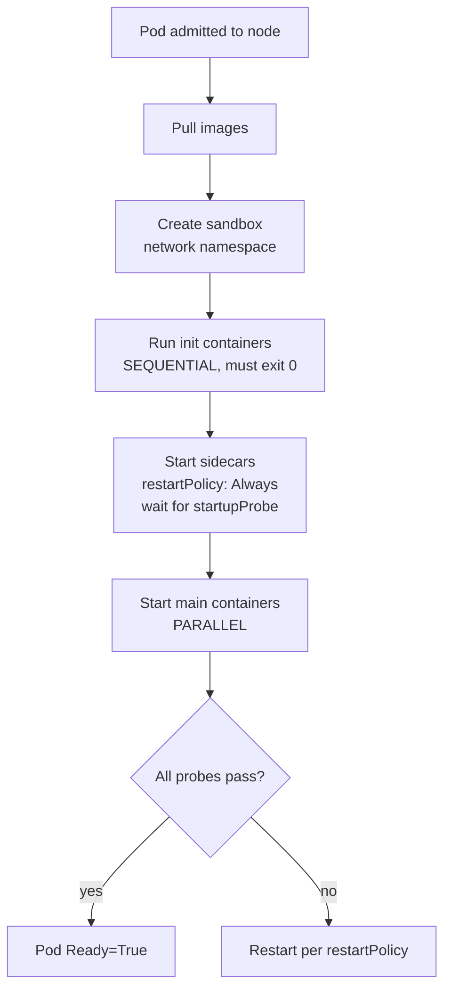
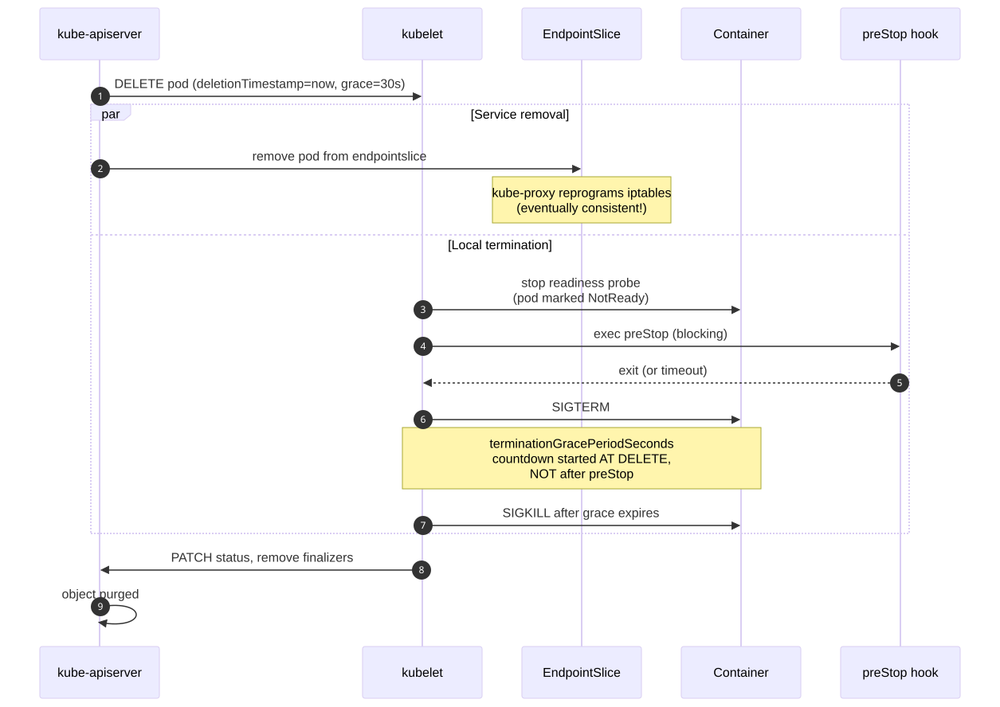
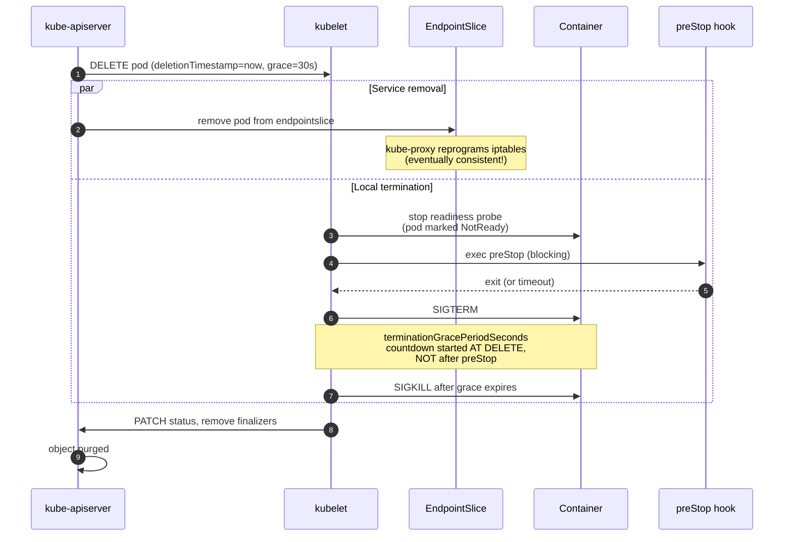

# Deep Dive: Pod Lifecycle

## Why this matters

A Pod is not "running" or "not running" — it moves through a small but subtle state machine where init containers, native sidecars, regular containers, probes, and termination hooks all interact. Most production outages tagged "the pod restarted" trace back to a misunderstanding of:

- the order of init / sidecar / app startup,
- when probes start firing,
- what `preStop` actually buys you, and
- the race between `terminationGracePeriodSeconds` and SIGKILL.

Native sidecar support (KEP-753: restartable init containers) reached **beta in 1.29** and **GA in 1.33**, fundamentally changing how meshes, log shippers, and secret fetchers should be deployed.

---

## Mental Model

> A Pod is a **Linux PID/network/IPC namespace shared by N containers**, scheduled atomically. Its `status.phase` is a coarse summary; the truth lives in `status.containerStatuses[]` and `status.conditions[]`.

Phases (the only valid values):

```
Pending → Running → Succeeded
              ↓
            Failed
              ↓
            Unknown   (kubelet unreachable)
```

Sub-states inside `Pending` (what users actually see):
- `Scheduled` (cond) — scheduler bound to a node
- `Initialized` — all init containers succeeded
- `PodReadyToStartContainers` (1.29+) — sandbox + network ready
- `ContainersReady` — all main containers passed startup/readiness
- `Ready` — pod is in service endpoints

---

## Diagram 1 — Container startup order with native sidecars

<!-- mermaid:rendered -->
<p align="center"></p>

<details><summary>Mermaid source</summary>



</details>

Key 1.29+ rule: a "native sidecar" is an **init container with `restartPolicy: Always`**. The kubelet:
1. Starts it in the init phase.
2. Waits for its `startupProbe` (or readiness if no startup) to pass before starting the next init/main container.
3. Restarts it on crash even after main containers exit.
4. Terminates it **after** all main containers exit (reverse order), giving log shippers / mesh proxies time to flush.

---

## Diagram 2 — Termination sequence (the part everybody gets wrong)

<!-- mermaid:rendered -->
<p align="center"></p>

<details><summary>Mermaid source</summary>



</details>

> **Critical race:** `terminationGracePeriodSeconds` starts at the DELETE call, not after preStop. If `preStop` sleeps 25s and grace is 30s, the app gets only 5s for SIGTERM cleanup. Size grace = preStop + app drain + buffer.

---

## Walkthrough: a production-grade Pod with init, sidecar, app, probes, hooks

```yaml
apiVersion: v1
kind: Pod
metadata:
  name: web
  labels: {app: web}
spec:
  terminationGracePeriodSeconds: 60     # preStop(15) + drain(30) + buffer(15)
  initContainers:
    - name: schema-migrate              # classic init: runs once, must exit 0
      image: registry.example.com/migrator:1.4
      args: ["--up"]
    - name: envoy                       # NATIVE SIDECAR (1.29 beta, 1.33 GA)
      image: envoyproxy/envoy:v1.30
      restartPolicy: Always             # <-- this is what makes it a sidecar
      startupProbe:                     # gate main containers on this
        httpGet: {path: /ready, port: 15021}
        periodSeconds: 1
        failureThreshold: 30            # 30s budget to come up
      lifecycle:
        preStop:
          exec:
            command: ["/bin/sh","-c","sleep 15"]   # let app drain first
  containers:
    - name: app
      image: registry.example.com/web:2.7
      ports: [{containerPort: 8080}]
      startupProbe:                     # use when slow-starting
        httpGet: {path: /healthz, port: 8080}
        failureThreshold: 60            # 60 * 5s = 5 min budget
        periodSeconds: 5
      readinessProbe:                   # gates EndpointSlice membership
        httpGet: {path: /ready, port: 8080}
        periodSeconds: 5
        failureThreshold: 3
      livenessProbe:                    # restart on hang
        httpGet: {path: /live, port: 8080}
        periodSeconds: 10
        failureThreshold: 3
        timeoutSeconds: 2
      lifecycle:
        preStop:
          httpGet: {path: /drain, port: 8080}      # tell app to stop accepting
      resources:
        requests: {cpu: 100m, memory: 128Mi}
        limits:   {cpu: "1",  memory: 512Mi}
```

Why this works:
- Native sidecar Envoy is **up before** the app starts (startupProbe gate).
- On termination, `preStop` on the app fires first → app drains.
- Envoy's `preStop` sleeps 15s so it stays around to proxy in-flight requests.
- Grace = 60s comfortably covers both.

---

## Race conditions you will hit in production

| Race | What happens | Fix |
|---|---|---|
| EndpointSlice update lag vs SIGTERM | New traffic arrives at a SIGTERM'd pod for ~1–5s | `preStop: sleep 5–10s` BEFORE app shutdown |
| `livenessProbe` fires during slow startup | Pod restart-loops forever | Add a `startupProbe`; liveness is paused until startup passes |
| Sidecar dies before app | App loses mesh / logs / secrets | Use native sidecars (restartPolicy: Always) — kubelet auto-restarts |
| `terminationGracePeriodSeconds` too small | App killed mid-flush, data loss | grace ≥ preStop + drain + buffer |
| Init container OOM | Pod stuck in `Init:OOMKilled` loop | Set proper `resources.requests/limits` on init containers too |
| PVC not mounted before container starts | `CreateContainerError` | Verify CSI driver, check `PodReadyToStartContainers` condition |
| `preStop` exec hook missing binary | Hook fails silently, pod gets SIGTERM immediately | Use `httpGet` hooks where possible; test with `kubectl exec` |

---

## Interview Q&A

> Pod lifecycle questions are the SRE / platform interviewer's favorite "do they actually run this in prod?" filter.

**Q1. Walk me through what happens from `kubectl apply` of a Deployment to the pod serving traffic.**
apply → apiserver admission → Deployment object stored → deployment-controller creates ReplicaSet → RS controller creates Pod → scheduler binds to node → kubelet pulls image, creates sandbox, runs init containers sequentially, starts native sidecars (waits for startup probe), starts main containers in parallel, waits for readiness → endpoint-slice-controller adds pod IP to EndpointSlice → kube-proxy programs iptables → traffic flows.

**Q2. Difference between a regular init container and a native sidecar?**
Regular init: `restartPolicy` ignored, must exit 0, blocks the next init. Native sidecar (1.29 beta / 1.33 GA): an init container with `restartPolicy: Always`, runs concurrently with subsequent inits and main containers, restarted on crash, terminated AFTER main containers in reverse order.

**Q3. What is the difference between liveness, readiness, and startup probes?**
Startup: gate before the others run; for slow-booting apps. Liveness: restart container on failure. Readiness: remove from EndpointSlice on failure (no restart). startupProbe SUSPENDS liveness until it passes — that's the whole point.

**Q4. Why might a pod be `Running` but not `Ready`?**
`Running` means container processes started. `Ready` means readiness probe passes (or no probe defined and process is up). Probe failing → endpoint slice removes pod → no traffic, but pod stays `Running`.

**Q5. What is `terminationGracePeriodSeconds` and when does the timer start?**
The window between SIGTERM and SIGKILL. Timer starts at DELETE, NOT after preStop. preStop eats into this budget.

**Q6. How do you achieve zero-downtime rolling deployments?**
`maxSurge`/`maxUnavailable` on the Deployment + `preStop` sleep ≥ kube-proxy convergence + app drain endpoint + readiness probe + PodDisruptionBudget. Critical: the preStop sleep is needed because EndpointSlice removal is eventually consistent across nodes.

**Q7. Pod is stuck in `ContainerCreating` — what do you check?**
`kubectl describe pod` events first. Common causes: image pull (registry creds, network), volume mount (CSI driver, PVC binding), sandbox creation (CNI plugin error), runtime (containerd/cri-o crash). Then `journalctl -u kubelet` on the node.

**Q8. What changes in 1.33 GA for sidecars?**
KEP-753 native sidecars are GA. `restartPolicy: Always` on init container is the supported API. Service meshes (Istio, Linkerd) and log shippers should migrate off the old "main container with shared termination" pattern that suffered from race conditions during pod shutdown.

---

## Sources

- [Pod Lifecycle](https://kubernetes.io/docs/concepts/workloads/pods/pod-lifecycle/)
- [Init Containers](https://kubernetes.io/docs/concepts/workloads/pods/init-containers/)
- [Sidecar Containers](https://kubernetes.io/docs/concepts/workloads/pods/sidecar-containers/) (1.29 beta, 1.33 GA)
- [Container Lifecycle Hooks](https://kubernetes.io/docs/concepts/containers/container-lifecycle-hooks/)
- [Configure Liveness, Readiness and Startup Probes](https://kubernetes.io/docs/tasks/configure-pod-container/configure-liveness-readiness-startup-probes/)
- [KEP-753: Sidecar containers](https://github.com/kubernetes/enhancements/tree/master/keps/sig-node/753-sidecar-containers)
- [SIG Node](https://github.com/kubernetes/community/tree/master/sig-node)
