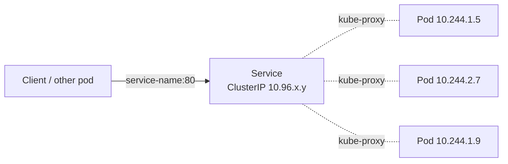
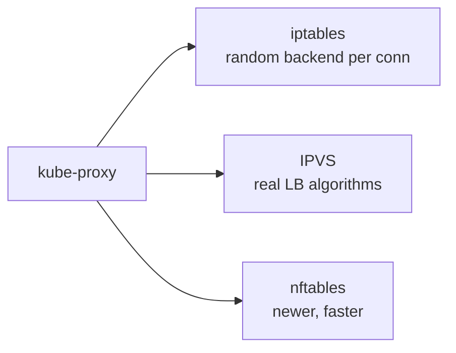

# 04 — Services

> Pods are mortal — their IPs change. **A Service is a stable virtual IP + DNS name** that load-balances to a set of pods selected by labels.

## Why Services

<!-- mermaid:rendered -->
<p align="center"></p>

<details><summary>Mermaid source</summary>



</details>
Without a Service, you'd hardcode pod IPs. With one, you call `http://hello-app.default.svc.cluster.local` and traffic round-robins to healthy backends.

## Quick reference

=== ":material-lightbulb-outline: Concept"
    A Service is a stable virtual IP plus DNS name that load-balances to a label-matched set of Pods. It decouples clients from ephemeral pod IPs and is the unit of east-west traffic in the cluster.

=== ":material-file-code-outline: Manifest"
    ```yaml
    apiVersion: v1
    kind: Service
    metadata:
      name: hello-app
    spec:
      type: ClusterIP
      selector:
        app: hello-app
      ports:
        - name: http
          port: 80
          targetPort: 8080
          protocol: TCP
    ```

=== ":material-console: kubectl"
    ```bash
    kubectl apply -f clusterip.yaml
    kubectl get svc hello-app
    kubectl get endpoints hello-app
    kubectl run tmp --rm -it --image=curlimages/curl --restart=Never -- \
      curl -s http://hello-app/
    ```

=== ":material-text-box-outline: Expected output"
    ```text
    service/hello-app created

    NAME        TYPE        CLUSTER-IP      EXTERNAL-IP   PORT(S)   AGE
    hello-app   ClusterIP   10.96.142.18    <none>        80/TCP    3s

    NAME        ENDPOINTS                                       AGE
    hello-app   10.244.1.5:8080,10.244.1.7:8080,10.244.2.4:8080 5s

    Hello, world!
    Version: 1.0.0
    Hostname: hello-app-7d4b9c8f6-x2k7p
    ```

## Service types

| Type | What it does | When to use |
|------|--------------|-------------|
| **ClusterIP** (default) | Stable VIP only inside the cluster | East-west pod-to-pod |
| **NodePort** | Exposes service on every node's IP at a static port (30000–32767) | Quick external access in dev |
| **LoadBalancer** | Provisions a cloud LB (AWS ELB, GCP, Azure) | Public-facing services in cloud |
| **ExternalName** | DNS CNAME to an external host | Abstract external services |
| **Headless** (`clusterIP: None`) | No VIP — DNS returns pod IPs directly | StatefulSets, custom LB |

## kube-proxy modes

<!-- mermaid:rendered -->
<p align="center"></p>

<details><summary>Mermaid source</summary>



</details>
## Apply & observe

```bash
# First create a backend deployment
kubectl apply -f ../03-deployments/deployment.yaml

# ClusterIP
kubectl apply -f clusterip.yaml
kubectl get svc hello-app
kubectl run tmp --rm -it --image=curlimages/curl --restart=Never -- \
  curl -s http://hello-app/

# NodePort
kubectl apply -f nodeport.yaml
kubectl get svc hello-app-np
# kind: port-forward; minikube: minikube service hello-app-np --url

# Headless
kubectl apply -f headless.yaml
kubectl run tmp --rm -it --image=busybox --restart=Never -- \
  nslookup hello-app-headless    # ← returns multiple A records, one per pod

# Endpoints (the actual pod IPs behind a Service)
kubectl get endpoints hello-app
kubectl get endpointslices -l kubernetes.io/service-name=hello-app
```

## DNS

```
<service>.<namespace>.svc.cluster.local
hello-app.default.svc.cluster.local → ClusterIP 10.96.x.y
```

Same-namespace? Just `hello-app`.

## Cleanup

```bash
kubectl delete -f clusterip.yaml -f nodeport.yaml -f headless.yaml
```

## Gotchas

> ⚠️ **Service `selector` must match Pod labels.** A typo = empty Endpoints = "connection refused".

> ⚠️ **NodePort opens a port on EVERY node.** Firewall accordingly.

> ⚠️ **LoadBalancer in kind/minikube stays `Pending`** unless you install [MetalLB](https://metallb.universe.tf/) or use `minikube tunnel`.

> ⚠️ **Headless services have no load balancing.** Your client (or DNS resolver) picks a pod.

## Reference

- [Service](https://kubernetes.io/docs/concepts/services-networking/service/)
- [DNS for Services and Pods](https://kubernetes.io/docs/concepts/services-networking/dns-pod-service/)
- [EndpointSlices](https://kubernetes.io/docs/concepts/services-networking/endpoint-slices/)
