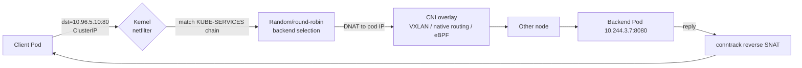
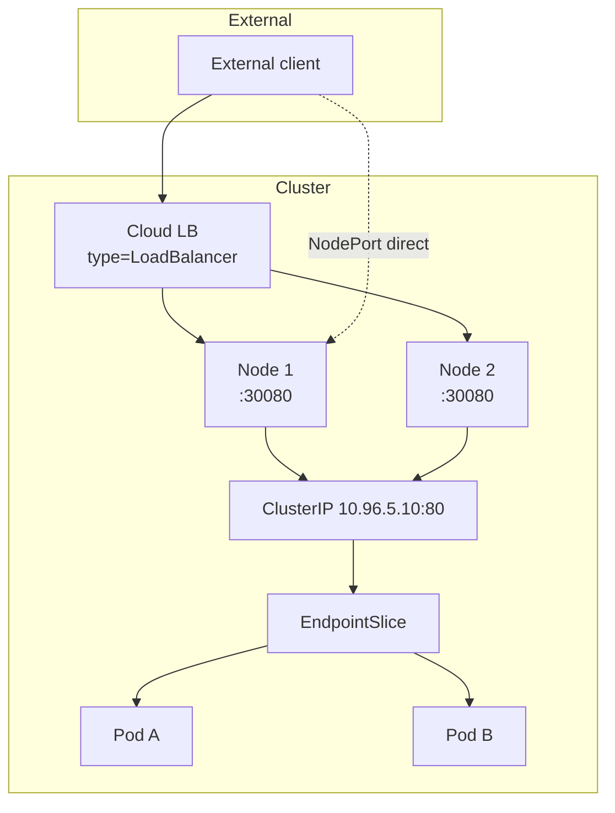

# Deep Dive: Service Networking — ClusterIP to Backend Pod

## Why this matters

A `Service` is the abstraction that makes pods addressable despite their ephemeral IPs, but the actual packet path involves **kube-proxy**, **EndpointSlices**, **conntrack**, and one of four datapath modes (iptables, IPVS, nftables, eBPF/Cilium). Misunderstanding this layer leads to:

- "Why does my new pod get traffic instantly?" (it shouldn't)
- "Why does scaling kube-proxy cost more CPU than my app?"
- "Why does NodePort work locally but not from outside the cluster?"
- "Why does my LoadBalancer hairpin fail?"

In 1.31, the **nftables proxy mode is GA** and is the recommended default for new clusters. iptables mode remains the historical default but scales poorly past ~10k services. eBPF (Cilium) and IPVS exist for the same scaling problem.

---

## Mental Model

> A Service is **just an entry in etcd**. The data plane is programmed by `kube-proxy` (or a CNI like Cilium) on **every node** by translating EndpointSlices into kernel rules.

Three layers, top to bottom:

```
Service object   (virtual IP, selector, ports)        ← API layer
EndpointSlice    (the actual {pod IP, port, ready})   ← state layer
kernel rules     (iptables / nftables / IPVS / eBPF)  ← datapath layer
```

The Service IP is **fictional** — no interface holds it. Packets to it are intercepted by kernel rules and DNAT'd to a real pod IP.

---

## Diagram 1 — Packet flow ClusterIP → backend pod

<!-- mermaid:rendered -->
<p align="center"></p>

<details><summary>Mermaid source</summary>



</details>
The "Random/round-robin selection" step is what differs across modes:

| Mode | Mechanism | Scale | Status |
|---|---|---|---|
| `iptables` | Linear chain of `-m statistic --probability` | O(n) per packet | Default, legacy |
| `ipvs` | Kernel L4 LB hash table | O(1) | Stable |
| `nftables` | Native nftables maps | O(1) | **GA in 1.31** |
| `cilium` (eBPF) | eBPF program at TC/socket | O(1) | Replaces kube-proxy entirely |

---

## Diagram 2 — Control plane: how rules get there

```mermaid
sequenceDiagram
    participant U as User
    participant API as kube-apiserver
    participant ESC as EndpointSlice Controller
    participant KP as kube-proxy<br/>(DaemonSet on every node)
    participant K as Kernel netfilter

    U->>API: kubectl apply Service + Deployment
    API->>ESC: WATCH Pod, Service
    ESC->>API: create/update EndpointSlice<br/>(addr, port, ready, hints)
    API-->>KP: WATCH EndpointSlice (per node)
    KP->>K: program iptables/nftables/IPVS rules
    Note over KP,K: full sync periodically;<br/>incremental on watch event
```

- Pre-1.21: one big `Endpoints` object per Service → API churn at scale.
- 1.21+: `EndpointSlice` (default ≤100 endpoints per slice) → 100x less write amplification.
- 1.27+: **Topology Aware Routing** (formerly hints) lets kube-proxy prefer same-zone endpoints when `spec.trafficDistribution: PreferClose` (1.31 beta).

---

## Diagram 3 — How NodePort and LoadBalancer extend ClusterIP

<!-- mermaid:rendered -->
<p align="center"></p>

<details><summary>Mermaid source</summary>



</details>
Service types are **layered**:

- `ClusterIP` — the base. A virtual IP routable only inside the cluster.
- `NodePort` — adds a high port (30000–32767 by default) on **every node** that DNATs to the ClusterIP.
- `LoadBalancer` — provisions a cloud LB that targets the NodePort on each node. Always inherits ClusterIP + NodePort.
- `ExternalName` — pure DNS CNAME, no proxying.

---

## Walkthrough: annotated YAML

```yaml
apiVersion: v1
kind: Service
metadata:
  name: web
  annotations:
    # cloud-specific LB tuning lives here
    service.beta.kubernetes.io/aws-load-balancer-type: "nlb"
spec:
  type: LoadBalancer            # → also gets NodePort + ClusterIP
  selector:
    app: web                    # → matches pods, not deployments
  ports:
    - name: http
      port: 80                  # ClusterIP port
      targetPort: 8080          # container port (or named)
      nodePort: 30080           # optional explicit (else auto-assigned)
      protocol: TCP
  externalTrafficPolicy: Local  # Local = no SNAT, preserves client IP
                                # Cluster = round-robin to any node, hides client IP
  internalTrafficPolicy: Cluster
  trafficDistribution: PreferClose   # 1.31 beta — same-zone preference
  ipFamilyPolicy: PreferDualStack
  ipFamilies: [IPv4, IPv6]
  sessionAffinity: None         # or ClientIP for sticky sessions (3hr default)
---
# kube-proxy 1.31+ recommended config snippet
apiVersion: kubeproxy.config.k8s.io/v1alpha1
kind: KubeProxyConfiguration
mode: nftables                  # GA in 1.31; preferred over iptables for new clusters
nftables:
  syncPeriod: 30s
```

**externalTrafficPolicy** matters:
- `Cluster` (default): traffic hits any node, gets SNAT'd, redistributed → load is even, client IP is lost.
- `Local`: traffic only goes to nodes that actually run the pod, no SNAT → client IP preserved, but uneven load and 503s if no local pod.

---

## Hidden facts that bite people

1. **conntrack table fills up** under high churn. Symptom: random connection drops. Tune `nf_conntrack_max`.
2. **iptables mode latency grows linearly** with rule count. At 5k+ services, switch to nftables/IPVS/eBPF.
3. **LoadBalancer with `Local` policy**: cloud LB health checks must hit the NodePort and only nodes with local pods pass — otherwise traffic blackholes.
4. **Headless Service** (`clusterIP: None`): no virtual IP, DNS returns all pod IPs; used for StatefulSets.
5. **EndpointSlice `ready` flag** ≠ pod `Ready` immediately. There's a propagation delay → `preStop: sleep 5s` is essential.
6. **kube-proxy is optional** when using Cilium kube-proxy replacement (`kubeProxyReplacement: true`); rules live in eBPF maps.

---

## Interview Q&A

**Q1. What happens when I curl a ClusterIP from a pod?**
DNS lookup → ClusterIP → kernel netfilter intercepts via iptables/nftables/IPVS rule installed by kube-proxy → DNAT to a backend pod IP from EndpointSlice → routed via CNI to the target node → conntrack remembers the mapping for the reply path → reply SNAT'd back to the ClusterIP.

**Q2. Difference between Service, Endpoints, and EndpointSlice?**
Service is the user-facing abstraction. Endpoints (legacy, single object per Service) and EndpointSlice (1.21+, default, sharded) are the controller-managed objects that map the Service selector to actual pod IP/port/ready tuples. kube-proxy watches slices.

**Q3. iptables vs IPVS vs nftables vs eBPF — when would you use each?**
iptables: small clusters, legacy (default historically). IPVS: high service count, kernel hash-table LB. nftables: GA 1.31, modern replacement for iptables, recommended for new clusters. eBPF (Cilium): replaces kube-proxy entirely, lowest latency, observability, NetworkPolicy at line rate.

**Q4. What does `externalTrafficPolicy: Local` do and what is its trade-off?**
Skips SNAT and only sends traffic to nodes with local backend pods. Preserves client source IP. Trade-off: uneven load distribution and risk of black-holed traffic if a node has no local pod.

**Q5. How do you preserve source IP through a LoadBalancer?**
`externalTrafficPolicy: Local` for L4. For L7, use an Ingress / Gateway and rely on `X-Forwarded-For`. With AWS NLB / GCP TCP LB you also need PROXY protocol for non-HTTP workloads.

**Q6. Why is NodePort not used in production?**
Port range is restricted (30000–32767), no TLS termination, no host-based routing, exposes every node IP. LoadBalancer or Ingress/Gateway is preferred. NodePort is the underlying primitive both rely on.

**Q7. What is Topology Aware Routing / `trafficDistribution: PreferClose`?**
Hints kube-proxy/CNI to prefer same-zone endpoints to cut cross-AZ data charges and latency. `trafficDistribution: PreferClose` (beta 1.31) is the modern field; the older `service.kubernetes.io/topology-mode: Auto` annotation is deprecated.

**Q8. Headless Service — what is it, when do you use it?**
`spec.clusterIP: None`. No virtual IP allocated, DNS returns every backing pod IP (A records). Used for StatefulSets where each pod is individually addressable (`pod-0.svc.ns`), and for clients that want to load-balance themselves (e.g., gRPC).

---

## Sources

- [Service](https://kubernetes.io/docs/concepts/services-networking/service/)
- [EndpointSlices](https://kubernetes.io/docs/concepts/services-networking/endpoint-slices/)
- [Virtual IPs and Service Proxies](https://kubernetes.io/docs/reference/networking/virtual-ips/)
- [nftables proxy mode (1.31 GA)](https://kubernetes.io/docs/reference/networking/virtual-ips/#proxy-mode-nftables)
- [Topology Aware Routing](https://kubernetes.io/docs/concepts/services-networking/topology-aware-routing/)
- [KEP-3866: nftables kube-proxy](https://github.com/kubernetes/enhancements/tree/master/keps/sig-network/3866-nftables-proxy)
- [Cilium kube-proxy replacement](https://docs.cilium.io/en/stable/network/kubernetes/kubeproxy-free/)
- [SIG Network](https://github.com/kubernetes/community/tree/master/sig-network)
