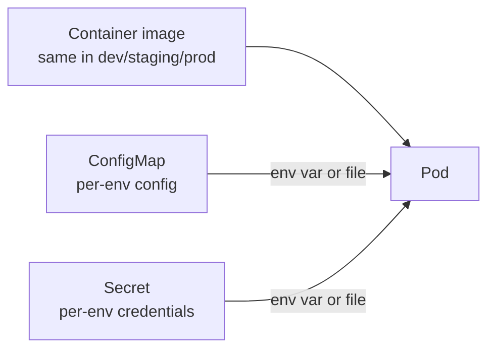

# 05 — ConfigMaps & Secrets

> **ConfigMaps** = non-sensitive config (URLs, feature flags). **Secrets** = sensitive (API keys, passwords). Both decouple config from container images.

## Why decouple

Hardcoded config = rebuild image for every env change. ConfigMaps + Secrets let the same image run anywhere.

<!-- mermaid:rendered -->
<p align="center"></p>

<details><summary>Mermaid source</summary>



</details>
## Quick reference

=== ":material-lightbulb-outline: Concept"
    ConfigMaps hold non-sensitive key/value config; Secrets hold sensitive bytes (base64-encoded, optionally encrypted at rest). Both decouple per-environment values from your container image so the same image runs everywhere.

=== ":material-file-code-outline: Manifest"
    ```yaml
    apiVersion: v1
    kind: ConfigMap
    metadata:
      name: app-config
    data:
      APP_ENV: "production"
      APP_LOG_LEVEL: "info"
      app.properties: |
        server.port=8080
        feature.dark-mode=true
    ---
    apiVersion: v1
    kind: Secret
    metadata:
      name: db-credentials
    type: Opaque
    stringData:
      username: appuser
      password: s3cr3t-rotate-me
    ```

=== ":material-console: kubectl"
    ```bash
    kubectl apply -f configmap.yaml -f secret.yaml -f pod-with-config.yaml
    kubectl get cm,secret
    kubectl exec app-with-config -- env | grep APP_
    kubectl exec app-with-config -- cat /etc/config/app.properties
    kubectl get secret db-credentials -o jsonpath='{.data.password}' | base64 -d
    ```

=== ":material-text-box-outline: Expected output"
    ```text
    configmap/app-config created
    secret/db-credentials created
    pod/app-with-config created

    NAME                          DATA   AGE
    configmap/app-config          3      4s
    secret/db-credentials         2      4s

    APP_ENV=production
    APP_LOG_LEVEL=info

    server.port=8080
    feature.dark-mode=true

    s3cr3t-rotate-me
    ```

## How they're consumed

| Method | Pros | Cons |
|--------|------|------|
| **env var** | simple | no live updates; visible in `ps`/`env` dump |
| **volume mount (file)** | live updates (~60s); not in env | file I/O |
| **subPath mount** | mount one key as a file | no live updates |
| **envFrom** | bulk-load all keys as env | name collisions |

## Secret types

| Type | Use |
|------|-----|
| `Opaque` (default) | arbitrary key/value |
| `kubernetes.io/dockerconfigjson` | private image registry pull |
| `kubernetes.io/tls` | TLS cert + key (Ingress) |
| `kubernetes.io/service-account-token` | auto-mounted SA tokens |

## Apply & observe

```bash
kubectl apply -f configmap.yaml -f secret.yaml -f pod-with-config.yaml
kubectl get cm,secret
kubectl describe pod app-with-config

# Verify config is in the pod
kubectl exec app-with-config -- env | grep -E 'APP_|DB_'
kubectl exec app-with-config -- cat /etc/config/app.properties
kubectl exec app-with-config -- cat /etc/secrets/db-password
```

## Decode a Secret

```bash
kubectl get secret db-credentials -o jsonpath='{.data.password}' | base64 -d
```

## Immutable ConfigMaps / Secrets

Add `immutable: true` to lock data once created — improves API server perf at scale and prevents accidental edits. Trade-off: must delete + recreate to change.

## Cleanup

```bash
kubectl delete -f configmap.yaml -f secret.yaml -f pod-with-config.yaml
```

## Gotchas

> ⚠️ **Secrets are base64-encoded, NOT encrypted.** Anyone with `get secrets` RBAC sees them in plaintext. Use [Sealed Secrets](https://sealed-secrets.netlify.app/), [External Secrets Operator](https://external-secrets.io/), or [SOPS](https://github.com/getsops/sops) for git-safe storage.

> ⚠️ **Env vars don't auto-update** when ConfigMap changes — pod must restart. Volume mounts DO update (with ~kubelet sync period delay).

> ⚠️ **`stringData` is write-only.** It's auto-converted to base64 in `data`. Don't expect to read it back via `kubectl get -o yaml`.

> ⚠️ Enable [encryption at rest](https://kubernetes.io/docs/tasks/administer-cluster/encrypt-data/) for etcd in production.

## Reference

- [ConfigMap](https://kubernetes.io/docs/concepts/configuration/configmap/)
- [Secrets](https://kubernetes.io/docs/concepts/configuration/secret/)
- [Configure a Pod to Use a ConfigMap](https://kubernetes.io/docs/tasks/configure-pod-container/configure-pod-configmap/)
