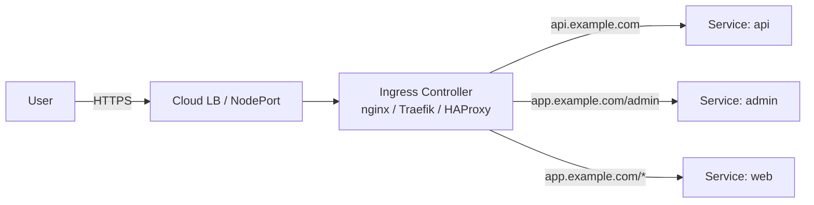

# 08 — Ingress

> Services give pods stable IPs. **Ingress** gives them HTTP routes (host- and path-based) — and TLS — through a single entry point.

## Why Ingress

Without Ingress: one LoadBalancer per service = $$$ + sprawl.
With Ingress: one LB → one Ingress controller → routed to many services by hostname/path.

<!-- mermaid:rendered -->
<p align="center"></p>

<details><summary>Mermaid source</summary>



</details>
## Quick reference

=== ":material-lightbulb-outline: Concept"
    Ingress is L7 HTTP routing — one external entry point that fans out to many backend Services by hostname or URL path, optionally terminating TLS. Implemented by an Ingress Controller (nginx, Traefik, ALB, etc.).

=== ":material-file-code-outline: Manifest"
    ```yaml
    apiVersion: networking.k8s.io/v1
    kind: Ingress
    metadata:
      name: hello-ingress
      annotations:
        nginx.ingress.kubernetes.io/rewrite-target: /
    spec:
      ingressClassName: nginx
      rules:
        - host: hello.local
          http:
            paths:
              - path: /
                pathType: Prefix
                backend:
                  service:
                    name: hello-app
                    port:
                      number: 80
    ```

=== ":material-console: kubectl"
    ```bash
    kubectl apply -f ingress.yaml
    kubectl get ingress hello-ingress
    kubectl describe ingress hello-ingress | tail -15
    curl -H "Host: hello.local" http://localhost/
    ```

=== ":material-text-box-outline: Expected output"
    ```text
    ingress.networking.k8s.io/hello-ingress created

    NAME            CLASS   HOSTS         ADDRESS     PORTS   AGE
    hello-ingress   nginx   hello.local   localhost   80      6s

    Rules:
      Host         Path  Backends
      ----         ----  --------
      hello.local
                   /     hello-app:80 (10.244.1.5:8080,10.244.2.4:8080)

    Hello, world!
    Version: 1.0.0
    ```

## Ingress vs Gateway API

| Aspect | Ingress | Gateway API |
|--------|---------|-------------|
| Status | Stable, ubiquitous | GA, replacing Ingress |
| Expressiveness | Limited (hosts/paths + annotations) | Rich (headers, methods, weights, mirroring) |
| Multi-tenant | Weak | Strong (Gateway / Route separation) |
| Recommendation | Fine for now | Adopt for new clusters |

## Pick a controller

| Controller | Best for |
|------------|----------|
| **ingress-nginx** | Default, well-documented |
| **Traefik** | Auto-discovery, dynamic config |
| **HAProxy** | Performance |
| **AWS LB Controller** | Native ALB on EKS |
| **GKE Ingress** | Native GCP LB |

This folder uses **ingress-nginx**. See [`ingress-nginx-install.md`](./ingress-nginx-install.md).

## Apply & observe

```bash
# 1. Install controller (kind has special manifest)
kubectl apply -f https://raw.githubusercontent.com/kubernetes/ingress-nginx/main/deploy/static/provider/kind/deploy.yaml
kubectl wait --namespace ingress-nginx --for=condition=ready pod \
  --selector=app.kubernetes.io/component=controller --timeout=180s

# 2. Backend
kubectl apply -f ../03-deployments/deployment.yaml
kubectl apply -f ../04-services/clusterip.yaml

# 3. Ingress
kubectl apply -f ingress.yaml
kubectl get ingress

# 4. Test (kind maps localhost:80 → ingress)
curl -H "Host: hello.local" http://localhost/
```

## TLS

Create a TLS Secret, reference it in `spec.tls`. Use [cert-manager](https://cert-manager.io/) for automatic Let's Encrypt issuance.

## Cleanup

```bash
kubectl delete -f ingress.yaml
```

## Gotchas

> ⚠️ **`ingressClassName` is required** in K8s 1.22+. Without it, no controller picks up your Ingress.

> ⚠️ **Path types matter.** `Prefix` vs `Exact` vs `ImplementationSpecific` — `Prefix` matches `/foo` AND `/foo/bar`.

> ⚠️ **One IngressClass per controller.** If you have two controllers (nginx + Traefik), label your Ingress correctly.

> ⚠️ **kind exposes ingress on `localhost`** only because of the `extraPortMappings` in [kind-cluster.yaml](../00-cluster-setup/kind-cluster.yaml). Without those, you'd need `kubectl port-forward`.

## Reference

- [Ingress](https://kubernetes.io/docs/concepts/services-networking/ingress/)
- [Gateway API](https://gateway-api.sigs.k8s.io/)
- [ingress-nginx](https://kubernetes.github.io/ingress-nginx/)
- [cert-manager](https://cert-manager.io/docs/)
